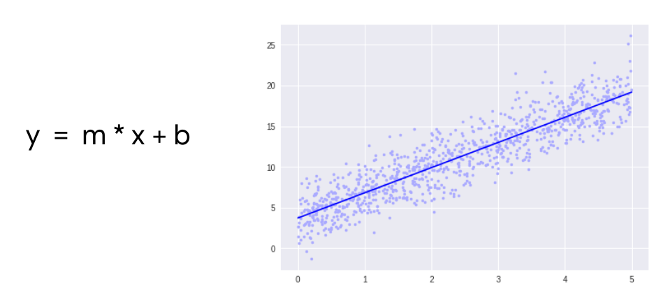
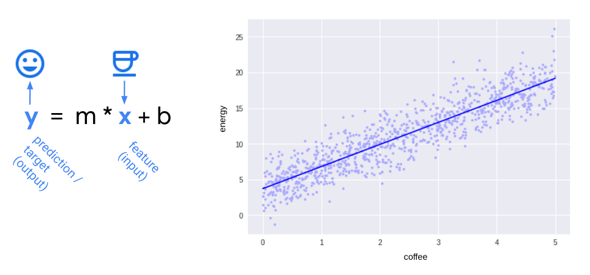
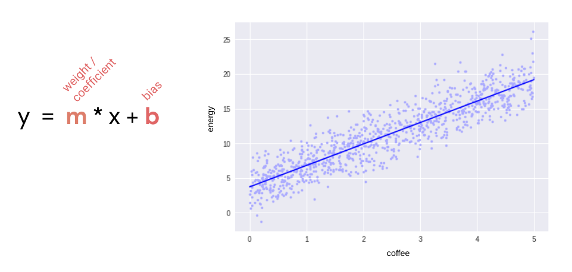
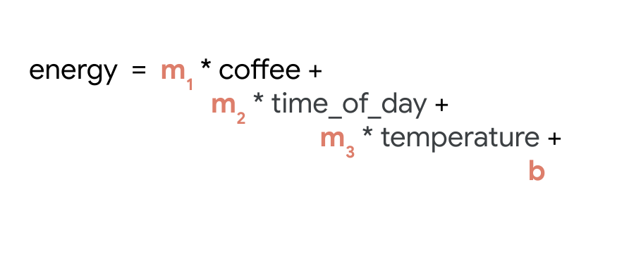
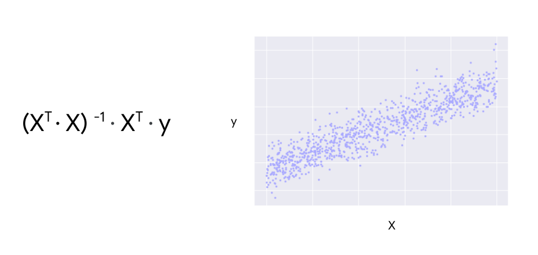
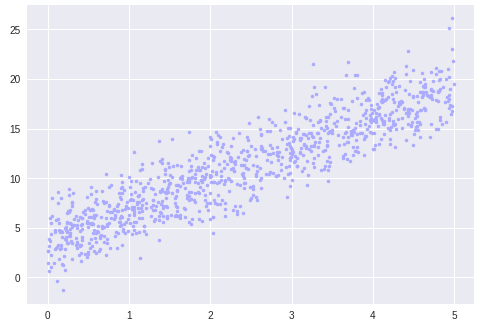
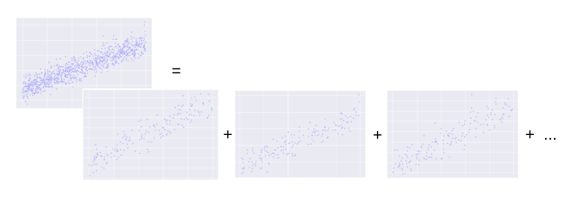
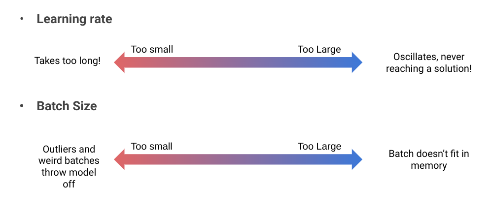

# Regression

---

<!--
Intro activity. Ask if anyone has seen a crime show / heard of an investigation where they used a footprint to determine a suspect’s height. It’s a tactic frequently mentioned in connection to forensics, but does it actually work? Let’s try it out!

Note: Use your shoe size / height as the suspect’s, and tell students to keep in mind that US men’s size = US women’s size - 2

Split the students into groups of ~6 each and give them a sheet of graph paper. Plot their shoe sizes (x-axis) vs. heights (y-axis) and have them guess the suspect’s height based on their shoe size. Then have the groups share data (so each has a plot of the whole class’s info) and make another guess per group. See if anyone comes close :-)

They should theoretically have better guesses with more data, but shoe size might not actually be well correlated to height, so they might not.

Source: photo by George Evans on Unsplash
-->

---

# Mathematical Model

<!--
Linear regression has a simple goal: to find a line that best fits a set of data. 
-->

---

# Data goes in, prediction comes out

<!--
Recall that the equation for a line is y = m * x + b, where x is input features and y is output targets. If we were trying to predict energy level from coffee intake, amount of coffee would be the input and energy level would be output.
-->

---

# What is the machine "learning?"

<!--
Using the data, regression “learns” two values. The first is m, which you may have called “slope” and which we’ll refer to as a “weight / coefficient”. This represents how much a change in the feature value (x) should affect our prediction (y). The second is b, which you may have called an “intercept” and which we’ll refer to as a “bias”. This represents the prediction we would make if our input features are all 0. 
-->

---

# Multiple features

<!--
Realistically, energy level might depend on several factors. Now, our model needs to learn 3 weights (one for each input feature) and one bias.

The concept of weights and bias is important to most machine learning models, even complex neural networks. The model uses data to learn how each input feature affects the output, and learns a bias to linearly shift its predictions to fit the data (like shifting a y-intercept).
-->

---

# Closed form, exact solution

<!--
How does the model actually “learn” those values? Through linear algebra, we’ve actually found an exact equation -- all you need to do is plug in your X and y values, and calculate to get your weight and bias values.

So, is that it? Is machine learning solved??
-->

---

# Reality intrudes

Closed form solution is expensive
* Requires *lots* of computation
* In practice, requires all data to fit into RAM
* Computer’s just gonna give up

<!--
A closed form solution is perfect if you have a relatively small number of features and data points. But we’ve said before that machine learning models work best with large amounts of data -- and some models have thousands or tens of thousands of input features. 

With such complex data, the computation required to get a closed form solution is prohibitively difficult (both in terms of memory and time required). 

https://stats.stackexchange.com/questions/23128/solving-for-regression-parameters-in-closed-form-vs-gradient-descent

Source: Photo by JESHOOTS.COM on Unsplash
-->

---

# "Learned" parameters

Wobble m and b around **iteratively** to **reduce loss**
  * Usually, loss means root mean squared error **(RMSE)**

<!--
Instead, machine learning must iteratively update its parameters (anything that is being “learned”, in this case the weights and bias). It does this based on a loss function that measures how well the current parameters are performing. The model will attempt to incrementally change its weights and bias to decrease loss.
A common loss function for regression is the root mean squared error -- we’ll discuss this and some other common loss functions in more detail later.
-->

---

# Gradient descent

* The computer’s job: 
  * Start with an arbitrary value
  * Tweak it in whichever direction reduces loss more 
  * The less the loss is changing, the less the value should be tweaked

* The human’s job: choose the **learning rate**
  * A constant value which scales how far we tweak the value on each learning step
  * It’s a **hyperparameter**: not a parameter in the the actual model, but a parameter in the algorithm that tweaks the model

<!--
How does the model “iteratively” update its parameters? We can think of our goal as an optimization problem, where we’d like to optimize (minimize) a loss function. Machine learning models then use an “optimizer”, or an algorithm to perform that optimization.

The most common optimizer is Gradient Descent. Essentially, the model starts by picking random values for each parameter. It then changes each in the direction that reduces loss the most. On each iteration, or “step”, the model should get closer to the minimal loss until it “converges”, or reaches a point where the loss isn’t changing much between steps (usually this is based on some threshold, like changing by less than 0.001 between steps). Since this isn’t a closed-form solution, gradient descent isn’t guaranteed to converge to the absolute lowest loss possible. There are more sophisticated optimizers that can sometimes do better.

You can control gradient descent by deciding the learning rate, which determines how much you tweak each parameter on each step. We call this a hyperparameter -- a value you can change to change model performance, but isn’t “learned” by the model.
-->

---

# Batched data

Break data into smaller batches
  * We’ll use a new batch on each learning step
  * New hyperparameter batch size controls how much data is used for each learning step
 
 
  
 <!--
 Another important hyperparameter is batch size. While you could perform gradient descent based on your full dataset every step, it 1) may require too much memory, and 2) takes longer to converge. To combat both, we split the data into smaller batches. On each step, we’ll use a new batch to update parameters. You can control how large these batches are.
-->

---

# Hyperparameters we care about

 
 
 <!--
 After setting up a model, you may find you need to perform “hyperparameter tuning” to achieve best results. Different problems work well with different combinations of hyperparameter values -- you’ll often need to experiment, or “tune”, those combinations. Here are some rough guidelines for potential problems with learning rate and batch size that might suggest increasing or decreasing their values.
-->

