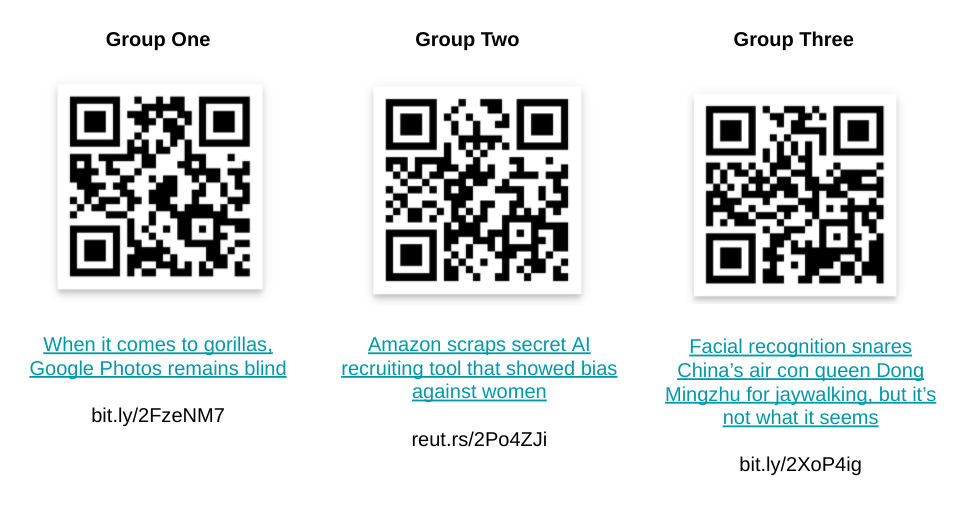

# Classification Gone Wrong

---

<!--
Ask students to count 1-3, and assign them to read the corresponding article.
After everyone has finished reading (~10 mins), gather in mixed clusters of 3 to explain the main takeaway of your article to others in your group. What bias was uncovered and how would you describe its impact on people? What do you find interesting about this article? The group discussion should last ~15 minutes, which gives ~5 minutes for each member to describe their article.
Next, use the questions on the next slides to open a discussion with the class. Ask 1+ groups to answer each one of the questions, making sure all groups participate. Moderate the conversation and try to encourage self-reflection. What will they do once they are the data scientists and machine learning engineers responsible for these systems? How can they prevent this? What’s the real world impact of these mistakes and what does that mean in terms of their responsibility as professionals in the field?
-->

---

Describe what happened {.big}

---

Positive impact {.big}

The model is trying to solve a problem. 
Think about who will benefit from that problem being solved and describe how the model will help.

---

Negative impact {.big}

Models don't often have universal benefit. 
Discuss who might be negatively impacted by the predictions the model is making. 
This person or persons might not be directly using the model, but instead might be impacted indirectly.

---

Bias {.big}

Models can be bias for many reasons. 
The bias can come from the data used to build the model (eg. sampling, data collection methods, available sources) and from the interpretation of the predictions generated by the model.

Think of at least a way that bias might have been introduced to the model and explain both below.

---

Changing the dataset to mitigate bias {.big}

Bias datasets are one of the primary ways in which bias is introduced to a machine learning model. 
Think about how you might change something about the data to reduce bias in your model.

---

Changing the model to mitigate bias {.big}

Is there any way to reduce bias by changing the model itself? 
This could include modifying algorithmic choices, tweaking hyperparameters, etc.

---

Mitigating bias downstream {.big}

Models make predictions. Downstream processes make decisions. 
What processes and/or rules should be in place for people and systems interpreting and acting on the results of the model to reduce the bias? 
Describe these below.

