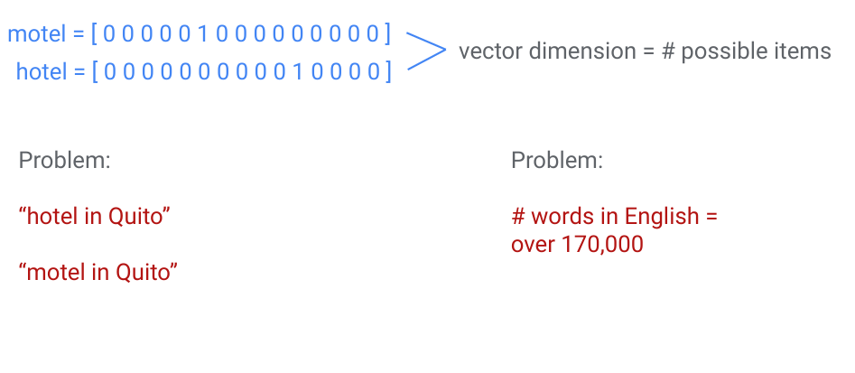
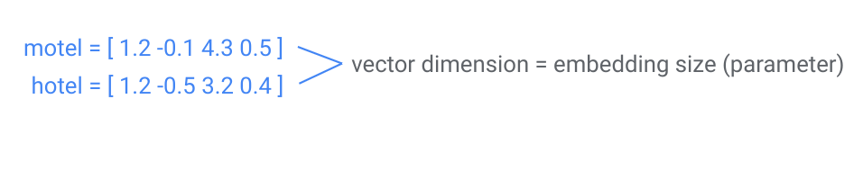
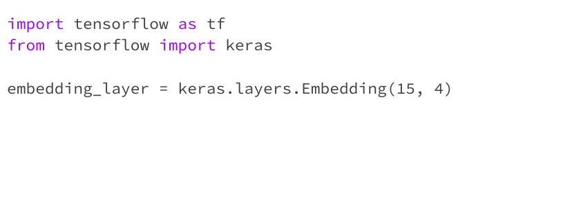
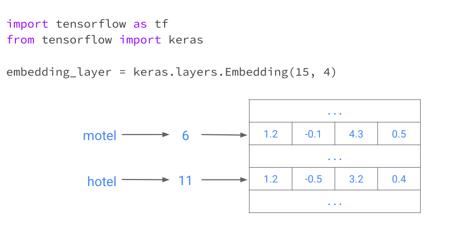
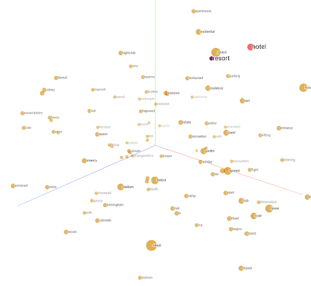

# Embeddings

---

# Review: one-hot encodings

<!--
Suppose we’re working with input data with a large number of possible categories, such as words. Our machine learning models can’t work directly on words -- they need to take a vector of numbers as input. Traditionally, we could do this using a “one-hot encoding” (as shown). 

This has 2 main problems: 1) similar items don’t have similar encodings (“hotel in Quito” may not lead to similar search results as “motel in Quito”), and 2) we may need huge vectors to encode all possible items.
-->

# Embeddings

* Efficient, dense representation
* Similar items have similar encodings

<!--
the embedding dimension is a parameter you specify
higher dimension = more descriptive, but takes more data / time to learn
-->

---

# Using embeddings

<!--
the first number, 15, is the # of possible items
the second number, 4, is your chosen embedding size
Instead of manually specifying embedding values, we can train them (they are treated similarly to weights learned by the model during training)
* no separate training process needed, they are treated as another hidden layer
-->

---

# Using embeddings

<!--
The embedding layer acts as a “lookup table”, where each item has a unique index that is used to lookup its corresponding embedding. This particular table has 15 rows (corresponding to unique items) and 4 columns (one for each embedding dimension). You’ll investigate this more in the colab.
-->

---

# Visualizing embeddings

<!--
One of the big advantages of embeddings is that they can meaningfully represent items and relationships between items, in a way we can easily visualize. Here we can see that the embeddings for “hotel” and “resort” are fairly close. Based on the dataset used to train these embeddings, this means these two words are used in similar contexts.
-->

---

# Embeddings in practice

* Can either train your own or use pre-trained embeddings
* Not just words! Can embed:
  * entire books
  * medical labels
  * images
  * any discrete data

---
  
# Your Turn

[Embeddings](https://colab.sandbox.google.com/drive/1LlkhE9uY6qZVxiwTjQSO37E2pp-YZ6X6)
  
<!--
Let’s work on the Embeddings colab where we can apply these skills to:
Training your own embeddings
Visualizing your trained embeddings
-->

