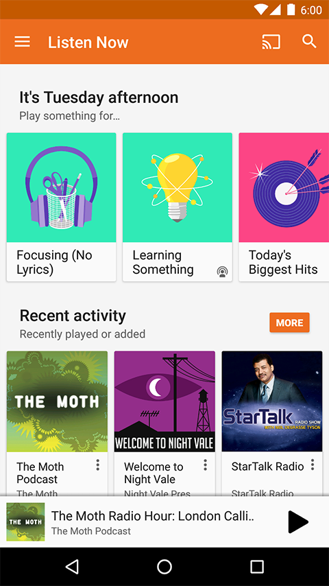

---

# Goals of This Class

* Learn to take a real-life problem and apply machine learning to make predictions.
* Learn to implement machine learning solutions using TensorFlow
* Learn how to evaluate the quality of your solution
* Machine learning is a very broad field -- we only just touch upon some of the most common machine learning algorithms

---

 

**get to know each other!** {.big}

* Find someone you don’t know and talk about what is your expectation of this ML course.
* You will introduce your partner and share your partner’s expectation briefly in 1-2 min.

---

# Applications

---

---

# Sample Applications of Machine Learning

* Medical applications such as disease prediction
* Speech recognition and understanding
* Recommendation systems
* Malware and spam detection
* Image understanding and annotation
* AI for games
* Translating between languages
* Predicting likelihood of earthquakes
* Matching resumes with jobs

<!--
Goal here is to make sure the students see the wide range of applications of machine learning.  First just some sample applications from a wide range of areas and then some explicit examples where ML is used at Google.
-->

---

# Google Products Using Machine Learning

---

# Google Assistant

<!--
Search - something we all us all the time
Voice recognition
Ranking - which pages to show
-->

---

# Google Photos: Searching Images via Text

<!--
Image collections are growing rapidly with digital cameras, especially our phones
Extremely hard to label every image to be able to find it when needed
There are people who do that
Google labels your pictures - allows you to search without ever adding a label
(Source: image: Photos taken by Wolff Dobson in Tokyo 2016 -- have permission to use here)
-->

---

# Gmail: Smart Reply

<!--
Smart Reply
A lunch invitation from a colleague
Makes good suggestions for simple replies to emails
-->

---

# Google Play Music: Recommending Music

<!--
Deep Learning is also used in everyday applications, like Google Play Music.
Here, it’s used to recommend artists you might enjoy
-->

---

# Game Playing: Alpha Go

<!--
Deep Learning can also be used to play games.
You might have heard of “DeepBlue” - the first computer to play chess at a championship level.
In 1997, it defeated the world champion - Garry Kasparov.
But to do it, DeepBlue used mostly brute force. In fact, it used an algorithm demonstrated by Claude Shannon, back in 1949! (recommendation: go read about Claude Shannon on Wikipedia)
-->

---

# Google Play Music: Recommending Music

---

# Combined Vision and Translation

<!--
Deep Learning can also be used for text recognition and translation
Machine Learning powers translation from and to 90+ different languages, in Google Translate.
-->

---

 

**your favorite ML applications** {.big}

* What are some applications of machine learning you know about and like?
* Where are some places you think machine learning might be helpful?
* Where do you think machine learning might be harmful?

---

# Introduction to AI and Machine Learning

---

# What is Machine Learning (ML)?

There are many ways to define ML.

* ML systems learn how to combine data to produce useful predictions on *never before seen data*
* ML algorithms find patterns in data and use these patterns to react correctly to brand *new data.*

---

# ML is a branch of Artificial Intelligence 

Artificial Intelligence (AI) focuses on the creation of computer programs that appear to work and react like humans

---

 

**AI & ML** {.big}

Discuss about the relationship between AI and ML.
* What are examples of AI technologies?
* What are examples of ML technologies?

---

---

# Introduction to Linear Regression

---

# Sample Machine Learning Problem

<!--
Begin with a very simple example.  The goal here is to help the students really understand what we mean by a linear model.  Goal is to slowly build up from a line in two dimensions to a higher-dimension linear model.
-->

---

# Sample Machine Learning Problem (cont)

---

# Sample Machine Learning Problem (cont)

---

 

**prediction** {.big}

Given our model of the data y = 7x - 30, how might we predict cricket chirps/minute (y) for a temperature (x) that we don't have a measurement for?

---

# Sample Machine Learning Problem (cont)

<!--
The goal of the green line is to illustrate using the model to make a prediction visually as well as algebraically.
-->

---

# Sample Machine Learning Problem (cont)

<!--
First introduce the notion of a model for the parameters of the network, and what is meant by a linear model.
-->

---

# Definition: Linear Regression

<!--
Begin defining linear regression. We are going to introduce some notation in the next few slides.  The goal is to step through this slowly so the students have time to get comfortable with the notation.
-->

---

