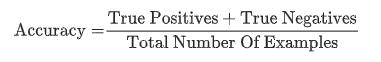
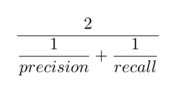
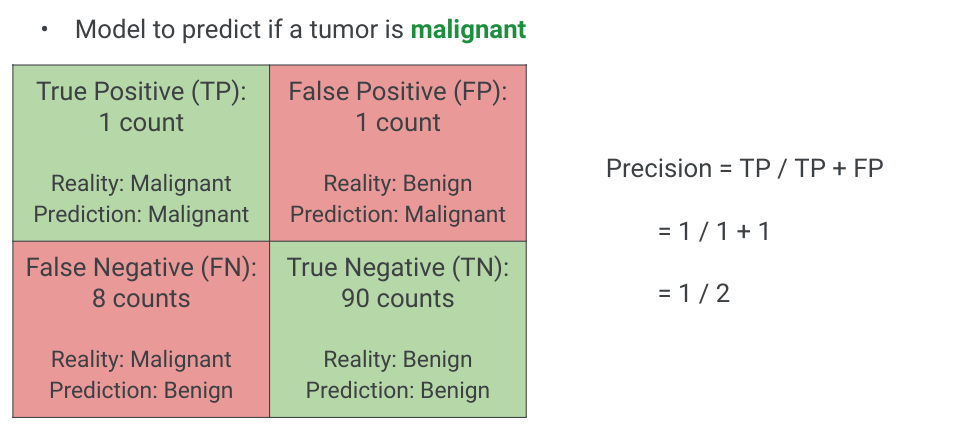
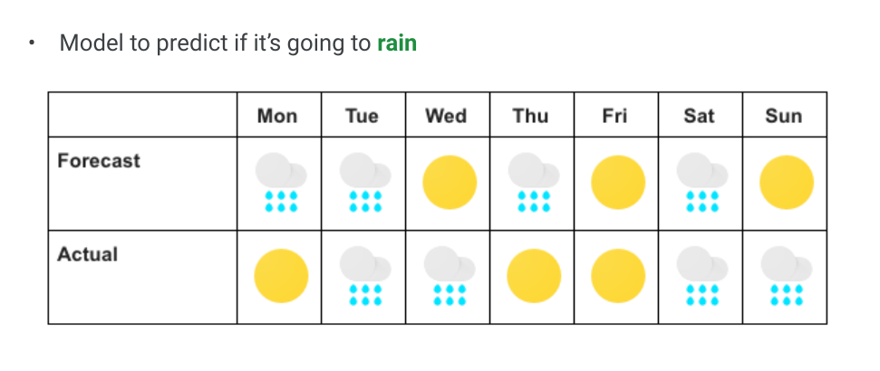
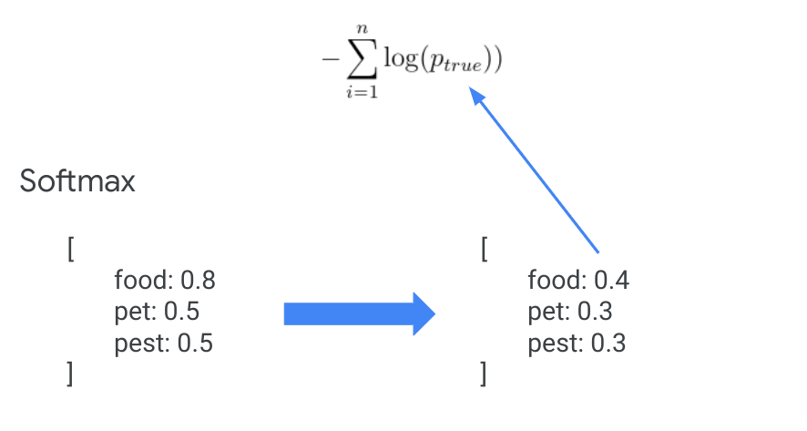

# Classification Quality

<!--
A giant piece of machine learning is knowing how to evaluate and tune your model results.
first half is calculating basics of accuracy, precision, recall, F1
second half is more advanced analysis like precision-recall curve, ROC curve, cross entropy loss
-->

---

# Confusion matrix

Model to predict if a tumor is malignant

<!--
A confusion matrix is often used to describe how well a classification model performs on a dataset where true values are known.  It’s best to think of it as a table with 2 rows and 2 columns
It’s important to note what is the model trying to predict - which represents a “positive” outcome.  In this example the model is trying to predict if a tumor is malignant.  So positive outcome is a malignant tumor (though not positive in a human sense)

The 4 sections of the confusion matrix:
True Positive (TP)
Model predicts positive outcome (malignant) and it’s actually positive (malignant)
A hit scenario
True Negative (TN)
Model predicts negative outcome (benign) and it’s actually negative (benign)
False Positive (FP)
Model predicts positive outcome (malignant) and it’s actually negative (benign)
A false alarm scenario, also called Type I error
False Negative (FN)
Model predicts negative outcome (beningh) and it’s actually positive (malignant)
A miss scenario, also called Type II error
--> 

---

# What is accuracy?

* The fraction of predictions that a classification model got right
* In binary classification, the correct predictions by model is the sum of True Positive (TP) and True Negative (TN)

<!--
Accuracy measures how well the model is performing based on the fraction of correct predictions -- regardless of whether the model predicts a positive or negative outcome
That is a contrast to Precision which we’ll discuss in the next slide which only considers positive outcome predictions
-->

---

# What is precision?

* The fraction of predictions that a classification model got right when predicting positive outcome
* Compute the fraction of **correct** positive outcome prediction out of **all** positive outcome predictions

<!--
Unlike accuracy, here we are only interested in positive outcome predictions and the frequency that we got the prediction correct among all positive outcome predictions

Actual positive outcome includes:
TP
Prediction: Positive
Actual: Positive
FP
Prediction: Positive
Actual: Negative
-->

---

# What is recall?

* The fraction of predictions that a classification model got right when out of all possible positive outcome
* Compute the fraction of correct positive outcome prediction out of all positive outcome predictions

<!--
Recall is often confused with precision.  Unlike precision where you compare correct positive predictions (TP) to all positive predictions (TP & FP), recall compare correct positive predictions (TP) over all actual positive outcomes (TP & FN)

Actual positive outcome include:
TP
Prediction: Positive
Actual: Positive
FN
Prediction: Negative
Actual: Positive
References
A useful visual to explain the difference between Precision and Recall from Wikipedia
-->

---

# What is F1 score?

* Harmonic mean of precision and recall
* High F1 means precision and recall are both high

<!--
Recall that good classification results are a balancing act between precision and recall. 

F1 score is a good measure to balance precision and recall. It computes the harmonic mean for the values, so optimizing for a high F1 score helps keep both precision and recall high.
-->

---

# Confusion matrix

Model to predict if a tumor is malignant

<!--
Let’s calculate based on the following example data where we have:
1 count of TP
1 count of FP
8 counts of FN
90 counts of TN
The total number of predictions is 100 counts
-->

---

# Accuracy

---

# Precision

---

# Recall

---

# F1

<!--
low because recall is low!
from previous slides:
precision = 1 / 2
recall = 1 / 9
-->

---

# Weather prediction

<!--
Practice calculations (these are the most common / important metrics to know for classification)
-->

---

# Your Turn

* Given that model to predict if it’s going to rain, construct a confusion matrix, and calculate:
  * Accuracy =
  * Precision =
  * Recall =
  * F1 =
  
<!--
Click back to previous slide to let students calculate
-->

---

# Solution

---

# Advanced Measures

---

# Precision recall curve

<!--
Besides F1 score, detailed plots of precision vs. recall can also be used to pick where to find a balance. In this case there is a drastic decrease in recall as precision crosses 80%. Depending on your problem, you'll probably want to keep your model tuned to values close to 80% precision.

Talk with class about examples where recall or precision might be favored:
Hiring decision? --precision
Youtube: Marking inappropriate content (google youtube children), or copyrighted material. -- recall
Music / video recommendations? (is it better to play a song the user won’t like, or not play something they would?) --accuracy
Medical treatment? (what happens if a doctor sends you home and you have a terminal disease? What about when they run the exams just in case?) --recall
criminal justice risk assessment --precision 
Fraud / identity theft detection --recall ( every once in a while your card gets blocked or you get a call, specially if travelling or diff purchase behavior, because that’s cheaper than having to deal with the consequences of not detecting it early enough)

Point to importance of knowing how the algorithm got to that conclusion: compare early detection of schizophrenia vs criminal justice risk assessment 

---

# Receiver Operating Characteristic (ROC) curve

<!--
Another curve used to visualize model quality is the ROC curve. ROC curve plots True Positive Rate (TPR, or recall) against False Positive Rate for various threshold values. FPR is (1 - the true negative rate).

The next slides will detail what these values are.
-->

---

# ROC: True positive rate == recall

<!--
The true positive rate in the ROC curve (y-axis) is exactly the recall. 
-->

---

# ROC: false positive rate

<!--
The false positive rate is one minus the true negative rate (TNR). TNR is also called specificity.

You can interpret this as how many actual negative examples were falsely predicted as positive.
-->

---

# Receiver Operating Characteristic (ROC) curve

<!--
How do you tell if you have a good model? There is a calculation called Area Under Curve (AOC) or Area Under ROC (AUROC). Most toolkits will calculate this value for you. An AOC of 0.5 is a totally random classifier (dotted line) and an AOC of 1.0 is a perfect classifier.

ROC / AOC are complicated metrics that people often misinterpret -- an ideal graph curves high on the upper left and has an AOC closer to 1.0
-->

---

# Cross entropy loss

<!--
Finally, recall our discussion of loss functions from earlier. For regression, common loss functions were L1 and L2 loss. For classification problems, the most common loss function is Cross Entropy Loss. This will be most useful in neural network models.

This loss function requires that your model outputs *probabilities* (i.e. the confidence for each class should sum to 1). Depending on the classification model used, you may need to apply a mathematical transformation to get a probability distribution. A common transformation is the softmax function: https://en.wikipedia.org/wiki/Softmax_function (you don’t need to get into the math, but if students are curious the formula is in the wiki). You may notice that softmax squashed the confidences closer together -- it preserves relative magnitude but doesn’t necessarily preserve the relative ratios.

Once you have a probability distribution, you calculate Cross Entropy Loss by adding together the log of the probability the model outputted for the correct class for each data point. Since lower loss is better for models, the negative of that sum is your cross entropy loss.
-->

---

# Which do I use?

<!--
The answer is "it depends". It is a good idea to measure the quality of your classifier using many different metrics and graphs, as well as qualitative measures (looking through examples of what the model is predicting correctly and incorrectly).

In general accuracy isn't a good measure. F1 is a good measure to balance precision and recall.

The precision recall curve is best used when the positive case is rare or when false positives are more important than false negatives. In contrast, the ROC curve is best when the positive and negative cases are more balanced.

Cross entropy loss is most commonly used for more complex models, like neural networks.
-->
