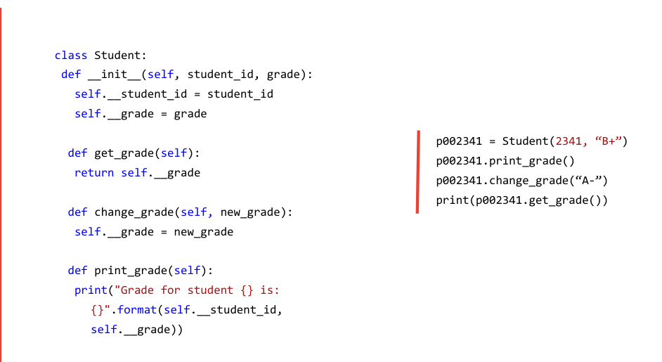
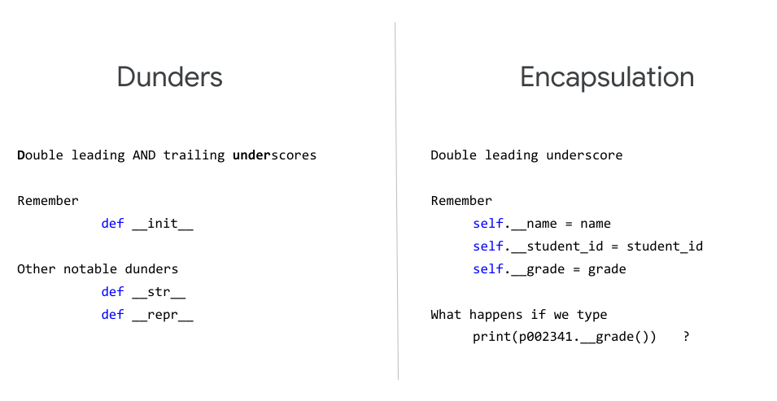

# Intermediate Python

---

# OOP

* Object Oriented programming paradigm
* Classes and instances
* Instance variables and methods
* Method calling

<!--
Make sure everyone knows what “programming paradigm” means
Compare and contrast OOP with procedural and functional (procedural programming is mentioned on colab, so make sure to explain it and give examples so the distinction is clear)
Clearly define objects, instances, and classes. Eg: Classes are like blueprints, while instances are the actual object, ie, the actual physical representation in memory of a “thing” of the type defined by the class. Ex: the class student has the instance variables name, age, and student_id. “Bobby” is not a class, but rather an instance of the class Student. Objects and instances are often used interchangeably.
-->

---

<!--
Give a full example of defining a class, creating methods, instantiating an object, and calling functions.
-->

---

<!--
Explain str vs repr
Explain the concept of encapsulation and why it’s important
See http://www.cems.uwe.ac.uk/~jsa/UMLJavaShortCourse09/CGOutput/Unit3/unit3(0809)/page_13.htm for a summary)
Compare print(p002341.get_grade()) with print(p002341.__grade())
Note that print(p002341._Student__grade()) would work
Helpful read: https://dbader.org/blog/meaning-of-underscores-in-python
-->

---

# Inheritance

<!--
Explain inheritance:
Helpful reads:
https://web.stanford.edu/class/archive/cs/cs106b/cs106b.1152/preview-inheritance.shtml
http://www.jesshamrick.com/2011/05/18/an-introduction-to-classes-and-inheritance-in-python/
Also Multiple inheritance in Python (https://pythonbasics.org/multiple-inheritance/)
-->
