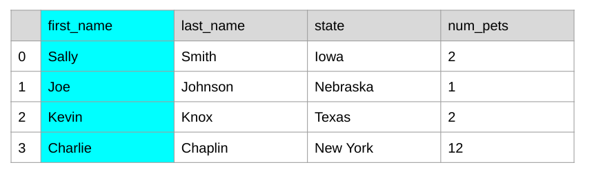
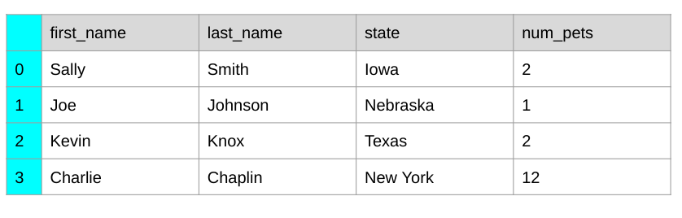

# Introduction to Pandas

---

# Pandas

<!--
Pandas? These animals are adorable but we are going to talk to about a Python library called Pandas which is a popular tool for handling and analyzing input data.

Source: photo by Pascal Müller on Unsplash
-->

---

# What is Pandas

* Data analysis tools for Python programming language
* In use in wide variety of academic and commercial domains, including Finance, Neuroscience, Economics, Statistics, Advertising, and more
* Open source with active community contribution
* More info: https://pandas.pydata.org/index.html

<!--
Python is popular language for working on files and data munging, but to more data analysis and modeling means switching to a more domain specific language like R.
Pandas provide data structures and tools to perform data analysis.  Hence by combining Python and Pandas, you will be able to carry out the entire data analysis workflow using Python.
-->

# Pandas Data Structures

DataFrame

<!--
Pandas data structure is very much like a table with one or more columns - which means it works well with CSV type of data file format.
Let’s start with a data structure: DataFrame
* Looks like a table which consists of rows and columns
* The first row contains column headers
-->

---

# Pandas Data Structures

Series

<!--
Pandas Series is 1-dimensional and contains homogeneously-typed array
So, in summary a DataFrame contains 1 or more Series
-->

---

# Pandas Data Structures

Index

<!--
Lastly, the first column is an index column and in this case it’s numeric values, but it can be non-numeric as you’ll see as you dig deeper into Pandas usage
-->

---

# Read Data into DataFrame

<!--
The data analysis tool is only useful if there is a way to load data into the DataFrame.  Pandas has a rich IO API that easily load the data that’re in various common format so you don’t need to parse the data yourself
The most commonly used would be read_csv() but for a large dataset read_sql might be handy
-->

---

# Your Turn

[Introduction to Pandas](https://colab.sandbox.google.com/drive/1YHNh4nYPq0nJfLe_uPZKAml-B-rZs8-d)

