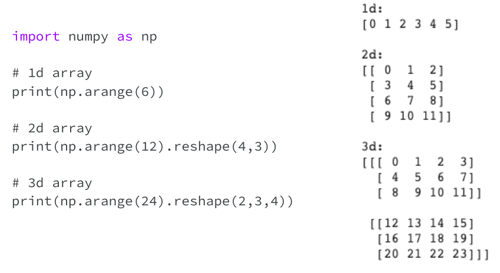
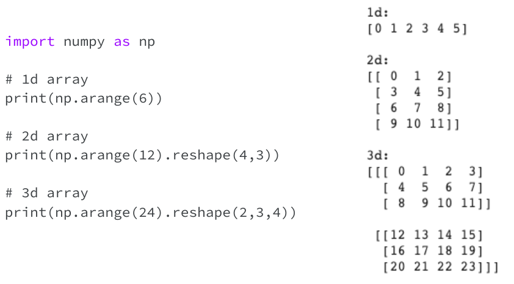
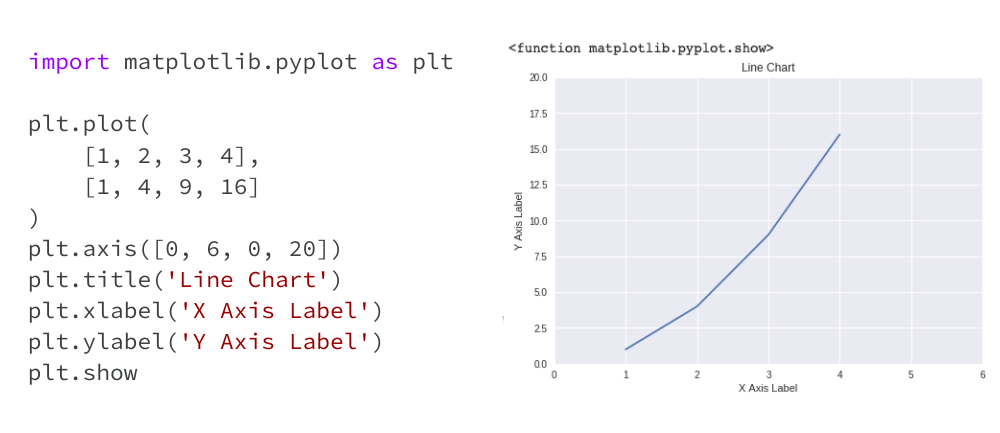
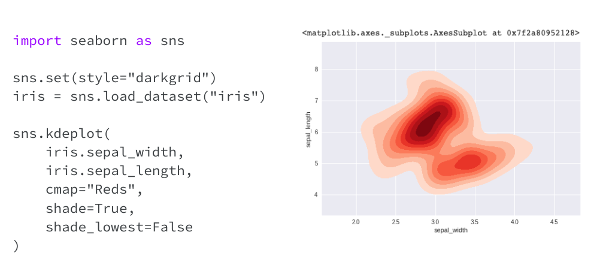

# Visualizations

---

# What is NumPy?

* Package for scientific computing with Python
* Add support for n-dimensional array object, numpy.array
* Include high-level mathematical functions to operate on numpy.array
* Community supported open source project
* More info: http://www.numpy.org/

---

# numpy.array

<!--
Numpy array is similar but not the same as Python array - mostly because numpy array offers much more functionalities, especially as it relates to computing of multidimensional array or matrices.
In this example, we shows the code for creating a sample 1-dimension, 2-dimension, and 3-dimension arrays:
For simplicity, the code use np.arange() function to get a list of evenly spaced number given an start and stop numbers, for example: np.arange(6) results in an array of number 0 to 5
To get 2-dimension and 3-dimension, we pass the 1-dimension array returned by np.arange() through np.reshape() function:
np.reshape(4.3) change the shape of the 1-d array into 4 by 3 2-d array
np.reshape(2,3,4) change the shape of the 1-d array into 2 arrays of 3 by 4

Resources: 
numpy.arrange: https://docs.scipy.org/doc/numpy/reference/generated/numpy.arange.html
numpy.reshape: https://docs.scipy.org/doc/numpy/reference/generated/numpy.reshape.html
-->

---

# Data Visualization

* Important steps in exploring the dataset(s)
* Many Python visualization libraries including Matplotlib and Seaborn
* Integrated to work with Pandas data structures
* Support a large variety of chart types
* More info: https://matplotlib.org/ and https://seaborn.pydata.org/

---

# Matplotlib

<!--
This simple example illustrate the ability to create a line chart with just a line of code.  In this case:
Plt.plot defaults to line chart
The 2 arrays are values for the x and y axis
For a list of the different chart supported by matplotlib:
https://matplotlib.org/tutorials/introductory/sample_plots.html#sphx-glr-tutorials-introductory-sample-plots-py
-->

---

# Matplotlib

<!--
Matplotlib also allow various customization of the chart by setting chart properties.  In this example:
Added definition for axis value range by setting plt.axis property to an array of [xmin, xmax, ymin, ymax] which represents the minimum and maximum values of the respective x and y axis
Set the chart title by setting plt.title property to a string
Similarly, we set the x and y axis labels
Calling plt.show to draw all final chart
For full list of properties for line chart:
https://matplotlib.org/tutorials/introductory/pyplot.html#controlling-line-properties
-->

# Seaborn

<!--
Seaborn is built on top of Matplotlib and provide a high-level interface for drawing attractive and informative graphics.  The graphics can be produced using Matplotlib but it’s more complex to code with lower level APIs.
In this example:
Import Seaborn package as sns
Set the background and grid to dark theme
Load Iris dataset from Seaborn sample data repository
Draw density plot between Iris flower sepal length and width
Resources:
Seaborn tutorials: https://seaborn.pydata.org/tutorial.html
Seaborn chart gallery: https://seaborn.pydata.org/examples/index.html
Wikipedia article on Iris dataset: https://en.wikipedia.org/wiki/Iris_flower_data_set
Wikipedia article on flower sepal: https://en.wikipedia.org/wiki/Sepal
-->

---

# Your Turn

[Numpy, Matplotlib, and Seaborn](https://colab.sandbox.google.com/drive/1DteCte0oOefBB5w0lZVg8oeqPgsOcheT)

