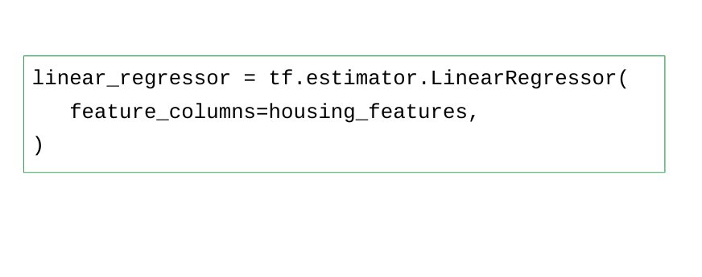
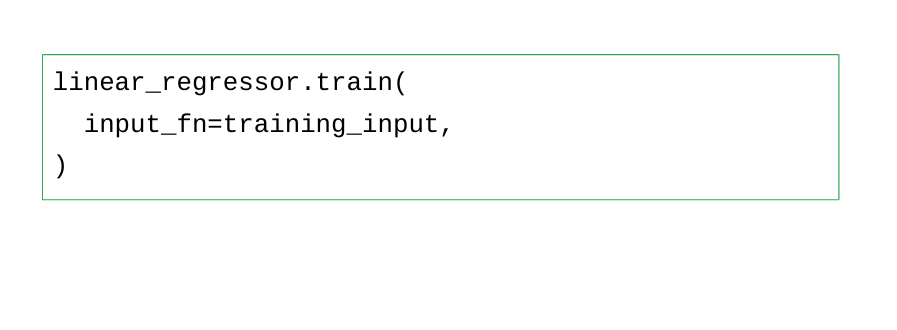

# Linear Regression with TensorFlow

---

# Predicting California Housing Prices 

<!--
In this colab we will be be examining California housing price data. The data is from the year 2000 census and contains block-level data about california housing prices.

A census block is a geographic area containing between 300 and 3000 individuals, so in denser areas there are more census blocks.
-->

---

# The Dataset

<!--
Let's take a look at the dataset that we'll be loading.

We can see that we have 17,000 rows. Notice that some values are scaled by thousands such as median income.
-->

---

We will implement Linear Regression with a TensorFlow estimator. {.big) 

Estimators are a high level way to use TensorFlow, allowing us to skip over more technical considerations. {.big}

---

Using TensorFlow estimators requires four steps: {.big}

1. Define feature columns. {.big}
1. Write a function(s) to import your data set(s). {.big}
1.  Instantiate the relevant estimator. {.big}
1.  Call a training or evaluation method. {.big}

---

1.) Define feature columns {.big}

---

2.) Write a function(s) to import your data set(s) {.big}

---

3.) Instantiate the relevant estimator {.big}

---

4.) Call a training or evaluation method {.big}

---

# Your Turn
