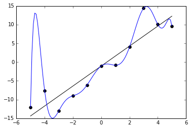
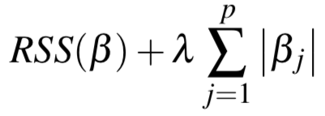
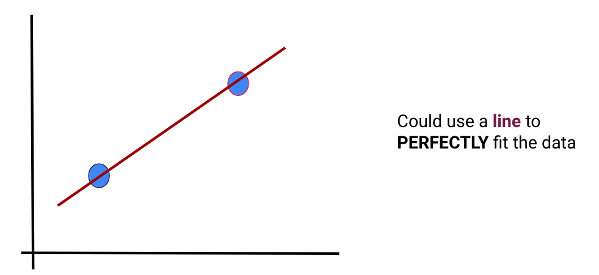
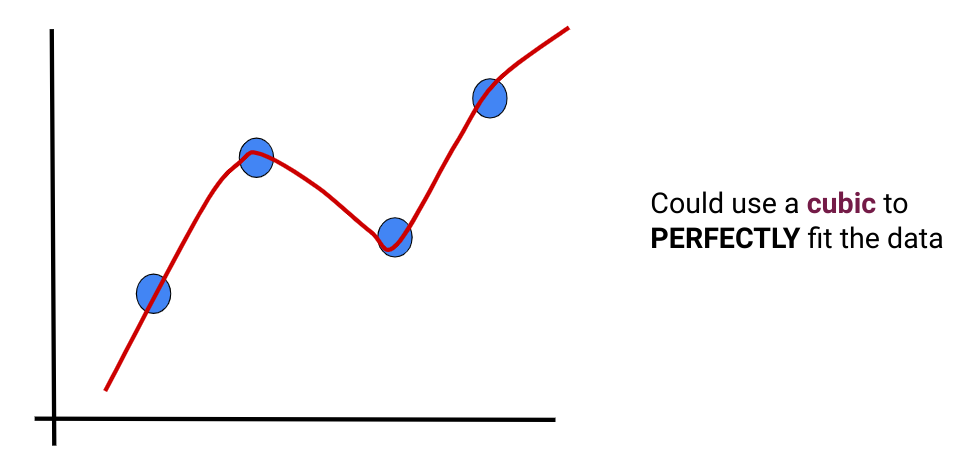
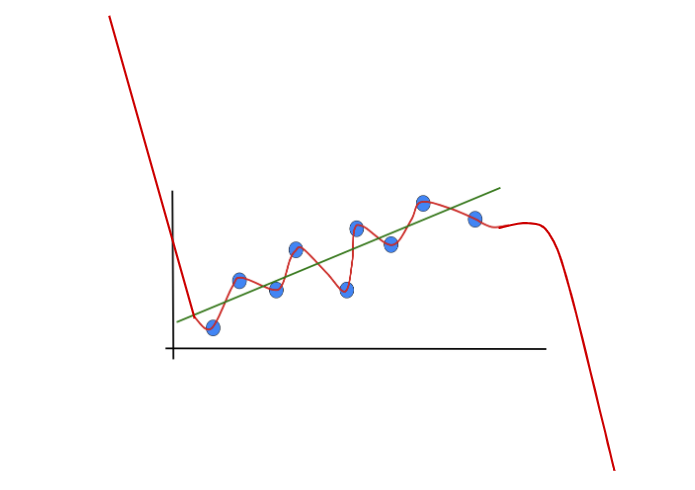

# Polynomial Regression & Overfitting

---

# What Are We Doing Here?

1.  Remind ourselves of **Linear Regression**
1.  **Polynomial Regression**: what does it buy us…?
1.  Whoa - Caution! **Dangers** of polynomial regression!
1.  Regression vs. **Interpolation** (connect the dots!)

---

<!--
We have seen linear regression and have implemented it using multiple toolkits. We found our line using both the "closed form" solution and using optimizers such as gradient descent. Though linear regression can be a powerful predictive tool, it isn't appropriate for all types of regression problems.
-->

---

<!--
Take a look at this dataset for a few seconds and see if you can find a good spot to place a line.
-->

---

<!--
This is the line that the closed form of linear regression would create. It doesn't look like a very good fit does it? The r-squared score for this line is actually 0.2278666166017529.
-->

---

<!--
We can see that if we introduce a polynomial line (in this case a 2nd degree polynomial), we get a much better looking fit. The r-squared score is now 0.7900240657338337.
-->

---

<!--
Here are a few examples of polynomial equations. The topmost is the linear equation that we know and love. The next is commonly called a "quadratic" equation. The third is a "cubic" equation. The number of factors you can add to equation is theoretically unbounded, though you'll pay a computational expense for very large equations and also introduce the risk of overfitting (which we'll talk about soon).
-->

---

<!--
Have students talk to one another and answer the above two questions.
-->

---

<!--
This dataset was actually randomly generated based on a polynomial equation with a bit of random noise. You can see that line drawn in green on the chart. Our red predicted line isn't perfect by any means, you can see a much sharper slope at both ends, but it is still better than a straight-line fit.
-->

---

<!--
Have students talk to one another and answer the above two questions.

Transition remarks: we will now discuss using different order polynomials for regression and in particular explore potential dangers of using higher and higher order polynomial fits
-->

---

<!--
Question to students: What could go possibly go wrong if we use a polynomial to fit the following data? Have them brainstorm some ideas
-->

---

<!--
-Discuss which appear to be viable
-Pretend to throw one more data about in (B) in region where curve does not pass through to show one point could throw off entire fit!
-->

---

# Overfitting

---

<!--
Let's think of overfitting by looking into clothing. Here we have a person wearing a reasonably well-fitting suit.

Source: photo by NordWood Themes on Unsplash
-->

---

<!--
Clothing can be a little more form fitting, which reduces the number of people that it will fit. This is overfitting. You can think of it like a custom-tailored suit or a suit of armor.

Source: photo by Hugo L. Casanova on Unsplash
-->

---

<!--
There is the other extreme, where you make clothing so loose that just about anyone could cover up with it. This would be underfitting.
-->

---

<!--
Most of the time you just want a simple midsized unisex t-shirt of a model. It fits most of the time at the cost of being a little frumpy.
-->

---

<!--
So how does this apply to real data? Here is an illustration of overfitting a regression model. You can see how the regression line perfectly fits the data points on the graph, but probably doesn't project well onto other x-values.

https://en.wikipedia.org/wiki/Overfitting
-->

---

How Do You Avoid This? {.big}

<!--
Given the problem of a polynomial fitting data too closely, how would you avoid overfitting.
Give the students some time to throw out some ideas.
-->

---

Avoiding Overfitting {.big}

* Simpler polynomial
* More training data
* Dropping out some training data
* Overfitting penalties (Regularization)

<!--
Here are some of the more common ways of avoiding overfitting.

Using a simpler polynomial function is one obvious way. If you model is introducing enough curvature to cross every training data point then remove some of the freedom of the model to adapt by reducing the polynomial space.

Another tactic is to use more data to train your model. As your dataset grows in size, it will likely also grow in diversity and create a model that is less overfit.

If you can't collect more data to train your model, it might be possible to drop some data out of the training set to reduce the ability for your model to overfit.

And finally, there are strategies for adding penalties to the model to make even a high-degree polynomial less likely to overfit. Some common strategies are called LASSO, Ridge, and ElasticNet. We'll look at each of these a little closer and you'll experiment with them in your lab exercise.
-->

---

# Regularization

<!--
Regularization is a method of "shrinking" the coefficients in the learned equation. There are two distinct types we will look at: Lasso and Ridge, as well as one type that somewhat merges the two.

https://medium.com/@yongddeng/regression-analysis-lasso-ridge-and-elastic-net-9e65dc61d6d3
-->

---

# Loss

<!--
But what does it mean to shrink the coefficients? It means to increase the value of the loss function as the coefficients are calculated.

As a reminder, here is the equation of a common loss function for regression problems, the residual sum of squares.

In this equation:

n = the number of rows in the training data
p = the coefficients in the equation
yi = the target value
β0 = the intercept
βi = the bias at each coefficient of the polynomial equation
xi = the feature value at the given factor of the polynomial equation

https://en.wikipedia.org/wiki/Residual_sum_of_squares

$$RSS(\beta) = \displaystyle\sum_{i=1}^{n} \left( y_i -\beta_0 - \displaystyle\sum_{j=1}^p \beta_j x_{i}^j \right)^2$$
-->

---

# Lasso (L1)

<!--
Lasso is considered L1 regression. This regression uses the absolute value of the coefficients and appends them to the output of the loss function.

It actually is an acronym for Least Absolute Shrinkage and Selection Operator.

Due to the L1-Norm, some of the coefficients are more likely set equal to zero, depending on the regularisation parameter λ which needs to be chosen/tuned by the Cross-Validation 

https://en.wikipedia.org/wiki/Lasso_(statistics)

$$RSS(\beta) + \lambda \displaystyle \sum_{j=1}^p \left| \beta_j \right|$$
-->

---

# Ridge (L2)

<!--
Ridge regularization looks similar, but instead of appending the sum of absolute values to the loss function, it appends the sum of squares.

Ridge regression, also known as Tikhonov Regularisation seeks λ that minimises the penalised or regularised RSS. As the L2 norm is differentiable, learning problems using the method can be solved by Gradient Descent

https://en.wikipedia.org/wiki/Tikhonov_regularization

$$RSS(\beta) + \lambda \displaystyle \sum_{j=1}^p \beta_j^2$$
-->

---

# ElasticNet (L1 + L2)

<!--
ElasticNet is the combination of L1 and L2 regularization applied to the loss function.

https://en.wikipedia.org/wiki/Elastic_net_regularization
--> 

---

# Which is Best?

<!--
It really depends.

L1 regularization can drive coefficients to zero and tends to produce a sparse model.

L2 regularization is less likely to drive coefficients to zero and tends to produce a more dense model.

ElasticNet works well in many situations.

It is probably worth experimenting with each method to see which works best for your particular model.
-->

---

Is there a way we can find a polynomial to go through the data perfectly? {.big}

---

Is there a way we can find a polynomial to go through the data perfectly? {.big}
**If so, should we do it?** {big}

---

What type of function would you use to fit the following data? {.big}

---

What type of function would you use to fit the following data? {.big}

--- 

What type of function would you use to fit the following data? {.big}

---

What type of function would you use to fit the following data? {.big}

---

What type of function would you use to fit the following data? {.big}

---

What type of function would you use to fit the following data? {.big}

---

Why might this be a bad idea? {.big}

---

Polynomial Interpolation  ! =  Polynomial Regression {.big}

<!--
-A linear regression may make more sense; throw in another data point and polynomial may drastically change!
-Especially true if we are looking for general trends, high order polynomials may be too “curvy”
-Next slide...also polynomial interpolations generally go crazy outside the region where the data was interpolated (connected)
-->

---

Polynomial Interpolations go nuts outside the data range {.big}

---

# Your Turn
