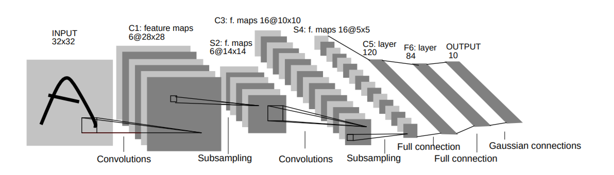

# Convolutional Neural Networks

---

<!--
Biological science from the 80s

Source: https://pixabay.com/illustrations/wallpapper-music-colors-80-s-778185/
-->

---

<!--
Visual cortex; small receptive field; overlap; react to different line orientations; can stack

Source: https://pixabay.com/photos/eye-iris-pupil-vision-eyeball-3221498/
-->

---

<!--
Small receptive field

Source: https://pixabay.com/illustrations/grid-block-cube-square-design-684983/
-->

---

<!--
Overlap

Source: https://pixabay.com/vectors/circles-colors-primary-red-blue-27975/
-->

---

<!--
Stack

Source: https://pixabay.com/photos/pancake-crepes-eat-food-crepe-640869/
-->

---

<!--
Lines

Source: https://pixabay.com/photos/industry-strommast-power-line-pylon-3112436/
-->

---

# LeNet-5

<!--
LeNet

http://yann.lecun.com/exdb/publis/pdf/lecun-01a.pdf
-->

---

<!--
Convolutional Layers
-->

---

GoogLe-Net

http://yann.lecun.com/exdb/publis/pdf/lecun-01a.pdf

---

<!--
Feature Maps
-->

---

<!--
Pooling
-->

---

# GoogLe-Net

<!--
GoogLe-Net
http://yann.lecun.com/exdb/publis/pdf/lecun-01a.pdf
-->

---

