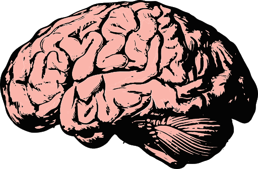
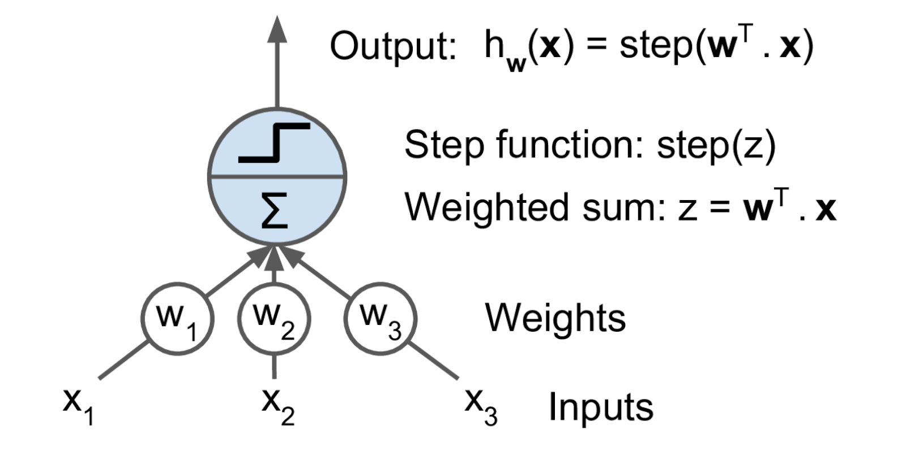
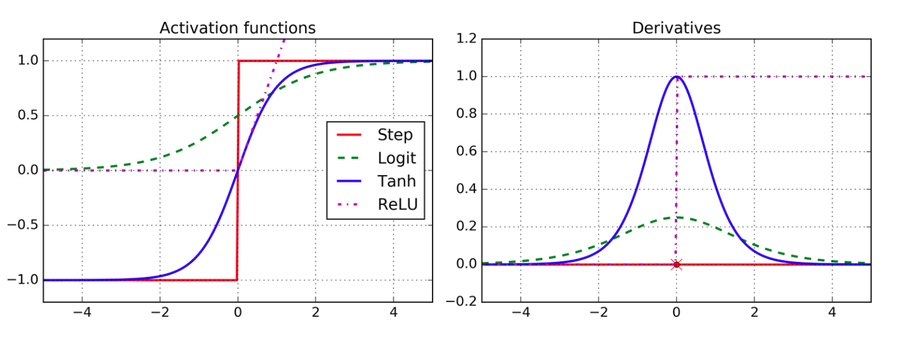

# Neural Networks

---

<!--
Nature can be a source of inspiration. Birds inspired man to fly. The burdock plant was the inspiration for velcro. Even in the computer science realm we hear references to trees, forests, and other things that occur in nature.

https://pixabay.com/photos/burdock-thistle-prickly-stick-barb-745306/
https://pixabay.com/photos/nike-baby-shoes-shoe-baby-velcro-1201595/
https://pixabay.com/photos/bird-seagull-flying-wings-gull-3158784/
https://pixabay.com/photos/plane-aircraft-take-off-sky-50893/
-->

---

<!--
This is a brain
Source: https://pixabay.com/vectors/brain-think-knowledge-mind-science-2845862/
-->

---

<!--
This is the building block of the brain: a neuron.

A neuron is just a cell with a nucleus and cell body like any other cell. One of the distinguishing features of the neuron is the 'axon', which is the long tail of the neuron. The tip of the axon has synaptic terminals that attach to other neuron bodies. A neuron body receives signals from the synapse of neurons before it. When those signals reach a critical point within a fixed period of time, the receiving neuron fires, sending a signal to later neurons.

Source: https://pixabay.com/vectors/neuron-nerve-cell-axon-dendrite-296581/
-->

---

<!--
This builds a web of neurons called a "neural network"

This simplification of the brain signaling pathway lead to research into "artificial neural networks" with different types of neurons.

Source: https://pixabay.com/illustrations/neurons-brain-cells-brain-structure-440660/
-->

<!--
1940s! I thought neural networks were cutting edge?

Many of the fundamental algorithms that we use today are rooted in thought experiments from the 1940s, but it has been a long journey from then until where we are today.

Computing power and data storage that we have today is nearly unimaginable compared to what was available, even in the recent past. Also, many of the early ideas were foundational, but have been improved upon over time.

The idea of deep learning is not new. There were even a few "AI winters" over the last 80 years that stalled development and research in deep learning. It feels like we might finally be at a point where the theoretical ideas of the past can be fulfilled with the technologies of today.

Source: https://pixabay.com/photos/albert-einstein-1-october-1940-1165218/
-->

---

# Artificial Neural Networks (ANN)

<!--
Today we will talk about artificial neural networks. These are computational networks inspired by biological systems.

ANN is a big umbrella. There are "feed-forward" networks. There is a concept of "backpropagation". And there are specific types of networks such as convolutional neural networks (CNN) and recurrent neural networks (RNN) that we will look at in more detail.
-->

---

<!--
Let's first take a look at a naive neuron. This type of neuron receives signals and makes a decision. There are pass-through/identity neurons, "And" neurons. "Or" neurons. And "Not" neurons.

These neurons are the building blocks from the 40s. They can build a computational system of signals that can be used to make decisions.
-->

---

# Perceptrons

<!--
The simple on/off model can be effective, but in practice there is a better type of neuron for many applications: the perceptron
-->

---

<!--
The perceptron (circa 1957) is a different type of neuron layer. It is composed of TLUs. Each TLU is a neuron which inputs weighted values and has a step function that only fires if the weights are over some threshold.

These are built on TLUs (Threshold Logic Units).
-->

---

<!--
This perceptron has two inputs (plus a bias) and three TLUs.

The perceptron is trained by reinforcing connections that fire together and produce a correct output.
-->

---

<!--
Multilayer perceptron. This is used to get more advanced calculations, such as XOR, but also obfuscates the decision making rationale of the algorithm. 
-->

---

# Backpropogation

<!--
Let’s make this even shorter: for each training instance the backpropagation algorithm first makes a prediction (forward pass), measures the error, then goes through each layer in reverse to measure the error contribution from each connection (reverse pass), and finally slightly tweaks the connection weights to reduce the error (Gradient Descent step).
-->

---

<!--
The choice of activation function is important. RELU makes differentiation difficult, but actually works in practice. The other functions are also very useful.
-->

---

<!--
Softmax is often used at the end of a neural network in classification functions. It can pick the most probable output neuron.
-->
