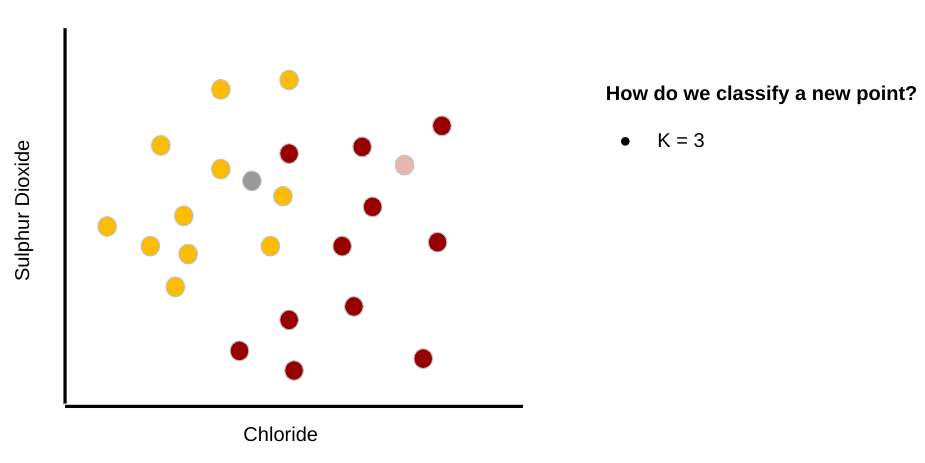
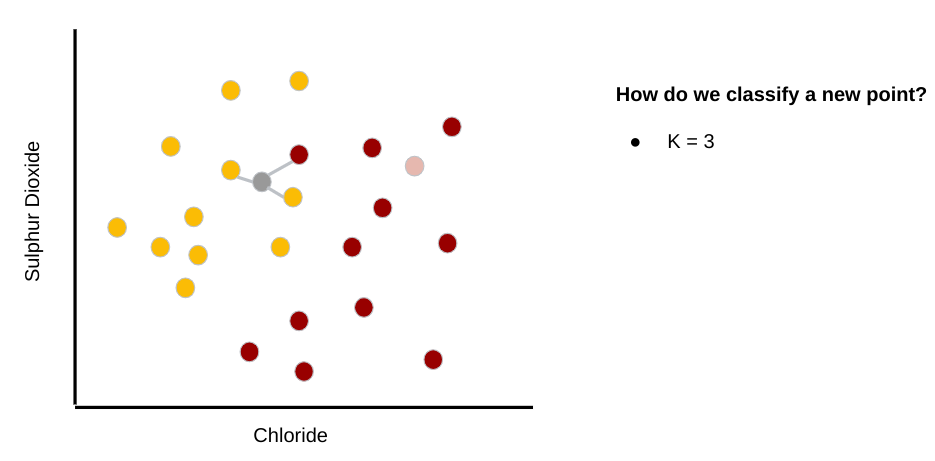
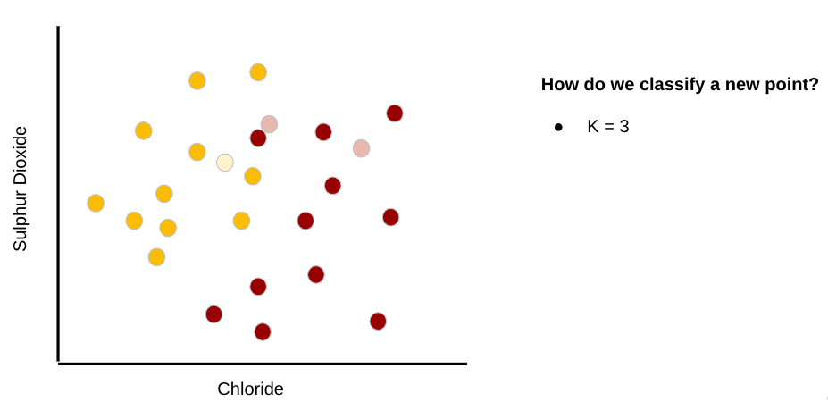
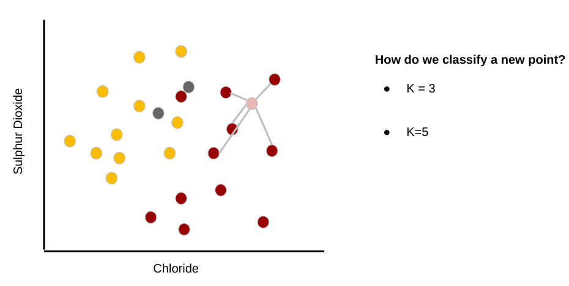

# K Nearest Neighbors

<!--
So far we have learned about:
* Regression (straight-line)
* Polynomial Regression
* Classification
* scikit-learn
* TensorFlow
and many more concepts and tools used in machine learning.

In this unit we are going to combine the concepts about classification that we recently learned and apply them using the scikit-learn toolkit.
-->

---

K Nearest Neighbors (KNN)

One of the simplest **supervised** machine learning algorithms used mostly for classification. 

---

K Nearest Neighbors (KNN)

One of the simplest **supervised** machine learning algorithms used mostly for classification. 

[Note: We can also use KNN for regression -- example in Colab.]

---

Example: classify as red or white wine {.big} 

---

Example: classify as red or white wine {.big} 

---

Example: classify as red or white wine {.big} 

---

Example: classify as red or white wine {.big} 

---

Example: classify as red or white wine {.big} 

---

Example: classify as red or white wine {.big} 

---

Example: classify as red or white wine {.big} 

---

Example: classify as red or white wine {.big} 

---

Example: classify as red or white wine {.big} 

---

Example: classify as red or white wine {.big} 

---

Example: classify as red or white wine {.big} 

---

Example: classify as red or white wine {.big} 

---

Example: classify as red or white wine {.big} 

---

Example: classify as red or white wine {.big} 

---

Example: classify as red or white wine {.big} 

---

