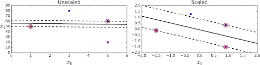

# Support Vector Machines

---

Linear and Nonlinear Classification {.big}

---

Classification and Regression {.big}

---

---

---

# Soft vs. Hard Margin

---

# C Hyperparameter

<!--
Smaller values allow more data in the highway and create wider highways.
-->

---

# Regression

<!--
The support vectors are the distances between the data points and the margin.
-->

---

# Kernal Trick

[Kernal Trick](https://www.youtube.com/watch?time_continue=2&v=3liCbRZPrZA&feature=emb_logo)

<!--When Linear SVM won’t work, the kernel trick finds a hyperplane boundary in a higher dimension, for low computational power

Source: https://www.youtube.com/watch?time_continue=2&v=3liCbRZPrZA&feature=emb_logo
-->
