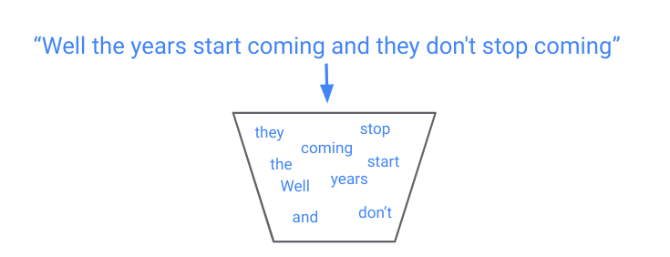
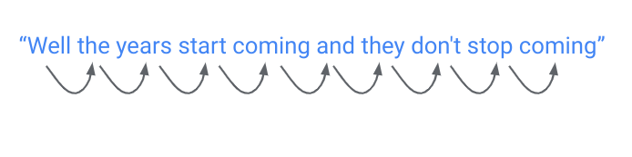

# Natural Language Processing 

---

# What is Natural Language Processing?

<!--
Group discussion: what are some applications of NLP in your everyday life?
See next slide for examples: really anything that involves processing text/language
-->

What is Natural Language Processing? {.big}

---

# Recurrent Neural Nets: Example

Character-Level Language Models

---

# Text Processing

Regular Expression (Regex)
* pattern used to match character combinations in strings

<!--
Before machine learning, solved NLP problems using mostly pattern matching. Even now, these text processing techniques can be very important in processing messy natural language. 

Regular Expressions are widely used in text processing (imagine needing to extract all the emails from a block of text, or remove prefixes/suffixes from a root word). A regex defines a pattern that is used to match certain character combinations, following a set of rules. Here we show a few examples of pattern matching rules: “.” matches any single character, “+” matches 1 or more of the previous character, “[^...]” negates the rest of the pattern in the brackets. 

Regex rules can be very powerful but also very complex. Many guides exist for effectively using regexes: https://www.rexegg.com/regex-quickstart.html
-->

---

Text Processing {.big}

Minimum edit distance (Levenshtein distance)
* minimum # edits needed to change one string into the other

<!--
Another important concept for text processing is minimum edit distance (also called levenshtein distance). This is especially useful for autocorrect tools and evaluating systems that generate language (like translation). There are many open source Python implementations of this algorithm you can use.
-->

---

# Feature Extraction

n-grams
* consider sequences of n words instead of one word at a time
* “that movie was not horrible” -> “that movie was not horrible”

TFIDF (term frequency - inverse document frequency)
* determine how important a word is to a document
* discount more common words (“and”, “the”)

<!--
Before neural networks, the first step in NLP was “feature extraction”, or transforming raw text into informative features. The idea is that just the individual words in a text do not fully capture the meaning of the text.

One very common feature extraction technique is n-grams, which consider n word sequences instead of just individual words. While in the original sentence “that movie was not horrible”, the word “horrible” may cause a model to predict very strong negative emotion, extracting bigrams (2-grams) would correctly pair “not horrible”, which is a much milder emotion.

Another common technique is TFIDF, which calculates how important a word is to a text. This often has the effect of ignoring more common words (like “the”) and letting the model focus on more unique words in the text.
-->

---

Feature Extraction: spaCy {.big}

<!--
There are many more linguistic features that you can extract from text. spaCy is a fast python library for advanced natural language processing tools. It converts text into a collection of “Token” objects, each of which contains useful annotations such as Part of Speech (pos) and Named Entities (ent_type).

In this example, spaCy breaks “San Francisco” into two Tokens, each of which is labeled as a proper noun (PROPN) and a Geographical/Political Entity (GPE). 
-->

---

# Language Modeling

Bag-of-Words (BOW)
* disregard order of words
* simple and surprisingly powerful

<!--
To build models for NLP tasks, we must have some notion of how words fit together into sentences and text. Language modeling refers to determining how likely a certain sentence is. The simplest language modeling approach is a bag-of-words: treat a sentence like an unordered collection (set) of words.

Take an example movie review, "I love love loved it!", and another, "I HATED it :-(".  You as a human could guess which review corresponded to a positive sentiment and which review corresponded to a negative sentiment, even if we looked at these sentences out of order (e.g., "it! I loved love love" and "HATED :-( I it".  So bag-of-words is like saying, "Ehhh... I'm pretty sure I can glean the meaning of sentences, with words in any order, so why bother keeping track of the order? Sounds like more work to me..." But you can probably think of an example or two where this strategy would fail, yes? Especially consider if you're trying to predict more than just two sentiments ("good" and "bad").
-->

---

Language modeling {.big}

Sequential
* language depends on the ordering of words
* Recurrent Neural Networks handle this well

<!--
BOW approaches are surprisingly successful on many tasks (email spam filter, sentiment analysis) and are less computationally intensive.

But, fundamentally, we know that the order of words matters. Harder NLP tasks build upon sequential approaches, which preserve the order of words in a text. This is exactly what RNNs are useful for.
-->

---

# NLP Processing

<--
the typical process for any NLP task is:
raw text -> transform to feature vectors (either through feature extraction or embeddings) -> run through some model -> perform supervised task
-->
