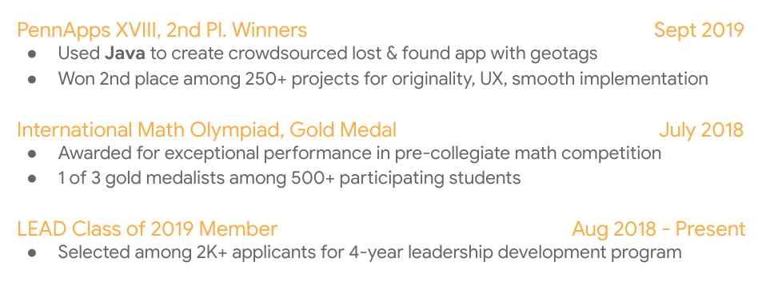

# CD-02: Resume Workshop

<!--
Today we’re going to go over some best practices for your resume. My hope is to provide some very clear guidance regarding what recruiters look for in students’ technical resumes. I also want you to know that no two resumes can and should be the same because you’ve all had different experiences and have different interests. By the end of today’s session you’ll have some industry best practices that you can apply to your resume, and I’ll be helping you with that during this presentation and one-on-one after the session.

[From your personal viewpoint, share why this workshop is important.]
-->

---

# Let's hear it

What are some frustrations you’ve had making and maintaining a resume? {.big}

<!--
Before we dive in, I’m curious to know what’s been challenging for you about creating and maintaining a resume? [Elicit student responses, and respond to each]

I hope today will clarify some of these questions you’ve had about resumes. Please ask questions as we go along if something is unclear or contradicts something you’ve heard before. I will do my best to answer, and if I don’t know the answer, I’ll find out and let you know!
-->

---

# Agenda

* General resume tips
* Resume structure
* Technical resume by section
* Your turn!
* Next steps

<!--
Here’s our agenda for today: general resume tips, resume structure (very important), a deep dive into each section, a chance for you to start putting these tips into practice, and instruction about where we’ll go with our newfound resume knowledge.

Source: Photo by Denise Jans on Unsplash
-->

---

# General resume tips

Recruiters should be able to find pertinent info on your resume with ease.

* PDF format
* Clean, simple, consistent, bullet-pointed
* Action words + metrics = results + impact
* Contact information
* “References upon request”

<!--
Before we narrow in on specific tips we have for each section of your resume, let’s start with some general resume tips first. 

The people reviewing your resume are actively looking for reasons to interview you. Because of this, you’ll want to ensure that the most pertinent, role-related information is clearly noted on your resume and found with ease. To that end, keep these tips in mind:

* PDF format: to avoid any formatting inconsistencies, which can happen during upload or file sharing, convert your resume into a PDF so that the formatting is retained without issues.
* Clean, simple, consistent, bullet-pointed: bullet points help make your resume more legible
* Action words + metrics = results + impact: we’ll get more into this later, but you want to start each bullet point with an action verb (e.g., created, designed, improved) and include metrics to highlight the impact you had in each experience on your resume. 
* Contact information: in addition to your name, be sure to include your contact information -- email preferred, phone number also helpful -- and feel free to include a link to your personal website or github page.
* “References upon request”: we don’t recommend using up space on your resume to list references. Feel free to use that space to tell us more about your experiences, leadership, skills, and interests. We will reach out to you for references down the line if we need more information.
-->

---

# Resume Structure

1. Education {.big}
1. Work Experience {.big}
1. Projects {.big}
1. Activities/Leadership {.big}
1. Honors/Awards {.big}

<!--
Let’s talk about the primary components of your resume.  There is a wide variety of different resume structures, and career centers offer advice based on your industry, experiences, time in education, etc. Utilize whichever format feels the most comfortable for you depending on what you’d like to highlight, but keep in mind that this structure here [point to slide] helps recruiters find the most relevant information to determine your eligibility for technical internships and full-time opportunities.
-->

---

# Technical Resume by Section

<!--
Now that you have a good idea of what your overall resume structure can look like, let’s dive deeper into each section for a more specific look at what information is helpful to include. We’ll start with education.

Source: Photo by Burst on Unsplash
-->

---

1.) Education {.big}

Your education should be the first section of your resume.

* Post-secondary school(s) attended 
* Intended major / minor / degree
* Graduation month and year
* Grade Point Average
* Relevant Coursework*
* Technical Skills*
* You can put this program here, or in another category if it fits better

<!--
Your education should be the first section of your resume (after your name and contact info, that is). 
[Ask audience]:Why?
Answer: Right, you’re students! Being a student is an important part of your story, especially when you’re submitting this resume for Internship or Uni Grad roles. [Walk through slide using notes below].

Post-secondary schools attended: let us know where you’re currently pursuing your education. If you’ve moved on to graduate school and/or transferred, be sure to include your previous institution as well.
Intended major/minor/degree: self-explanatory; we know that some universities don’t require you to pick a major until the end of your second year, so feel free to note your INTENDED major here if you haven’t yet declared it.
Graduation month/year: This is super important. Your graduation month and year help us determine your eligibility for certain roles. For example, if you’re graduating in May/June 2019 and do not intend to return to school next fall, you’re eligible for our full-time Uni Grad opportunities. However, if you’re graduating in December 2019, you may be eligible for our summer internship opportunity.
GPA: whether you list your cumulative or your major GPA, just be sure to note it clearly on your resume. We’ll be looking at your coursework on your transcript to see how well you did in the courses that are most relevant to your technical career. (i.e., DS&A, upper-level math, etc.)

Asterisked:
Relevant Coursework: If you’ve taken data structures & algorithms, please list it here. You’ll also want to include this section if you’re a non-CS major who wants to demonstrate CS knowledge and coursework, and/or if you’ve ‘specialized’ in a specific area and want to show advanced knowledge in specific areas (i.e., Cryptography, Embedded Systems, Machine Learning, AI, etc.)
Technical Skills: listed in order of proficiency (strongest first, weakest last). Nice to have, but your proficiency in your technical skills is best demonstrated in the body of your resume through your technical experiences. More on that later.
-->

---

Education example {.big}

<!--
While including your relevant coursework is not absolutely necessary to include (because you’ll have submitted your unofficial transcript too), we do advise that you list Data Structures and/or Algorithms on your resume if you’ve taken it. Other times when you should list coursework include if: 1) you’re a non-CS major who wants to demonstrate CS knowledge and coursework, or 2) you’ve ‘specialized’ in a specific area and want to show advanced knowledge in specific areas (i.e., Cryptography, Embedded Systems, Machine Learning, AI, etc.).

Technical Skills: How you demonstrate your level of “proficiency” can vary. Here, it’s listed in # of years of experience using that language. Whatever you decide, be sure to include most proficient -> least proficient. Even MORE importantly, include examples of how you gained those skills and used those languages in the body of your EXPERIENCE section.
-->

---

2.) Work Experiences {.big}

Focus on your impact!

* Include employer, position, dates employed
* Keep bullet points clear, concise, and descriptive
* Consider relevant experiences

<!--
Employers want to know how, when, and where you’ve already started to make an impact. This section of the resume is a great opportunity to do just that.

* Include employer, position, dates employed: also ensure that most recent experiences are listed first (reverse chronological order)
* Keep bullet points clear, concise, and descriptive: highly encourage bullet points & concise fragments over full sentences
* Consider relevant experiences: especially if you’re running out of space on your one-page resume, consider leaving off the non-tech-related experience (e.g., worked the front desk at the library, restocked medical supplies at the hospital -- these are important experience, but perhaps not for this role) in favor of the ones that are relevant to the role to which you’re applying

If a student (usually early on in their tech career) asks: What if I don’t have work experience?
* A: internships, student groups, hacks/coding competitions and class projects can be added here under the heading “EXPERIENCES” instead of “WORK EXPERIENCES” until you build up your relevant tech experience throughout university
-->

---

“Accomplished [X], as measured by [Y], by doing [Z].” {.big}

<!--
What do we mean when we say “focus on impact?” 

This formula is from Google’s former Head of People Operations Laszlo Bock’s personal “winning formula” for resume-writing, which he published in an article on LinkedIn (in case you’d like to check it out!). Let’s break this down:

Accomplished [X]: You’ve probably heard this tip before; start each bullet point with an action verb (e.g., “debugged,” “created,” “designed,” etc.) For tech, this is also your chance to let us know which languages/technologies you used. (Keep in mind again -- our most often-used languages here at Google include Java, C++, and Python, so examples of your strength in these is relevant).

As measured by [Y]: this is where you can include any metric to support the impact you had. (e.g., increased server query response time by 15%)

By doing [Z]: what you specifically did to achieve those results (e.g., by restructuring the API). 
-->

---

Before {.big}

<!--
This work experience description provides us with some information, but how could it be better? [Elicit student responses, and respond to each.]
-->

---

After {.big}

<!--
Things to point out:
Language used is clearly marked and bold
Metrics (12%) to demonstrate improvement based on what candidate accomplished
Mention: description is important, even if you don’t have numbers to share
-->

---

3.) Projects {.big}

Again, focus on your impact.

* Accomplished [X], as measured by [Y], by doing [Z]
* Course projects 
* Personal projects
* Technical skills gained: Java, C, C++, Python, JavaScript, Go

<!--
As we mentioned before, early on in your technical career, you may not feel that you have enough “work experiences” to warrant its own section. That’s okay! Perhaps it makes more sense for you to have a “PROJECTS” section instead until you do have more industry experience. 

* Format: Continue emulating the same format “Accomplished X, as measured by Y, by doing Z” in this section to let us know the technologies/languages you used to make an impact, making sure to include metrics wherever possible to highlight the scope of your impact. 
* School/Personal: Let us know which projects were for a class at school versus a personal project; be sure to let us know if you were officially recognized or “awarded” for any of your projects (e.g., class project competition winner). Definitely list personal projects if you have them -- hiring teams love to see that you code outside of classroom work!
* Tech Skills gained: Be sure to include the language you used (Java, C, C++, Python in particular) so resume reviewers can see exactly how and when you improved your coding skills 
-->

---

Projects example {.big}

<!--
Things to point out:
Use of language/technologies: C++, Objective C
Clear delineation of group (class) project vs. personal project
300+ downloads with 4.0 rating = impact and level of interests in project
-->

---

4.) Activities/Leadership {.big}

Tell employers what excites you.

* Clubs and organizations
* National society chapters
* Programming competitions & hackathons
* Internships
* Teaching Assistantships
* Research opportunities
* Open Source projects
* Tech-focused developmental programs

<!--
Employers are often curious to know how you spend time outside of the classroom as well. Are you: 
* Part of computer science clubs or societies? 
* Part of national chapters like ACM or NSBE, or CS fraternities like UPE?
* Into programming competitions (like Code Jam) or hackathons? Have you won? If so, out of how many competing teams/individuals?
* Spending your summers interning at companies, big or small?
* A TA for a CS course or advanced math class?
* A research assistant for a professor at your school (or another school)?
* Building your technical skills through open source projects (like Google Summer of Code)?
* A graduate of a developmental program like CSSI (computer science summer institute) or CodeU?

Employers want to know what excites you, so take this opportunity to let them know!
-->

---

Activities/Leadership example {.big}

<!--
Things to point out:
* Demonstration of leadership on campus (created Data Analytics community)
* Demonstration of problem-solving/strategic thinking to grow club
* Mention of # of students impacted by TA 
* Mention of language most often used for debugging
* Leadership of 55 TAs as Head TA impacting 500 students
-->

---

5.) Honors/Awards {.big}

What, in addition to what you’ve already shared, sets you apart?

* Distinguished academic awards
* Speaking engagements
* Presentations & publications
* Include selectivity if available

<!--
Along the way of your technical career, you may come across opportunities to: 1) be recognized for your work, and/or 2) to share your knowledge with others. Let employers know how and when you received additional recognition for your achievements! 

* Distinguished academic awards: What were the criteria? To how many recipients was it awarded?
* Speaking engagements: What did you speak about? Which organization invited you? 
* Presentations & publications: What was your topic? Who was the audience? How big was the audience?
* Include selectivity if available: This helps us understand the magnitude of these opportunities with metrics wherever possible.
-->

---

Honors/Awards example {.big}

<!--
Things to point out:
Use of language: Java
Clear mention of selectivity of each honor or award
-->

---

# Let's recap

Demonstrate your passion for tech.

**Education**: Include your graduation month/year
**Work Experience**: Explain your work with,
* “Accomplished [X], as measured by [Y], by doing [Z]”
**Experience**: Highlight how you’ve used technical skills
**Different versions**: Keep all info regarding your experiences in one master resume
**You**: Tell your story!	

<!--
Your resume should demonstrate your passion for tech (through involvement in activities/projects inside and outside of the classroom) and familiarity with key concepts/technical strengths (through projects, coursework, work experience & accomplishments.)

* Always be sure to include your graduation month and year. Even if it changes later on, it’s super helpful for us to know this to determine your eligibility for certain roles.
* As often as you can, mirror the ‘accomplished X as measured by Y by doing Z’ to ensure that your impact is clear
* As frequently as it’s true, include examples of how and when you’ve used Java, C, C++, Python, JavaScript, and Go. You can bold it on your resume if you’d like.
* I recommend having one long master resume that includes all of your experiences. From there, make different versions of your resume that are best suited for the role you’re applying for
* What you include on your resume tells your story. 
-->

# Your Turn

Take the next 15 minutes to apply these suggestions to your resume. {.big}

