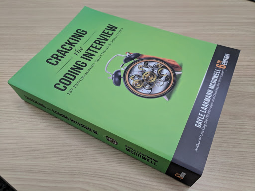

# CD-08A: The Technical Interview 
(for Data Science and Machine Learning)

<!--
Today we’re discussing technical interviews for data science and machine learning-related jobs. Technical interviews can be a very stressful experience for students starting their technical careers and seasoned professionals alike. These interviews should be stressful and require significant preparation, as you can be asked questions from a range of topics.

We’re going to go over those topics today, as well as some suggestions from one of Google’s most experienced technical interviewers. This session will also prepare us for peer technical interviews we’ll engage in during our next session.  Let’s get started!
-->

---

 {.background}

<!--
One caveat before we get started is that coding interviews for software engineers tend to follow a particular pattern that is well known and fairly reliable across companies and across interviewers.
 
Data science interviews don't have a set pattern, but we've identified some tips to help you prepare for the most likely scenarios. One of these is coding questions and we'll cover them as part of this session but there are other types of questions to prepare for. 
-->

---

# Agenda

* Basic interview protocol
* Technical vs. behavioral interviews
* Technical interview tips
* Types of technical questions
* Q&A
* Practice

<!--
We’ll start by going over some general best practices for interviewing for any full-time role. Then we’ll get on the same page about the differences between behavioral and technical interviews and go over some technical interview tips. Then we’ll discuss the types of questions you’re likely to be asked in DS/ML-related technical interviews. We’ll close out with Q&A and practice.
-->

---

# Basic interview protocol recap

* Before → 
  * Research company’s history, mission, and the job description fully
  * Come prepared with 2-3 things you like about the opportunity
  * Be able to clearly articulate why you’re a good fit
* During → 
  * Dress up! Even if the work place is casual, dress a notch above that.
  * Shake hands, make eye contact, skew answers toward the positive
* After → 
  * Thank your interviewer(s)
  * Send a same-day thank you email that’s tailored to the interview

<!--
It’s extremely important to come prepared to an interview having researched the company, its history, the role, and why you’re a good fit for the role. It’s possible that you don’t meet all the requirements they’re looking for the role -- this is very common! But you can stand out as an especially desirable candidate by being passionate about the organization and the work it’s doing. 

Always dress up for an interview. Don’t take a guess about whether or not a workplace is casual. If the recruiter or interviewer tells you in advance of the interview that attire is casual, still wear business casual to the interview. If the workplace is NOT casual, definitely wear business attire -- a business suit. 

Much like in your work with recruiters, show gratitude to your interviewers. Thank them during the interview and then in a same-day thank you email that mentions something you specifically enjoyed about the interview and that excites you about the role or the company. Sometimes you may not have access to the interviewer’s contact information. In that case, you should forward personalized thank you emails to your recruiter or whomever set up your interviews and ask them to pass your notes along. It’s important to remember that some interviewers could be your future boss, but other interviewers can be employees at the company whose job involves interviewing from time to time. It’s because people make time for that in their work that you’re able to interview in a timely way, so it’s important to show appreciation for their time. 
-->

---

# behavioral vs. technical interviews {.big}
## What’s the difference? {.big}

<!--
What do you think? What’s the difference between a behavioral and a technical interview question? [Ask for student contributions and respond to each.]
-->

---

# technical vs. behavioral interviews

**Technical interviews assess**

* Role-specific technical knowledge
* Problem-solving abilities
* How you think
* Communication skills
* How you get to your answer

Prevalent with employers hiring for engineering, science, and IT roles

.

{.column}

**Behavioral interviews assess**

* Likelihood of future behavior based on past behavior
* How you’ve responded in specific situations
* The measurable skills and value you brought to those situations

Prevalent with employers hiring for any role

.

<!--
As we learned from the technical interview session prior to this one, technical interviews assess your technical knowledge for a given role, your problem-solving abilities, and what the process of getting to your answer entailed. Your skills are on display in real time.

Behavioral interviews, on the other hand, assess your likelihood of future behavior based on past behavior. The interviewer wants to know how you’ve responded in specific situations and the measurable skills you’ve brought to those situations. Behavioral interview questions often start with, “Tell me about a time when....” or “Describe a time when…”
-->

---

# Technical interview tips

* Interviews require preparation
* The interviewer is not a judge; they are your advocate.
* It’s not just you being evaluated; you’re also evaluating the company
* Engage in active listening throughout your interview.
    * Ask questions
    * Verbalize your thought process
    * Justify and vocalize your assumptions
* There are usually multiple correct answers.
    * Take time to think
    * Choose carefully

<!--
First, interviews are not like school work. They're not like the work you’re doing in this program. They're not even like the work you're going to be doing with these employers. Therefore, you really need to prepare for them. 

Second, the interviewer is not a judge. Think of them as your advocate. Can't guarantee that you won't get an interviewer who's trying to trick you but in most cases the things they say, they're saying to help you.

Remember that you're not just being evaluated; you're also evaluating the company.

Listen to your interviewer. Questions can sound similar, so make sure you understand what you're being asked to do. Ask questions to clarify the problem and verbalize your thought process. It’s better to say something wrong than to say nothing. Make sure you’re justifying (and vocalizing) your assumptions.

Last, there are usually multiple correct answers. Take the time to think. Pick carefully.
-->

---

# 5 kinds of DS & ML technical interview questions: 

1. Aha! or estimation questions {.big}
1. Knowledge questions {.big}
1. Probability questions {.big}
1. Coding questions {.big}
1. Open-ended questions {.big}

There are 5 kinds of questions that we think you're likely to run into. We'll cover each of them in more details.

---

# 1.) Estimation

How many ping pong balls does it take to fill up a Google shuttle?

<!--
These kinds of questions used to be popular in high tech in the late 90's and have still not completely died out. Other examples include, “Why are manhole covers round?” “What numbers would you put on each face of 2 D6s to represent dates?” These questions don't really give a valuable signal to the employer. 

Source: Photo by Ionut Andrei Coman on Unsplash
-->

---

# 2.) Knowledge?

What is selection bias? Why does it matter?

<!--
Knowledge questions can include anything within the field that you're applying to and have been studying. Throughout this program we’ve tried to cover the topics that are likely to come up in the interview. It’s worth reviewing the list of topics that have been covered in the course. Questions might include, “What is selection bias? Why does it matter” or “What is linear regression?”

Source: Photo by chuttersnap on Unsplash
-->

---

# 3.) Probability

There is a research on two medical cures A, B.

200 people tried the cure A, it helped to 110 people and did not helped to 90 people.

210 people tried the cure B, it helped to 120 people  and did not helped to 90 people.

Compute success percentages for each drug.

<!--
The interviewer is also likely to assess your knowledge of probability. This might be rolled into one of the other question (e.g. coding or open-ended) but could be a separate question as well. Questions may include something like Bertrand’s box paradox or  Penney’s game.

Here’s an example probability question that involves something called Simpson’s paradox. 

Source: Photo by Jonathan Petersson on Unsplash
-->

---

# 4.) Coding 

<!--
<!--
There are likely to be coding questions as well. If you have a CS degree, check out the Cracking the Coding interview book and use it to practice. If you don't, you're still likely to get a coding question but hopefully one that is tailored to your abilities. 

Whatever question you get, this is definitely a place to practice active listening. Make sure you understand the question, ask clarifying question, verify sample inputs and outputs.

Also, coding on a whiteboard is weird and you need to practice it.

And once you're done writing the code, you're not done. Verify that it works as intended by doing careful testing.

Source: Photo by Ilya Pavlov on Unsplash
-->

---

**Decomposition** {.big}

<!--
If you find yourself writing very nested code remember decomposition. Just because you're asked to "write one function" doesn't mean you're limited to one function.
-->

---

# 5.) Open-ended

Is it better to have too many false negatives or too many false positives?

---

# Recap

* Interviews require preparation. They’re unlike school, projects, and work!
* The interviewer is not a judge; they are your advocate.
* Engage in active listening throughout your interview.
    * Ask questions
    * Verbalize your thought process
    * Justify and vocalize your assumptions
* 5 types of DS & ML technical interview questions
  1. Estimation
  1. Knowledge
  1.  Probability
  1. Coding
  1. Open-Ended
  
<!--
Let’s recap what we’ve discussed so far.

[Call on student volunteer(s) to read the review bullet points]
-->

# Questions?

<!--
What questions do you have at this point?
-->

---

# Practice

* With a partner, work through the practice interview questions in the handout provided in our remaining time today
* Verbalize your thought processes, justify and vocalize your assumptions, ask questions
* Whatever you don’t finish today, finish prior to our next career development session, which will be peer technical interviews

<!--
Let’s close out with some practice. Our next session will be peer technical interviews, and this will help prepare you. In the handout provided, please work with a partner on these interview questions. Remember, convey your thought process, and vocalize any assumptions you’re making. Ask questions!

Thank you for participating, and please don’t hesitate to ask me for help!
-->

---
