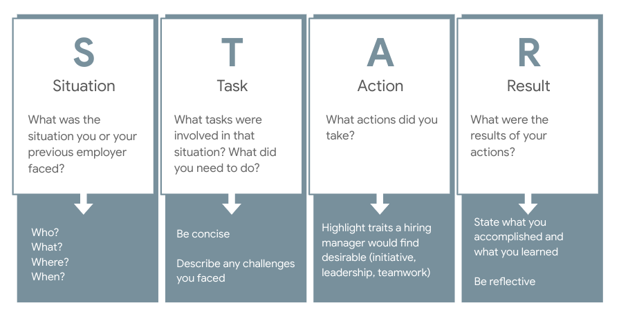
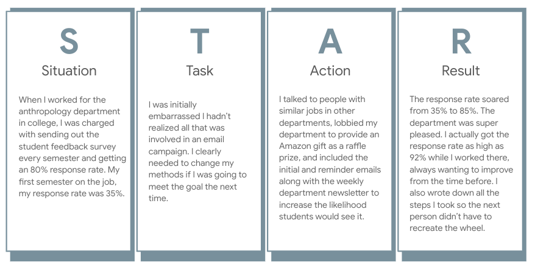
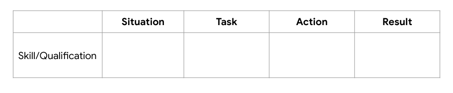
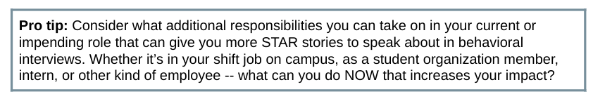

# CD-9A: The Behavioral Interview

<!--
Today we’re going to talk about behavioral interviews. While aspiring and established engineers, scientists, and IT professionals like yourselves need to prepare for technical interviews, you ALSO need to be prepared for behavioral interview questions. These questions can be very different from technical interview questions you may get, but they are not hard to master if you come prepared. 

Behavioral interview questions are important to understand and practice because, unlike a technical interview where you display skills you have for the interviewer to see and assess, behavioral interviews ask you to accurately, quickly, and effectively draw upon academic or professional experiences you’ve had in the past and communicate them in a compelling way to your interviewer. It doesn’t matter if you’ve done extraordinary work in the past if you aren’t fluent in conveying that work.

I also want to point out that behavioral and technical interviews aren’t mutually exclusive. Employers can ask both in the same interview and event integrate elements of both in the same question. To perform well with both, it’s critical that you have a firm grasp on the school and/or professional work you’ve done and are able to explain it clearly. 

Let’s dive in!
-->

---

# Agenda

* Basic interview protocol recap
* Technical vs. behavioral interviews
* Behavioral interview basics
* How to prepare for behavioral interviews (STAR method)
* STAR method activity
* Q&A

<!--
We’ll start by recapping basic interview protocol from our technical interview session. Then we’ll get on the same page about the differences between behavioral and technical interviews. Then we’ll We’ll go over behavioral interview specifics and how to prepare for them next, and we’ll close with an activity to get you practicing behavioral interviews.
-->

---

# Basic interview protocol recap

* Before → 
  * Research company’s history, mission, and the job description fully
  * Come prepared with 2-3 things you like about the opportunity
  * Be able to clearly articulate why you’re a good fit
* During → 
  * Dress up! Even if the work place is casual, dress a notch above that.
  * Shake hands, make eye contact, skew answers toward the positive
* After → 
  * Thank your interviewer(s)
  * Send a same-day thank you email that’s tailored to the interview

<!--
Here’s a quick recap on basic interview protocol. It’s extremely important to come prepared to an interview having researched the company, its history, the role, and why you’re a good fit for the role. It’s possible that you don’t meet all the requirements they’re looking for the role -- this is very common! But you can stand out as an especially desirable candidate by being passionate about the organization and the work it’s doing. 

Always dress up for an interview. Don’t take a guess about whether or not a workplace is casual. If the recruiter or interviewer tells you in advance of the interview that attire is casual, still wear business casual to the interview. If the workplace is NOT casual, definitely wear business attire -- a business suit. 

Much like in your work with recruiters, show gratitude to your interviewers. Thank them during the interview and then in a same-day thank you email that mentions something you specifically enjoyed about the interview and that excites you about the role or the company. Sometimes you may not have access to the interviewer’s contact information. In that case, you should forward personalized thank you emails to your recruiter or whomever set up your interviews and ask them to pass your notes along. It’s important to remember that some interviewers could be your future boss, but other interviewers can be employees at the company whose job involves interviewing from time to time. It’s because people make time for that in their work that you’re able to interview in a timely way, so it’s important to show appreciation for their time. 
-->

---

# behavioral vs. technical interviews {.big}
## What’s the difference? {.big}

<!--
What do you think? What’s the difference between a behavioral and a technical interview question? [Ask for student contributions and respond to each.]
-->

---

# Options

**Technical interviews assess**

* Role-specific technical knowledge
* Problem-solving abilities
* How you think
* Communication skills
* How you get to your answer

Prevalent with employers hiring for engineering, science, and IT roles

.

{.column}

**Behavioral interviews assess**

* Likelihood of future behavior based on past behavior
* How you’ve responded in specific situations
* The measurable skills and value you brought to those situations

Prevalent with employers hiring for any role

.

<!--
As we learned from the technical interview session prior to this one, technical interviews assess your technical knowledge for a given role, your problem-solving abilities, and what the process of getting to your answer entailed. Your skills are on display in real time.

Behavioral interviews, on the other hand, assess your likelihood of future behavior based on past behavior. The interviewer wants to know how you’ve responded in specific situations and the measurable skills you’ve brought to those situations. Behavioral interview questions often start with, “Tell me about a time when....” or “Describe a time when…”
-->

---

# Behavioral interview basics

Sample behavioral interview questions:

* Describe a situation that required you to consider a different perspective when exploring an issue.
* Describe a project that required input from people at different levels in the organization.
* Tell me about a time you went above and beyond the call of duty to get things done. 
* Tell me about two improvements you have made in the last six months.
* Tell me about a time that you took the lead on a difficult project.
* Describe a time when you found it difficult to work with someone from a different background.
* Describe a time when you anticipated potential problems and developed preventive measures.
* Tell me about a time when you had to analyze information and make a recommendation.

<!--
Here are some sample behavioral interview questions. Can you think of some others you’ve heard?  [Ask for student contributions and respond to each.]
-->

---

# Behavioral interview basics

Interviewers want to know

* How your past job performance could support their company’s needs
* “...about a time when…” not, “what you would do if…”
* How you define terms like, “difficult person,” “pressure at work,” “greatest accomplishment,” etc based on your answers
* If you can communicate clearly. There are no wrong answers, but there are subpar answers
   * 1-2 minutes long
   * Anticipate follow-up questions

<!--
Interviewers are asking questions like those in the previous slide in order to determine if your past job and academic performance can support their company’s needs. They’re also interested in knowing how you define terms like “difficult person” and “greatest accomplishment.” If you describe a “difficult person” as a boss who wanted you to meet deadlines and your “greatest accomplishment” as getting a higher grade than the guy you hate in statistics class, understand that these will be red flags. Craft your answers in a way that tell the truth and that also position you as a team player, leader, problem solver and someone who values diversity and is willing to receive and implement feedback. Now, we can’t authentically convey that we are all of those things in every answer we give. But it’s important to keep in mind how your word choice and story choice come across to an interviewer.

It’s also very important that you communicate clearly and don’t give long-winded answers. 1-2 minute answers are more than enough to start. Your interviewer will ask follow-up questions. 
-->

---

# How do I effectively prepare for a behavioral interview? {.big}

<!--
At this point, you might be feeling overwhelmed. We’ve discussed a lot of possible interview questions and what interviewers are looking for when they ask you these questions. But we haven’t talked about how to prepare so that fielding these questions in interviews is more manageable and allows you to convey your academic and professional experiences truthfully. Let’s do that now!
-->

---

# STAR method: explained

<!--
Take a few moments to read this slide over before we get started. [Provide students 1-2 minutes of silence to read the slide.]

The STAR method is a tried and true technique for preparing for behavioral interviews and successfully answering behavioral interview questions. In the 1-2 minutes in which you’re responding to a behavioral interview question, you should format your answer using the STAR method: describe the situation, the task or tasks, the actions you took, and the result. Remember, most behavioral interview questions start with “Tell me about a time when…” or “Describe a time when…” so interviewers are explicitly looking for you to tell a true story about your past academic or professional experiences. Practicing your stories in this order and keeping this framework in your head will help you deliver more effective, organized answers in interviews. 

Let’s look at an example.
-->

# STAR method: example

<!--
Here’s an example that will hopefully bring the STAR method to life a bit. Tell me about a time you didn’t meet a goal and how you handled it.

Could I get a few volunteers to read this STAR method example please? [Have four students read each of the different parts of the STAR example, beginning with the Situation.]

What stands out to you here? What has the interviewee done well? 
[Ask for student contributions and respond to each. Things to point out: gave appropriate background information in the Situation, quantified the situation and the result to show impact and provide specifics, shows initiative, displays humility, continued improving even after meeting goal, etc.]

What questions do you have looking at this example or about the STAR method generally? 
[Ask for student contributions and respond to each.]
-->

---

# STAR method: what to prepare

* Read the job description
* List the 4-6 top skills or qualifications 
  * general traits like leadership, ethical behavior, relationship management, integrating feedback, and intercultural fluency,  are also frequently assessed in behavioral interviews 
* Think of a story that illustrates your ability in each of those areas
* Write your stories down in the STAR format
* Practice saying them aloud 

<!--
That was just one example. Here are some steps to prepare for a job interview using the STAR method.

[Call on a student to read each of these steps aloud.]

Practicing is so important! It’s not enough to think of these stories and write them down. You must develop the muscle memory of saying them by practicing.
-->

---

# STAR method: what to prepare

<!--
It might be helpful to set up a table like this to prepare for behavioral interview questions. After you write out these different stories according to the STAR method, use this sheet to practice saying them aloud. 
-->

---

# STAR method: additional tips

* Interview questions won’t mirror the job description. Behavioral interview questions are also trying to get at those general employee characteristics:
  * Teamwork
  * Intercultural fluency	
  * Initiative
  * Leadership
  * Problem-solving
  * Communication
  * Conflict resolution
  * Flexibility 
* Be specific and quantify when possible.
* Be honest!

<!--
Here are some additional tips to keep in mind:

There’s no guarantee you’ll be asked interview questions straight from the job description. You’ll need to think on the spot about how to best apply the stories you’ve prepared -- and maybe some you HAVEN’T -- to the questions you’re asked. Practicing describing work you’ve done in the past can help a lot!

As with the anthropology department example, it’s important to be specific and quantify your impact when possible. Did your actions increase club membership by 50% or quarterly sales by 15%? Did your team debug 25% more lines of code after a change in process you initiated? Some answers you’ll provide will be about situations you can’t quantify, and that’s ok! But it is important to be specific and concise and the results of your actions made clear.
-->

---

# STAR method: activity

* Pick one of the following skills:
  * teamwork
  * time management
  * taking initiative
  * communicating effectively with a non-technical audience
* Think of a story that illustrates your ability to perform that skill.
* Capture your story in the STAR format. **You have 6 minutes to write up your STAR answer.**
* Share with a partner. **You have 2 minutes to share with your partner.** Then switch and hear theirs.

<!--
Let’s practice!

[Call on a student to read the instructions.]

What questions do you have? Depending on how much time we have left, we may switch and share with a second partner.

[Call on a student to read the instructions.]

[Give students a 1-minute warning after five minutes have passed. Keep time when they’re in partner groups, too.]
-->

---

# Debrief

## How was this exercise for you?
## What questions do you have about behavioral interviews?

[Debrief the activity with students. Answer questions and respond to their comments as needed.]

[Thank students for participating.]

---

# Next steps

* Review the [30 Behavioral Interview Questions You Should Be Ready to Answer](https://www.themuse.com/advice/30-behavioral-interview-questions-you-should-be-ready-to-answer) from The Muse
* Choose one question from each of the six sections and create a STAR bank that includes a story for all six.
* Next session we’ll do mock behavioral interviews. This exercise will help you perform better in those interviews! 

<!--
Let’s close out with some next steps. Our next session will be behavioral mock interviews, and between now and then you’ll spend some time preparing. I’ll share out this link of 30 Behavioral Interview Questions You Should Be Ready to Answer. Choose one question from each of the six sections and create a star bank that includes a story for all six. Do not hesitate to ask me for help! 

Last, I hope this discussion has led you to begin reflecting on prior or current class projects, internships, jobs, and other academic and professional experiences. You may have to dig deep to remember and resurface more details to fully flesh out your STAR answers. I hope it’s also led you to consider how you can expand your impact in these roles so you have even more experiences to reflect upon when you interview for your next big role. 

Thank you again for participating, and please don’t hesitate to ask me for help!
-->

---
