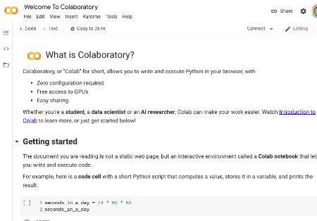

---

marp: true

---

<style>
img[alt~="center"] {
  display: block;
  margin: 0 auto;
}
</style>

# Introduction to Python

<!--
Welcome to our Introduction to Python unit. In this unit we'll introduce you to the Python programming language. If you have programmed in another language, you'll likely get up to speed really quickly. Even if you have never programmed before, you'll find that Python is an easy and approachable language that caters to the beginner while still providing powerful tools for the expert.
-->

---

# *"Python is an interpreted, high-level, general-purpose programming language."*
# -Wikipedia

<!--
"Interpreted" means portability, ease of use (no compiling), and that the code can be run interactively.

"High-level" means closer to human languages and further from machine languages.

"General-purpose" means it can be used for anything, including creating web apps (e.g. YouTube), small scripts (e.g. automatically renaming photos based on data from the camera), machine learning, data visualization, and much more.
-->

---

# Python 3

```python
print('hello')         # used to be: print 'hello'

range(10)              # used to be: xrange(10)

3 / 2 == 1.5           # used to == 1

raise ValueError('x')  # used to be: raise ValueError, 'x'
```

<!--
There are multiple versions of Python in the world.

1.x is long gone.

2.x is deprecated, and support has stopped. However, there's still a lot of code and code samples out there that use it.

Python 3 is the modern version and how all new code should be written. In this course, we'll focus on Python 3.

From the outside, the move from Python 2 to Python 3 might be difficult to notice. There are a few syntax differences, some of which we've illustrated in this slide. There are more subtle differences and a lot of performance improvements that we won't mention here.

When looking at Python reference docs, look for the version number in the URL, and make sure you're looking at the documents for Python 3!
-->

---

# Running Python 3

```shell
$ python3
Python 3.7.5 (default, Oct 27 2019, 15:43:29) 
[GCC 9.2.1 20190909] on linux
Type "help", "copyright", "credits" or "license" for more information.
>>> 
```

<!--
Python 3 can be executed directly from the command line by running the `python3` command. On your system it might also just be `python`.

You can tell which version you are running by reading the first line in the output of the command. In this example, the particular version that we are using is 3.7.5.

The three greater-than symbols tell us we are in an interactive Python shell. In this shell we can type Python commands.
-->

---

# Python 3: Interactive Shell

```python
>>> print('Hello Class')
Hello Class
>>> 3 + 4
7
>>> exit()
```

<!--
Here you can see some commands typed into the shell. We can explicitly call print as we did in the first command. Also, the return value for the expression is always printed by default, as you can see with the 3+4 with no print statement.

In order to exit the Python interactive shell, you can type `exit()` or use the `Ctrl+d` key combination.
-->

---

# Python 3: Python File

```python
# hello.py

print('Hello Class')
3 + 4
```

```shell
$ python3 hello.py
Hello Class
```

<!--
It is also possible to run Python commands stored in a file. In this example we have a file called 'hello.py' that contains our print and addition commands from earlier.

We can then pass that file to python3.

Notice that we don't see the value of the addition. When running commands using a file, you have to explicitly print output.
-->

---

# Python 3: Notebooks



<!--
Another way to run Python is in an interactive notebook. Jupyter is a popular type of notebook that combines rich textual documentation and Python code. We will be using notebooks throughout this course. We'll be using a service called Colab, which hosts and runs Jupyter notebooks in the cloud.

* Image name: res/notebook.png
  * Repo link: https://github.com/google/applied-machine-learning-intensive/tree/master/content/00_prerequisites/00_introduction_to_python/res/notebook.png
  * Source https://github.com/google/applied-machine-learning-intensive/tree/master/content/00_prerequisites/00_introduction_to_python/res/notebook.png by Author Google LLC under License Copyright [2020] Google LLC.
-->

---

# Python Libraries

```python
import re

re.match(...)
```

```python
import tensorflow as tf

tf.keras.Model(...)
```

```python
from sklearn.metrics import mean_squared_error

mean_squared_error(...)
```

<!--
One of Python's powers is that it has many built-in libraries and many more third-party libraries to give it specialized abilities. We'll explore many of these specialized libraries over the course of this program.

In order to use those libraries you need to import them. Here are three ways to import.

In the first, we import the `re` (regular expression) library directly.

In the second, we import the `tensorflow` library but refer to it as `tf` for short. You can use any valid identifier in the place of `tf`, but you'll find that there are many conventions, such as using `tf` for `tensorflow` that are expected by the community.

In the third, we import the `mean_squared_error` function from the `sklearn.metrics` library. This makes only this function available to us. We also don't have to use a prefix.
-->

---

# White Space Matters

```python
def MyFunction(param):
  print(param)

for i in range(3):
  MyFunction(i)
MyFunction(101)
```
```shell
0
1
2
101
```

<!--
White space matters in Python. 2-space or 4-space indents are used to delineate code blocks instead of `{}` like you would see in many languages.

Tabs can be used, too, but should not be mixed with spaces. (We recommend just using spaces.)

Indents can be nested to arbitrary depths. In practice, indentation makes it hard to have long functions with several levels of nesting. That's actually a good thing, as it encourages using decomposition (breaking code into smaller functions) instead.
-->

---

# Data Types

```python
123    # integer

1.23   # float

"123"  # string

True   # bool
```

<!--
Python supports core data types that you have probably seen if you have programmed in another programming language. Here you can see four basic types:

* integer: whole numbers (can be negative)
* float: decimal numbers (can be negative)
* string: unicode characters
* bool: True/False values
-->

---

# Data Types: More About Strings


```python
'Guido "BDFL" Van Rossum'    # single-quoted string

'I\'m a pythonista'          # single-quoted string (with escapes)

"I'm a pythonista"            # double-quoted string

'''
Hi. We are about to learn
Python.
'''                          # triple-quoted string

"""
It
    is
        fun!
"""                          # triple-quoted string
```

<!--
Strings are powerful data types. In Python 3, they are unicode encoded by default. They are also "immutable." Once you make a string, you can't change it directly.

Here are a few ways to make strings. The first example uses single quotes.

The second example also uses single quotes, but since the string itself contains a single quote, that quote has to be *escaped*. The backslash before the single quote denotes that the single quote is part of the string. The backslash itself is not part of the string, just the single quote in "I'm." Any ideas how you get a backslash in a string?

The third example switches over to using double-quotes for the string. Now there is no need to escape the single quote in "I'm."

The final two examples are "triple-quoted" strings. This string type allows you to type newlines in strings. Typically these types of strings are used for documentation.
-->

---

# Data Types: List

```python
[]                   # empty list

list()               # empty list

[1, 2, 3, 4]         # list containing only integers

[1, 2.0, "3", True]  # list containing many types

["a", [1, "b"], 2]   # nested list
```

<!--
Python also has built-in support for lists.

In the first example, you can see how to create an empty list with just square brackets.

In the second example, you can see a list created using the `list()` class.

In the third example, we create a list of integers.

In the fourth example, we create a list containing an integer, a float, a string, and a bool. Lists can contain any type of value. This is different from some languages that require lists to all be of the same type.

And in the final example, you can see that we have a list that contains another list. You can nest lists as much as you need too.
-->

---

# Data Types: Tuple

```python
(,)                             # empty tuple

tuple()                         # empty tuple

(1, 2, 3, 4)                    # tuple containing only integers

1, 2, 3, 4                      # tuple containing only integers

(1, 2.0, "3", True)             # tuple containing many types

("a", (1, "b"), 2, ["x", "y"])  # nested tuple (and list)
```

<!--
Tuples are a list-like data structure that is core to Python. At a very "hand-wavy" level, you can think of a tuple as an immutable list. There are a few other differences, but they aren't necessary at this stage of your Python journey. If you are interested in learning about the intricacies of Python, we suggest taking a look at the book 'Fluent Python' published by O'Reilly Media.

In the first example, we create an empty tuple using parentheses and a comma. It is a little awkward syntax, but the comma is required for Python to realize that you actually want a tuple.

The next example shows creating a tuple using the `tuple()` class.

Similar to a list, you can create tuples containing a single data type.

If you look at the fourth example ,you can see that we can also create a tuple without parentheses. The presence of commas is enough for Python to know that we want a tuple. This is core to Python. You often pass tuples around this way without thinking twice about it.

And finally in the last two examples, you can see that we can have a tuple of mixed data types, even list and tuple data types.
-->

---

# Data Types: Dictionary

```python
{}                            # empty dictionary

dict()                        # empty dictionary

{"a": 1.23, 2: "what"}        # populated dictionary

{"a": {"b": 3}, 2: ["h", 1]}  # nested dictionary (and list)
```

<!--
Python also supports dictionaries. A dictionary is a bundle of key-value pairs. These are sometimes called maps in other languages.

In the first two examples you can see two ways to create an empty dictionary. The `dict()` method can also populate a dictionary in interesting ways that you might want to explore.

The third example shows a basic pre-populated dictionary. You can see that keys and values can be different data types. The only real constraint is that keys must be immutable. This means that integers, floats, strings, and tuples can all be used as keys. Dictionaries and lists are not allowed. Also, if a tuple contains a mutable data type, it cannot be a key.
-->

---

# Variables are Dynamically Typed

```python
a = 123
print(type(a))

b = 1.23
print(type(b))

c = "123"
print(type(c))
```

```shell
<class 'int'>
<class 'float'>
<class 'str'>
```

<!--
Variables are labels that you can use to represent data in your program. You can assign values to them, read those values, and change those values. In the example above, we create variables `a`, `b`, and `c'.

In some languages, you have to declare the type of a variable. In Python, you don't. Python is able to determine the type of your variable from context.

The Python interpreter will not help you catch mistyped variables in most cases. You typically only realize a type mistake when you run the code and something goes wrong. For this reason, it is typically a good idea to try to keep a variable set to the same type.

In version 3.5 of Python, type annotations were added. This allows you to give the interpreter hints about the types of the variables that you are using. The hints aren't enforced, but they do allow pre-runtime checkers to find instances where the wrong type is being used. As of the time of the release of this course, early 2020, type annotations aren't yet in widespread use, so we don't use them in examples in this course.
-->

---

# Variables: Numbers

```python
a = 42.12   # float variable
a = a + 1   # add integer to float variable
print(a)

b = 12      # integer variable
b %= 10     # find modulus 10 of b
print (b)

c = a - b   # mixed float and integer math
print(c)
```

```shell
43.12
2
41.12
```

<!--
Here you can see some numeric variables in action. We create a float variable. We then add an integer to it. The result is still a float. Notice how the variable can appear on the left and right of the assignment operator.

Next we create the integer variable `b`. We use the `%=` operator to find the remainder after we divided `b` by 10. Note that we could use `b = b % 10` also. The `%=` is just shorthand for doing math with a variable and assigning the value back to that variable.

Finally we subtract `b` from `a`. Notice that in every case that we mixed float and integer math, the result was a float.
-->

---

# Variables: Strings

```python
a = "my string"
b = 'your string'

print(a.upper())  # upper case version of string
print(a[1])       # 2nd character of string
print(a[1:4])     # 2nd-4th character of string

print(len(a))     # length of string

c = a + b         # string concatenation
print(c)
```

```shell
MY STRING
y
y s
9
my stringyour string
```

<!--
Here we have some examples of working with string variables.

Strings are objects. Objects are the combination of data - in this case, the value of the string - and methods which can be called on that data. In this case, we call `.upper()` on our string variable to get a copy of the string converted to upper-case.

Strings consist of characters. In our second print statement, we print the second character of the string `a`. Counting starts at 0. In the third print statement, we print a slice of a string. We start at the second character (index 1) and end at index 4. Notice that the character in index 1 is included in the output, but the character at index 4 is not. Slicing always includes the value at the first index and excludes the final index.

In our fourth example we call `len()` on the string variable `a`. Notice that this is not a method. It is a Python built-in function. Python is a little inconsistent here. There are reasons for this, but they are beyond this scope of this lab.

Finally we use the `+` operator to combine two strings.

There is so much more that you can learn about strings. We encourage you to look at the [official documentation](https://docs.python.org/3/library/string.html) to familiarize yourself with strings and string methods.
-->

---

# Variables: Lists

```python
a = ["my", "list", "of", "strings", ["and", "more", "strings"]]

print(a[2])
print(len(a))

a[0] = "My"
print(a[0:3])

print(a[4][1])
```

```shell
of
5
['My', 'list', 'of']
more
```

<!--
In this example, we create a list variable. Notice that you can index a list just like you can index a string.

`len()` also works on lists. Notice that in this case it gives the length of the outer list, not the inner list.

Lists are mutable, so we can change values in them, combine lists, sort lists, add values to lists, remove values from lists, and more.

Lists can also be sliced. Notice that the slice returns another list.

To index sublists you can stack indexes as we did in the final example. The inner list is at index 4. Within the inner list, the string "more" is at index 1.
-->

---

# Variables: Tuples

```python
a = ("my", "tuple", "of", "strings", ("and", "more", "strings"))

print(a[2])
print(len(a))

# a[0] = "My"     # Can't do this!
print(a[0:3])

print(a[4][1])
```

```shell
of
5
('my', 'tuple', 'of')
more
```

<!--
Tuples behave like lists, except that you can't modify them. Also, tuple slices return tuples.
-->

---

# Variables: Dictionaries

```python
a = {"x": 12, "y": ["a", "b"], "z": {(2, "a"): "cow"}}

print(a["x"])

a["x"] = 13
print(a["x"])

print(a["y"][1])

print(a["z"][(2, "a")])
```

```shell
12
13
b
cow
```

<!--
In this slide we see some examples of how to use a dictionary. Similar to lists and tuples, the dictionary can be indexed. In this case, it is indexed by key (not value), and you can't slice a dictionary since the data stored in a dictionary isn't ordered.

As you can see, dictionaries are modifiable.

In the final two examples, you can see we can stack indexes to reference deep into embedded lists, tuples, and dictionaries.
-->
---

# Flow Control: if/elif/else

```python
a, b, c = 5, 3, 7

if a > b and a > c:
  print(a)
elif b > a and b > c:
  print(b)
else:
  print(c)
```

```shell
7
```

<!--
Here we have an example of the if/elif/else flow control mechanism. Can anyone tell what this code is trying to do?

It prints the maximum value out of three values.

The `if` statement checks to see if `a > b` and `a > c`. If both cases are true, then `a` is printed, and the other cases aren't considered. If the first condition is false, the `elif` is checked. If that is true `b` is printed. If not we moved to the `else` case, which is the case of last resort.

`if` is the only required part of this series of blocks. The first block in a conditional statement is always the `if` block, and all subsequent blocks are optional but must be `elif` or `else` blocks.

`elif` is optional, and there can be as many `elif` cases that you want. `elif` is short for "else if". `elif` statements are executed in order. The first case, to be true, has its block executed, and none of the following blocks are considered.

The `else` block is run only if none of the cases before it are true. There can be zero or one `else`. It always has to come last.

The expressions in the `if` and `elif` lines are boolean expressions. They return True or False. The booleans can be combined with operators like `and`, `or`, and `not`.
-->

---

# Flow Control: for - lists and tuples

```python
my_list = ["apple", "banana", "coconut"];

for item in my_list:
  print(item)

for i in range(len(my_list)):
  print(i, my_list[i])
```

```shell
apple
banana
coconut
0 apple
1 banana
2 coconut
```
<!--
Here we can see two different ways to use a `for` loop. If we put a list or tuple to the right of `in`, we get each item in the list in turn. We can also use the `range()` function to get the indexes for each element in turn. We can then use those indexes to pull items out of the list for printing.
-->

---

# Flow Control: for - dictionaries

```python
my_dict = {"a": "apple", "b": "banana"}

for key in my_dict:
  print(key, my_dict[key])

for value in my_dict.values():
  print(value)

for key, value in my_dict.items():
  print(key, value)
```

```shell
b banana
a apple
apple
banana
b banana
a apple
```

<!--
Dictionaries are iterable too. By default for loops pass over the keys of a dictionary. You can use those to index into the dictionary.

In the second example, you can see us looping over values. There is no efficient way to get the keys in this case.

And finally, you can loop over the keys and values at the same time using `.items()`.

Notice that the output is in no particular order. Dictionaries "hash" their keys, so the order is nondeterministic.
-->

---

# Flow Control: for - strings

```python
my_string = "abc"

for c in my_string:
  print(c)

for i in range(len(my_string)):
  print(i, my_string[i])
```

```shell
a
b
c
0 a
1 b
2 c
```

<!--
Strings are also iterable. Here you can see that iterating over a string looks a lot like iterating over a list or tuple.
-->

---

# Flow Control: while

```python
count = 0
while count < 3:
  print(count)
  count += 1
```

```shell
0
1
2
```

<!--
Python also has a `while` loop. While loops iterate until their condition is met. In this case, we count to 2 and print the values.

Warning! Since while loops aren't iterating over iterables, but instead are waiting for a boolean condition to be False, it is possible to create infinite loops.
-->

---

# None

```python
a = None
b = None

if a == b:
  print("None matches")
if a is None:
  print("and a is None)
```

```shell
None matches
and a is None
```

<!--
When a value is not known in Python, we use the `None` value. `None` is roughly equivalent to `null` or `nil` that you might find in some other languages.

One key thing to know about Python's `None` is that `None == None`. This is different from some languages that consider null values to not equal each other.

Also, even though you can use `==` to check for `None`, it is much more common to see the expressions `is None`.
-->

---

# Your Turn!

<!--
Now it's time to practice these techniques in the lab. 
-->
