---

marp: true

---

# Intermediate Python

<!--
SciKit-learn and Tensorflow both require us to understand objects and inheritance for some common use cases. Intermediate Python introduces the concept of object-oriented programming (OOP) to prepare us to use the scikit-learn and Tensorflow features that require object extension. List comprehension and lambdas are also included in this unit, since they are popular Python features that can be very useful, especially during data prep and exploration. 

-->

---

# Object-Oriented Programming

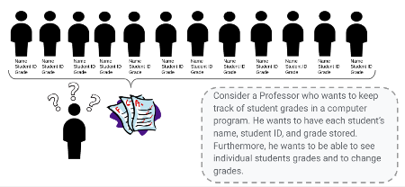

<!--

Object-Oriented Programming is a programming paradigm that organizes data into classes.

What does “programming paradigm” mean?
  * It is a style of programming; object-oriented programming is one particular style that organizes data into objects within classes.

Sometimes when the data structures available are not complex or specialized enough, you need a class to hold your data.

Let's consider an example where a teacher wants to create a program where they can keep track of students' grades.
  * Wants a way to hold the following values: name, student ID, and grade
  * Wants methods to get a grade, change a grade, and print a grade
  * How could they organize all this capability in one program?

Image Details:
* [intermediatepython01.png](https://opensource.google/docs/copyright/): Copyright Google
-->

---

# Objects: Classes

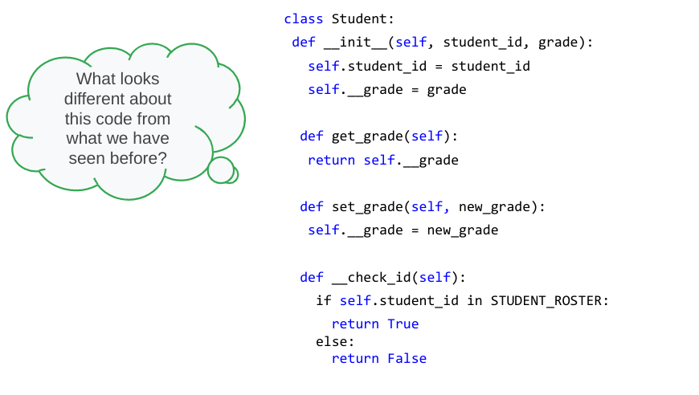

<!--

We can use classes to create objects that have attributes and methods.

Look at the code and decide what looks familiar/new and maybe even predict how those new items will work.

Image Details:
* [intermediatepython02.png](https://opensource.google/docs/copyright/): Copyright Google
-->

---

# Objects: Classes

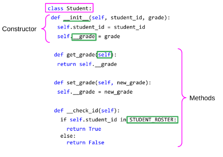

<!--
Looking at the code...
* Class → This is a keyword to tell Python you are starting a class declaration. This is always followed by the class name and a colon.
  * Everything following this declaration is like a blueprint for instances of this class.
  * It shows the data each instance will hold and methods that can be called on.
* __init__ → It is called as a constructor for a class.
  * Every class is required to have one; it shows the data each object of a class will hold.
  * Note that it's a private member. We will learn more about this later.
* __grade: The underscores indicate that grade is a private member variable, meaning it can’t be accessed or edited outside of the class. We'll get into more about this later.
* Self → It is used to refer to objects in a class.
  *  When “self” is an argument coming into a method, you don’t actually need to include that when calling the method.
  * “self” is implied as the instance of the class you declare before the dot.
* STUDENT_ROSTER → It's a constant value. In this case, presumably it's a constant list of students in the class.
* Methods → This is a collection of functions that can be run on an object of a given class.

Image Details:
* [intermediatepython03.png](https://opensource.google/docs/copyright/): Copyright Google
-->

--- 

# Objects: Classes

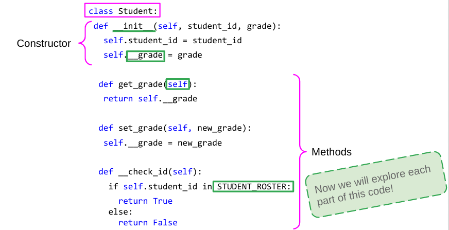

<!--
Now let's break it all down in more detail. 

Image Details:
* [intermediatepython04.png](https://opensource.google/docs/copyright/): Copyright Google
-->

--- 

# Objects: Instances

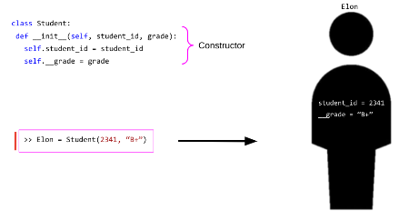

<!--
Instances are the actual object, i.e., the actual physical representation in memory of a “thing” of the type defined by the class.

Every class needs a constructor to show the computer what data members it should be allocating memory for each time an instance is created.

“Elon” is an instance of our class. His student ID is 2341 and his grade is a B+. 

Now that we have an instance of a class, we can manipulate that instance with methods defined in the class.

Image Details:
* [intermediatepython05.png](https://opensource.google/docs/copyright/): Copyright Google
-->

---

# Objects: Instance Methods

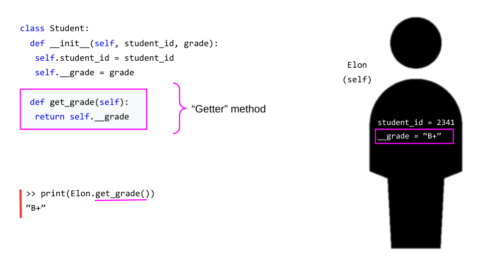

<!--
This is an example of how a function can be called on an instance of a class.

* Notice how you call the function.
  * When “self” is an argument of a method, you don’t actually need to include that when calling the method.
  * “self” is implied as the instance of the class you declare before the dot.

This type of method is called a “getter” method, as it's used to get access to variables in a class.
  * We will see why this might be necessary later.

Image Details:
* [intermediatepython06.png](https://opensource.google/docs/copyright/): Copyright Google
-->

---

# Objects: Instance Methods

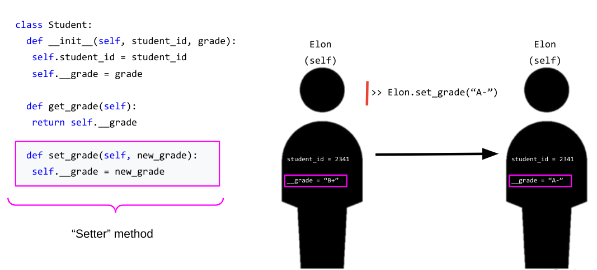

<!--
This is an example of how a function can be created to change the data in an instance of a class.

Notice how you call the function.
  * “self” is still implied as Elon.
  * However, this time we also need a new_grade, and this is passed in as a typical argument in Python.

This type of method is called a “setter,” and we will see why later.

Image Details:
* [intermediatepython07.png](https://opensource.google/docs/copyright/): Copyright Google
-->

---

# Objects: Private Methods

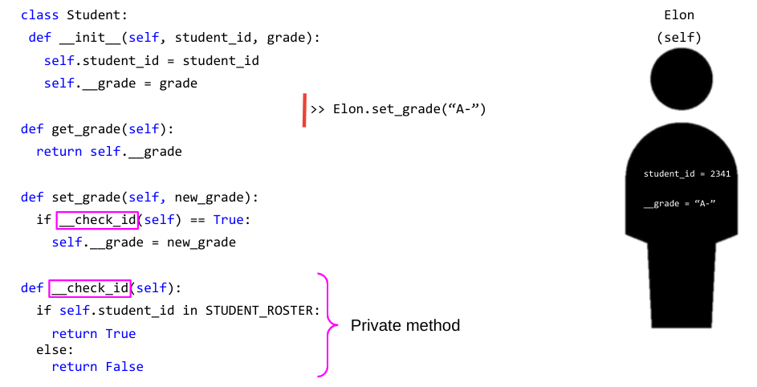

<!--
__check_id is a **private** method.

These are methods that are only helper methods to others in the class and cannot be accessed outside of it.

Let's see how the helper method _check_id can be useful. 

Image Details:
* [intermediatepython08.png](https://opensource.google/docs/copyright/): Copyright Google
-->

---

# Objects: Private Methods

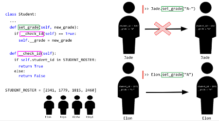

<!--
Here we can see that having the private helper function can stop you from accidentally messing up and adding a grade for an unknown student.

Image Details:
* [intermediatepython09.png](https://opensource.google/docs/copyright/): Copyright Google
-->

---

# Encapsulation

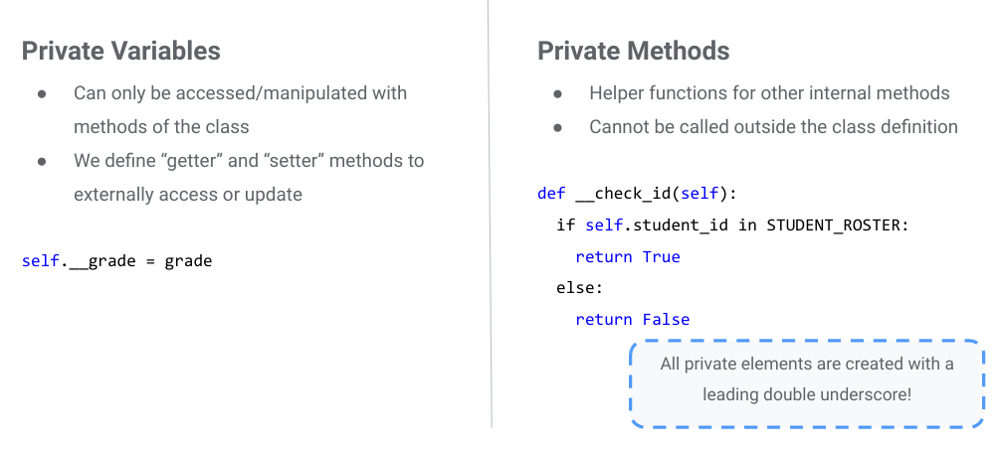

<!--

Encapsulation ensures that properties of a class are only accessed and modified in the ways that are explicitly and intentionally allowed.

Remember the “getter” and “setter” methods. This is why we had them!
  * Getters and setters allow safe ways to access private variables.

Private methods allow you the ability to maintain functionality you want for helper functions while not allowing anything outside of the class to manipulate it in a way you do not want. Additional examples of this later will make it more clear what kind of use cases this is helpful for.

Helpful reads:
* See http://www.cems.uwe.ac.uk/~jsa/UMLJavaShortCourse09/CGOutput/Unit3/unit3(0809)/page_13.htm for a summary
* https://dbader.org/blog/meaning-of-underscores-in-python

Image Details:
* [intermediatepython10.png](https://opensource.google/docs/copyright/): Copyright Google
-->

---

# Encapsulation

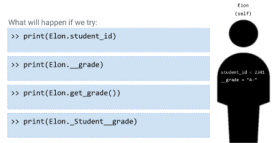

<!--
@Exercise (5 minutes): {
Ask students to break into pairs and discuss what they think will be printed in each of these cases.
}

Image Details:
* [intermediatepython11.png](https://opensource.google/docs/copyright/): Copyright Google
-->

---

# Encapsulation

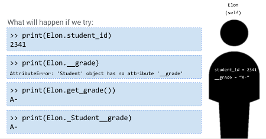

<!--
print(Elon.student_id) - This works! We’re just accessing a public member variable.
print(Elon.__grade) - This doesn’t work! Our variable isn’t accessible outside of our class.
print(Elon.get_grade()) - This works! Our method is accessible outside of our class and will return the grade.
print(Elon._Student__grade) - This works, too! If you add the class name before the variable or method name, you are allowed to access internal variables and methods.

Image Details:
* [intermediatepython12.png](https://opensource.google/docs/copyright/): Copyright Google
-->

---

# Classes: Public Properties

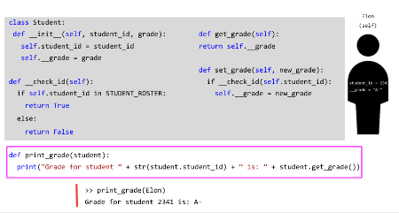

<!--
Encapsulation prevents **some** properties of classes from being accessed by outside code, but objects are designed to work with the rest of your codebase. Many properties of classes are made public, which means that they are accessible outside of the class.

You can write functions outside of classes that will interact with objects much like they do inside the class. The difference is that you have to pass the object as an argument, and reference that object instead of self.

Notice how student_id is an attribute and does not require (), while get_grade is a method and does require (). 

Image Details:
* [intermediatepython14.png](https://opensource.google/docs/copyright/): Copyright Google
-->

---

# Common Naming Conventions

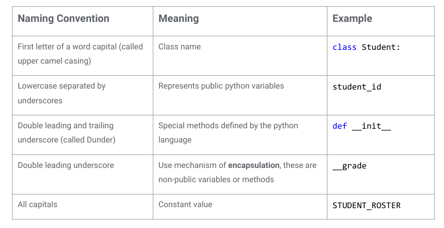

<!--
Go through each naming convention. It may be helpful to save this slide as a reference.  

Image Details:
* [intermediatepython13.png](https://opensource.google/docs/copyright/): Copyright Google
-->

---

# Class Inheritance

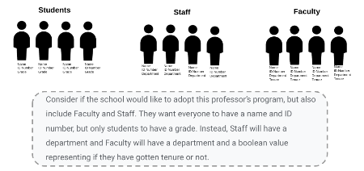

<!--
Here we see a scenario where it's helpful to have a way to make classes closely related, as they share similar data structures.

Image Details:
* [intermediatepython15.png](https://opensource.google/docs/copyright/): Copyright Google
-->

--- 

# Class Inheritance

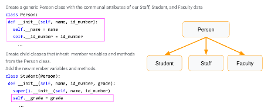

<!--
Inheritance structures are hierarchical relationships between classes.
  * They can have any number of classes inherit from other classes and create complex hierarchies.

For now we will just look at one parent class with 3 child classes.

The child class inherits all characteristics of the parent class and you can add on.
  * Look how we declare variables in Student(Person).
  * We get all the variables from super(), and we can declare our own.

Note: A student is a person, but a person is not a student.
  * Similarly, a square is a rectangle is a polygon, but not the other way around.

Helpful reads:
* https://web.stanford.edu/class/archive/cs/cs106b/cs106b.1152/preview-inheritance.shtml
* http://www.jesshamrick.com/2011/05/18/an-introduction-to-classes-and-inheritance-in-python/
* Also Multiple inheritance in Python (https://pythonbasics.org/multiple-inheritance/)

Image Details:
* [intermediatepython16.png](https://opensource.google/docs/copyright/): Copyright Google
-->

---

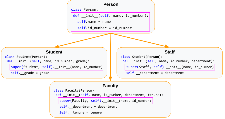

<!--
Walk through the different variables and reinforce the super() concept.

Image Details:
* [intermediatepython17.png](https://opensource.google/docs/copyright/): Copyright Google
-->

---

# Class Inheritance

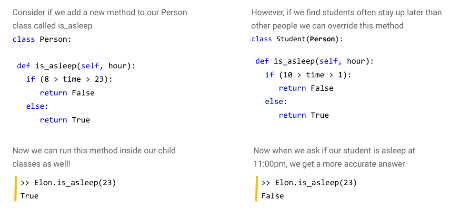

<!--

Methods can also be inherited and can be overwritten by child classes. We can call inherited methods on Elon our student, just like normal. Or we can modify methods inside a child class and override the parent method.

Image Details:
* [intermediatepython18.png](https://opensource.google/docs/copyright/): Copyright Google
-->

---

# List Comprehension

<!--
Now that we've covered classes, let's move on to another popular concept in Python: list comprehension.

-->

---

# List Comprehension

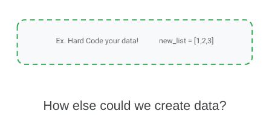

<!--

@Exercise (5 minutes): {
Ask students to break into pairs and discuss other possible ways to populate a list of data, rather than directly hard-coding values.

Hints: 
 * What coding concepts are often used for repetitive actions like adding something to a list?
 * Can you think of a way to generate a list of random numbers?
}

Image Details:
* [intermediatepython19.png](https://opensource.google/docs/copyright/): Copyright Google
-->

---

# List Comprehension

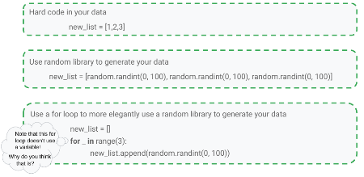

<!--
Walk through each of the listed ways to generate a list of data.
 * Note: An underscore is used instead of a variable in the for loop because we don’t have any use for the variable. It is good practice to avoid initializing variables if you don't need them.

None of these are very elegant. Can we think of a more efficient way?

Image Details:
* [intermediatepython20.png](https://opensource.google/docs/copyright/): Copyright Google
-->

---

# List Comprehension

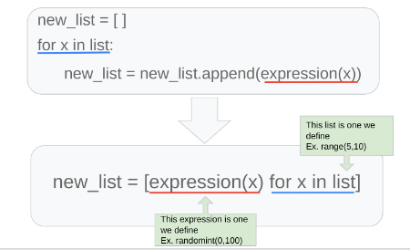

<!--
List comprehensions are a clearer and more concise way of generating lists of data.

They contain the same elements as a normal for loop, just arranged differently and enclosed within brackets.

The basic syntax for a list comprehension can be seen in the slide, and is as follows:
  * An open bracket,
  * followed by an expression,
  * followed by zero or more for clauses,
  * followed by zero or more if clauses,
  * followed by a close bracket.

The list comprehension always returns a new list, which contains the result of evaluating the for and if clauses on the expression.

The expression can be anything - from a simple variable to a complex function call - which makes list comprehensions very flexible.

Image Details:
* [intermediatepython21.png](https://opensource.google/docs/copyright/): Copyright Google
-->

---

# List Comprehension

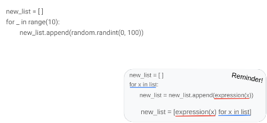

<!--

@Exercise (5 minutes): {
Ask students to try to rewrite the for loop on this slide as a list comprehension.
}

Image Details:
* [intermediatepython22.png](https://opensource.google/docs/copyright/): Copyright Google
-->

---

# List Comprehension

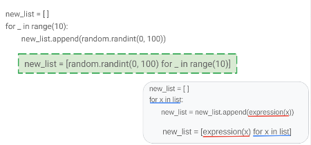

<!--
We can see that it follows the exact formula at the bottom of the slide and can still use our for loop without the variable.

Image Details:
* [intermediatepython23.png](https://opensource.google/docs/copyright/): Copyright Google
--> 

--- 

# List Comprehension

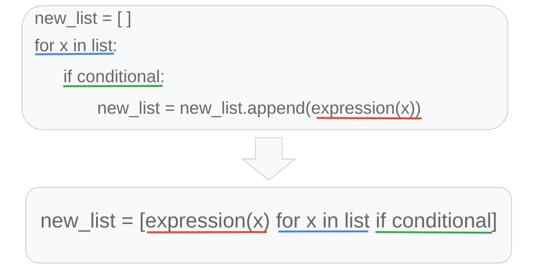

<!--
If you want to check something before adding it to the list, you can, by using an if statement.

Image Details:
* [intermediatepython24.png](https://opensource.google/docs/copyright/): Copyright Google
-->

---

# List Comprehension

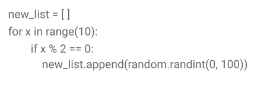

<!--

@Exercise (5 minutes): {
Ask students to try to make the for loop on this slide into a list comprehension that includes the conditional statement.
}

Image Details:
* [intermediatepython25.png](https://opensource.google/docs/copyright/): Copyright Google
-->

---

# List Comprehension

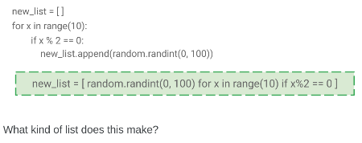

<!--
Here is the answer. What kind of list will we end up with?

Image Details:
* [intermediatepython26.png](https://opensource.google/docs/copyright/): Copyright Google
-->

---

# List Comprehension

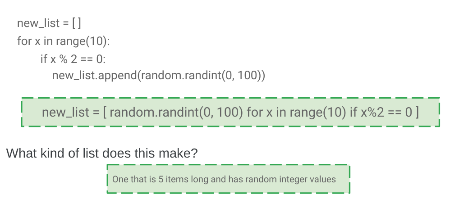

<!--
Because we added the condition that x had to be an even number (dividing by two gave no remainder), we only got five items in this list instead of 10, even though we looped over all the numbers in range(10).

Image Details:
* [intermediatepython27.png](https://opensource.google/docs/copyright/): Copyright Google
-->
