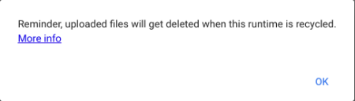

---

marp: true

---

<style>
img[alt~="center"] {
  display: block;
  margin: 0 auto;
}
</style>

# Acquiring Data

<!--
So far we have only worked with tiny datasets that we have hard-coded. 
As we begin to move deeper into data science, we will need to work with
larger and more complex datasets. In order to do that, we need to know how to
get the datasets into our Colab environments.

Remember that Colab is running "in the cloud," so in order to process any data, you
have to get that data onto the server that Colab is running on.

We'll cover a few ways of doing that in this lecture.
-->

---

# Uploading Data

<!--
One of the most straightforward ways of getting data into Colab is to upload it
into the lab. If you have a file on your machine and want to get it into Colab,
you can do so with just a few clicks.

Let's walk through an example.
-->

---

# Uploading Data

Click on the "Files" icon.


<!--
First, click 'Files' (a small folder icon) on the left side of the screen.

* Image name: res/files.png
  * Repo link: https://github.com/google/applied-machine-learning-intensive/tree/master/content/02_data/04_acquiring_data/res/files.png
  * Source https://github.com/google/applied-machine-learning-intensive/tree/master/content/02_data/04_acquiring_data/res/files.png by Author Google LLC under License Copyright [2020] Google LLC.
-->

---

# Uploading Data


<!--
Next, click on the 'Upload' link.

* Image name: res/upload.png
  * Repo link: https://github.com/google/applied-machine-learning-intensive/tree/master/content/02_data/04_acquiring_data/res/upload.png
  * Source https://github.com/google/applied-machine-learning-intensive/tree/master/content/02_data/04_acquiring_data/res/upload.png by Author Google LLC under License Copyright [2020] Google LLC.
-->

---

# Uploading Data


<!--
You will then be presented with a file selector dialog box. Find the file on
your local machine, and then click the 'Open' button.

* Image name: res/file-selector.png
  * Repo link: https://github.com/google/applied-machine-learning-intensive/tree/master/content/02_data/04_acquiring_data/res/file-selector.png
  * Source https://github.com/google/applied-machine-learning-intensive/tree/master/content/02_data/04_acquiring_data/res/file-selector.png by Author Google LLC under License Copyright [2020] Google LLC.
-->

---

# Uploading Data



<!--
The first time you upload a file to an active lab you will see a warning telling
you that the files won't stick around forever. Colab environments run for a
fixed amount of time (less than a day), and then the runtime gets recycled.

For this class and for small data science and machine learning projects, this is
okay. For longer-running projects, there are ways to point Colab at a different
environment. You can also download Colab notebooks and run them in Jupyter on a
machine that can store the files longer-term.

Do be warned, though, if you do a lot of processing on data and save that data to
a file, you will want to download the file before the Colab runtime gets
recycled.

* Image name: res/warning.png
  * Repo link: https://github.com/google/applied-machine-learning-intensive/tree/master/content/02_data/04_acquiring_data/res/warning.png
  * Source https://github.com/google/applied-machine-learning-intensive/tree/master/content/02_data/04_acquiring_data/res/warning.png by Author Google LLC under License Copyright [2020] Google LLC.
-->

---

# Uploading Data


<!--
Once your file is uploaded, you will be able to see it in the left 'Files' panel
of Colab.

* Image name: res/uploaded-files.png
  * Repo link: https://github.com/google/applied-machine-learning-intensive/tree/master/content/02_data/04_acquiring_data/res/uploaded-files.png
  * Source https://github.com/google/applied-machine-learning-intensive/tree/master/content/02_data/04_acquiring_data/res/uploaded-files.png by Author Google LLC under License Copyright [2020] Google LLC.
-->

---

# Uploading Data


<!--
If at any time you end up seeing a list of files and folders like this, then you
clicked on the 'Parent Directory' link instead of the 'Upload' link. This moves
you from the `/content/` folder on the virtual machine to the `/` (root) folder.

From the root folder you can browse other folders like `/content/`, but any
uploads you do will go to root and not to `/content/`.

Why does this matter?

* Image name: res/root-folder.png
  * Repo link: https://github.com/google/applied-machine-learning-intensive/tree/master/content/02_data/04_acquiring_data/res/root-folder.png
  * Source https://github.com/google/applied-machine-learning-intensive/tree/master/content/02_data/04_acquiring_data/res/root-folder.png by Author Google LLC under License Copyright [2020] Google LLC.
-->

---

# Uploading Data

```python
df = pd.read_csv('data.csv')    # Reads /content

df = pd.read_csv('../data.csv') # Reads /
df = pd.read_csv('/data.csv')   # Reads /
```

<!--
The landing spot of the file affects the way you read the file into a
`DataFrame`. By default Colab considers `/content/` to be the working directory,
so if you upload data to `/content/` you can read it directly as shown in the
first example of this slide. If you upload data to root, you have to use the
`../` syntax to read from the parent directory or the `/` syntax to read from
root.
-->

---

# Uploading Data


<!--
Let's think about what is happening when we are uploading data to Colab. We have
the data on our local computer and then we copy/upload that data to Colab
running on the cloud.

* Image name: res/to-cloud.png
  * Repo link: https://github.com/google/applied-machine-learning-intensive/tree/master/content/02_data/04_acquiring_data/res/to-cloud.png
  * Source https://github.com/google/applied-machine-learning-intensive/tree/master/content/02_data/04_acquiring_data/res/to-cloud.png by Author Google LLC under License Copyright [2020] Google LLC.
-->

---

# Uploading Data


<!--
It is actually even more likely, especially in this class, that you are
downloading data from the internet and then uploading that data back to Colab.

For small files this might be okay, but for large files this can be slow.
This is especially true in a classroom setting where many of us are uploading
and downloading large files at the same time. 

* Image name: res/to-from-cloud.png
  * Repo link: https://github.com/google/applied-machine-learning-intensive/tree/master/content/02_data/04_acquiring_data/res/to-from-cloud.png
  * Source https://github.com/google/applied-machine-learning-intensive/tree/master/content/02_data/04_acquiring_data/res/to-from-cloud.png by Author Google LLC under License Copyright [2020] Google LLC.
-->

---

# Uploading Data


<!--
Luckily, there are numerous ways to move data around without ever having to
bring it down to your local computer. You can write code in Colab to perform
"cloud-to-cloud" data transfers. This reduces the number of times that the data
are copied and, it reduces the transfers over your network connection.

* Image name: res/cloud-to-cloud.png
  * Repo link: https://github.com/google/applied-machine-learning-intensive/tree/master/content/02_data/04_acquiring_data/res/cloud-to-cloud.png
  * Source https://github.com/google/applied-machine-learning-intensive/tree/master/content/02_data/04_acquiring_data/res/cloud-to-cloud.png by Author Google LLC under License Copyright [2020] Google LLC.
-->

---

# Downloading With Python

```python
import urllib.request

urllib.request.urlretrieve(
    'http://www.example.com/data.csv',
    'data.csv')
```

<!--
It is possible to directly download data into Colab using the `urllib` library
in Python. The `urllib.request.urlretrieve` function takes two primary
arguments: a url to download and a file name to save the data into.
-->

---

# Downloading With Pandas

```python
import pandas as pd

pd.read_csv(
    'http://www.example.com/data.csv',
    names=column_names)
```

<!--
Pandas can also read data directly into a `DataFrame` using the `read_csv`
function. The only required argument is the URL to download. Another common
argument is `names=, which allows you to set column names if the data file
doesn't have them.
-->

---

# SQL

```python
import pyodbc
import pandas as pd

db_connection = pyodbc.connect(...)

query = pd.read_sql_query('''
  select * from data_table
''', db_connection)

df = pd.DataFrame(query, columns=column_names)
```

<!--
If your data is stored in a database, you can use SQL to read data into a
`DataFrame`. To do this you need to create a database connection. Then create a
query to read the data you are interested in. Finally, you can pass the query to
Pandas to create a new `DataFrame` containing the data.

We won't be working with databases much in this course, but there is a good
chance you'll encounter data in a database sometime in your data science career.
It is good to know that you can connect to the database from Python and load the
data directly into a `DataFrame`.
-->

---

# APIs

```python
import tweepy

auth = tweepy.OAuthHandler('key', 'secret')

api = tweepy.API(auth)

for tweet in api.search(q='Machine Learning'):
    print(tweet.text)
```

<!--
APIs are another common way to fetch data. Many services have APIs that you can
use to search through their data. Most of these services require that you
authenticate yourself before you use the API. Some APIs have free tiers and
for-pay tiers.

Here is an example of using the `tweepy` API to query Twitter for the term
'Machine Learning'.

You can see that we first have to authenticate, and then once we authenticate, we
can call the `search` functions on the API.

Every API is different. If you have a service that you want to get data from,
check and see if they have an API. Then see if there is a Python wrapper around
that API. For example, tweepy is a library that makes working with the Twitter
API easier. Wrappers exist for many popular services, so always check before
trying to use any API directly.
-->

---

# Kaggle

<!--
Now we'll talk about getting data from Kaggle into your Colab. We talk about
Kaggle specifically because it does require authentication to download data from
Kaggle, and we use Kaggle quite a bit in this course.
-->

---

# Kaggle: Browser Download


<!--
Once you navigate to a dataset in Kaggle, you can download the dataset by
clicking the 'Download' link. If you aren't logged in, you'll be prompted to log
in first.

After you have downloaded the file to your local machine, you can then upload it
to Colab.

* Image name: res/kaggle-download.png
  * Repo link: https://github.com/google/applied-machine-learning-intensive/tree/master/content/02_data/04_acquiring_data/res/kaggle-download.png
  * Source https://github.com/google/applied-machine-learning-intensive/tree/master/content/02_data/04_acquiring_data/res/kaggle-download.png by Author Google LLC under License Copyright [2020] Google LLC.
-->

---

# Kaggle: Command Line

```shell
kaggle datasets download joshmcadams/oranges-vs-grapefruit
```

<!--
You can also use the `kaggle` command to directly download a dataset into Colab,
bypassing the need to download the dataset to your computer.

1. Type the 'kaggle' command
2. The `kaggle` shell command can work with numerous Kaggle objects such as contents, notebooks, and datasets. In this case, we are working with datasets, so we type 'datasets'.
3. We then type 'download' to indicate that we want to download a dataset.
4. Finally, we tell the command the dataset that we want to download.

Note that there is some setup required before running `kaggle`. You'll need to
get API credentials from Kaggle and store them in your lab. Instructions for
doing that are in the lab for this unit.
-->

---

# Your Turn!

<!--
Now it's time to practice acquiring data in the lab. 
-->
