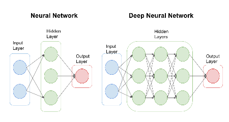
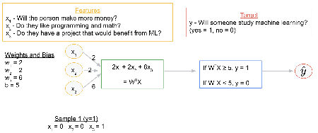

---

marp: true

---

<style>
img[alt~="center"] {
  display: block;
  margin: 0 auto;
}
</style>

# Neural Networks

<!--
So far we have used classic machine learning models. These models are powerful and have proven useful for a wide range of applications.

It's likely you have heard about neural networks and deep learning. These concepts are in vogue right now. Depending on your perspective, deep learning and neural networks are either going to be a giant leap forward for humanity, are going to destroy us all, or are over-hyped tools with limited application.

There is likely a little bit of truth to each of these opinions.
-->

---

# Neural Networks: Good?


<!--
Deep learning is a giant leap forward for humanity. We can now program machines to excel at tasks that we once thought only humans could master. Computers can drive cars, interpret medical imaging, create art, and play complex games at a human expert-level or better.

* Image name: res/car.jpg
  * Repo link: https://github.com/google/applied-machine-learning-intensive/tree/master/content/03_regression/07_neural_networks/res/car.jpg
  * Source https://pixabay.com/photos/vehicle-autonomous-4759347/ by Author Falco / https://pixabay.com/users/falco-81448/ under License https://pixabay.com/service/license/.
-->

---

# Neural Networks: Bad?


<!--
There is also the fear that deep learning will have huge negative impacts on society. The images of a terminator are likely overblown, but there is real concern that advanced deep learning algorithms will have negative effects on some people.

Disruptive technologies like self-driving cars will displace millions of workers.

Societal bias, conscious or not, can become encoded in deep learning algorithms, multiplying and normalizing the negative effects that have existed for decades.

When using deep learning, great care must be taken to remove bias and to understand the implications of mass application of the algorithms.

* Image name: res/terminator.jpg
  * Repo link: https://github.com/google/applied-machine-learning-intensive/tree/master/content/03_regression/07_neural_networks/res/terminator.jpg
  * Source https://pixabay.com/illustrations/bot-cyborg-robot-helper-arm-chair-4875211/ by Author Sergeitokmakov / Sergei Tokmakov https://pixabay.com/users/sergeitokmakov-3426571/ under License https://pixabay.com/service/license/.
-->

---

# Neural Networks: Hype?


<!--
And finally, there are those who think deep learning and neural networks are just hype. For every person who thinks a technological revolution is around the corner, there is another pointing out how specialized and controlled the environment has to be for machine learning algorithms to perform well.

Deep learning doesn't progress at an even pace. We are currently in a deep learning boom, but this has happened before. There have been a few "AI winters" where researchers thought that we were on the cusp of a revolution, only to have research in neural networks go dormant for a while.

We'd like to think that this time might be different. Computation is finally fast enough and has enough scale that algorithms designed decades ago can finally be implemented and trained in an effective manner.

Only time will tell if deep learning can live up to expectations. What we can do now is learn about it, be thoughtful about how we train and use it, and continue to innovate cautiously.

* Image name: res/hype.jpg
  * Repo link: https://github.com/google/applied-machine-learning-intensive/tree/master/content/03_regression/07_neural_networks/res/hype.jpg
  * Source https://unsplash.com/photos/NrtC3y108Ys by Author Verena Yunita Yapi https://unsplash.com/@verenayunita under License https://unsplash.com/license.
-->

---

# History & Motivation

<!--
Let's first look at some history and motivation for neural networks.
-->

---

# Neural Networks: Inspired by Nature


<!--
We've talked about what people think neural networks can and cannot do, but we really haven't talked about what neural networks are. And why are they even called neural networks?

Nature can be a source of inspiration. Birds inspired man to fly. The burdock plant was the inspiration for velcro. Even in the computer science realm we hear references to trees, forests, and other things that occur in nature.

* Image name: res/nature.png
  * Repo link: https://github.com/google/applied-machine-learning-intensive/tree/master/content/03_regression/07_neural_networks/res/nature.png
  * Source https://pixabay.com/photos/burdock-thistle-prickly-stick-barb-745306/ by Author nidan / Heiko Stein https://pixabay.com/users/nidan-455298/ under License https://pixabay.com/service/license/.
  * Source https://pixabay.com/photos/nike-baby-shoes-shoe-baby-velcro-1201595/ by Author FotoRieth https://pixabay.com/users/fotorieth-837884/ under License https://pixabay.com/service/license/.
  * Source https://pixabay.com/photos/bird-seagull-flying-wings-gull-3158784/ by Author Atlantios / Antonios Ntoumas https://pixabay.com/users/atlantios-4957810/ under License https://pixabay.com/service/license/.
  * Source https://pixabay.com/photos/plane-aircraft-take-off-sky-50893/ by Author Holgi / Holger Detje https://pixabay.com/users/holgi-5825/ under License https://pixabay.com/service/license/.
-->

---

# Neural Networks: Inspired by Nature


<!--
Similar to the examples in the last slide, neural networks are inspired by nature. The brain contains a massive network of neurons that send electrical signals that activate other neurons. Through this network we are able to think.

This is the building block of the brain: a neuron.

A neuron is just a cell with a nucleus and cell body like any other cell. One of the distinguishing features of the neuron is the 'axon,' which is the long tail of the neuron. The tip of the axon has synaptic terminals that attach to other neuron bodies. A neuron body receives signals from the synapse of neurons before it. When those signals reach a critical point within a fixed period of time, the receiving neuron fires, sending a signal to later neurons.

Neural networks were inspired by neurons and connections between neurons in the brain, hence the name.

* Image name: res/neuron.png
  * Repo link: https://github.com/google/applied-machine-learning-intensive/tree/master/content/03_regression/07_neural_networks/res/neuron.png
  * Source https://pixabay.com/vectors/neuron-nerve-cell-axon-dendrite-296581/ by Author Clker-Free-Vector-Images https://pixabay.com/users/clker-free-vector-images-3736/ under License https://pixabay.com/service/license/.
-->

---

# Neural Networks: Inspired by Nature


<!--
This builds a web of neurons called a "neural network."

This simplification of the brain signaling pathway led to research into "artificial neural networks" with different types of neurons.

Beyond this network effect, the concept of neural networks tends to break away from biology. Similarly, birds inspired flight, but modern airplanes don't flap their wings.

We find inspiration in nature. We don't have to copy it.

* Image name: res/neurons.jpg
  * Repo link: https://github.com/google/applied-machine-learning-intensive/tree/master/content/03_regression/07_neural_networks/res/neurons.jpg
  * Source https://pixabay.com/illustrations/neurons-brain-cells-brain-structure-1773922/ by Author geralt / Gerd Altmann https://pixabay.com/users/geralt-9301/ under License https://pixabay.com/service/license/.
-->

---

# Neural Networks: Cutting Edge


<!--
When did neural networks originate? The 1940s.

1940s! I thought neural networks were cutting edge?

Many of the fundamental algorithms we use today are rooted in thought experiments from the 1940s, but it has been a long journey from then to where we are today.

The computing power and data storage that we have today is nearly unimaginable compared to what was available even in the recent past. Also, many of the early ideas were foundational, but they have been improved upon over time.

The idea of deep learning is not new. There were even a few "AI winters" over the last 80 years that stalled development and research in deep learning. It feels like we might finally be at a point where the theoretical ideas of the past can be fulfilled with the technologies of today.

* Image name: res/einstein.jpg
  * Repo link: https://github.com/google/applied-machine-learning-intensive/tree/master/content/03_regression/07_neural_networks/res/einstein.jpg
  * Source https://pixabay.com/photos/albert-einstein-scientists-physicist-62931/ by Author WikiImages https://pixabay.com/users/wikiimages-1897/ under License https://pixabay.com/service/license/.
-->

---

# Artificial Neural Networks (ANN)

<!--
Today we will talk about artificial neural networks. These are computational networks inspired by biological systems.

ANN is a big umbrella. There are "feed-forward" networks. There is a concept of "backpropagation." And there are specific types of networks such as convolutional neural networks (CNN) and recurrent neural networks (RNN) that we will look at in more detail in future units.
-->

---

# Artificial Neural Networks (ANN)



<!--
These are the typical diagrams you see to depict an artificial neural network. On the left we have our "input layer." This is where we feed our feature data into the model. In these two diagrams, there are three features (depicted by the two blue dots on the far left of the schematic).

The feature information then flows into "hidden layers." In these hidden layers, mathematical operations are performed to extract patterns from the feature data. We'll talk more about this math on future slides.

Finally, the transformed feature data flows to the output layer, which returns our predicted target values.

The main idea is that if neurons in one layer "fire." Then, using the connections to the next layer, we can determine which neurons in the next layer will fire. For now, it is useful to think of a neuron firing as a 1 and not firing as a 0. It is true that more sophisticated neural networks take into account the intensity of a "fire" (i.e., fired at 50% vs fired at 100%), but for the sake of discussion, let's stick with the 1 or 0 model.

* Image name: res/ann.png
  * Repo link: https://github.com/google/applied-machine-learning-intensive/tree/master/content/03_regression/07_neural_networks/res/ann.png
  * Source https://github.com/google/applied-machine-learning-intensive/tree/master/content/03_regression/07_neural_networks/res/ann.png by Author Google LLC under License Copyright [2020] Google LLC.
-->

---

# Perceptron


<!--
In 1958, an American psychologist named Frank Rosenblatt attempted to build a machine called a perceptron.

We can think of the perceptron as the building block of neural networks. The perceptron has no hidden layers. We feed our features into the left side, do computation, and receive a predicted target.

This looks strikingly similar to the models we've been building in this course. And that's no accident! We can think of a linear regression model as a perceptron.

But what are those mystery computations that take place on the black lines? There are weights, w_{1}, ..., w_{m}, that are used in these computations. How does that work? Let's look closer at what's happening behind the scenes along those black lines.

* Image name: res/perceptron.png
  * Repo link: https://github.com/google/applied-machine-learning-intensive/tree/master/content/03_regression/07_neural_networks/res/perceptron.png
  * Source https://github.com/google/applied-machine-learning-intensive/tree/master/content/03_regression/07_neural_networks/res/perceptron.png by Author Google LLC under License Copyright [2020] Google LLC.
-->

---

# Perceptron


<!--
The green and blue compartments show the computations taking place in the connections between the input layer and output layer of a perceptron.

The features are denoted by x_{i}. The weights w_{i} are playing the same role as the weights in our linear regression model. If we build a weight vector W = [w_{1}, w_{2}, ..., w_{m}] and a feature vector X = [x_{1}, x_{2}, ..., x_{m}], then the green computation is simply W^{T}X + b (which is exactly the same as the target in a regression model: bias + w_{1}x_{1} + w_{2}x_{2} + ... + w_{m}x_{m}).

This information is then sent to an "activation function," which uses the information from the green computation to determine whether or not the next neuron should fire. In a linear regression example, the activation function might be f(x) = x. In other words, the activation function plays no role. But let's look at a slightly more interesting example and walk through these details in a little more depth.

* Image name: res/perceptron2.png
  * Repo link: https://github.com/google/applied-machine-learning-intensive/tree/master/content/03_regression/07_neural_networks/res/perceptron2.png
  * Source https://github.com/google/applied-machine-learning-intensive/tree/master/content/03_regression/07_neural_networks/res/perceptron2.png by Author Google LLC under License Copyright [2020] Google LLC.
-->

---

# Perceptron Example


<!--
Suppose we want to predict whether an individual will start studying machine learning. Our features are given by:
x_{1} = will the person make more money?
x_{2} = does the person love programming and mathematics?
x_{3} = does the person have a project that would benefit from ML?

We compute W^{T}X = w_{1}x_{1} + w_{2}x_{2} + w_{3}x_{3} + bias.

Now assume that we will say "yes": the person will study machine learning if the result is >= 0 and "no": the person will not study machine learning if the result is < 0.

*It might be helpful to flip back to the previous slide and explain that the specific activation function we're working with in this example is f(x) = 1 if W^{T}X + b >= 0 and f(x) = 0 if W^{T}X + b < 0. Also, for notational convenience, we flip the sign of b and write w_{1}x_{1} + w_{2}x_{2} + w_{3}x_{3} - b going forward. If we use this model, then the algorithm will learn a negated form of b.*

That is, we ask is w_{1}x_{1} + w_{2}x_{2} + w_{3}x_{3} - bias >= 0? Which is the same as asking is w_{1}x_{1} + w_{2}x_{2} + w_{3}x_{3} >= b. For convenience, we have relabeled b as -b.


* Image name: res/perceptron_example.png
  * Repo link: https://github.com/google/applied-machine-learning-intensive/tree/master/content/03_regression/07_neural_networks/res/perceptron_example.png
  * Source https://github.com/google/applied-machine-learning-intensive/tree/master/content/03_regression/07_neural_networks/res/perceptron_example.png by Author Google LLC under License Copyright [2020] Google LLC.
-->

---

# Machine Learning Process

1. Infer/Predict/Forecast
1. Calculate Error/Loss/Cost
1. Train/Learn
1. Iterate (until some stopping condition)

<!--
Let's recall the general machine learning process. This is the same process that we use for all ML models.
-->

---

# Perceptron Example


<!--
Let's assume we already have our weights and bias. We say that x_{1} and x_{2} have an equal impact on a person's decision to study ML, and they both have weight 2. Assume that x_{3} is three times as important in a person's decision to study ML, so its weight is 6. Now let's assume the bias is 5. In other words, we are thresholding at 5, and we say if W^{T}X >= 5, then the person will study machine learning. If W^{T}X < 5, then the person will not study machine learning.

Let's take a second to think about these numbers critically and see what they really mean.

* Image name: res/perceptron_example_01.png
  * Repo link: https://github.com/google/applied-machine-learning-intensive/tree/master/content/03_regression/07_neural_networks/res/perceptron_example_01.png
  * Source https://github.com/google/applied-machine-learning-intensive/tree/master/content/03_regression/07_neural_networks/res/perceptron_example_01.png by Author Google LLC under License Copyright [2020] Google LLC.
-->

---

# Perceptron Example



<!--

Let's assume a particular person, Kelly, does not stand to make more money by studying ML and she does not like programming and math (x_{1} = x_{2} = 0). But assume that Kelly does have a project that would benefit from ML (x_{3} = 1).

* Image name: res/perceptron_example_02.png
  * Repo link: https://github.com/google/applied-machine-learning-intensive/tree/master/content/03_regression/07_neural_networks/res/perceptron_example_02.png
  * Source https://github.com/google/applied-machine-learning-intensive/tree/master/content/03_regression/07_neural_networks/res/perceptron_example_02.png by Author Google LLC under License Copyright [2020] Google LLC.
-->

---

# Perceptron Example


<!--
Computing W^{T}X we get 6.

We check that 6 is >= 5, so we say "yes": Kelly will study machine learning.

* Image name: res/perceptron_example_03.png
  * Repo link: https://github.com/google/applied-machine-learning-intensive/tree/master/content/03_regression/07_neural_networks/res/perceptron_example_03.png
  * Source https://github.com/google/applied-machine-learning-intensive/tree/master/content/03_regression/07_neural_networks/res/perceptron_example_03.png by Author Google LLC under License Copyright [2020] Google LLC.
-->

---

# Perceptron Example


<!--
Now let's assume we have another person, Riley, who will make more money in her job by learning ML and she does like programming and math (x_{1} = x_{2} = 1), but she does not have a project that would benefit from ML (x_{3}=0).

* Image name: res/perceptron_example_04.png
  * Repo link: https://github.com/google/applied-machine-learning-intensive/tree/master/content/03_regression/07_neural_networks/res/perceptron_example_04.png
  * Source https://github.com/google/applied-machine-learning-intensive/tree/master/content/03_regression/07_neural_networks/res/perceptron_example_04.png by Author Google LLC under License Copyright [2020] Google LLC.
-->

---

# Perceptron Example


<!--
Computing W^{T}X we get 4.

We check that 4<5, so the model predicts "no": Riley will not study ML.

In general, this is how we feed input data into our model. If the model had already finished learning the weights and bias, then this is how we would generate our predicted targets.

* Image name: res/perceptron_example_05.png
  * Repo link: https://github.com/google/applied-machine-learning-intensive/tree/master/content/03_regression/07_neural_networks/res/perceptron_example_05.png
  * Source https://github.com/google/applied-machine-learning-intensive/tree/master/content/03_regression/07_neural_networks/res/perceptron_example_05.png by Author Google LLC under License Copyright [2020] Google LLC.
-->

---

# Networks With Hidden Layers


<!--
If we had a network with more layers, then the same process is happening between each layer. We can think of this as many perceptrons stacked on top of each other.

For example, in the input layer we have X = [x_{1}, ..., x_{m}]. All these nodes are connected to node h_{1}^{1}. There are weights assigned to each of these that we can combine into a vector, W_{1}^{1}. Then W_{1}^{1}^{T}X + b can be thought of as a perceptron.

Similarly, all the nodes in the first hidden layer are connected to h_{1}^{2}. All these connections have their own individual weights. And this part of the network can be thought of as its own perceptron.

Thus, feeding data through the hidden layers is equivalent to a composition of many matrix multiplications.

* Image name: res/hidden_layers.png
  * Repo link: https://github.com/google/applied-machine-learning-intensive/tree/master/content/03_regression/07_neural_networks/res/hidden_layers.png
  * Source https://github.com/google/applied-machine-learning-intensive/tree/master/content/03_regression/07_neural_networks/res/hidden_layers.png by Author Google LLC under License Copyright [2020] Google LLC.
-->

---

# Perceptron Example


<!--
But how does the model actually update the weights and bias during the learning process?

Let's look back at our example. Note that both of these samples were technically training data. From our dataset, we know that both Kelly and Riley did study ML (y=1), but for Kelly we predicted \hat{y} = 1, and for Riley we predicted \hat{y} = 0. So Kelly's prediction was correct, while Riley's was not correct.

Now the model needs to adjust the weights. It seems like if a person stands to make more money from studying ML AND they love programming and math, then the model should predict a 1 (whether or not they have a current project that would benefit from ML).

So the model needs to update the weights and bias via some optimization algorithm like gradient descent. In order to compute the derivative (gradient) to discern the direction of steepest descent, we will need to unravel the many compositions of matrix multiplication. If you remember your calculus, how do we take the derivative of a composition? The chain rule! That is effectively what backpropagation does. It is a way to compute the gradient when many chain rules are involved through each layer of the network.

* Image name: res/perceptron_example_06.png
  * Repo link: https://github.com/google/applied-machine-learning-intensive/tree/master/content/03_regression/07_neural_networks/res/perceptron_example_06.png
  * Source https://github.com/google/applied-machine-learning-intensive/tree/master/content/03_regression/07_neural_networks/res/perceptron_example_06.png by Author Google LLC under License Copyright [2020] Google LLC.
-->

---

# Machine Learning Process

1. Infer/Predict/Forecast
    * Compute f(X, W, B) - compositions of f and lots of matrix mult
1. Calculate Error/Loss/Cost
    * MSE, MAE, etc.
1. Train/Learn
    * Change W and B in direction to minimize cost
    * Gradient descent -> derivative -> chain rule -> backpropagation
1. Iterate (until some stopping condition)

<!--
Let's put everything together and summarize how a neural network will learn in general. It shouldn't surprise you that it's the same machine learning process that we've been working with for all our models. Now we've just filled it with some high-level details of each step for neural networks.
-->

---


# Issues with this plan?

````
f(x) =  1 if x ≥ 0
        0 if x < 0
````

The step function, f, is not the greatest activation function.
* `f` is not differentiable at 0
* `f’(x) = 0` for all x other than 0
* `f` only returns 0 or 1 (as opposed to a confidence)

<!--
There are many possible activation functions, and some work better than others in certain situations.

Let's take a closer look at the activation function we used in our simple example. This function is called a step-function.

There are a few drawbacks to using the step-function.
* f is not differentiable at 0. This could create problems for gradient descent when we need to take a derivative.
* f'(x) is 0 whenever x is not 0. This could also create problems for gradient descent. If we ever multiply by f'(x), the entire function will go to 0, which means no slope. So it can be hard to determine the direction of steepest descent.
* f only returns a no or a yes. It would be preferable for f to return a continuous value between 0 and 1. For example, if f returned .9, then we would say that we're 90% confident the answer is "yes, this person will study ML." That is far more powerful than just returning a "yes" or "no." We will discuss this further in the section on classification.

-->

---

# Sigmoid


<!--
The sigmoid function is a far more popular activation function, as it addresses the issues we just discussed with the step-function. Again, we will talk more about this when we get to classification.

* Image name: res/sigmoid.png
  * Repo link: https://github.com/google/applied-machine-learning-intensive/tree/master/content/03_regression/07_neural_networks/res/sigmoid.png
  * Source https://github.com/google/applied-machine-learning-intensive/tree/master/content/03_regression/07_neural_networks/res/sigmoid.png by Author Google LLC under License Copyright [2020] Google LLC.
-->

---

# Activation Functions


<!--
The choice of activation function is important. RELU makes differentiation difficult, but it actually works really well in practice. The other functions are also very useful.

It is important to note that why certain activation functions behave in certain ways is an active area of research. People are testing new ones every day. Sometimes there is good theoretical justification for using a particular activation function, and sometimes we use a particular activation function simply because it trained quickly and gave us good results in practice.

* Image name: res/neurnet10.png
  * Repo link: https://github.com/google/applied-machine-learning-intensive/tree/master/content/03_regression/07_neural_networks/res/neurnet10.png
  * Source https://github.com/google/applied-machine-learning-intensive/tree/master/content/03_regression/07_neural_networks/res/neurnet10.png by Author Google LLC under License Copyright [2020] Google LLC.
-->
