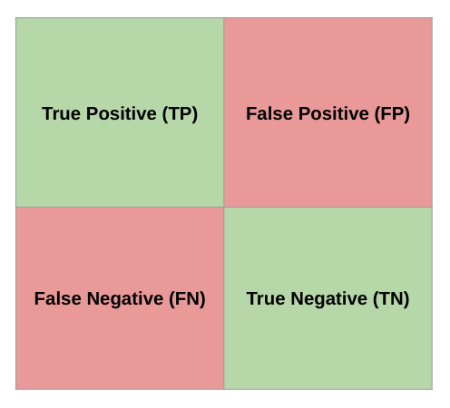

---

marp: true

---

<style>
img[alt~="center"] {
  display: block;
  margin: 0 auto;
}
</style>

# Binary Classification

<!--
Our exploration of classification will start with the simplest case: binary classification. 
-->

---

# Binary Classification


<!--
Binary means there are only two values to predict. Binary classification is used to predict one of two values.

These can be true/false, hotdog/not hotdog, yes/no, benign/malignant, or any other possible this-or-that options. For simplicity, these options are usually encoded as 1 and 0.

Image Details:
* [yes_or_no.png](https://pixabay.com/vectors/button-yes-no-red-green-icon-32259/): Pixabay License
-->

---

# Binary Classification: Models

* Logistic Regression
* Decision Trees and Random Forests
* Support Vector Machines (SVM)
* Bayesian Networks
* Neural Networks
* *... and more*

<!--
There are many models capable of performing binary classification. Some of the more common ones are listed on this slide. Each model has its strengths and weaknesses. We'll study each of these model-types in this course.
-->

---

# Binary Classification: Logistic Regression


<!--
In the lab for this unit, we will build a logistic regression. A logistic regression finds a logistic function and uses it to divide two classes of data. A logistic function is a function in the shape depicted in this slide. It can range in values from zero to one.

This model is relatively easy to interpret and train, but it doesn't perform well unless an actual logistic boundary can be found. To create a logistically divisible set of classes, you sometimes have to perform some very heavy data manipulation.

Image Details:
* [classification.gif](https://opensource.google/docs/copyright/): Copyright Google
-->

---

# The Lab


<!--
In our binary classification lab we will try to differentiate between oranges and grapefruit. We have a dataset with weight, size, and color information. We will build a logistic regression model to try to accomplish this task.

Image Details:
* [oranges_and_grapefruit.jpg](https://pixabay.com/photos/oranges-orange-grapefruit-3004200/): Pixabay License
-->

---

# The Lab: Grid Search

```python
search = GridSearchCV(model, {
  'learning_rate': [1e-3, 1e-4],
  'max_iter': [10000, 15000],
  'C': 1,
})
```

<!--
In this lab, we'll use a few new machine learning techniques. One of these is grid search. Grid search is a way to test different hyperparameters for a model. The search accepts a dictionary containing keys that map to model parameters. The values are lists for hyperparameters that you want to experiment with or single values for parameters that you want to keep constant.

Grid search tries every combination of parameters and finds which performs the best. This can be really useful for testing hyperparameters, but remember that combinations increase at a factorial rate, so running grid search can take quite a while.
-->

---

# The Lab: Confusion Matrix



<!--
We will also create our first confusion matrix in this lab. Remember that a confusion matrix shows true and false positives and negatives.

Image Details:
* [Classification1.png](https://opensource.google/docs/copyright/): Copyright Google
-->

---

# Your Turn

<!--
Now let's explore the binary classification lab.
-->
