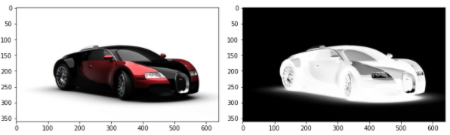
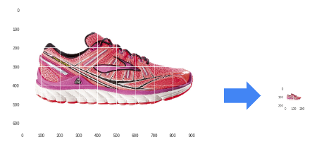
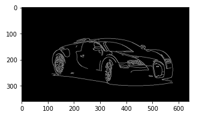
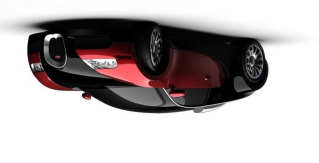

---

marp: true

---

<style>
img[alt~="center"] {
  display: block;
  margin: 0 auto;
}
</style>

# Images and Videos

<!--
In this unit we will move away from machine learning for a bit and instead talk about images
and videos.

Why images and videos?

Image and video processing is actually very common in machine learning applications. Can you think
of any examples of images or video processing in machine learning?

Some ideas include:

* Facial recognition
* Classification
* Converting video to a textual description (story)
* Analyzing video for suspicious movements
* Disease detection in medical images
* Crop yield estimates based on aerial photos of fields

The list goes on and on. There are many applications of image and video processing in machine
learnings.
-->

---

# What Is an image?

<!--
Let's think for a second. What is an image actually?

You likely know that an image is a grid of pixels. And each pixel represents a single color point
in the image. But how is that pixel encoded?
-->

---

# Image Encodings

<!--
Not all pixels are encoded in the same way. There are actually quite a few different
encodings for images.
-->

---
# Image Encodings
## Grayscale vs. Color Images



<!--
One of the first distinctions to be made is if the image is made up pixels on a "gray scale" or if
the image is made from a larger spectrum of colors. In this example you can see that the image on
the left has many colors, including some reds while the image on the right is limited to black,
white, and the grays in between.

What does this mean for the encoding?

* Image name: res/color-vs-gray.png
  * Repo link: https://github.com/google/applied-machine-learning-intensive/tree/master/content/04_classification/06_images_and_video/res/color-vs-gray.png
  * Source https://pixabay.com/illustrations/car-sports-car-racing-car-speed-49278/ by Author Lipetkd / Felipe Lima https://pixabay.com/users/lipetkd-4592/ under License https://pixabay.com/service/license/.
-->

---

# Grayscale
## [0, 255] or [0.0, 1.0]?


<!--
We'll start with the simplest format, grayscale. Grayscale images have a single numeric value
representing each pixel in the image.

But what are those numbers?

Typically they range from 0 to 255 if they are integers or 0.0 to 1.0 if they are floating point
values.

Even with grayscale images, it is important to know the range of values for the input pixels. If
the pixels range from 0.0 to 1.0 then many models will be able to more easily train on the images.
If the values are integers between 0 and 255, then it is typically a good idea to divide the values
by 255.0 in order to bring them into the 0.0 to 1.0 range that neural networks in order to help the
models learn more quickly.

* Image name: res/grayscale.png
  * Repo link: https://github.com/google/applied-machine-learning-intensive/tree/master/content/04_classification/06_images_and_video/res/grayscale.png
  * Source https://pixabay.com/illustrations/car-sports-car-racing-car-speed-49278/ by Author Lipetkd / Felipe Lima https://pixabay.com/users/lipetkd-4592/ under License https://pixabay.com/service/license/.
-->

---

# Color Images
## RGB, RGBA, BGR, BGRA, CMYK, CMYKA, other?


<!--
Grayscale images typically are one of the two encodings that we mentioned. It is of course important
to know which encoding your images are in since a model expects inputs to be on the same scale.
However, converting between [0.0, 1.0] and [0, 255] is fairly trivial.

Color images introduce an entirely new level of encoding complexity. There are scores of encodings
for color images. One of the more common ones that you might have seen is RGB.

RGB stands for "red", "green", "blue". With these three colors you can make scores of other colors.
With RGB encoding a value, typically between 0 and 255 (though sometimes between 0.0 and 1.0), you
can combine the colors to create a rainbow of possibility.

With RGB you have three numeric values for each pixel. This triples the size of your inputs!

But that is not all. There is RGBA, which takes our red, green, and blue and adds an "alpha" channel
which represents the opacity of the pixel.

Opacity?

Typically when we think of an image, we think about only seeing that image. But what if we put an
image under the image we were looking at? If there were no opacity, then we'd only see the topmost
image. If there is opacity (think transparency) then we would see a little bit of the underlying
image too.

The alpha channel, also typically between 0 and 255 or 0.0 and 1.0, manages how "see-through" our
pixel is.

But why RGB? Why not BRG or GBR or any other ordering?

It turns out that there are other orderings, one of the more common being BGR. This was a common
encoding in early digital cameras for hardware reasons that aren't relevant to our topic. Just
know that color order can change, and you need to make sure that your inputs for training and
predicting have the same encodings.

Of course, this begs the question. Are reds, greens, blues, and maybe alphas the only way to encode
color?

Of course not!

There are other schemes such as CMYK, which stands for cyan, magenta, yellow, and black.

Encodings aren't complicated individually, but the number and variety of image encodings can be
difficult to work with.

Know your inputs!

* Image name: res/color.png
  * Repo link: https://github.com/google/applied-machine-learning-intensive/tree/master/content/04_classification/06_images_and_video/res/color.png
  * Source https://pixabay.com/illustrations/car-sports-car-racing-car-speed-49278/ by Author Lipetkd / Felipe Lima https://pixabay.com/users/lipetkd-4592/ under License https://pixabay.com/service/license/.
-->

---

# Modifying Images
## Encodings

```python
  image =  cv.cvtColor(image, cv.COLOR_BGR2RGB)

  image = image / 255.0
  
  image = int(image * 255)
```

<!--
We talked about image encodings and how it is important to feed your model images encoded in the
same way.

In order to do this you have a few options.

If you are converting encodings, you can use the OpenCV `cvtColor` function to to the conversion
for you.

If you are scaling the encodings you can use simple Python expressions with NumPy arrays.
-->

---

# Modifying Images
## Resizing an Image



<!--
But what about scaling/resizing an image?

Some models have a scaling layer as an early step, but not all do. Also, you may want more control
of your image when you scale it.

In the example in this slide we simply scaled the image down to a size that presumptively the model
expects. We could have also padded it into a proportional square or rectangle before resizing.

* Image name: res/resize.png
  * Repo link: https://github.com/google/applied-machine-learning-intensive/tree/master/content/04_classification/06_images_and_video/res/resize.png
  * Source https://pixabay.com/photos/running-shoe-shoe-brooks-371624/ by Author Stux https://pixabay.com/users/stux-12364/ under License https://pixabay.com/service/license/.
-->

---

# Modifying Images
## Pad an Image


<!--
But you don't always just want to blindly resize an image. That might distort it.

In some cases you'll want to pad an image with whatever the background color is and then resize
it in order to avoid distorting the image.

To do this, you must find the number of pixels to add to the height of the image and divide those
pixels across the top and bottom of the image. You must do the same for the left and right of the
image.

* Image name: res/pad.png
  * Repo link: https://github.com/google/applied-machine-learning-intensive/tree/master/content/04_classification/06_images_and_video/res/pad.png
  * Source https://pixabay.com/photos/running-shoe-shoe-brooks-371624/ by Author Stux https://pixabay.com/users/stux-12364/ under License https://pixabay.com/service/license/.
-->

---

# Modifying Images
## Centering



<!--
If we have images with a predictable solid background, we can actually perform more complex
processing and try to find the center of the focal object. Using algorithms like the Canny
algorithm, we can find the key strokes and make our image, hone in on them, and find the center of
our image. We can then pad around that.

* Image name: res/lines.png
  * Repo link: https://github.com/google/applied-machine-learning-intensive/tree/master/content/04_classification/06_images_and_video/res/lines.png
  * Source https://pixabay.com/illustrations/car-sports-car-racing-car-speed-49278/ by Author Lipetkd / Felipe Lima https://pixabay.com/users/lipetkd-4592/ under License https://pixabay.com/service/license/.
-->

---

# Modifying Images
## Rotating



<!--
Other image manipulation tricks involve rotations. You can augment an image by spinning it around.

* Image name: res/upside-down-color.png
  * Repo link: https://github.com/google/applied-machine-learning-intensive/tree/master/content/04_classification/06_images_and_video/res/upside-down-color.png
  * Source https://pixabay.com/illustrations/car-sports-car-racing-car-speed-49278/ by Author Lipetkd / Felipe Lima https://pixabay.com/users/lipetkd-4592/ under License https://pixabay.com/service/license/.
-->

---

# Modifying Images
## Other Augmentations?

<!--
What are some other image augmentations that you can think of?

Some others include:

* 'cutting': where images of the same class are spliced together to increase the size of the
  training data set.
* 'drop out': where portions of training images are removed during training.
* Generating fake data based from a model that is then used to train another model.

There are many more strategies and none are right for every model. You have to experiment.
-->

---

# Video

<!--
This section also talks about video.

We are going to greatly simplify video.

If you think about a video feed, it has images, it has sound, it might have captions and other
optional features.

For our case in this course, video will simply be a series of images and we will treat it as such.

Much of the video we watch is 30 "frames per second" (fps) or 60 fps. Think of each of these frames
as a still image. Now think about how much changes between frames in 1/30th of a second?

Well, it depends on what type of video you are processing.

Are you watching the spray from a sneeze?

Are you watching ice melt?

Video might simply be a "series of images" for our purposes, but you still need to consider what
you are modelling.
-->

---

# Your Turn

<!--
It is time for you to practice working with images and video.

This unit is a bit different because there are three labs to do. Two perform images processing.
One with PIL (Pillow) and the other with OpenCV. We then do a video processing lab where we open
a video and extract frames. This all leads to a project where we will take a video and classify
items in the video.

Have fun!
-->
