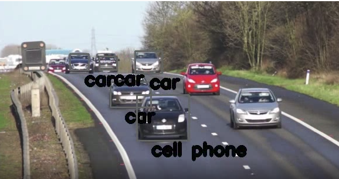

---

marp: true

---

# Video Processing Project
## Identifying Cars in a Video

<!--
We are about to combine many of the skills we've learned over the past few units. We will take a video file and a pre-trained model and build bounding boxes around items in each frame of the video.
-->

---

# Review 
How is image data typically represented and stored? What are the features? 

<!--
@Exercise(5 minutes) {
Have students discuss the fact that images are simply pixels. There are different ways to represent pixels, but it's common to use RGB values that each range from 0 to 255. Each pixel is a feature. Remind them that image data can be challenging to work with because it is often very large. For example, a 12 megapixel image has 36,000,000 features. You may mention that grayscale is one way to cut down on the number of features. 
}
-->

---

# Review 
What Python libraries have we used for image and video manipulation? 

<!--
@Exercise(5 minutes) {
Have students discuss the labs they completed using PIL and OpenCV. 
}
-->

--- 

# Review 
How have you performed classification tasks with image data? 

<!--
@Exercise(5 minutes) {
Have students discuss the fact that they used TensorFlow to train a simple classification model for the Fashion MNIST dataset. This was a prefabricated dataset that was relatively small, so it was possible to train a simple model locally and in a reasonable amount of time. For larger classification tasks, we discussed using pre-built models (specifically those stored in the TensorFlow detection model zoo). 
}
-->

---

# Video Processing Project

<!--
Now let's talk about the project for today! 

Here you can see a single frame of a video showing a road with a bunch of cars. A machine learning model, like the one you will use, has identified many of the cars in the image and labeled them as "car." One was strangely labeled as a cell phone. Clearly models are not perfect. 

In this project we will process a video frame-by-frame and create bounding boxes around items found in those images by the third-party model.

* Image name: res/boxes.png
  * Repo link: https://github.com/google/applied-machine-learning-intensive/tree/master/content/04_classification/08_video_processing_project/res/boxes.png
  * Source https://pixabay.com/videos/cars-motorway-speed-motion-traffic-1900/ by Author MikesPhotos https://pixabay.com/users/mikesphotos-1860391/?tab=videos under License https://pixabay.com/service/license/.
-->

---

# Your Turn

<!--
In this lab you will exercise many of your Python and modeling skills. Let's get started!
-->
