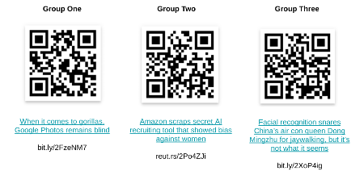

---

marp: true

---

# Classification Gone Wrong

<!--

*Note to facilitator: This is an activity best used during the Classification lessons in Track 4.*
*It focuses on small group discussions and involves limited setup and facilitation by the instructor.
It would best be taught in about 35 minutes, but it could be stretched to 45 minutes depending on the number of groups and how long you want to allow for discussion.*
-->

---

# What Do You See First?

<!--
When you look at this, what do you see first?

Raise your hand if it's a duck you see first. Raise your hand if it's a rabbit you see first.

You've likely seen similar ambiguous images, images where one thing jumps out at you at first, and it takes a little longer to see something else. This phenomenon is likely based on humans and their individual schemas.

But models can make the same kinds of errors, which can lead to some serious issues.

Today we'll discuss three separate scenarios of classifications that did not go as planned and the impact they caused.

Image Details:
* [classificationgonewrong1.jpg](https://opensource.google/docs/copyright/): Copyright Google

-->

---

# Framing Harmful Classifications

* Most of the time, people don’t set out to make a biased system
* But it still happens
* And when it does, it’s really difficult to fix it
* These mistakes can have long-lasting repercussions and negative impact on people or groups

<!--
Most people don’t set out to make a harmful or biased system; they set out to create a model that does one thing, but it ends up having other effects that could be unintended.

This happens frequently. You can search for many, many examples of machine learning projects gone awry, some more serious than others.

When these mistakes occur, they're often very difficult to remedy because they require collecting new data, retraining a model, etc.

If your dataset was biased to begin with, then focusing your data collection on only one type of data to remedy your initial issue may lead to another type of bias.

These mistakes can have a negative and far-reaching impact on people or entire groups.
-->

---

<!--
Let's break into groups by counting off 1, 2, and 3.

Group 1, you will read the corresponding article. The same goes for groups 2 and 3.

Image Details:
* [classificationgonewrong2.png](https://opensource.google/docs/copyright/): Copyright Google
-->

---

# Group Discussion

1. Read the article as a group (10 minutes)
1. Discuss the following questions (15 minutes)
  * What was the original intent of this model/system?
  * Describe the bias with the model that led to this problem.
  * What was the cause of this problem?
  * Are their other mistakes that this model/system could make with this same root problem?
  * What are the short-term and long-term impacts of this?
3. Each group will present to the class (5 minutes/group)

<!--
Each group will read their article and discuss these questions. After reading and your group discussion, each group will present to the class. You may have one member of your group present or several. When planning this 5-minute presentation, please allow one minute for questions.

*Give students a 5-minute warning to begin building a short presentation for the rest of the class.
You can give students easel boards or posters to use as an aid to present or have them just use notes to verbally present.
-->

---

# Class Discussion

* What was most surprising or alarming to you as you learned about these examples of bias in classification?
* How can situations like this be prevented?
* What is the real-world impact of these mistakes? What does that mean regarding your responsibility as professionals in the field?

---

<!--

*Note: If time permits, open up the discussion to the entire class after each group has presented. Encourage more follow-up questions and/or reflections of the questions listed on the slide.
-->
