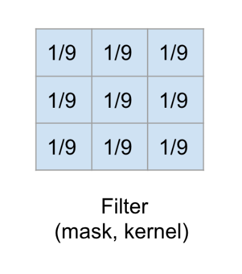
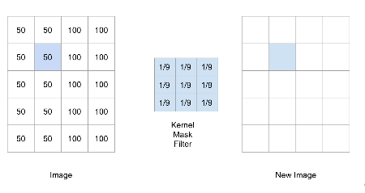
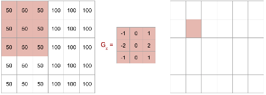

---

marp: true

---

# Convolutional Neural Networks

---

<!--

Like neural networks, convolutional neural networks were inspired by biology.

In the 1960s, David Hubel and Torsten Wiesel showed that the visual cortex in cats and monkeys contain neurons that fire individually in response to small regions in the field of view.

* Image name: res/conNN02.jpg
  * Repo link: https://github.com/google/applied-machine-learning-intensive/tree/master/content/05_deep_learning/00_convolutional_neural_networks/res/conNN02.jpg
  * Source https://pixabay.com/photos/eye-iris-pupil-vision-eyeball-3221498/ by Author blueberrykings111 / Aline Berry https://pixabay.com/users/blueberrykings111-8249241/ under License https://pixabay.com/service/license/.
-->

---

<!--
For a given neuron, the visual space that affects whether or not that neuron will fire is known as its "receptive field."

Neurons that are spatially close together often have similar and overlapping receptive fields.

Our eyes and brains then take the information from each of these small receptive fields and meld them together into the images that we see.

* Image name: res/conNN03.jpg
  * Repo link: https://github.com/google/applied-machine-learning-intensive/tree/master/content/05_deep_learning/00_convolutional_neural_networks/res/conNN03.jpg
  * Source https://pixabay.com/illustrations/grid-block-cube-square-design-684983/ by Author TheDigitalArtist / Pete Linforth https://pixabay.com/users/thedigitalartist-202249/ under License https://pixabay.com/service/license/.
-->

---

<!--

In the 1980s researchers were inspired by the visual cortex and used these ideas to create convolutional neural networks.

A convolutional neural network is simply a neural network with additional (or different) types of layers. There are convolutional layers, downsampling layers, and pooling layers.

* Image name: res/conNN01.png
  * Repo link: https://github.com/google/applied-machine-learning-intensive/tree/master/content/05_deep_learning/00_convolutional_neural_networks/res/conNN01.png
  * Source https://pixabay.com/illustrations/wallpapper-music-colors-80-s-778185/ by Author Osckar / Osckar Espinosa https://pixabay.com/users/osckar-982670/ under License https://pixabay.com/service/license/.
-->

---

<!--
You can stack different numbers of these layers in various orders to achieve different results during training.

* Image name: res/conNN05.jpg
  * Repo link: https://github.com/google/applied-machine-learning-intensive/tree/master/content/05_deep_learning/00_convolutional_neural_networks/res/conNN05.jpg
  * Source https://pixabay.com/photos/pancake-crepes-eat-food-crepe-640869/ by Author Tabea / Tabeajaichhalt https://pixabay.com/users/tabeajaichhalt-745002/ under License https://pixabay.com/service/license/.
-->

---

<!--
Recall the simplest building block for a typical neural network: the perceptron.

* Image name: res/conNN13.png
  * Repo link: https://github.com/google/applied-machine-learning-intensive/tree/master/content/05_deep_learning/00_convolutional_neural_networks/res/conNN13.png
  * Source https://github.com/google/applied-machine-learning-intensive/tree/master/content/05_deep_learning/00_convolutional_neural_networks/res/conNN13.png by Author Google LLC under License Copyright [2020] Google LLC.
-->

---

# Issues With Multi-Layer Perceptron (plain ANN)

<!--
If we are dealing with image data, small and often insignificant changes to the training data can yield large and often incorrect changes to the learned parameters in the model.

For example, consider a problem where you want to identify a cat in an image. If the cat is translated to a different part of the image, then the model will adjust different weights to recognize the cat. But the cat being on the left or right of an image isn't really a defining feature of a cat, right? We'd prefer to recognize things like ears, fur, etc.

CNNs help us solve this problem.

* Image name: res/conNN15.png
  * Repo link: https://github.com/google/applied-machine-learning-intensive/tree/master/content/05_deep_learning/00_convolutional_neural_networks/res/conNN15.png
  * Source https://pixabay.com/illustrations/black-cat-is-curious-black-cat-4134136/ by Author nengsang/ ภัทรี ศรีสุนทร  https://pixabay.com/users/nengsang-3391845/ under License https://pixabay.com/service/license/.
-->

---

<!--
In a convolutional neural network, we first feed our data into convolutional, downsampling, and pooling layers. The results are then fed into a fully connected neural network like we have seen before.

* Image name: res/conNN14.png
  * Repo link: https://github.com/google/applied-machine-learning-intensive/tree/master/content/05_deep_learning/00_convolutional_neural_networks/res/conNN14.png
  * Source https://github.com/google/applied-machine-learning-intensive/tree/master/content/05_deep_learning/00_convolutional_neural_networks/res/conNN14.png by Author Google LLC under License Copyright [2020] Google LLC.
-->

---

# Convolution

A way to analyze influence of nearby pixels using a filter

(Filters are also called kernels, masks, convolution matrices)

---

<!--
Let's look at a simple example. Imagine we have the image on the left. It's just a rectangle with two halves shaded different colors.

The intensity of each pixel is recorded on the right. This is how we typically work with image data.

* Image name: res/conNN16.png
  * Repo link: https://github.com/google/applied-machine-learning-intensive/tree/master/content/05_deep_learning/00_convolutional_neural_networks/res/conNN16.png
  * Source https://github.com/google/applied-machine-learning-intensive/tree/master/content/05_deep_learning/00_convolutional_neural_networks/res/conNN16.png by Author Google LLC under License Copyright [2020] Google LLC.
-->

---

<!--
We'll apply this 3x3 filter to the image.

It's a filter that adds a blurring effect.

* Image name: res/conNN17.png
  * Repo link: https://github.com/google/applied-machine-learning-intensive/tree/master/content/05_deep_learning/00_convolutional_neural_networks/res/conNN17.png
  * Source https://github.com/google/applied-machine-learning-intensive/tree/master/content/05_deep_learning/00_convolutional_neural_networks/res/conNN17.png by Author Google LLC under License Copyright [2020] Google LLC.
-->

---

<!--
We'll apply this 3x3 filter to the image.

It's a filter that adds a blurring effect.

* Image name: res/conNN18.png
  * Repo link: https://github.com/google/applied-machine-learning-intensive/tree/master/content/05_deep_learning/00_convolutional_neural_networks/res/conNN18.png
  * Source https://github.com/google/applied-machine-learning-intensive/tree/master/content/05_deep_learning/00_convolutional_neural_networks/res/conNN18.png by Author Google LLC under License Copyright [2020] Google LLC.
-->

---

<!--
Let's use the 3x3 filter to calculate the new value for this pixel.

* Image name: res/conNN19.png
  * Repo link: https://github.com/google/applied-machine-learning-intensive/tree/master/content/05_deep_learning/00_convolutional_neural_networks/res/conNN19.png
  * Source https://github.com/google/applied-machine-learning-intensive/tree/master/content/05_deep_learning/00_convolutional_neural_networks/res/conNN19.png by Author Google LLC under License Copyright [2020] Google LLC.
-->

---

<!--
First we think of centering the filter on the pixel. Then we multiply the values in the filter by the values in the image. And finally, we add up the result.

As you can see, the new pixel value is slightly lower than 100, but it's higher than 50. So the intensity is getting muted a little. This is because our filter is averaging the intensity of all the pixels around the center point. That is why this filter results in a blurring effect.

* Image name: res/conNN20.png
  * Repo link: https://github.com/google/applied-machine-learning-intensive/tree/master/content/05_deep_learning/00_convolutional_neural_networks/res/conNN20.png
  * Source https://github.com/google/applied-machine-learning-intensive/tree/master/content/05_deep_learning/00_convolutional_neural_networks/res/conNN20.png by Author Google LLC under License Copyright [2020] Google LLC.
-->

---

<!--
You may be wondering what happens if we're at the edge. There are different ways to handle this. But it's common to pad the original image with 0's around the edges. That way, those values drop out in the average.

* Image name: res/conNN21.png
  * Repo link: https://github.com/google/applied-machine-learning-intensive/tree/master/content/05_deep_learning/00_convolutional_neural_networks/res/conNN21.png
  * Source https://github.com/google/applied-machine-learning-intensive/tree/master/content/05_deep_learning/00_convolutional_neural_networks/res/conNN21.png by Author Google LLC under License Copyright [2020] Google LLC.
-->

---

<!--
Here you can see that we only used the part of the filter that is relevant to the image.

* Image name: res/conNN22.png
  * Repo link: https://github.com/google/applied-machine-learning-intensive/tree/master/content/05_deep_learning/00_convolutional_neural_networks/res/conNN22.png
  * Source https://github.com/google/applied-machine-learning-intensive/tree/master/content/05_deep_learning/00_convolutional_neural_networks/res/conNN22.png by Author Google LLC under License Copyright [2020] Google LLC.
-->

---

# Line Detectors

<!--
Here are two very common kernels that can be used to detect lines in an image.

Overall the goal is to detect sharp changes in intensity. Let's see how this works by doing an example with G_{x}.

* Image name: res/conNN23.png
  * Repo link: https://github.com/google/applied-machine-learning-intensive/tree/master/content/05_deep_learning/00_convolutional_neural_networks/res/conNN23.png
  * Source https://github.com/google/applied-machine-learning-intensive/tree/master/content/05_deep_learning/00_convolutional_neural_networks/res/conNN23.png by Author Google LLC under License Copyright [2020] Google LLC.
-->

---

<!--
On the left we have an image that is similar to the previous example. There is a line down the center, where the shading changes color. Let's see if the kernel G_{x} can detect this line.

Calculate the pixel on the right.

* Image name: res/conNN24.png
  * Repo link: https://github.com/google/applied-machine-learning-intensive/tree/master/content/05_deep_learning/00_convolutional_neural_networks/res/conNN24.png
  * Source https://github.com/google/applied-machine-learning-intensive/tree/master/content/05_deep_learning/00_convolutional_neural_networks/res/conNN24.png by Author Google LLC under License Copyright [2020] Google LLC.
-->

---

<!--

We get 0. There are no changes in intensity in the 3x3 block that is highlighted in the original image.

* Image name: res/conNN25.png
  * Repo link: https://github.com/google/applied-machine-learning-intensive/tree/master/content/05_deep_learning/00_convolutional_neural_networks/res/conNN25.png
  * Source https://github.com/google/applied-machine-learning-intensive/tree/master/content/05_deep_learning/00_convolutional_neural_networks/res/conNN25.png by Author Google LLC under License Copyright [2020] Google LLC.
-->

---

<!--

Now let's move one pixel to the right.

* Image name: res/conNN26.png
  * Repo link: https://github.com/google/applied-machine-learning-intensive/tree/master/content/05_deep_learning/00_convolutional_neural_networks/res/conNN26.png
  * Source https://github.com/google/applied-machine-learning-intensive/tree/master/content/05_deep_learning/00_convolutional_neural_networks/res/conNN26.png by Author Google LLC under License Copyright [2020] Google LLC.
-->

---

<!--

We get 200/9.

* Image name: res/conNN27.png
  * Repo link: https://github.com/google/applied-machine-learning-intensive/tree/master/content/05_deep_learning/00_convolutional_neural_networks/res/conNN27.png
  * Source https://github.com/google/applied-machine-learning-intensive/tree/master/content/05_deep_learning/00_convolutional_neural_networks/res/conNN27.png by Author Google LLC under License Copyright [2020] Google LLC.
-->

---

<!--

Again move one pixel to the right.

* Image name: res/conNN28.png
  * Repo link: https://github.com/google/applied-machine-learning-intensive/tree/master/content/05_deep_learning/00_convolutional_neural_networks/res/conNN28.png
  * Source https://github.com/google/applied-machine-learning-intensive/tree/master/content/05_deep_learning/00_convolutional_neural_networks/res/conNN28.png by Author Google LLC under License Copyright [2020] Google LLC.
-->

---

<!--

We get 300/9.

* Image name: res/conNN29.png
  * Repo link: https://github.com/google/applied-machine-learning-intensive/tree/master/content/05_deep_learning/00_convolutional_neural_networks/res/conNN29.png
  * Source https://github.com/google/applied-machine-learning-intensive/tree/master/content/05_deep_learning/00_convolutional_neural_networks/res/conNN29.png by Author Google LLC under License Copyright [2020] Google LLC.
-->

---

<!--

Finally, let's move one more pixel to the right.

* Image name: res/conNN30.png
  * Repo link: https://github.com/google/applied-machine-learning-intensive/tree/master/content/05_deep_learning/00_convolutional_neural_networks/res/conNN30.png
  * Source https://github.com/google/applied-machine-learning-intensive/tree/master/content/05_deep_learning/00_convolutional_neural_networks/res/conNN30.png by Author Google LLC under License Copyright [2020] Google LLC.
-->

---

<!--

And again we get 0.

Thus, we see that a vertical line was detected when the intensity changed in the original image.

* Image name: res/conNN31.png
  * Repo link: https://github.com/google/applied-machine-learning-intensive/tree/master/content/05_deep_learning/00_convolutional_neural_networks/res/conNN31.png
  * Source https://github.com/google/applied-machine-learning-intensive/tree/master/content/05_deep_learning/00_convolutional_neural_networks/res/conNN31.png by Author Google LLC under License Copyright [2020] Google LLC.
-->

---

<!--
This type of convolution happens in the convolutional layers of a neural network. The values in the kernels are parameters that will be learned during training. Thus, the specific features in the images that the kernels are testing for is something that the model "learns." In other words, you don't say "Hey model, test for vertical lines." Instead, the model identifies the features that are important to test for.

* Image name: res/conNN14.png
  * Repo link: https://github.com/google/applied-machine-learning-intensive/tree/master/content/05_deep_learning/00_convolutional_neural_networks/res/conNN14.png
  * Source https://github.com/google/applied-machine-learning-intensive/tree/master/content/05_deep_learning/00_convolutional_neural_networks/res/conNN14.png by Author Google LLC under License Copyright [2020] Google LLC.
-->

---

# Pooling

1. Pick a window size (usually 2x2 or 3x3)

1. Pick a stride (usually 2)

1. Move your window across each of the filtered images

1. Take maximum value in each window

<!--
Pooling is a type of downsampling that often occurs after convolution. The goal is, without losing much information, to reduce the size of the training data before it goes into the fully connected network.

-->

---

# Hyperparameters

Convolution
* Number of features
* Size of features

Pooling
* Window size
* Stride

Fully Connected Layers
* Number of nodes

AND How many of each layer and in what order.

<!--
While a convolutional neural network learns MANY parameters, there are also several hyperparameters that are chosen by the user. Here are the main ones. But as with our previous neural networks, the user can also choose the optimizer, activation function, etc.

-->

---

# Your Turn

<!--
Now it's your turn to build a CNN in the lab.
-->

