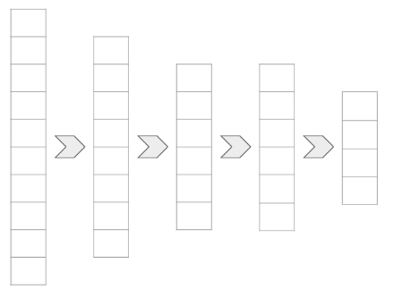
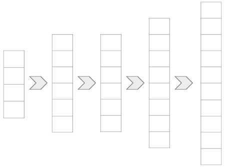

---

marp: true

---

<style>
img[alt~="center"] {
  display: block;
  margin: 0 auto;
}
</style>

# Autoencoders

<!--
In this unit we will learn about autoencoders. Autoencoders are a special application of deep neural networks. We'll also learn about a different way to build models in TensorFlow. So far we've used the `Estimator` API and the Keras `Sequential` API. We'll cover a new form of building models in Keras that makes building autoencoders a little more intuitive.
-->

---

# What Is an Autoencoder?

<!--
First things first, what is an autoencoder? It is a model that learns how to encode data and then decode data.

Let's look at a visualization.
-->

---

# Encoder



<!--
Encoding looks a whole lot like the neural networks that we have already seen, and that's because it is. The encoder is a neural network that starts out with some input data and outputs a smaller form of that data. The encoder can use dense layers, convolutional layers, pooling layers, and more.

The goal of the encoder is to take some form of input data and reduce it down to a smaller representation.

But there has to be some way to know if this smaller representation is useful. We do that with the decoder.

* Image name: res/encoder.png
  * Repo link: https://github.com/google/applied-machine-learning-intensive/tree/master/content/05_deep_learning/03_autoencoders/res/encoder.png
  * Source https://github.com/google/applied-machine-learning-intensive/tree/master/content/05_deep_learning/03_autoencoders/res/encoder.png by Author Google LLC under License Copyright [2020] Google LLC.
-->

---

# Decoder



<!--
As you might expect, the decoder does the opposite of the encoder. The decoder starts with a compressed representation of the data and inflates it back to the original size.

We haven't really seen this before. The networks we have built tend to get narrower as data flows through them. This widening is less common. Sure, we could add wider and wider dense layers in a deep neural network, but it isn't common to see outside of this context.

How do we do this?

* Image name: res/decoder.png
  * Repo link: https://github.com/google/applied-machine-learning-intensive/tree/master/content/05_deep_learning/03_autoencoders/res/decoder.png
  * Source https://github.com/google/applied-machine-learning-intensive/tree/master/content/05_deep_learning/03_autoencoders/res/decoder.png by Author Google LLC under License Copyright [2020] Google LLC.
-->

---

# Decoder: Upsampling

```python
tf.keras.layers.UpSampling2D(
    size=(2, 2)
)
```

```text
conv2d_3 (Conv2D)            (None, 4, 4, 16)          2320      
_________________________________________________________________
up_sampling2d (UpSampling2D) (None, 8, 8, 16)          0      
```

<!--
We use upsampling to add wider dense layers and create the decoder. You can think of upsampling as the reverse of the pooling layers we used in the convolutional neural networks we created for classification. While a pooling layer shrinks its input, the upsampling layer expands its input.

In TensorFlow Keras we'll use the `UpSampling2D` layer to decode our encoded data.

In the example on this slide, you can see a convolutional layer that outputs a 4x4x16 matrix. The upsampling layer doubles the first two dimensions to 8x8x16.
-->

---

# Autoencoder


<!--
What do you get when you mix an encoder and a decoder? An autoencoder!

The encoder finds an efficient representation for the data. The decoder is able to revive some approximation of the original data from the encoded data.

This is "lossy" compression. The output of the model is not typically exactly what was put in, but is hopefully a reasonable approximation.

* Image name: res/autoencoder.png
  * Repo link: https://github.com/google/applied-machine-learning-intensive/tree/master/content/05_deep_learning/03_autoencoders/res/autoencoder.png
  * Source https://github.com/google/applied-machine-learning-intensive/tree/master/content/05_deep_learning/03_autoencoders/res/autoencoder.png by Author Google LLC under License Copyright [2020] Google LLC.
-->

---

# What Are Autoencoders Good For?
* Lossy data compression
* Non-linear principal component analysis
* Cleaning up messy data
* *... and more!*

<!--
Obviously autoencoders are good at lossy data compression. Once trained, the encoder part of the model can be used to compress our input data. The decoder can then later be used to expand that data to a version that is close to the original.

Another application is principal component analysis. If you think about what an autoencoder is doing, it is reducing input data down into the minimal amount of information required to then revive that data. It is finding principal components using a neural network. You can train the model and then use the encoder to reduce the dimensionality of your data before feeding it into another model.

Another interesting application is data cleaning. Autoencoders can be used to remove noise from data. In our lab we'll remove static and watermarks from images. Admittedly, there is some data loss, but it is still an interesting application.
-->

---

# Keras Model

```python
from tensorflow.keras.layers import Conv2D, MaxPool2D, UpSampling2D
from tensorflow.keras.models import Model


input_layer = Input(...)

conv_layer = Conv2D(...)(input_layer)

latent_layer  = MaxPool2D(...)(encoder_conv1)

encoder = Model(input_layer, latent_layer, name='encoder')
```

<!--
You could build an autoencoder with a standard `Sequential` model, but often you'll want to use the encoder and decoder separately. In order to do this, we can use the Keras `Model` class.

In this example we build an input layer and pass it to a convolutional layer, which is then passed to a pooling layer. The input and output layers are then passed to the `Model`.

You might also notice that we called the output of the encoder the "latent layer." This is a common term used to identify the intermediate data representation that is output by the encoder and input to the decoder.
-->

---

# Keras Model

```python
encoder = Model(input_layer, latent_layer, name='encoder')

decoder = Model(latent_layer, output_layer, name='decoder')

autoencoder = Model(
    input_layer,
    decoder(encoder(input_layer)),
    name="autoencoder"
)
```

<!--
To build an autoencoder, you create an encoder and a decoder. The encoder accepts an input layer and outputs a latent layer. The decoder accepts a latent layer and outputs an output layer.

The encoder and decoder are stitched together into a third model, the autoencoder. Notice that the autoencoder accepts the input layer and passes it directly to the encoder. The encoder is the input to the decoder (via the latent layer).

When the autoencoder is trained, the encoder and decoder are also trained and can be used separately.
-->

---

# Your Turn!

<!--
Now it is your turn. In this lab we will walk through examples of using an autoencoder for compression and for removing static. Our exercise will be to remove a watermark from a video.
-->
