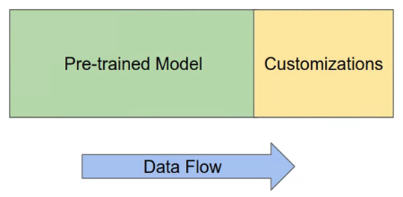
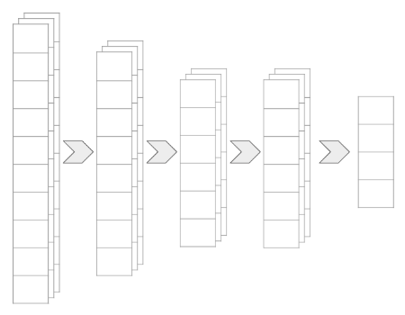
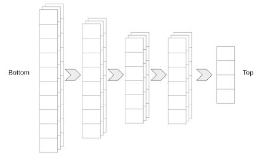
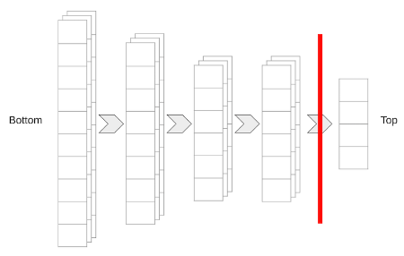

---

marp: true

---

# Transfer Learning

<!--
Most of the models we have trained so far have been trained from scratch. We start with a randomly-weighted model and then use large amounts of data and many, many epochs over that data in order to build a reasonable model.

But is that how we learn?
-->

---

# Transferring Knowledge

<!--
Well, yes and no.

We do indeed learn in self-guided ways by looking at examples. But we also learn through the transfer of knowledge. Others can provide insights that can be used to accelerate our learning process.

* Image name: res/learning.jpg
  * Repo link: https://github.com/google/applied-machine-learning-intensive/tree/master/content/05_deep_learning/04_transfer_learning/res/learning.jpg
  * Source https://www.pexels.com/photo/girls-on-desk-looking-at-notebook-159823/ by Author Pixabay https://www.pexels.com/@pixabay under License https://www.pexels.com/license/.
-->

---

# Transferring Knowledge

<!--
Let's say we already know what a horse, tiger, and penguin are. If we wanted to learn how to identify a zebra, we could look at pictures of zebras. Or, someone might tell us that a zebra is the shape of a horse, has the coat patterns of a tiger, and the colors of a penguin. This would greatly accelerate our ability to identify zebras, even if we only had a handful of pictures of zebras to study.

Transfer learning is a similar idea. A model that can already identify some classes of data can be extended to fit a different problem that we are trying to solve. The base model is already good at finding key features. The new model can utilize this ability and perform better and faster than if it was trained from scratch.

* Image name: res/zebra.jpg
  * Repo link: https://github.com/google/applied-machine-learning-intensive/tree/master/content/05_deep_learning/04_transfer_learning/res/zebra.jpg
  * Source https://www.pexels.com/photo/white-and-black-zebra-standing-on-ground-1916645/ by Author Magda Ehlers https://www.pexels.com/@magda-ehlers-pexels under License https://www.pexels.com/license/.
-->

---

# Transfer Learning

<!--
At a very high level, transfer learning can look a lot like adding an extra few layers to the end of a pre-trained model.

In this diagram the pre-trained model is an existing model that has been trained and performs acceptably well. This model has persisted weights that are packaged and loaded with the model.

The customizations model is a new set of untrained layers. They have random, or at least naive, initial weights. These weights still need to be learned through training.

As you can decipher from the data flow arrow, data typically still enters the model through the pre-trained input layer. However, the output layer of the pre-trained model then feeds the new model. The final output is the output layer of the new model.

* Image name: res/high-level.png
  * Repo link: https://github.com/google/applied-machine-learning-intensive/tree/master/content/05_deep_learning/04_transfer_learning/res/high-level.png
  * Source https://github.com/google/applied-machine-learning-intensive/tree/master/content/05_deep_learning/04_transfer_learning/res/high-level.png by Author Google LLC under License Copyright [2020] Google LLC.
-->

---

# Do You Retrain the Pre-Trained Model?

<!--
This begs the question: Do you re-train the pre-trained model?

The answer is usually "no" but not always. 

If the data you have to train your new model is similar in size or larger than the data used to train the pre-trained model, and if the classes that they identify largely overlap, then it may be worthwhile. Otherwise it is advisable to "freeze" the pre-trained model and not update the weights.

This freezing can be for the whole model or for only a few specific layers. Typically those layers closer to the input layer are frozen.
-->

---

# Output Layer?

<!--
We also need to think about which layer is actually the output layer from a pre-trained model.

In most classification problems, we have multiple layers of high-dimensional matrices. But then at the very end of the model, we flatten the data down to a vector of class-estimates.

We don't want to flatten the data before feeding it to our extended model, so instead we need to use an intermediate high-dimensional layer.

* Image name: res/which-output.png
  * Repo link: https://github.com/google/applied-machine-learning-intensive/tree/master/content/05_deep_learning/04_transfer_learning/res/which-output.png
  * Source https://github.com/google/applied-machine-learning-intensive/tree/master/content/05_deep_learning/04_transfer_learning/res/which-output.png by Author Google LLC under License Copyright [2020] Google LLC.
-->

---

# Bottom/Top

<!--
We need to introduce a little modelling terminology at this point. You sometimes hear about the "bottom" or "top" of a model. Which end is which?

Many papers illustrate models with the input layer at the bottom and the output layer at the top of diagrams. For this reason, culture now dictates that the "bottom" of a model is the input, and the "top" of a model is the output.

* Image name: res/bottom-top.png
  * Repo link: https://github.com/google/applied-machine-learning-intensive/tree/master/content/05_deep_learning/04_transfer_learning/res/bottom-top.png
  * Source https://github.com/google/applied-machine-learning-intensive/tree/master/content/05_deep_learning/04_transfer_learning/res/bottom-top.png by Author Google LLC under License Copyright [2020] Google LLC.
-->

---

# Include Top?

<!--
This terminology is important because some models allow you to choose to include the "top" of the model or not. If you leave out the top, then you get a higher-dimensional input for your custom model, which is typically a good thing.

* Image name: res/new-top.png
  * Repo link: https://github.com/google/applied-machine-learning-intensive/tree/master/content/05_deep_learning/04_transfer_learning/res/new-top.png
  * Source https://github.com/google/applied-machine-learning-intensive/tree/master/content/05_deep_learning/04_transfer_learning/res/new-top.png by Author Google LLC under License Copyright [2020] Google LLC.
-->

---

# Your Turn

<!--
Now we'll attempt a little transfer learning of our own. We'll use MobileNetV2, which can classify 1,000 classes, to build a network that can reliably classify cats and dogs.
-->
