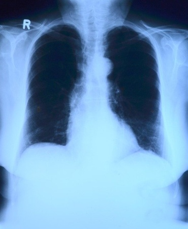

---

marp: true

---

<style>
img[alt~="center"] {
  display: block;
  margin: 0 auto;
}
</style>

# Image Classification Project
## Identifying Pneumonia

<!--
We are nearing the end of the classification track. We've learned quite a bit. In the last few labs we've created binary and multiclass classifiers. We've used scikit-learn and TensorFlow to create various models we then evaluated and tuned.

In this final project, you'll get to show off what you've learned in one large project.
-->

---

# Image Classification Project



<!--
In the lab we'll download a dataset from Kaggle. The dataset contains images of x-rays of patient lungs. Some of the images are classified as having pneumonia, while others are classified as normal.

* Image name: res/x-ray.jpg
  * Repo link: https://github.com/google/applied-machine-learning-intensive/tree/master/content/05_deep_learning/05_image_classification_project/res/x-ray.jpg
  * Source https://pixabay.com/photos/x-ray-image-x-ray-thorax-lung-x-ray-568241/ by Author toubibe https://pixabay.com/users/toubibe-647761/ under License https://pixabay.com/service/license/.
-->

---

# Review

What is convolution? How is it performed and what is the goal? 

<!--
@Exercise(5 minutes) {
Have students discuss convolution. It is a process of passing a filter (kernel) over an image and computing new pixel values. This process involves multiplying the values in the image by those in the filter and adding them up. You need to know the size of your filter and the stride. The goal is to detect features in the image. Remind students that we saw simple kernels that were line detectors. 
}
-->

---

# Review

Describe the general architecture of a convolutional neural network. What knobs can you tune? Think about layers, hyperparameters, etc.

<!--
@Exercise(5 minutes) {
Have students discuss CNNs. In general, there are convolutional layers and pooling layers. Then the information is fed into a typical fully-connected neural network. Changing the number of layers, the order of layers, filter size, stride, pooling size, or other factors can all result in different results. Furthermore, an important choice the user needs to make is which activation function to use. Since this is a binary classification task, it is useful to use the sigmoid function on the final output layer. Relu works well on the other layers. 
}
-->

---

# Image Classification Project: Dataset

```text
chest_xray
     |--> test
             |--> NORMAL
             |--> PNEUMONIA
     |--> train
             |--> NORMAL
             |--> PNEUMONIA
     |--> val
             |--> NORMAL
             |--> PNEUMONIA

```

<!--
The images in the dataset are already divided into test, train, and validation sets. The training set is, of course, used for training your model. The testing dataset should be used to adjust model hyperparameters, shape, etc. Once you have found a model that tests well, check it against the validation dataset. That will serve as one final test for the ability for your model to generalize.
-->

---

# Image Classification Project: Tips

* You probably want to enable GPU.
* Make sure the dataset matches the documentation.

<!--
First tip: enable GPU in Google Colab. This dataset tends to train significantly faster if you enable GPU in the runtime.

Also, perform EDA on your dataset. The dataset may have duplication, undocumented folders, etc.
-->

---

# Your Turn!

<!--
And with that, it is your turn to work on the lab.
-->
