---

marp: true

---

# K Nearest Neighbors

---

# K Nearest Neighbors (KNN)

One of the simplest **supervised** machine learning algorithms, used mostly for classification

[Note: We can also use KNN for regression (example in lab)]

<!--
KNN is one of the simplest supervised machine learning algorithms. It is mostly used for classification, which we'll talk about in this lecture. It can also be used for regression, an example of which can be found in this unit's lab.
-->

---

# Example: Classify as Red or White Wine

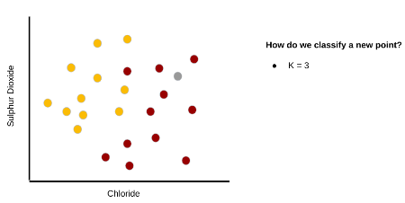

<!--
Let's say we have information about a particular wine's sulphur dioxide and chloride content, and we want to be able to say whether the wine is red or white. Let's approach this problem using KNN.

Consider this graph of sulphur dioxide vs. chloride. Think of the colored dots as our training set. It is labeled, so we know whether each wine in the training set is actually red or white, and the data points are colored accordingly.

Assume we have a new wine for which we know the sulphur dioxide and chloride content (colored in grey). We want to know if it is red or white.

The hyperparameter K denotes how many "neighbors" we should look at. In this example, assume K=3. So we will look at the three nearest neighbors of the grey dot.

* Image name: res/KNN02.png
  * Repo link: https://github.com/google/applied-machine-learning-intensive/tree/master/content/06_other_models/04_knn/res/KNN02.png
  * Source https://github.com/google/applied-machine-learning-intensive/tree/master/content/06_other_models/04_knn/res/KNN02.png by Author Google LLC under License Copyright [2020] Google LLC.
-->

---

# Example: Classify as Red or White Wine

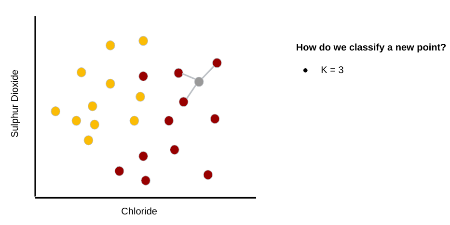

<!--
In this example we use simple Euclidean distance and find the three points in our training set that are nearest to the grey dot.

Note: It is common to use other distance metrics depending on the problem.

* Image name: res/KNN03.png
  * Repo link: https://github.com/google/applied-machine-learning-intensive/tree/master/content/06_other_models/04_knn/res/KNN03.png
  * Source https://github.com/google/applied-machine-learning-intensive/tree/master/content/06_other_models/04_knn/res/KNN03.png by Author Google LLC under License Copyright [2020] Google LLC.
-->

---

# Example: Classify as Red or White Wine

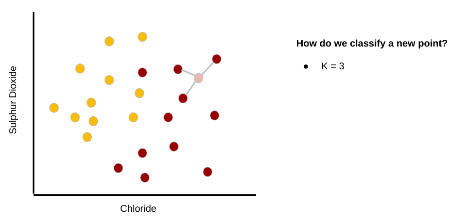

<!--
It is clear that the unknown wine is closest to three red wines. Therefore, we would classify the grey point as red.

* Image name: res/KNN04.png
  * Repo link: https://github.com/google/applied-machine-learning-intensive/tree/master/content/06_other_models/04_knn/res/KNN04.png
  * Source https://github.com/google/applied-machine-learning-intensive/tree/master/content/06_other_models/04_knn/res/KNN04.png by Author Google LLC under License Copyright [2020] Google LLC.
-->

---

# Example: Classify as Red or White Wine

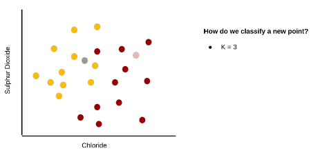

<!--
Let's try another example. Again, K=3.

*Prompt the class*: What about this grey point?

* Image name: res/KNN05.png
  * Repo link: https://github.com/google/applied-machine-learning-intensive/tree/master/content/06_other_models/04_knn/res/KNN05.png
  * Source https://github.com/google/applied-machine-learning-intensive/tree/master/content/06_other_models/04_knn/res/KNN05.png by Author Google LLC under License Copyright [2020] Google LLC.
-->

---

# Example: Classify as Red or White Wine

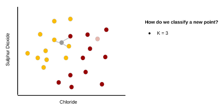

<!--
We see that its three nearest neighbors contain two whites and a red. What should we do?

* Image name: res/KNN06.png
  * Repo link: https://github.com/google/applied-machine-learning-intensive/tree/master/content/06_other_models/04_knn/res/KNN06.png
  * Source https://github.com/google/applied-machine-learning-intensive/tree/master/content/06_other_models/04_knn/res/KNN06.png by Author Google LLC under License Copyright [2020] Google LLC.
-->

---

# Example: Classify as Red or White Wine

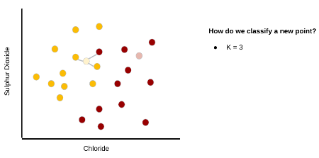

<!--
We can simply take the majority. So we classify this point as white.

* Image name: res/KNN07.png
  * Repo link: https://github.com/google/applied-machine-learning-intensive/tree/master/content/06_other_models/04_knn/res/KNN07.png
  * Source https://github.com/google/applied-machine-learning-intensive/tree/master/content/06_other_models/04_knn/res/KNN07.png by Author Google LLC under License Copyright [2020] Google LLC.
-->

---

# Example: Classify as Red or White Wine

<!--
Finally, we'll do one last example when K=3.

Two of the three nearest neighbors are red.

* Image name: res/KNN08.png
  * Repo link: https://github.com/google/applied-machine-learning-intensive/tree/master/content/06_other_models/04_knn/res/KNN08.png
  * Source https://github.com/google/applied-machine-learning-intensive/tree/master/content/06_other_models/04_knn/res/KNN08.png by Author Google LLC under License Copyright [2020] Google LLC.
-->

---

# Example: Classify as Red or White Wine

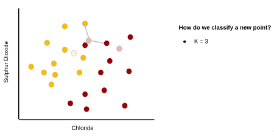

<!--
So we'll classify this one as red.

* Image name: res/KNN09.png
  * Repo link: https://github.com/google/applied-machine-learning-intensive/tree/master/content/06_other_models/04_knn/res/KNN09.png
  * Source https://github.com/google/applied-machine-learning-intensive/tree/master/content/06_other_models/04_knn/res/KNN09.png by Author Google LLC under License Copyright [2020] Google LLC.
-->

---

# Example: Classify as Red or White Wine

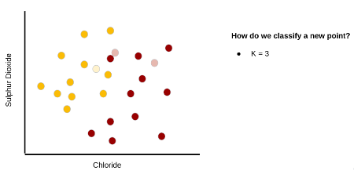

<!--
That looks pretty good!

* Image name: res/KNN10.png
  * Repo link: https://github.com/google/applied-machine-learning-intensive/tree/master/content/06_other_models/04_knn/res/KNN10.png
  * Source https://github.com/google/applied-machine-learning-intensive/tree/master/content/06_other_models/04_knn/res/KNN10.png by Author Google LLC under License Copyright [2020] Google LLC.
-->

---

# Example: Classify as Red or White Wine

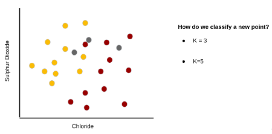

<!--
Let's run through the same example with the same data points, but we'll change the hyperparameter, K. This time K=5.

* Image name: res/KNN11.png
  * Repo link: https://github.com/google/applied-machine-learning-intensive/tree/master/content/06_other_models/04_knn/res/KNN11.png
  * Source https://github.com/google/applied-machine-learning-intensive/tree/master/content/06_other_models/04_knn/res/KNN11.png by Author Google LLC under License Copyright [2020] Google LLC.
-->

---

# Example: Classify as Red or White Wine

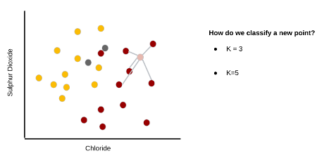

<!--
We see that the five nearest neighbors for the first data point are all red, so we classify it as red.

* Image name: res/KNN12.png
  * Repo link: https://github.com/google/applied-machine-learning-intensive/tree/master/content/06_other_models/04_knn/res/KNN12.png
  * Source https://github.com/google/applied-machine-learning-intensive/tree/master/content/06_other_models/04_knn/res/KNN12.png by Author Google LLC under License Copyright [2020] Google LLC.
-->

---

# Example: Classify as Red or White Wine

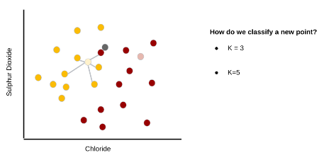

<!--
We see that four of the five nearest neighbors of the second data point are white, so we classify it as white.

* Image name: res/KNN13.png
  * Repo link: https://github.com/google/applied-machine-learning-intensive/tree/master/content/06_other_models/04_knn/res/KNN13.png
  * Source https://github.com/google/applied-machine-learning-intensive/tree/master/content/06_other_models/04_knn/res/KNN13.png by Author Google LLC under License Copyright [2020] Google LLC.
-->

---

# Example: Classify as Red or White Wine

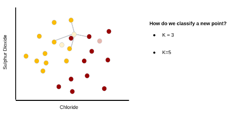

<!--
We see that three of the five nearest neighbors of the third data point are white, so we classify it as white.

* Image name: res/KNN14.png
  * Repo link: https://github.com/google/applied-machine-learning-intensive/tree/master/content/06_other_models/04_knn/res/KNN14.png
  * Source https://github.com/google/applied-machine-learning-intensive/tree/master/content/06_other_models/04_knn/res/KNN14.png by Author Google LLC under License Copyright [2020] Google LLC.
-->

---

# Example: Classify as Red or White Wine

<!--
Interesting! We classified the third data point as red wine when K was 3, but as white wine when K was 5.

* Image name: res/KNN15.png
  * Repo link: https://github.com/google/applied-machine-learning-intensive/tree/master/content/06_other_models/04_knn/res/KNN15.png
  * Source https://github.com/google/applied-machine-learning-intensive/tree/master/content/06_other_models/04_knn/res/KNN15.png by Author Google LLC under License Copyright [2020] Google LLC.
-->

---

# How Do We choose K?

* Small K -> noise has a higher influence
* Large K -> computationally expensive

<!--
There is a balance when choosing K. If we choose K to be very small, say K=3, then outliers in our dataset may have a stronger influence over how we classify new points (i.e., noise has a strong influence). If we choose K too large, then it can be computationally expensive to find the K nearest neighbors every time we want to classify a new data point.

Another thing to think about is the parity of K. For example, what may happen if we choose an even K for a binary classification problem? We may find that there is a tie (e.g., two red and two white in the four nearest neighbors of a new data point). But an even K isn't always bad. What if we had three classes: cat, dog, and pig? If we choose K=3, then we could end up with one cat, one dog, and one pig in the three nearest neighbors.

-->

---

# How Do We choose K?

* Small K -> noise has a higher influence
* Large K -> computationally expensive

**SOME OPTIONS**:
* Let K = sqrt(m) (where m is the sample size)
* Try K=1, 2, 3, 4, 5, …. with multi training/testing compare F1, accuracy, etc.
* Try different K and use cross-validation 
* Use a clustering algorithm 
* And more!

<!--
Here are a few of the common ways to choose K.
-->

---

# Distance

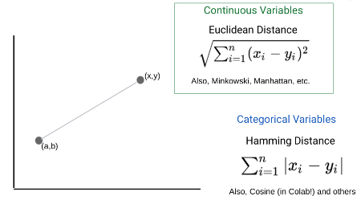

<!--
Here are a couple of different distance metrics you can use.

The choice is usually dependent on the type of feature variables you have. If your features are continuous, then you may use the Euclidean distance (or Minkowski, or Manhattan). If your features are categorical, then a Hamming distance would be preferred (or cosine).

* Image name: res/KNN16.png
  * Repo link: https://github.com/google/applied-machine-learning-intensive/tree/master/content/06_other_models/04_knn/res/KNN16.png
  * Source https://github.com/google/applied-machine-learning-intensive/tree/master/content/06_other_models/04_knn/res/KNN16.png by Author Google LLC under License Copyright [2020] Google LLC.
-->

---

# When to Use KNN?

KNN is a “lazy learner” algorithm. It doesn’t learn a function from the training set (no generalization until query is made).

Use when:
* Dataset is relatively small
* Dataset is relatively noise-free

<!--
KNN doesn't learn a decision-making function from the training data. Instead, the algorithm is run each time we want to classify a new data point.
-->

---

# Your Turn!

<!--
Let's take a look at the lab.
-->
