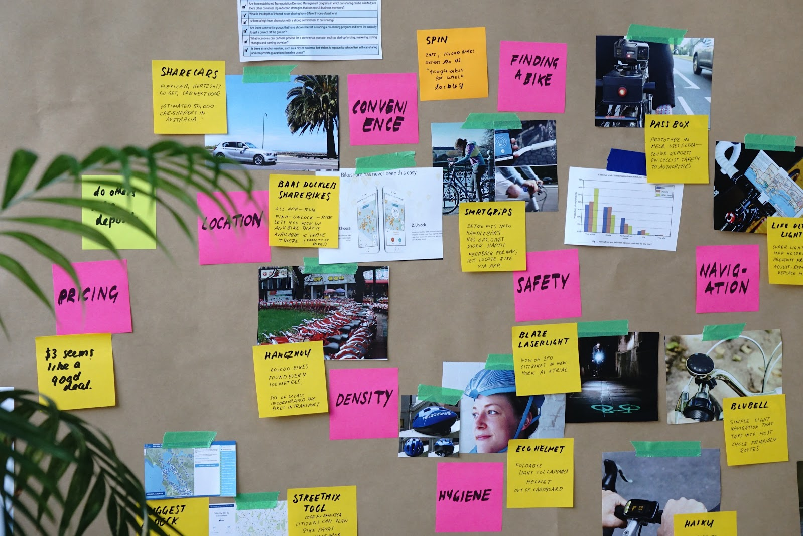

---

marp: true

---

# Final Project Ideation

<!--
Now that we've discussed the goals, expectations, timeline, and deliverables for our capstone project, let's brainstorm what topics or questions we may want to explore as the focus of the project.
-->

---

# Brainstorming

<!--
We’ll do two rounds of brainstorming. The first is very general, capturing as many ideas as possible. The second will be more specific, helping us narrow in on our exact idea.

Everyone will write down individual ideas for the final project. Then we will discuss as a group all the ideas that people came up with. It might be helpful at that time to start grouping similar ideas, considering feasibility, and getting slightly more detailed. Then each of you will "pitch" your favorite idea. After that the most-liked ideas will become the project topics, and we'll form groups. 

Image Details:
* [projectideation01.jpg](https://pixabay.com/photos/thought-idea-innovation-imagination-2123970/): Pixabay License
-->

---

# Brainstorming

1.  Defer judgment
1.  Encourage wild ideas
1.  Build on the ideas of others
1.  Stay focused on the topic
1.  One idea and one conversation at a time
1.  Be visual
1.  Go for quantity

<!--
We will take five minutes to write down as many ideas as possible about goals/questions/topics for your capstone project. 

In order to have a fun and productive exercise, we all need to agree on some norms:
* Brainstorming should be completely judgement free.
* Crazy ideas are more than welcome! Even if it's infeasible that they'd get accomplished in the next few weeks, they may inspire other great and more realistic ideas. So write down EVERY idea. No matter how well-thought out it is. 
* Each idea gets its own post-it note. We want to ensure every idea gets its fair shake. 
* Let's have one conversation and share one idea at a time, so people don't get spoken over or have their ideas minimized.
* Feel free to make your ideas visual, with a drawing instead of text. 

Can you think of any other norms we should all agree upon before diving into the initial phase?

*Pass out markers and post-it notes. Set a timer for three minutes.* 
-->

---

# Group Ideas by Theme

<!--
Now we'll share out our ideas. Once everyone has shared, we'll start to group the ideas together by theme.

*Ask students to come up and share their ideas, one by one, sticking their post-it notes on the whiteboard. Make sure there’s a large, clean area devoted to this activity. If your classroom is very large, you may consider asking all students to get up and gather around the whiteboard, so it’s easier to hear each other and so it’s more dynamic. Make sure to enforce the “one conversation at a time" rule so students feel heard. Anyone can start, and others should jump in and share similar ideas or build on the ideas of one another. As they share out, ask them to start roughly clustering similar ideas, if possible.*

*After everyone shares their ideas, give them 10 minutes to group the ideas by theme. Encourage them to create or revise clusters and use markers to identify each cluster.*

Image Details:
* [projectideation02.jpg](https://unsplash.com/photos/bjemWZcNF34): Unsplash License
-->

---

# Narrow Your Problem and Brainstorm Again

## How Might We...?

1. Pick an idea or problem that's been presented so far today.
1. Write a sentence that considers what project you could take on to address that idea. 
1. Begin the sentence with, "How might we..."

<!--
Now it’s time to narrow down a problem and brainstorm a project idea. Everyone take a new post-it and write down ONE idea or problem that has been presented so far today. It doesn't need to be one that you originally came up with. 

Now we'll work on brainstorming how to frame a project around this idea. For example, suppose one of the ideas was “identify skin cancer,” which was grouped in the “healthcare” cluster. One might frame this problem as “How might we use machine learning to identify photos of skin cancer?” or yet “How might we make it easier for people to detect skin cancer early?” This can then eventually become the idea for a mobile app that allows you to take pictures or moles or skin tags, and get a confidence interval of how likely that is to be skin cancer. (This is actually a past project done by a previous student in this course.)

Everyone should have the problem statement written down on a post-it note in front of them (one for each student, as this portion is also individual). 

*Then, set the timer for another five minutes and ask them to come up with ways to frame solutions to that problem. It’s important to stay focused on the problem that they wrote down and not get distracted by other ideas. They will use these ideas to create a pitch. The best ideas will be selected, and we will only form groups at the very end.

The next step we'll take is pitching your idea.
-->

---

# Pitch

The **WHO**
* Always start by introducing yourself.

The **WHAT**
* Describe your idea.
* Tell people what makes your idea stand out from other, maybe similar, ideas.

The **WHY**
* What’s the value proposition of your idea? Why should people consider working on this idea?
* Why is this a challenging yet feasible project that will be enjoyable to work on? 

<!--
Now you will pitch your idea to the class. Each person will have two minutes to convey their idea and convince others to consider working on it as their capstone project. A pitch must have:

- Who: In one or two sentences, describe who you are with a focus on what makes you qualified to propose the project you’re proposing. 
- What: This is the meat of the pitch. Describe your idea in one sentence.
- Why: This is all about the value proposition. What are you adding, what are users getting they wouldn’t get otherwise? How will “what you’re pitching” achieve the value proposition. What is the reason for you to be offering them this value proposition. What are your reasons? Why should others care?
-->

---

# Create Your Pitch

<!--
You will have 15 minutes and a piece of flip-chart paper to create your two-minute pitch and then share with the class. The who/what/why should be clearly stated on each paper, including your name. Feel free to use text but also drawings and visual representations if you'd like. 

Image Details:
 * [projectideation05.png](https://pixabay.com/vectors/pixel-cells-idea-visualization-3976295/): Pixabay License
-->

---

# Pitch

Time to pitch!

<!--

*Each pitch is two minutes. Assign a person to keep time. Assign someone to put the posters up after each presentation. The posters should be clustered by themes, so try to put all posters of healthcare related ideas on one wall or corner and all posters with education related ideas on another, etc.
-->

---

# Finalizing Project Ideas

<!--
Everyone take out a piece of paper and rank order the top five ideas that you're interested in. 

*After every student has ranked their top five ideas, the instructional team will collect the votes. It is then up to the instructional team how to choose the final project topics and form the groups. Many of the pitches may have been for similar projects and it may be easy to form groups that way. The instructional team may also consider running a simple optimization scheme using the students' rankings to maximize overall happiness of the class. This is left to the discretion of the instructor, as they know the projects on the table, the students in the room, and the class dynamics.*
-->

