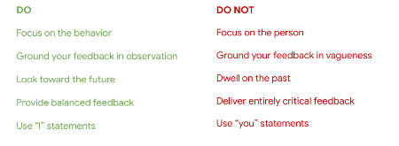
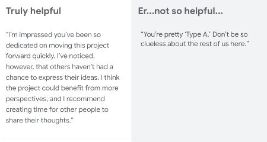
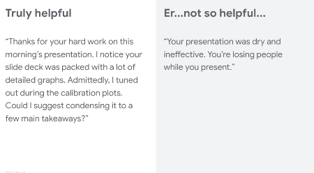
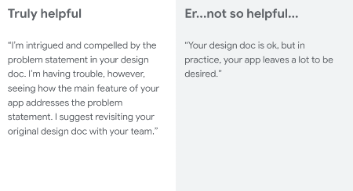

---

marp: true

---

# Career Development: Giving and Receiving Feedback

<!--
Today we’ll discuss two absolutely critical professional skills: giving and receiving feedback. 

*Give 1-2 anecdotes or reasons why giving and receiving feedback are important skills to develop.*

It can be challenging to both give and receive feedback well, and there is always room for improvement. When you leave this session you won’t be an expert on either (I’m certainly not!), but you’ll have a broader understanding of why particular kinds of feedback are likely to have their desired effect and why others are not. I hope you’ll also leave with some helpful suggestions for more effectively receiving feedback, no matter who it comes from.

I’d also like to mention that giving and receiving feedback can be emotional and feel personal at times. This session will be most meaningful if you share your perspectives and questions. What’s shared within this group should stay within this group.

Integrating the tips from this session will help you make the most of academic and professional work.

But first, please take the notecard on your desk and a pen or pencil.
-->

---

# Warm-up: Describe a Time When...

… you received feedback from someone on how to improve at something, and it felt good.

<!--
Take the notecard in front of you and take two minutes to jot down some thoughts on the prompt: describe a time when you received feedback from someone on how to improve at something, and it felt good. 

*Ask for volunteers: What made it feel good?*

Clearly there are ways to suggest improvements that are well-received and can lead to meaningful change.
-->

---

# Warm-up: Describe a Time When...

… you received feedback from someone on how to improve at something, and it felt bad or was not helpful.

<!--
Turn the notecard over and take two minutes to jot down some thoughts on this next prompt: describe a time when you received feedback from someone on how to improve at something, and it felt bad or was not helpful.

*Ask for volunteers: What made it feel bad or made it unhelpful?*

Clearly there are ways people deliver feedback that cause the receiver to ignore the feedback, shut down, and/or lose some faith in them as a colleague, boss, or peer. Sometimes *how* someone says something can make a tremendous difference in whether or not the person welcomes and integrates the feedback.
-->

---

# Agenda

* Developing a growth mindset  
* Best practices for giving feedback
* Receiving feedback effectively
* Feedback exercise

<!--
We’ll start by discussing growth mindset, and then we’ll dive into best practices for both giving and receiving feedback in constructive ways. We’ll close by putting these to use with some practice.
-->

---

# Developing a Growth Mindset

* Growth mindset vs. fixed mindset 
* Shift the focus from a fixed mindset of “being good” to a growth mindset of “getting better”
* When possible, give feedback on the process, not the outcome

<!--Before we even get to talking about giving and receiving feedback, let’s ground this conversation in an important scientific concept related to feedback: growth mindset. 
-->

---

# Growth vs. Fixed Mindset

**Growth mindset:**

* "Failure is an opportunity to grow."
* "I can learn to do anything I want."
* "Challenges help me to grow."
* "My effort and attitude determine my abilities."
* "Feedback is constructive."
* "I am inspired by the success of others."
* "I like to try new things."

.

{column.}

**Fixed mindset:**

* "Failure is the limit of my abilities."
* "I'm either good at it or I'm not."
* "My abilities are unchanging."
* "I can either do it or I can't."
* "My potential is predetermined."
* "I don't like to be challenged."
* "When I'm frustrated, I give up."
* "Feedback and criticism are personal."
* "I stick to what I know."

.

<!--
These are the differences between growth mindset and fixed mindset. If someone has a growth mindset, they think their talents and abilities can be improved through working hard and seeking to grow in a particular area. This view sparks a desire to learn and the buoyancy to persist when challenged. The opposite is a fixed mindset. In a fixed mindset, people think their intelligence and talents are fixed traits, or characteristics they were born with. People with a fixed mindset are likely to believe innate talents alone create success and concern themselves with what they’re good at instead of developing skills to improve. 

Significant research supports the assertion that we are capable of growing our intelligence and skills much like we’re capable of growing and building physical muscles in our body. Teams that operate with a growth mindset work better together, have open discussions, and feel they can surface disagreements in a safe space. Teams that work with a fixed mindset are often anxious about how their ideas would be received and worried about being judged as either smart or dumb.
-->

---

# Best Practices for Giving Feedback

<!--
Here are some best practices for giving feedback. How you deliver the feedback can depend on the situation and the person on the receiving end, but these are generally helpful guidelines to keep in mind when delivering feedback.

Are there other best practices you can think of?

Image Details:
* [feedback02.png](https://opensource.google/docs/copyright/): Copyright Google
-->

---

<!--
Let’s apply those best practices to some examples. What’s the difference between the two pieces of feedback shown here? 

Truly helpful: “I” statement, behavior- and observation-focused, balanced, looking toward the future
Er...not so helpful…: person-focused, vague, unkind, entirely critical, “you” statements

Image Details:
* [feedback03.png](https://opensource.google/docs/copyright/): Copyright Google
-->

---

<!--
What about this one? What’s the difference between the two pieces of feedback shown here? 

Truly helpful: “I” statement, behavior- and observation-focused, balanced, looking toward the future
Er...not so helpful…: person-focused, vague, unkind, entirely critical, “you” statements

Image Details:
* [feedback04.png](https://opensource.google/docs/copyright/): Copyright Google
-->

---

<!--
Here’s a last example. What do you think? 

Truly helpful: “I” statement, behavior- and observation-focused, balanced, looking toward the future
Er...not so helpful…: person-focused, vague, unkind, entirely critical, “you” statements

Image Details:
* [feedback05.png](https://opensource.google/docs/copyright/): Copyright Google
-->

---

# Your Turn!

Imagine you’re working with a fellow student on a research project that involves emailing professors to ask them to fill out a survey about their professional paths. Your teammate’s email template includes several run-on sentences and sentences with comma splices instead of accurate punctuation.

**Turn to the person next to you.
One of you share a helpful piece of feedback for the teammate. The other share unhelpful feedback.**

<!--

*Ask a student to read the first paragraph.*

Now turn to the person next to you or find a partner sitting elsewhere. One of you share a HELPFUL piece of feedback for this teammate. The other person share an UNHELPFUL piece of feedback. We’ll gather back together and share some examples in 2-3 minutes.

Ok, let’s go over some examples! Who wants to share?

*Point out where students have applied specific elements to helpful and unhelpful feedback to their responses.*
--> 

---

# Giving Feedback Recap

* Kind {.big}
* Helpful {.big}
* Specific {.big}
* Forward-focused {.big}
* Observation-based {.big}

<!--
To summarize, good constructive feedback is kind, specific, helpful, forward-focused, and observation-based. It doesn’t dwell on the past, it’s not all negative, and it doesn’t focus on the person.
-->

---

# Receive Feedback Effectively

* Feedback is a gift; the alternative is silence
* It’s natural to get defensive, shut down, or extrapolate when receiving feedback
    * Know your tendencies
    * Try to respond in constructive, healthy ways
* Work to separate the feedback from the person providing it

<!--
It’s not always easy to be open to constructive feedback, and that’ll probably be the understatement of the day. 

What do you find difficult about receiving critical feedback? 

* One way to become more open to developmental feedback is to think of feedback as a gift. Feedback is a way for people to show investment in you. The alternative is silence. If people (family members, roommates, or colleagues) were not interested in seeing you reach your potential in some way, they could always say nothing when you could be doing better - or when you’re doing great. Feedback very often derives from someone wanting to see you succeed or improve at something. It’s best to think of it that way. Be grateful as best as you’re able and say thank you.
* Also, many of us can get defensive or shut down when receiving feedback. Sometimes we extrapolate from a small piece of feedback and assume we are not good or incapable of improving at something. For example, the advertising executive quoted in the prep article you read said when he heard his boss make an offhand joke about his lack of professionalism, he said he was flooded with shame and “all his failings rush to mind, as if he were Googling ‘things wrong with me’ and getting 1.2 million hits, with sponsored ads from his father and his ex. In this state it’s hard to see the feedback at ‘actual size.’” But now that Michael understands his standard operating procedure, he’s able to make better choices about where to go from there. He said he’s now able to reassure himself that he’s exaggerating, and usually after he sleeps on it, he’s in a better place to figure out whether there’s something he can learn. He’s learned what he needs to do to appropriately and constructively ingest and make use of the feedback given to him.
* Another tip is to work to separate the feedback from the person giving it. If the feedback is on target and the advice is wise, it shouldn’t matter who’s delivering it. But it does. Often our feelings about the feedback giver (or how, when, where he delivered the comments) can override the feedback itself. It’s best to attempt to view feedback on its own. You don’t have to apply every piece of feedback you receive, but it would be foolish to rule out a good piece of advice because of some grievance regarding the person giving it.

Source: https://hbr.org/2014/01/find-the-coaching-in-criticism
-->

---

# Some Helpful Frames for Responding to Feedback:

* *“Thank you for the feedback.”*
* *“I appreciate your suggestion. Thank you for taking time to make it.”*
* *“To clarify my understanding… [ask question about feedback]..?”*
* *“Thank you. I’d like to think about what you’ve shared with me before I respond. Could I get 10-15 minutes with you tomorrow after I’ve had some time to think this over?”*
* *“I value your feedback and hadn’t thought of it that way. Thank you.”*
* … don’t forget that you can ask for feedback and should! 

<!--
Here are some helpful frames for how to receive feedback in the moment. 

If you know you tend to get defensive or shut down when receiving critical feedback, sometimes it’s best to ask for time to digest before responding. If the person giving the feedback is your boss, this can be especially wise, as it’s important to preserve your relationship with that person and not say things you’ll regret. Granted, this extra time isn’t always possible. But if you're able to receive your yearly performance review in writing the day before you meet with your boss, why not ask for it?

Don’t forget to ask for feedback! As you read in the HBR article, research shows people who explicitly seek critical feedback tend to get higher performance ratings. This is probably because someone who’s asking for coaching is likely to take what is said and genuinely improve. Asking for feedback also communicates you have humility, respect, a desire to achieve, and confidence.

Can you think of a time you’ve asked for constructive feedback preemptively?
-->

---

# Feedback Exercise

Think of one personal or academic situation where you’d like some feedback or advice, taking 1-2 sentences to describe.  

* For **8 minutes**, go around and talk to as many people as you can, in pairs.
    * Person A: “My situation is…< one or two sentences>.  How can I do better?”
    * Person B: Offer one bit of feedback.  Focus on the future, not on the past.
    * Person A listens to the idea without judging, shake hands, say thank you.
    * Find a new partner. Repeat!

<!--
Let’s put this into practice!

*Ask student to read the on-screen directions.*

This is meant to be a fun exercise with an easy-to-describe example. I might say, “My situation is that I take forever to put my clothes away after doing laundry. How can I do better?” or “I munch on snacks right before dinner, a very bad habit. How can I do better?” or “I often let personal emails slip deep into my inbox before I’m able to respond, and then I can’t find them. How do I do better?” The point is to proactively ask for feedback from others to benefit our own personal growth. Feedback should be constructive, forward-thinking, and kind. Remember, we’re looking ahead. It’s not, “what have I been doing wrong?” It’s “how can I do better?” Take eight minutes starting now.
-->

---

# Feedback Exercise Debrief

* What was this experience like? 
* Can you give me one word to describe it?

<!--
How many of you heard at least one piece of feedback that you liked and might want to try? What was this experience like in one word?

The most common word that comes up is “fun." It's not painful, not uncomfortable or embarrassing. The most common word students say is fun because it shows good ideas can come from everyone around you. They don’t have to be an expert. Focusing on the future feels good. There’s no need to nitpick ideas from others. Just listen and take what you think is useful.
-->

# Looking Ahead

* Our capabilities are not fixed. We’re always growing if we work to improve.
* Feedback is a gift.
* Good feedback is kind, helpful, specific, forward-focused, and observation-based.
* Ask, “How can I do better?” Not, “What have I been doing wrong?”
* *insert opportunities for feedback, if relevant*

<!--
Let’s recap what we’ve gone over today.

*Ask 1-4 students to read the on-screen summary points. If there are forthcoming opportunities for students to practice giving and/or receiving feedback, list them on this slide and mention them here.
-->

---

# Questions?

Questions or comments?

<!--
Thank you all so much for participating today and for your willingness to engage with this important topic. What remaining questions or comments do you have?
-->

---
