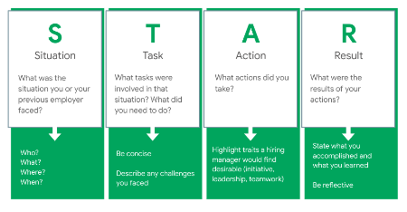
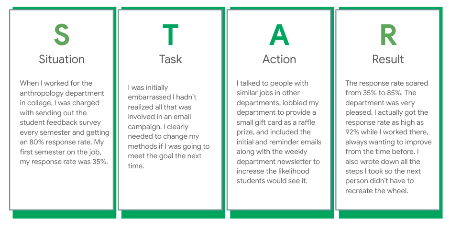
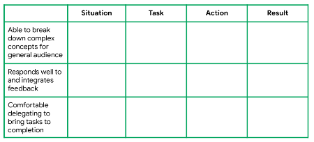

---

marp: true

---

# Career Development: Preparing for Interviews

<!--
Today we’ll go over a basic overview of interview preparation and the differences between behavioral and technical interviews, both of which you’re likely to face as you job search. Technical interviews can be a very stressful experience for students starting their technical careers and seasoned professionals alike. These interviews should be stressful and require significant preparation, as you can be asked questions from a range of topics. Behavioral interviews also require preparation, but with the helpful framework we give you today, hopefully they will become manageable. And as with most things, both get easier with practice. Let’s dig in. 
-->

---

# Agenda

* Interview prep essentials
* Technical vs. behavioral interviews
* Technical interview basics & tips
* Behavioral interview basics & tips
* Q&A

<!--
We’ll start by going over some general best practices for interviewing for any full-time role. Then we’ll get on the same page about the differences between behavioral and technical interviews and go over tips for both. Then we’ll discuss the types of questions you’re likely to be asked in data science/machine learning-related technical interviews and some common behavioral interview questions. We’ll close out with Q&A.
-->

---

# Interview Prep Essentials

* Before → 
  * Research company’s history, mission, and the job description fully.
  * Come prepared with 2-3 things you like about the opportunity.
  * Be able to clearly articulate why you’re a good fit.
* During → 
  * Dress up! Even if the work place is casual, dress a notch above that.
  * Shake hands, make eye contact, skew answers toward the positive.
  * You are also evaluating the company. Think, is this a place you want to work?
* After → 
  * Thank your interviewer(s).
  * Send a same-day thank you email that’s tailored to the interview.
  
<!--
First, it’s extremely important to come prepared to an interview having researched the company, its history, the role, and why you’re a good fit for the position. It’s possible that you don’t meet all the requirements they’re looking for the role; this is common! But you can stand out as an especially desirable candidate by being passionate about the organization and the work it’s doing. 

Always dress up for an interview. Don’t take a guess about whether or not a workplace is casual. If the recruiter or interviewer tells you in advance of the interview that attire is casual, still wear business casual to the interview. If the workplace is NOT casual, definitely wear business attire - a business suit. 

Additionally, while they are evaluating your skills and fit for the role, interviews are a time for you to evaluate if this is a place you want to work.  

Much like in your work with recruiters, show gratitude to your interviewers. Thank them during the interview and then in a same-day thank you email that mentions something you specifically enjoyed about the interview and that excites you about the role or the company. Sometimes you may not have access to the interviewer’s contact information. In that case, you should forward personalized thank you emails to your recruiter or whomever set up your interviews and ask them to pass your notes along. It’s important to remember that some interviewers could be your future boss, but other interviewers can be employees at the company whose job involves interviewing from time to time. It’s because people make time for that in their work that you’re able to interview in a timely way, so it’s important to show appreciation for their time. 
-->

---

# Behavioral Interviews vs. Technical Interviews 

## What’s the difference?

<!--
What do you think? What’s the difference between a behavioral and a technical interview?
-->

---

# Technical vs. Behavioral Interviews

**Technical interviews assess:**

* Role-specific technical knowledge
* Problem-solving abilities
* How you think
* Communication skills
* How you get to your answer

Prevalent with employers hiring for engineering, science, and IT roles

<!--
Technical interviews assess your technical knowledge for a given role, your problem-solving abilities, and what the process of getting to your answer entailed. Your skills are on display in real time.
-->

---

# Technical vs. Behavioral Interviews

**Behavioral interviews assess:**

* Likelihood of future behavior based on past behavior
* How you’ve responded in specific situations
* The measurable skills and value you brought to those situations

Prevalent with employers hiring for any role

<!--
Behavioral interviews, on the other hand, assess your likelihood of future behavior based on past behavior. The interviewer wants to know how you’ve responded in specific situations and the measurable skills you’ve brought to those situations. Behavioral interview questions often start with, “Tell me about a time when....” or “Describe a time when…”

Note that many interviews may involve both technical and behavioral questions.
-->

---

# Technical Interview Basics

There are five types of technical interview questions you’re likely to encounter:

1.  Estimation questions
1.  Knowledge questions
1.  Probability questions
1. Coding questions
1. Open-ended questions

<!--
Now let’s get into the basics of technical interviews. Technical interviews vary depending on the kind of technical work you’ll be asked to do in the job. For technical roles related to data science and machine learning, you’re likely going to see questions of these five types: 

1.) Estimation: These kinds of questions used to be popular in high tech in the late 90's and have still not completely died out. They are significantly less common than they used to be though. Examples include, “Why are manhole covers round?” “What numbers would you put on each face of 2 D6s to represent dates?” These questions don't really give a valuable signal to the employer. 

2.) Knowledge: Knowledge questions can include anything within the field that you're applying to and have been studying. Throughout this program we’ve tried to cover the topics that are likely to come up in the interview. It’s worth reviewing the list of topics that have been covered in the course. 

3.) Probability: The interviewer is also likely to assess your knowledge of probability. This might be rolled into one of the other questions (e.g., coding or open-ended) but could be a separate question as well. 

4.) Coding: There are likely to be coding questions as well. If you have a CS degree, check out the Cracking the Coding interview book and use it to practice. If you don't, you're still likely to get a coding question but hopefully one that is tailored to your abilities. Whatever question you get, this is definitely a place to practice active listening. Make sure you understand the question, ask clarifying questions, verify sample inputs and outputs. Also, coding on a whiteboard is weird and you need to practice it. And once you're done writing the code, you're not done. Verify that it works as intended by doing careful testing.

5.) Open-ended: Open-ended questions are often last because they can shrink or expand to fit the time that is left. They sound like knowledge questions but don't have a single quick answer, and it's more about the discussion that ensues than getting the “right” answer.
-->

---

# Technical Interview Example Questions

Below is an example of each kind of technical question you’re likely to see:

1.  **Estimation**: How many ping pong balls does it take to fill a 747 airplane?
1.  **Knowledge**: What is selection bias? Why does it matter?
1.  **Probability**: There is a research on two medical cures: A, B. 200 people tried the cure A, it helped 110 people and did not help 90 people. 210 people tried the cure B, it helped 120 people and did not help 90 people. Compute success percentages for each drug.
1.  **Coding**: Reverse all the words in a string of words while preserving the word order and spacing.
1.  **Open-ended**: Is it better to have too many false negatives or too many false positives?

<!--
Here’s an example of each of these kinds of technical questions. Estimation questions, as stated previously, are not commonly used anymore.

Next is knowledge questions. Knowledge questions might include, “What is selection bias? Why does it matter” or “What is linear regression?”

Third is probability questions. This is just one example. Other questions may include something like Bertrand’s box paradox or Penney’s game.

Fourth is coding. You could be presented with a lot of different coding questions. Again, Cracking the Coding Interview is a great resource for technical interview prep.

Fifth is open-ended. These are often reserved for the end of an interview because they can shrink and expand to meet the time that’s left in the interview. 
-->

---

# Technical Interview Tips

* They typically last for 45-50 minutes 
  * Review the fundamentals 
* Ask your recruiter how you’ll be coding.
  * Whiteboard on video?
  * Phone and with a shared document?
* The interviewer is not a judge; they are your advocate.
* Engage in active listening throughout your interview.
  * Ask questions.
  * Verbalize your thought process.
  * Justify and vocalize your assumptions.
  * Listen carefully. Are they giving you hints or providing directives?
* There are usually multiple correct answers. Take time to think and choose carefully.

<!--
First, interviews are not like school work. They're not like the work you’re doing in this program. They're not even like the work you're going to be doing with these employers. Therefore, you really need to prepare for them. 

Second, the interviewer is not a judge. Think of them as your advocate. Can't guarantee that you won't get an interviewer who's trying to trick you, but in most cases they are trying to help you.

Remember that you're not just being evaluated; you're also evaluating the company. That doesn't mean you can ask questions for 20 minutes in a 45 minute interview, but come prepared with a few questions and take note of aspects of the application and interview process that reflect a workplace culture you'd want to join or not want to join.

Listen to your interviewer. Questions can sound similar, so make sure you understand what you're being asked to do. Ask questions to clarify the problem and verbalize your thought process. It’s better to say something wrong than to say nothing. Make sure you’re justifying (and vocalizing) your assumptions.

Last, there are usually multiple correct answers. Take the time to think. Pick carefully.
-->

---

# Behavioral Interview Example Questions

* Describe a situation that required you to consider a different perspective when exploring an issue.
* Describe a project that required input from people at different levels in the organization.
* Tell me about a time you went above and beyond the call of duty to get things done. 
* Tell me about two improvements you have made in the last six months.
* Tell me about a time that you took the lead on a difficult project.
* Describe a time when you found it difficult to work with someone from a different background.
* Describe a time when you anticipated potential problems and developed preventive measures.
* Tell me about a time when you had to analyze information and make a recommendation.

<!--
Now let’s transition into behavioral interviews. Remember that in behavioral interviews, employers are assessing your likelihood of future behavior based on past behavior. How have you responded in specific situations that will help employers to know how you’ll respond in future, similar situations?

Here are some sample behavioral interview questions they may use to help do that. Can you think of some others you’ve heard? 

As you can see, there are a lot of different directions you could take your answers to these questions. The best way to prepare for behavioral interviews is to have a bank of stories lined up that align with the role’s expectations and required/preferred qualifications. You might be wondering how to create that bank of stories, which is what we’ll discuss in the next two slides.
-->

---

# Behavioral Interview Basics: STAR Method

<!--
The best way to approach creating a bank of behavioral interview stories is to follow the STAR method. Take a few moments to read this slide over before we get started. [Provide students 1-2 minutes of silence to read the slide.]

The STAR method is a tried and true technique for preparing for behavioral interviews and successfully answering behavioral interview questions. In the 1-2 minutes in which you’re responding to a behavioral interview question, you should format your answer using the STAR method: describe the situation, the task or tasks, the actions you took, and the result. Remember, most behavioral interview questions start with “Tell me about a time when…” or “Describe a time when…” so interviewers are explicitly looking for you to tell a true story about your past academic or professional experiences. Practicing your stories in this order and keeping this framework in your head will help you deliver more effective, organized answers in interviews. 

Let’s look at an example.

* Image name: res/interviewprep01.png
  * Repo link: https://github.com/google/applied-machine-learning-intensive/blob/master/content/xx_career_development/06_preparing_for_interviews/res/interviewprep01.png
  * Source: https://github.com/google/applied-machine-learning-intensive/blob/master/content/xx_career_development/06_preparing_for_interviews/res/interviewprep01.png by Author Google LLC under License Copyright [2020] Google LLC.
-->

---

# Behavioral Interview Basics: STAR Method

Tell me about a time you didn’t meet a goal and how you handled it.

<!--
Here’s an example that will hopefully bring the STAR method to life a bit. Tell me about a time you didn’t meet a goal and how you handled it.

Could I get a few volunteers to read this STAR method example please? [Have four students read each of the different parts of the STAR example, beginning with the Situation.]

What stands out to you here? What has the interviewee done well? 
[Ask for student contributions and respond to each. Things to point out: gave appropriate background information in the Situation, quantified the situation and the result to show impact and provide specifics, showed initiative, displayed humility, continued improving even after meeting the goal, etc.]

What questions do you have looking at this example or about the STAR method generally? 
[Ask for student contributions and respond to each.]

* Image name: res/interviewprep02.png
  * Repo link: https://github.com/google/applied-machine-learning-intensive/blob/master/content/xx_career_development/06_preparing_for_interviews/res/interviewprep02.png
  * Source: https://github.com/google/applied-machine-learning-intensive/blob/master/content/xx_career_development/06_preparing_for_interviews/res/interviewprep02.png by Author Google LLC under License Copyright [2020] Google LLC.
--> 

---

# Behavioral Interview Basics: STAR Method Example

<!--
As you prepare for behavioral interviews, it might be helpful to set up a table like this to prepare for behavioral interview questions. After you write out these different stories according to the STAR method, use this sheet to practice saying them aloud. 

* Image name: res/interviewprep03.png
  * Repo link: https://github.com/google/applied-machine-learning-intensive/blob/master/content/xx_career_development/06_preparing_for_interviews/res/interviewprep03.png
  * Source: https://github.com/google/applied-machine-learning-intensive/blob/master/content/xx_career_development/06_preparing_for_interviews/res/interviewprep03.png by Author Google LLC under License Copyright [2020] Google LLC.
-->

---

# Recap

* Interviews require preparation. Prep for technical and behavioral questions and research the company and position.
* Engage in active listening throughout your interview.
  * Ask questions.
  * Verbalize your thought process.
  * Justify and vocalize your assumptions.
  * Listen closely for hints or additional information
* You’re also evaluating the employer. Come prepared with questions about the company.
* Use the STAR method to create a bank of behavioral stories that reflect what the position requires.

<!--
Let’s recap! Please don’t forget that interviews require a lot of preparation. They are not like school work. They're not like the work you’re doing in this course. They're not even like the work you're going to be doing with an employer. Therefore, you really need to prepare for them. 

Remember that you're not just being evaluated; you're also evaluating the company. Both before, during, and after the interview, you should pay attention to what’s a good fit for you at this company and for this role, and what may not be.

Listen to your interviewer. Questions can sound similar, so make sure you understand what you're being asked to do. Ask questions to clarify the problem and verbalize your thought process. It’s better to say something wrong than to say nothing. Make sure you’re justifying (and vocalizing) your assumptions.

Last, take some time to create a bank of STAR method stories. Your examples can be from internships, volunteer work, extracurriculars, school work, or jobs. Making a list of these stories and practicing them will help you think and answer more quickly, completely, and effectively in your behavioral interviews. 
-->

---

# Questions?

<!--
Thank you all so much for participating! What questions do you have?
-->

