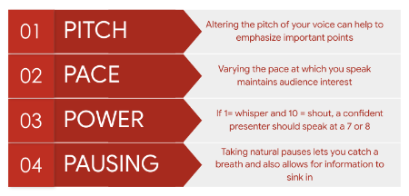
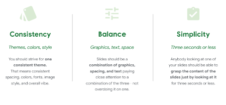

---

marp: true

---

# Career Development: Presenting with Confidence

<!--
Today we’re talking about everyone’s favorite topic: public speaking. That was my attempt at a joke. I'm sure some of you enjoy public speaking and maybe others avoid it like the plague. 

Presenting with confidence is a critical skill, though. Your career will hopefully provide opportunities to give presentations to your team, at professional conferences, and/or in academic settings. Being an effective presenter gives you credibility and visibility across all of those environments. Furthermore, hard work can be overlooked or under-appreciated if presenters don’t convey their ideas and work products in clear, understandable, and compelling ways.

*Share any anecdote or personal story about why presenting with confidence is such an important skill.*

But being a strong presenter takes time to learn and practice. So I hope no matter where you are in your experience with presenting with confidence, you can take a few tips and some extra experience from today’s session.
-->

---

# Agenda

* Formula for a Successful Presentation
  * Content + Delivery
  * The 4 P’s
  * Creating the Visual
  * Habits to Avoid
* Activity + Practice
  * Values Activity
  * Practice Presenting Confidently
  * Feedback
* Q&A

<!--
We’ll start by going over what makes a successful presentation: content, delivery, creating helpful visuals, and avoiding certain presentation pitfalls. Then we’ll do a brief activity and practice presenting with confidence. We’ll close with feedback and Q&A.
-->

---

# Content + Delivery = Success

## What you say and how you say it

<!--
The two main components of giving a presentation are the content (what you say) and the delivery (how you say it).
-->

---

# Content: Go From Good to Great!

* Know your audience
* Tell a story
* Make your ideas flow in an organized fashion
* Summarize main points

<!--
First let's discuss content, which is everything you say, display, or show in your presentation. 

No matter what information you’re sharing, it’s important you tailor it to your audience. If the information you’re presenting to a non-technical or mixed audience is too technical or not well-explained, your audience is likely to tune out. Increase the likelihood that your presentation will be engaging and well-received by tailoring your slide design, verbiage, and content to them.

Second, using examples is a great way to tell a story that keeps your audience engaged. People remember how stories illuminated a particular point better than they will if just the point is presented.

Third, try to maintain a logical progression of ideas, keeping in mind the main purpose of the presentation. When possible, provide an agenda. With long presentations, it’s a good idea to benchmark your progress or potentially create different sections so the audience knows where you are in the presentation. 

Finally, it’s important to summarize the main points of your presentation at the end of any presentation and throughout different sections if the presentation is 30 or more minutes.
-->

---

# Delivery: The Four Ps of Presenting 

<!--
Next up is delivery, or, how you get the content across to your audience.

Pitch or ‘musicality’ has to do with the note with which we pitch a word or phrase. Steering away from a monotone and varying your pitch when appropriate grabs attention and emphasizes what you want to express. It also helps convey the urgency or novelty of what you’re saying. 

Pace is the speed at which you talk. Pace can also be helpful to drive emphasis. For instance, when you want to highlight an important point, slow down and speak distinctly.

Next is power. Regardless of whether you speak quietly or loudly in day-to-day conversation, being able to project your voice while presenting is a clear sign of confidence. It is impossible to ‘whisper’ and still be heard.

Pausing allows you time to think, and it can be effectively used to create anticipation. Sometimes silence can get people’s attention more than speaking. It also allows sufficient time for an audience to fully absorb your message.

Which of these is something you think your presentation skills should improve on? Or what do you feel like you do well?

Image Details:
* [presentconfidence02.png](https://opensource.google/docs/copyright/): Copyright Google
-->

---

# Content, Delivery, Creation:

<!--
Now that we’ve covered what makes up a strong presentation, let’s go over some suggestions for how to achieve it. These are some general rules of thumb when making any presentation.

It’s important that your slides, tone, and overall presentation are consistent.

A presentation should be a simple representation of pieces of information. It only acts as a visual aid to the broader story, project, or conversation. Therefore, the key points in this deck would be explained verbally in a presentation rather than all piled onto a slide.

For all slides, apply the 3-second rule. People should be able to glean the point you're trying to convey on a slide within three seconds or less.

Image Details
* [presentconfidence03.png](https://opensource.google/docs/copyright/): Copyright Google
-->

---

# Tips

Avoid these common habits
* Not practicing
* Not recording practice
* Using filler words
* Fidgeting
* Avoiding eye contact or engagement
* Rushing

<!--
These are common presentation quirks that usually stem from nervousness or lack of preparedness. It’s important to be aware and try to avoid them, as they can detract from the impact of your presentation.

First, know your content, and do not read directly from the slides. Even if you feel you know your content well, practicing is essential. You may pick up on a slide or order that needs revising.

Record yourself when you practice so you can see what the audience will see. Look for ways to improve. Were there any awkward transitions? Did something not make sense?

Avoid using comfort/filler words like “um, like, y’know.” This is often subconscious. We don’t always realize when or how often we use fillers, which is another great reason to record yourself practicing.

Fidgeting, like touching your hair, fiddling with your clothes, etc., is very distracting for the audience. Some people roll up a piece of paper or pull on their work badge. Work on it if you know you have something like that.

A key part of presenting with confidence is engaging with your audience. You don’t want to exclude them from the presentation by avoiding eye contact or looking at the floor. Rotate who you make eye contact with to help keep people engaged. Ask them questions, and engage them in what you’re doing.

Don’t speed through your presentation. Your audience wants to hear what you have to say, and it is more inclusive of different kinds of learners and people with varying levels of English language acquisition to speak clearly and not too fast.

Which of these do you fall victim to? 
-->

---

# Recap

* Consider your audience, be organized, tell a story
* 4 Ps of persuasive presenting: Pitch. Pace. Power. Pausing.
* Be consistent with theme, colors, fonts, spacing, style
* 3-second rule of slide development
* Use eye contact and engage your audience with questions
* Record your practice 

<!--
Take a moment to read over some main points thus far. Also, here’s me putting to use the suggestion to recap for the audience!

What questions or comments do you have about the content we’ve covered so far? 
-->

---

# Activity + Practice 

<!--
Let’s do a brief activity and then put these presentation suggestions into practice!

[Pass out list of values handout.]
-->

---

# Activity 

* Read the list of values in front of you
* Underline the 10 values that resonate with you most
* Star five of those 10 values that are most important to you *
* Finally, circle two of those five values that feel like your most core values, those you can’t separate yourself from 

---

**Activity** {.big}

<!--

*Ensure students have the values handout.*

Take a moment to read over the list of values in front of you. When you’re done, underline the 10 values that resonate with you most.

Looking at this list of 10, star the five values that are most important to you.

Now, this part might be the most difficult, but the final task here is to circle two of those five values that are your core values. You may find that some of the other values that resonate with you fall under those two. Think of these values as the ones you hold yourself to in your everyday behavior and future planning, the values you aspire to embody - maybe so much so that you do so unconsciously. 

*Allow students one minute to find those two values.*

Why two values, you may ask? Researcher, public speaker, social worker, and famous author Brene Brown writes extensively about the importance of determining your two core values. If we have too many, they lose meaning and we aren’t able to hold ourselves to them. The two values that feel inextricably intertwined with who you are as a person are those two values.

*Facilitator should feel free to share their own two values here.*

Does anyone want to share what 1 or 2 of their values are? 
-->

---

# Practice 

* Pick a partner
* Take 3-4 minutes to prepare a 1½ -2 minute presentation on this prompt:
  * What are the two values that are most important to you?
* Take 6 minutes to present to one another and give feedback
  * 3 minutes each 
  * 1½ - 2 minutes to present
  * 1 minute of feedback
* Let’s not film it for now, so your partner can be fully present
* Share one strength and one area of improvement for your partner after they present
    * Remember, helpful feedback is clear, specific, kind, future-focused, and starts with “I”

<!--
Now, we’re going to share these values in a brief presentation to a partner. (We’ll also revisit these values in our next career development session, so don’t forget what you chose!)

*Ask a student to read the instructions aloud.*

Questions before we get started? 
-->

---

**Practice** {.big}

* Introduce yourself and your topic
  * Hello, my name is ____ and today I’ll be talking about ____.
* What do you want your audience to know?
  * Main Point 1 - support with evidence, data, or story
  * Main Point 2 - support with evidence, data, or story
* Conclude
  * Emphasize the most important points
  * Thank the audience for their time
 
 <!--
Here’s one way you can structure your presentation, but feel free to be creative. Note that this isn’t a likely a place for data, but I wanted to include it as a method of supporting a main point.

*If desired, the facilitator can share an example presentation before releasing students.*

*Flip back to previous slide so those instructions are displayed for students as they work. Give students 10 minutes total for this entire exercise, letting them know when they should transition from preparing the presentations to giving them and switching between partners.*
-->

---

# Any Volunteers?

<!--

*After students have presented to their partners and given and received feedback, ask if anyone would like to present to the class. Thank students who volunteer. Move on to closing if no one volunteers or if running short on time.*

What was this experience like for you? Which of the best practices we went over were difficult to apply? What did you or your partner do particularly well? What would you work to improve if you gave this presentation again?
-->

---

# Q&A

<!--
Thank you all so much for engaging in this session and sharing about yourselves in these presentations. 

As I mentioned in the beginning of this presentation, becoming a presenter takes time and involves significant, frequent practice. I hope you’ve taken something from today’s session that you can apply to your project presentations and other presentations you give in the future. What remaining questions do you have?
-->

---
