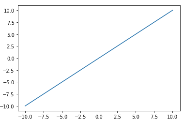
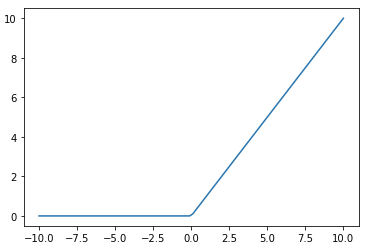
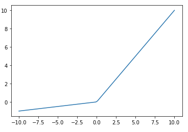
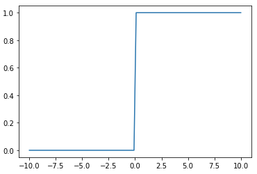
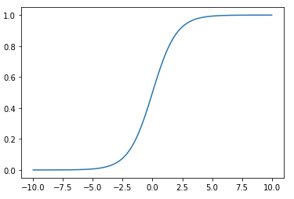
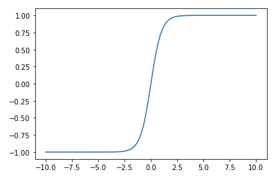

---

marp: true

---

# Activation Functions

<!--

Activation functions are a core component of neural networks. Choosing a "good" activation function, or a "bad" one for that matter, can have a big impact on the performance and training
time of your network.

-->

---

# What Is Being "Activated"?

$$a = activation(bias + \sum_{i=0}^{n}{w_{i}x_i})$$

<!--
Recall that neural networks are inspired by neurons in the brain. The idea is that when one neuron fires, it signals to other neurons that it's time to fire. 

If you think about an artificial neural network, it is a series of layers. Each of these layers contains one or
more nodes. The layers operate one at a time, feeding data from the top of the model through to the
outputs. Our goal is to decide if, and with how much intensity, a particular node "fires."

A node in layer n, receives input data from every node layer n-1 (the previous layer). Each piece of incoming information, $x_{i}$, is multiplied by a particular weight, $w_{i}$. Then we sum them all together along with the node's trained bias to create an output. Given this output value we now want to determine if this node "fires" (i.e., is activated), and that is what the activation function does. Thus, we feed the output sum from the current node into the activation function to determine the activation level of our current node. Then this value is fed into the nodes in the next layer. 

-->

---

# Types of Activation Functions

<!--
There are many different types of activation functions, and which function you choose depends on your use case. 

Let's take a look at some of the more commonly seen activation functions.

[Resource](https://en.wikipedia.org/wiki/Activation_function#Comparison_of_activation_functions)

-->

---

# Linear (Identity Function)

<!--
The most basic activation function is the linear activation function. This function takes the sum of inputs and bias, does nothing to it, and hands the result to the next layer of the network.

That's a pretty simple activation function to understand. But what value does it provide?

This function can be useful, especially in your output layer, if you want your model to predict large or negative values. Many of the activation functions we'll see greatly restrict the range of values that they output. The linear activation function does not restrict its output range at all. Any real number can be produced by a node with this activation function.

* Image name: res/linear.png
  * Repo link: https://github.com/google/applied-machine-learning-intensive/tree/master/content/xx_misc/activation_functions/res/linear.png
  * Source https://github.com/google/applied-machine-learning-intensive/tree/master/content/xx_misc/activation_functions/res/linear.png by Author Google LLC under License Copyright [2020] Google LLC.
-->

---

# Rectified Linear Unit (ReLU)

<!--
There is another linear activation function that turns out to be quite useful: the Rectified Linear Unit (ReLU).

If the input value is positive or zero, then ReLU acts like the identity function. If the input value is negative, then ReLU returns zero.

This is also a quite simple activation, but it turns out to be quite useful in practice. Many powerful neural networks utilize ReLU activation, at least in part. It has the advantage of making training very fast; however, nodes using ReLU do run the risk of "dying" during the training process. The nodes die when they get to a state where they always produce a zero output. Think of this as neurons that can no longer fire, so we have lost the benefit of having them in the model to begin with. 

Let's also think about the use of a ReLU node in a network. If the output layer consists of ReLU values, then the output of the network will be from 0 to infinity.

This works fine for models that predict positive values, but what if your model is predicting celsius temperatures in Antarctica or some other potentially negative value?

In this case you would need to adjust the target training data to all be positive, say, by adding 100 to it. Then do the reverse to the output of the model by subtracting 100 from each value.

You'll find that you'll need to do this type of adjustment quite often when building models. Understanding your activation functions, especially in your output layer, is critically important. When you know the range of values that your model can produce you can adjust your training data to fall within that range.

* Image name: res/relu.png
  * Repo link: https://github.com/google/applied-machine-learning-intensive/tree/master/content/xx_misc/activation_functions/res/relu.png
  * Source https://github.com/google/applied-machine-learning-intensive/tree/master/content/xx_misc/activation_functions/res/relu.png by Author Google LLC under License Copyright [2020] Google LLC.
-->

---

# Leaky ReLU

<!--
We talked about dead nodes when discussing the ReLU activation function. One strategy that helps mitigate the dead node issue is a "leaky" ReLU. Leaky ReLUs are ReLU functions that again act as the identity on any value zero or greater. But for values less than zero they apply an alpha value to them and return the result. The idea is that the magnitude of any negative numbers is rather small but not necessarily zero, which helps us avoid dead nodes.

* Image name: res/leaky_relu.png
  * Repo link: https://github.com/google/applied-machine-learning-intensive/tree/master/content/xx_misc/activation_functions/res/leaky_relu.png
  * Source https://github.com/google/applied-machine-learning-intensive/tree/master/content/xx_misc/activation_functions/res/leaky_relu.png by Author Google LLC under License Copyright [2020] Google LLC.
-->

---

# Binary Step

<!--
The binary step activation function serves as an on/off switch for a node. This function returns zero if its input is on one side of a threshold and returns one if the input is on the other side of the threshold. 

At the output layer this function can be useful when you need to make a yes/no decision and don't care about the confidence of the model in that decision. In other words, this can be useful for binary classification. 

* Image name: res/binary_step.png
  * Repo link: https://github.com/google/applied-machine-learning-intensive/tree/master/content/xx_misc/activation_functions/res/binary_step.png
  * Source https://github.com/google/applied-machine-learning-intensive/tree/master/content/xx_misc/activation_functions/res/binary_step.png by Author Google LLC under License Copyright [2020] Google LLC.
-->

---

# Sigmoid

<!--
Activation functions can also be non-linear. The sigmoid function works using a logistic curve.

You'll notice that the sigmoid function restricts its output range to $(0.0, 1.0)$. This is typically not a concern in hidden layers, but needs to be considered in the output layer. 

Sigmoid activation functions are very useful when making binary classification decisions. You can build a model that outputs values from $(0.0, 1.0)$ and treat the output as a confidence that the input is a 1. For example, suppose you're building a model to decide whether or not an image is a cat. If you use a sigmoid in the final layer and receive a 0.2, then we could say, "We are 20% confident the image is a cat." That's not very confident, so we'd likely classify it as a 0 (or not a cat). If we received a 0.9 form the model, then we'd say it's very likely to be a cat. 

During training, you would experiment to determine a threshold for which you will classify samples as 0 or 1. The most natural choice is to say if the model returns 0.5 or above, we'll call it a cat. Otherwise it's not a cat. But that may or may not be the best threshold. Before making this decision you'd need to experiment, find the precision and recall for different thresholds, and choose the one that fits your use case the best.

* Image name: res/sigmoid.png
  * Repo link: https://github.com/google/applied-machine-learning-intensive/tree/master/content/xx_misc/activation_functions/res/sigmoid.png
  * Source https://github.com/google/applied-machine-learning-intensive/tree/master/content/xx_misc/activation_functions/res/sigmoid.png by Author Google LLC under License Copyright [2020] Google LLC.
-->

---

# Hyperbolic Tangent (tanh)

<!--
Similar to sigmoid, the hyperbolic tangent, [tanh](https://www.tensorflow.org/api_docs/python/tf/keras/activations/tanh) is a non-linear activation function that can be used in your models. The biggest difference between sigmoid and tanh is that tanh has an output range of $(-1.0, 1.0)$.

* Image name: res/tanh.png
  * Repo link: https://github.com/google/applied-machine-learning-intensive/tree/master/content/xx_misc/activation_functions/res/tanh.png
  * Source https://github.com/google/applied-machine-learning-intensive/tree/master/content/xx_misc/activation_functions/res/tanh.png by Author Google LLC under License Copyright [2020] Google LLC.
-->

---

# Softmax

<!--
So far all of the activation functions that we have seen operate without knowing anything about other nodes in their layer. Each node accepts input from the layer before it and passes output to the next layer in the model. The node is unaware of any other node in its own layer, and activation functions on the nodes work independently.

Softmax is a different type of activation function. Softmax is aware of nodes in the same layer and adjusts their outputs in relation to each other.

Softmax outputs values in the range of  [0.0,1.0]. If you were to sum the outputs of every node in a layer, the sum would always equal 1.0, or something very very close to 1.0.

Let's say that we had a model that tried to determine if an image contained an apple, orange, or grapefruit. If given a picture of a bright red apple, it might output [1.0, 0.0, 0.0] to show that it was highly confident that the image contained an apple. If given a picture of a yellow apple it might be a little less confident and output [0.8, 0.15, 0.05], indicating a little less confidence. If given a picture of a large orange it might output [0.05, 0.55, 0.4], showing that it was having a tough time making a decision.

It is worth noting that softmax is typically not used in hidden layers of a model. Most of the time you will see it used on the output layer.
-->

---

# Keras

<!--
These are just a few of the activation functions you can use. Some are already developed for you in Keras. See [here](https://keras.io/api/layers/activation_layers/) for more on how Keras uses activation functions in its neural nets.

-->

---

# Your Turn

<!--
Now let's look at the lab, where you will practice using some of these activation functions. 
-->
