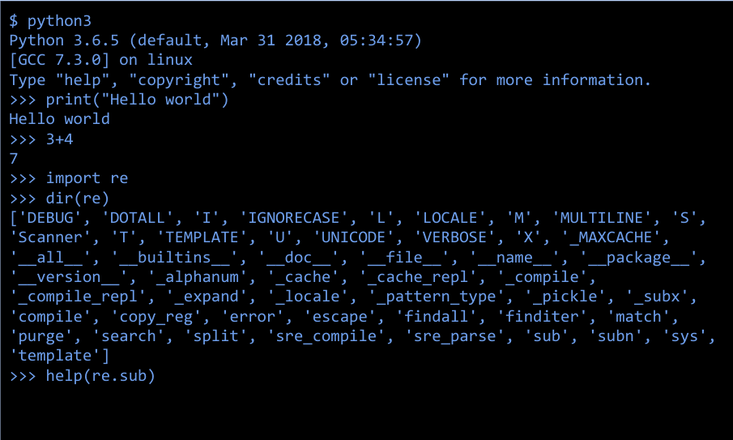
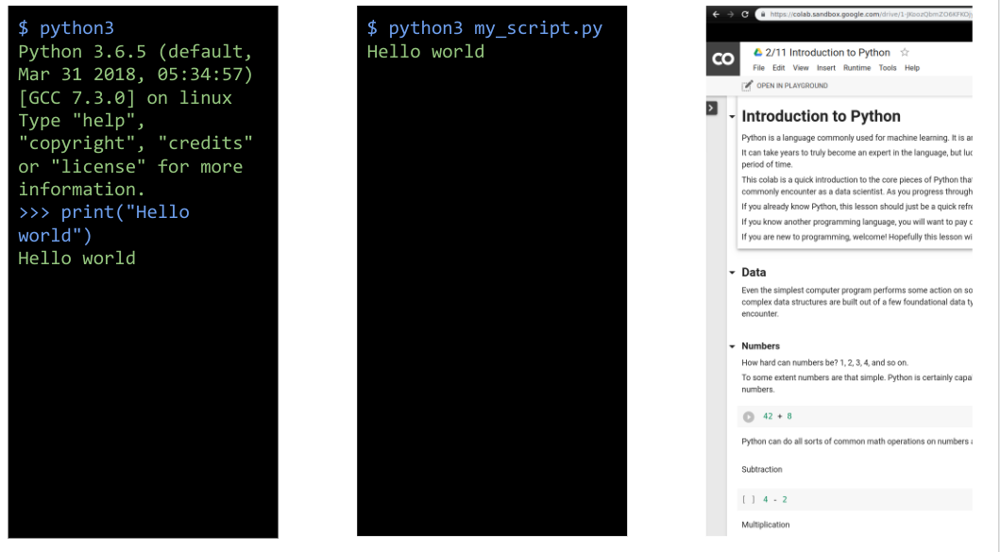
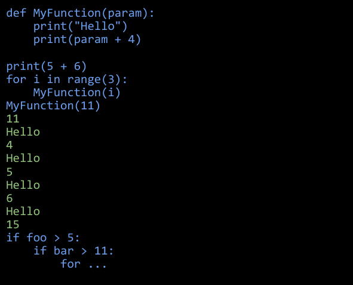
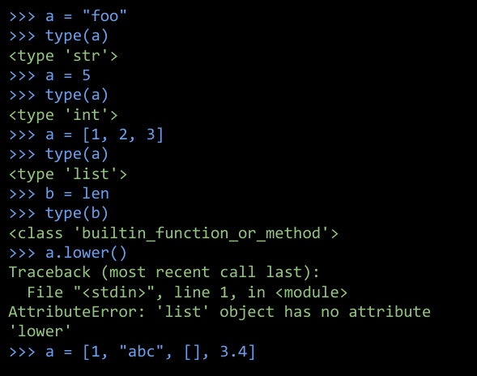
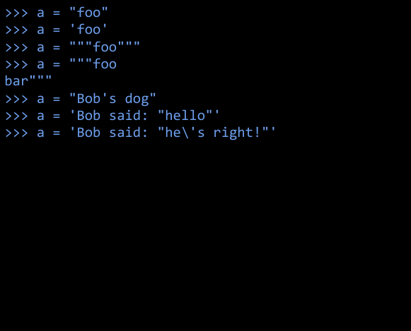
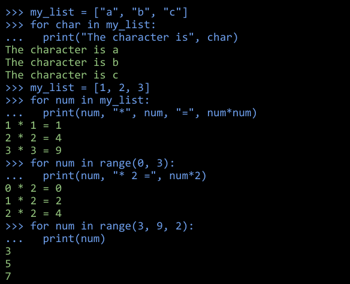
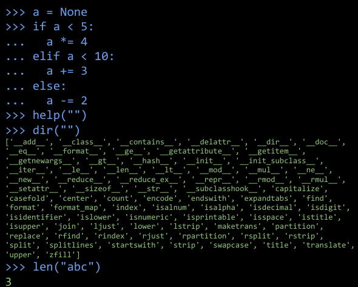

# Introduction to Python

---

# "Python is an interpreted, high-level, general-purpose programming language."

<!--
Source: Wikipedia
-->

---

<!--
* "Interpreted" means portability, ease of use (no compiling), and that the code can be run interactively.
* "High-level" means closer to human languages and further from machine languages.
* "General-purpose" means it can be used for anything, including creating web apps (e.g. YouTube), small scripts (e.g. automatically renaming photos based on data from the camera), machine learning, data visualization, and much more.

One of Python's powers is that it has many built-in libraries and many more third-party libraries to give it specialized abilities. We'll explore many of these specialized libraries over the course of this program.

Image Details:
* [introtopython1.png](http://www.google.com): Copyright Google
-->

---

# Python3

There are multiple versions of Python in the world:

* 1.x is long gone.
* 2.x is deprecated, and support will soon stop. But there's still a lot of code and code samples out there that use it.
* Because it's the modern version and how all new code should be written, we'll focus on Python3.

When looking at Python reference docs, look for the version number in the URL.
-->

---

<!--
There are multiple ways to run Python:
* You can open the interactive interpreter and type arbitrary code.
* You can run a Python file and all the code inside will get executed.
* You can run cells full of Python code in a notebook environment like Colab or Jupyter.
* If you're in a notebook, you can run all the cells in order (recommended), but you can also choose to run individual cells, which might lead to unexpected results.

Image Details:
* [introtopython4.png](http://www.google.com): Copyright Google
-->

---

# White Space Matters

* 2- or 4-space indents are used to delineate code blocks instead of `{}`.
* Tabs can be used, too, but should not be mixed with spaces. (We recommend just using spaces.)
* Indents can be nested to arbitrary depths.

<!--
In practice, indentation makes it hard to have long functions with several levels of nesting. That's actually a good thing, as it encourages using decomposition (breaking code into smaller functions) instead.
-->

---

# Variables Are Dynamically Typed

* This applies to function parameters, too.
* Interpreter will not help you catch mistyped variables.
* It's only when you try to do an operation for another type that the error will manifest itself.
* Avoid changing the type of a variable.

<!--
Image Details:
* [introtopython6.png](http://www.google.com): Copyright Google
-->

---

# String Are Defined With ', ", ''', and """

* Avoid triple-single quotes where possible.
* There is no `char` type. When you want to deal with characters, just use single-character strings.
* Strings are immutable.

<!--
Image Details:
* [introtopython7.png](http://www.google.com): Copyright Google
-->

---

# `for` Loops Always Loop Over Iterables (lists, tuples etc.)

* `for` is great for linearly processing lists and tuples.
* Looping over numbers requires creating a list of numbers. The `range` function makes that pretty easy.

<!--
Image Details:
* [introtopython8.png](http://www.google.com): Copyright Google
-->

---

# Python Fast Facts

* There is no `NULL`, it's `None`.
* `else if` is shortened to `elif`.
* Don't forget the colon at the end of your `for` loops, `while` loops, `if` statements, and function definitions.
* Use `help(some_object)` to get the man page.
* Use `dir(some_object)` to see its content (including methods).
* Use `len` to get the length of many objects (strings, lists, dictionaries, etc.).

<!--
Image Details:
* [introtopython9.png](http://www.google.com): Copyright Google
-->
