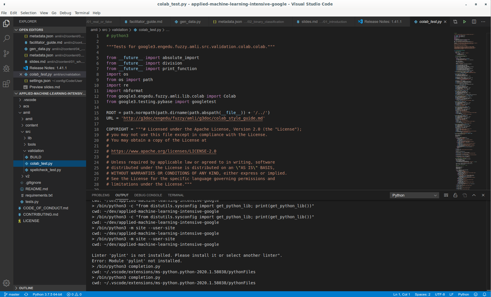
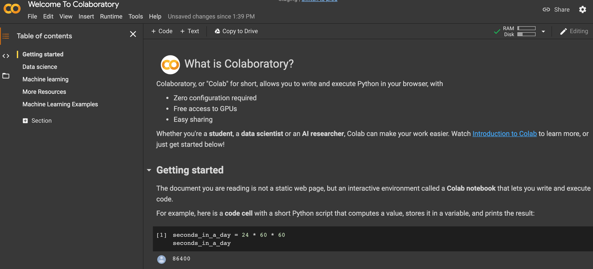
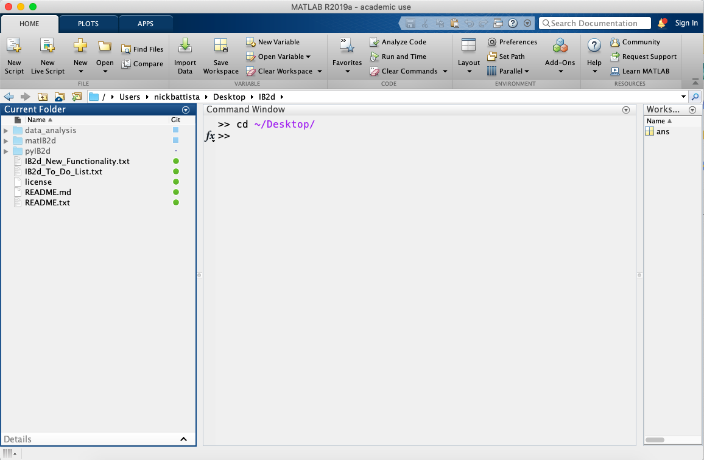
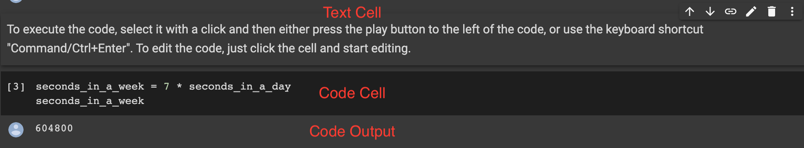
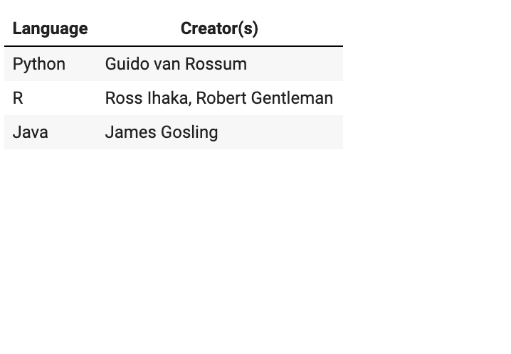
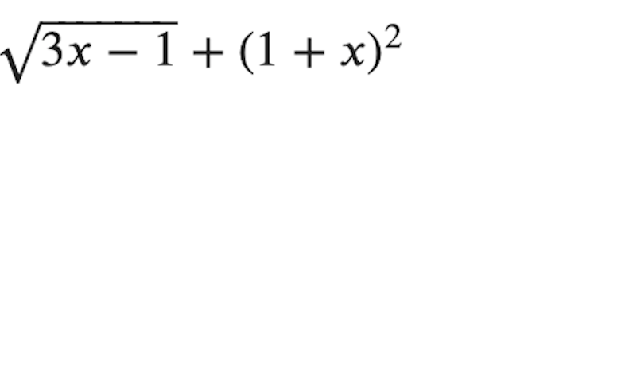

# Introduction to Colab


<!--
We have talked about machine learning and data science in the abstract. 
Now it's time to actually start applying our skills. To do this, we will 
need some sort of development environment. There are a plethora of options in this space.

Source: Google Copyright
-->

---

# Traditional Development Environments



<!--
Many data scientists choose to use a traditional development environment for
their work. These editors range in complexity from a text editor like Notepad on
Windows through large, integrated development environments such PyCharm.

With these environments, it is often necessary to install extra software to
support your data science work.

You'll likely find that data scientists with backgrounds in traditional
programming are comfortable in these environments since they have likely already
had experience with them.

These development environments are also useful for developing code supported by
unit tests and code that will be packaged and deployed on server systems.

Source: Google Copyright
-->

---

# Notebooks

 

<!--
Notebooks are another option that you will see regularly, and they are the
primary coding environment for this course.

When someone mentions a data science notebook, they are typically
referring to a Jupyter Notebook.

Jupyter Notebooks combine code, output, and supporting documentation in a single
structured document. The document can be executed, modified, and iterated on.

Though you'll see many Jupyter notebooks that contain Python code, they aren't
limited to Python. Jupyter supports many different 'kernels,' which allow users a
wide variety of choice in what languages and libraries they use. In this course, 
we will use Python. 

Source: Google Copyright
-->

---

# Other Options



<!--
The choice of development environments isn't a binary choice between notebooks
and traditional development environments. There is a wide spectrum of tools
available, some that blur the lines between traditional environments and
notebooks.

MATLAB is one of these tools. It can very much be used as a traditional
development environment where you write code and then deploy that code. However,
it also supports a notebook mode which has a much more Jupyter-like feel.

It is important to be aware that not all data scientists develop in the same
type of environment. Personal preference, costs, corporate standards, and other factors
go into the decision for someone to choose a specific environment.

The environment might even change over the course of a project. A data scientist
might explore and build a small model using a notebook. Later, once the model
is designed, they might then switch over to a more traditional environment to
create a deployable package.

Source: Google Copyright
-->

---

# What is Colab?

* Colab is short for Google Colaboratory
* Free, in-the-browser programming environment
* Requires no setup
* Runs entirely on the Cloud
* Similar to a Jupyter notebook that is stored in Google Drive
* Available at https://colab.research.google.com

<!--
Colab notebooks run by connecting to virtual machines that have maximum lifetimes of up to 12 hours. Notebooks will also disconnect from VMs when left idle for too long. Maximum VM lifetime and idle timeout behavior may vary over time, or based on your usage. 

Colab focuses on supporting Python and its ecosystem of third-party tools. There is not currently support for other Jupyter kernels like R or Scala.

More documentation on Colab can be found at https://research.google.com/colaboratory/faq.html 

A good introductory notebook can be found here https://colab.sandbox.google.com/notebooks/intro.ipynb#scrollTo=GJBs_flRovLc
-->

---

# Cells in a Colab Notebook 

A notebook contains movable cells which are either code or text cells

 

<!--
Hovering above or below a current cell will bring up the option to add a new code or text cell. 

You can run code cells and typeset text cells using Shift+Enter.

Source: Google Copyright
-->

---

# Code Cells: Python
Write all code in Python 3. 

<!--
As of January 1, 2020, the Python team no longer supports Python 2. And as of the same date, Colab has stopped supporting Python 2 runtimes. 
-->

---

# Code Cells: Basic Python Print

 

<!--
Writing Python code in a notebook is just like writing Python code anywhere else.

Source: Google Copyright
-->

---

# Code Cells: Order of Cells vs. Cell Run Order

* Variables you define in one cell can later be used in other cells
* It DOES NOT matter what order the cells appear in
* It DOES matter the order in which cells are run

<!--
It doesn't matter what order the cells appear in. What matters is the order in which they are run. The run-order is captured by the numbers to the left of each cell. 
-->

---

# Text Cells

* Contain explanatory text and images
* Are formatted using using a simple markup language called [markdown](https://colab.sandbox.google.com/notebooks/markdown_guide.ipynb)

<!--
Text cells are a great way to explain what you are doing in a notebook. Think of them like high-powered code comments.

These cells can look like normal plain text, but you can also format the text in those cells using a markup language called markdown. Markdown allows you to do things like bold and italicize your text. It also allows you to add links, images, tables, and other things to your notebook.

We'll look at a few key features of markdown in the next few slides.
-->

---

# Markdown: Bold & Italic & Strikethrough

\*\*bold\*\* = **bold** OR \_\_bold\_\_ = __bold__

\*italic\* = *italic* OR \_italic\_ = _italic_

\~\~strikethrough\~\~ = ~~strikethrough~~

<!--
You can easily format text with specific markdown syntax.
-->

---

# Markdown: Lists

**Create an Ordered List**  
Input:

```
1. Item 1
1. Item 2
```

Output:

1. Item 1
1. Item 2

.

{.column}

**Create an Unordered List**  
Input:

```
* Item
* Item
```
Output:

* Item 1
* Item 2

.


<!--
You can create numbered and bulleted lists. What is shown here is what the user should type in markdown. The output of an ordered list will contain the correct linear number 1. 2. 3. etc. 
-->

---

# Markdown: Embedded Lists

**Input:**

```
* Item
  1. Item 1
  1. Item 2
* Item
  1. Item 1
  1. Item 2
```

{.column}

**Output:**

 

<!--
You can also easily create sublists. 

Source: Google Copyright
-->

---

# Markdown: Links

**Input:**

```
[Text](http://...)
```

{.column}

**Output:**

[Text](http://...)

<!--
The [Text] portion indicates what will appear in your document, and the (http://...) should have the appropriate URL.
-->

---

# Markdown: Tables

**Input:**

```
Language | Creator(s)
--- | ---
Python | Guido van Rossum
R | Ross Ihaka, Robert Gentleman
Java | James Gosling
```

.

{.column}

**Output:**

 

.

<!--
Tables are created using | and -. They will be formatted automatically with lines at each delimiter. 

Source: Google Copyright
-->

---

# Markdown: LaTeX

**Input:**

```
$\sqrt{3x-1}+(1+x)^2$
```

{.column}

**Output:**

 

<!--
LaTeX is a powerful document preparation system for typesetting mathematical equations. Markdown in Colab supports basic LaTeX commands. 

https://www.latex-project.org/help/documentation/

Source: Google Copyright
-->

---

# Notebook Sharing

* Sharing a Colab notebook is as easy as sharing a Google Doc
* Can export the notebook to Github or download the file as .ipynb
* Downloaded file is compatible for use with Jupyter Notebook or compatible environments
* Use [Seedbank](https://research.google.com/seedbank/) to find shared Colab notebooks
* Limited collaborative editing works (use with caution!)

<!--
Since a Colab notebook is stored in Google Drive, sharing a Colab notebook is as easy as sharing a Google Doc.  Just like Google Doc sharing, you decide on the share permissions, eg: view-only or edit privilege.

If you prefer, you can export the notebook to a Github repository or download the notebook as a file.  The downloaded file is written in standard Jupyter notebook format and can be use in Jupyter Notebook or any other compatible framework.

Seedbank is a search engine for Colab notebooks for material for exploration and learning of ML. https://research.google.com/seedbank/guide/faq

Some of the collaborative features in Colab are quite limited, and it can be challenging to have two people editing the same lab at the same time. Furthermore, you can open labs in sandbox mode which does not save changes. Use collaborative features with caution. 
-->
