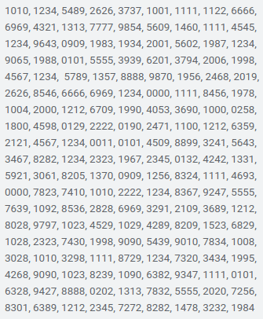
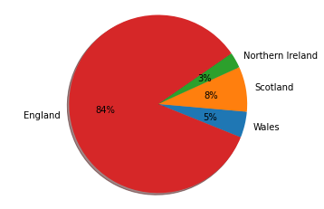
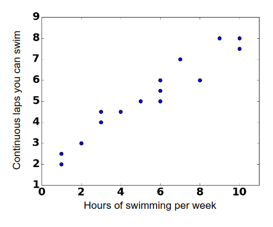

<style>
img[alt~="center"] {
  display: block;
  margin: 0 auto;
}
</style>

# Visualizations

A powerful way to identify patterns in data that otherwise can be hard to find and analyze

<!--
One of the most important things in machine learning is understanding your
dataset. Visualizations provide us with a powerful tool to analyze and gather
patterns to better understand our datasets. There are many varieties of
visualizations, and in this lecture we will go over some of the most common
visualizations. We will show scenarios when each visualization is useful.

To start, we want to examine a scenario when a visualization is particularly helpful.
-->

---

# Visualizations: Raw Data

What patterns can you see in these raw data of common PIN numbers?



<!--
Here you can see a dataset containing PIN numbers. Given the raw data shown, can
you see any patterns?

Not really. You may notice that 1111 is repeated a few times,
but other than that it's difficult.

Image Details:
* [pins.png](https://opensource.google/docs/copyright/): Copyright Google
-->

---

# Visualizations: Heatmap


<!--
Here we have a heatmap of the PIN numbers in the previous dataset. The first two
digits are along the x-axis, and the last two digits are along the y-axis. In
this particular map, yellow means that the pattern occurs more often.

What patterns do you see?

Image Details:
* [heatmap.png](https://opensource.google/docs/copyright/): Copyright Google
-->

---

# Visualizations: Heatmap


<!--
Here we see that repeated pairs of numbers are common. This is shown by the
diagonal line.

Image Details:
* [heatmap-repeat.png](https://opensource.google/docs/copyright/): Copyright Google
-->

---

# Visualizations: Heatmap


<!--
Here we see that using a year in the 1900s or 2000s is pretty common, too.

Image Details:
* [heatmap-year.png](https://opensource.google/docs/copyright/): Copyright Google
-->

---

# Visualizations: Heatmap


<!--
We can also see that specific pins are very popular. From left to right we can see that 0000, 1111, 1234, and 1342 are all very common.

Image Details:
* [heatmap-pinpoint-hotspots.png](https://opensource.google/docs/copyright/): Copyright Google
-->

---

# Visualizations: Chart Types


<!--
There are many different types of charts. This is just a sample of types of
charts that you might see to visualize data.

Image Details:
* [charts.png](https://unsplash.com/photos/JKUTrJ4vK00): Unsplash License
* [charts.png](https://unsplash.com/photos/IrRbSND5EUc): Unsplash License
* [charts.png](https://unsplash.com/photos/jrh5lAq-mIs): Unsplash License
* [charts.png](https://unsplash.com/photos/_Jb1TF3kvsA): Unsplash License
-->

---

# Visualizations: Pie Charts



<!--
Pie charts are great for representing data that is in the form of fractions adding up to one or percentages adding up to 100. They create a natural comparison between portions of a whole.

Image Details:
* [pie-chart.png)(https://opensource.google/docs/copyright/): Copyright Google
-->

---

# Visualizations: Pie Charts


<!--
Pie charts cannot be used for all data, and they can create misleading conclusions.

Problems:
* We don't want to create percentages where they're not necessary or helpful, solely to put it into the visualization.
* The states have separate budgets, so this visualization indicates correlation when there is none.

@Exercise (5 minutes): {
Think pair share - How could it be better represented?
It would appear better as a bar chart, comparing the pieces side-by-side, rather than as parts of a whole.
}

Image Details:
* [bad-pie-chart.png](https://opensource.google/docs/copyright/): Copyright Google
-->

---

# Visualizations: Bar Charts


<!--
Bar charts can help compare categorical data.

The same data is much easier to see and compare in a bar chart form!

Why?:
* You can see the actual number and not the arbitrary percentage because bar charts have axes.
* It's easier to compare between data points, as seeing them side by side gives a better natural comparison.

In general, bar charts are good for representing categorical data, as the x-axis can be used to represent categories very easily, and the bars create a natural comparison between categories.

Image Details:
* [bar-chart.png](https://opensource.google/docs/copyright/): Copyright Google
-->

---

# Visualizations: Bar Charts


<!--
For continuous data, bar charts might not be the best choice.

Problems:
* Bar charts can lack granularity. Here, we have to categorize times into hour-long buckets on the x-axis, even though time is continuous. This give the impression that for an entire hour the temperature was the same, when in reality, it may have changed minute-by-minute.
* It can be hard to gather many trends from this chart other than which hour had the highest or lowest temperature.

If all you want is to find the hour with the greatest temperature, for example, this would be a good chart. But if you want to be able to do more complex or granular analysis, like predicting future temperatures, this is a bad chart.

Also, bar charts are generally most readable when they go in ascending/descending
order of size. But since these x values have a meaningful ordering, we can’t
construct the chart for max readability.

Image Details:
* [bad-bar-chart.png](https://opensource.google/docs/copyright/): Copyright Google
-->

---

# Visualizations: Line Charts


<!--
Line graphs can help estimate missing data points and find trends.

This is a much more useful visualization than the bar chart.

Why?:
* It shows a relationship between the two things, which is relevant and helpful.
* This relationship can now be fit mathematically.
* Now we can estimate missing points and make predictions.
* We can use the meaningful ordering on the x-axis to actually make a prediction, whereas bar charts are usually organized in decrementing order of size.

In general, a line graph is a fantastic choice for data that could be well fit with a function (i.e. an x,y category where every x has just one corresponding y value, and where the x,y pairs strongly correlate in a mathematical way). It allows you to make inferences on what values that weren’t in the original dataset might be expanding your ability to analyze your data.

Image Details:
* [line-chart.png](https://opensource.google/docs/copyright/): Copyright Google
-->

---

# Visualizations: Line Charts


<!--
When there are multiple data points for the same place on the x-axis, line charts are not as useful.

Problems:
* Swimmers with different training habits will be able to swim different lengths, despite training the same amount, and vice versa. In other words, there may be multiple y values for a particular x value. A visualization with a continuous line masks these variations.
  * These values can be interesting to analyze, and they can be encapsulated in other visualizations without losing the ability to see other trends.
* Line charts always indicate a continuous correlation, even when there might not be one. Gaps (i.e. discrete jumps) in the data are missing when we visualize it as a continuous line.
  * Example: Does an extra ½ hour of swimming per week really boost your max distance an extra little bit, or is it actually that you have to jump to a whole hour?

Image Details:
* [bad-line-chart.png](https://opensource.google/docs/copyright/): Copyright Google
-->

---

# Visualizations: Scatter Plots



<!--
Scatter plots can help show correlations between two variables.

Why?:
* It's much more clear where the gaps, overlaps, and groups form.
* We are still able to grasp the general trends (lose very little value) without the line, and now we also have more possibilities for analysis.

In general if you have x,y data where you have multiple y values for every x, a scatter plot is a good choice as it allows you to see all the data clearly and doesn’t average out y values for a given x like a line graph would.

Image Details:
* [scatter-plot.png](https://opensource.google/docs/copyright/): Copyright Google
-->

---

# Visualizations: Scatter Plots


<!--
When there is too much data, a scatter plot will not be useful.

Problems:
* There could be too many points to draw conclusions.
* There may be a higher concentration of points in some areas, but in this format we cannot tell.

Image Details:
* [visualizationscatyawn1.png](https://opensource.google/docs/copyright/): Copyright Google
-->

---

# Visualizations: Heat Maps


<!--
Heatmaps are good for visualizing concentrated, continuous data.

Why?:
* We can now see the maximum and minimum amounts, where before we could only estimate.
* We can better analyze trends when we know the concentrations of points in each area.

In general heatmaps are good when you have lots of overlapping points in an x,y format. It allows you to see trends in very large datasets, and it can often be overlaid on maps or other graphics to show concentrations in an even clearer visual format.

@Exercise (5 minutes): {
Think Pair Share - We can imagine a heatmap wouldn’t work as well for other types of data. What types wouldn’t be as good with a heatmap?
}

Answers:
* Categorical data
* Data with a linear (or other basic math) correlation (an x,y category that strongly correlate in a mathematically easy to fit way)
* Data representing different proportions of a whole (percentages)

Image Details:
* [visualizationscatyawn2.png](https://opensource.google/docs/copyright/): Copyright Google
-->

---

# Which Visualization is Best?

Which type of visualization do you think would best represent the data below?

* Line chart
* Bar chart
* Scatter Plot
* Line chart or bar chart with averages
* Heat map
* Pie Chart


<!--

@Exercise (20 minutes): {
Think pair share: Discuss the possible charts that would be good for the different types of data on the following slides.

It might be helpful to write the following list on the board or have students take notes, so they can reference it during their discussions with peers:

* Line chart or bar chart depending on scope of the data
* Scatter Plot
* Line chart or Bar Chart w/averages?
* Heat map - maybe on a US map
* Pie Chart
}

Image Details:
* [candy-count-as-bg.png](https://opensource.google/docs/copyright/): Copyright Google

-->

---

# Which Visualization is Best?


<!--
Here are some example visualizations of the candy count:

* Pie chart - could work, good if you want to see how the bag has been portioned out as a whole
* Bar chart - could work, good because the data is categorical better for analysis between individual candy types
* Scatter plot - not good, draws correlation + x axis has no meaningful ordering
* Line graph - not good, draw a correlation where there is none in the space between chocolate types - masks the true values

Image Details:
* [candy-count-charts.png](https://opensource.google/docs/copyright/): Copyright Google
-->

---

# Which Visualization is Best?

Average monthly revenues for a small business

```
January: $15,000 | February: $17,500 | ...
```

<!--
What are the possible charts that would be good for this data?

*Line chart or bar chart depending on scope of the data.*
-->

---

# Which Visualization is Best?

Times for running a program based on input length

```
6 digits: 1:34:07 | 6 digits: 1:26:55 | 7 digits: 2:13:47 | ...
```

<!--
What are the possible charts that would be good for this data?

*Scatter plot*
-->

---

# Which Visualization is Best?

Total time taken to commute to work compared to departure time

```
8:00am: 15 mins | 8:01am: 17mins | 8:00am: 14 mins | ...
```

<!--
What are the possible charts that would be good for this data?

*Line chart or bar chart with averages*
-->

---

# Which Visualization is Best?

Concentration of hardware stores by geographical location

```python
(latitude, longitude) pairs
```

<!--
What are the possible charts that would be good for this data?

*Heat map, possibly geographical heat map*
-->

---

# Which Visualization is Best?

Student poll responses to the question: “Do you live on or off campus?”

<!--
What are the possible charts that would be good for this data?

*Pie chart*
-->

---

# Visualizations: Matplotlib & seaborn


<!--
So how do we build these visualizations?

There are actually many toolkits for building visualizations that range from
low-level libraries where you are rendering shapes manually, to automated systems
that simply require you to feed them data and get a chart back.

One library that you'll often see used in data science is
[Matplotlib](https://matplotlib.org/). Matplotlib is a classic visualization
library that can produce two-dimensional charts using Python.

Another library that you'll often see is
[seaborn](https://seaborn.pydata.org/). Seaborn is built on top of Matplotlib
and can produce eye-pleasing charts easily.

In the lab you'll get to use both to create the types of charts we've
discussed in this lecture.

Image Details:
* [logo2_compressed.svg](https://matplotlib.org/): Externally Linked
-->

