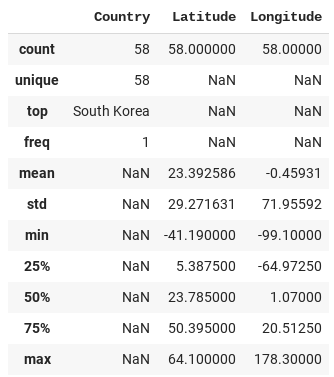

---

marp: true

---

<style>
img[alt~="center"] {
  display: block;
  margin: 0 auto;
}
</style>

# EDA: Exploratory Data Analysis

<!--
Exploratory Data Analysis, EDA for short, is the term used for the process of
analyzing your dataset. EDA involves loading your data and then using queries
and visualizations to find out information about your dataset.
-->

---

# EDA + DPP
## Data Preprocessing

<!--
Often you'll find that issues with the data actually prevent you from performing
a quality exploratory data analysis. These issues can include missing values,
impossible values, and values of the wrong type.

There are scores of issues that can make analyzing your data difficult.

Because of this, you'll often find yourself doing some preprocessing of your
data while you are performing EDA. Strictly speaking, EDA is just analysis. 
In practice, data analysis and data preprocessing and manipulation are 
intertwined. As you look at your data more closely, you'll have to fix parts 
of it to look further.
-->

---

# EDA Checklist

* Table-level analysis
* Per-column analysis and processing
* Cross-column analysis and processing
* Cross-table analysis

<!--
There is no official EDA checklist. Every dataset is different. Every data
scientist has a different approach.

Some data scientists pre-formulate questions and then perform the analysis and
preprocessing necessary to answer those questions.

Some data scientists begin with a thorough check of each component of the data,
fix obvious errors, and then explore through questions. Some of these questions
are created during the initial cleaning pass.

Your approach to EDA will also depend on the type of data you're working with. 
For example, are you looking at images and videos or tabular data (like we've been 
working within Pandas)? We will talk more about image data in a later unit of 
this course. 

If you're working with tabular data, then regardless of how you approach the analysis, 
you will likely gather a few distinct types of information: single-table information, 
single-column information, cross-column information, and then cross-table information.
-->

---

# EDA: Table-Level Analysis


<!--
Table-level analysis is all about getting to know data about an individual
table or `DataFrame` of data as a whole. Using `describe()` we can see things like
the column names and the row counts.

In this example we can see that there are 1795 rows. We can see that some are
missing values. We can also see the column names and can infer the column types
by what statistics are printed.

What other information can you see in this output?

What other methods do we know that can provide us table-level analytics?

Image Details:
* [describe.png](https://opensource.google/docs/copyright/): Copyright Google
-->

---

# EDA: Table-Level Analysis

```python
df.head()     # First few rows of data

df.tail()     # Last few rows of data

df.sample(10) # Random sample of data

df.columns    # Column labels

df.dtypes     # Data types of columns
```

<!--
Here are some examples of other table-level methods and attributes we can
use to learn about the data in a `DataFrame`.
-->

---

# EDA: Per Column Analysis

```python
df[column].isna().any() # Missing values?

df[column].describe()   # Statistics for column

df[column].hist()       # Histogram

df[column].sample(10)   # Data sample
```

<!--
Analysis of a single column/`Series` of data is similar to that of a
`DataFrame`. You can use many of the same methods. Most statistics you can
gather about a `DataFrame` can also be done for an individual column. Sometimes
it is nice to look at these stats column-by-column, so you don't get overwhelmed
with information. 
-->

---

# EDA: Cross-Column Analysis


<!--
Cross-column analysis simply means looking at the relationships among data across
columns. This is often done visually, but it doesn't have to be. In the example
shown, we can see the correlation between columns with a call to `corr()`.

Recall that the Pearson correlation coefficient is used to measure the strength of a 
linear association between two variables. Note that along the diagonal, we have a 
correlation of 1.0, since each column is perfectly correlated with itself. A correlation 
coefficient of 1.0 means that for every positive increase in one variable, there is a 
positive increase of a fixed proportion in the other. Off the diagonal, we have values 
between -1 and 1 that indicate the correlation between two columns. A negative correlation
means that for every positive change (increase) in one variable, there is a negative 
change (decrease) in the other variable. The magnitude of the correlation coefficient 
captures the strength of the correlation. 

Image Details:
* [correlation.png](https://opensource.google/docs/copyright/): Copyright Google
-->

---

# EDA: Cross-Column Analysis


<!--
Of course, many times visualizations are very helpful. Here we see a boxplot of
two columns in a `DataFrame`.

On the x-axis, we have the percent of cocoa in the chocolate. On the y-axis, we 
have the ratings. The line in the center of the box represents the median. We also 
see the quartiles and any outliers. 


Image Details:
* [boxplot.png](https://opensource.google/docs/copyright/): Copyright Google
-->

---

# EDA: Cross-Table Analysis



<!--
Often we'll find ourselves working with many sources of data. Even data from the
same data source is often provided as distinct files that later have to be
merged.

For example, here is a country table that contains geo-location data for a set
of countries. If we have tables in our dataset with countries in them, we can
merge the tables and do analysis based on location. This is really
cross-table-cross-column analysis, but that is a lot to try to say.

Image Details:
* [country.png](https://opensource.google/docs/copyright/): Copyright Google
-->

---

# EDA: Data Preprocessing

* Missing values
* Invisible values
* Placeholder values
* Values out of the expected range
* Incorrect data types
* Inconsistent values (USA vs. U.S.A.)

<!--
As we mentioned earlier, it is difficult to successfully perform EDA without
doing a bit of data preprocessing. Some common issues you'll encounter
include those listed on this slide.

Invisible values are probably the least self-explanatory. These are values
where a space or some other invisible character is the only value at a data
point. Technically the data isn't missing, so Pandas will not report it in an
`isna()` check. However, the data present isn't actually meaningful. We'll see
how to handle a case like this in the lab.
-->

---

# EDA: *Not Necessarily* Data Preprocessing

* Normalization
* Standardization
* One-hot encoding

<!--
There are some data processing techniques that aren't necessarily part of the
EDA phase. A few of those are listed on this slide.

These techniques are used to make your data more palatable to your model. We'll
dig into each of these during this course. But here's a quick overview of each one 
on this list. 

* Normalization usually means rescaling the values into a range of [0,1]. 
* Standardization usually means rescaling data to have a mean of 0 and a standard deviation of 1.
* One-hot encoding is a process of converting categorical variables into 0s and 1s (which 
is better for many ML algorithms).

Your preprocessing steps are informed by your research questions and the model 
you intend to build to address your questions. Throughout this course, we will talk about 
when to use certain preprocessing techniques. 
-->

---

# Preprocessing Strategies

* Fill in missing data
* Fix broken data
* Remove problematic columns
* Remove problematic rows

<!--
What happens when you do find bad data?

There are a few strategies. It is best to fill in and fix data wherever possible.
Sometimes you just have to get rid of problematic data, though. There is no one-size
fits all approach, and we will see many examples of these preprocessing steps in the
lab and throughout the course. 
-->

---

# EDA: [Chocolate Bar Ratings Lab](https://www.kaggle.com/rtatman/chocolate-bar-ratings)

* Part 1: Individual tables and columns
* Part 2: Cross tables and columns

<!--
It is about time for us to practice our EDA skills. We'll use tools we recently
learned including Pandas, matplotlib, and seaborn. There are also some
new concepts introduced in this lab, but it should mostly serve as an
exercise in bringing the tools you have already learned together to
perform exploratory data analysis and data preprocessing on a dataset.

The lab is divided into two parts. Part 1 is all about individual table and
column analysis and processing. Part 2 will build upon our work in part 1 and
will bring in more tables to help us analyze our data. We'll also do some
analysis of how columns relate to one another. Along the way we'll create some
meaningful visualizations and answer questions about our dataset.
-->

---
