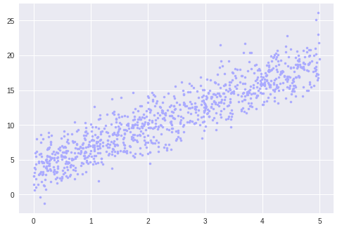
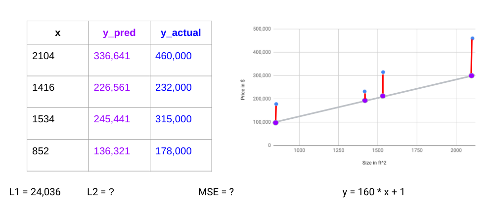
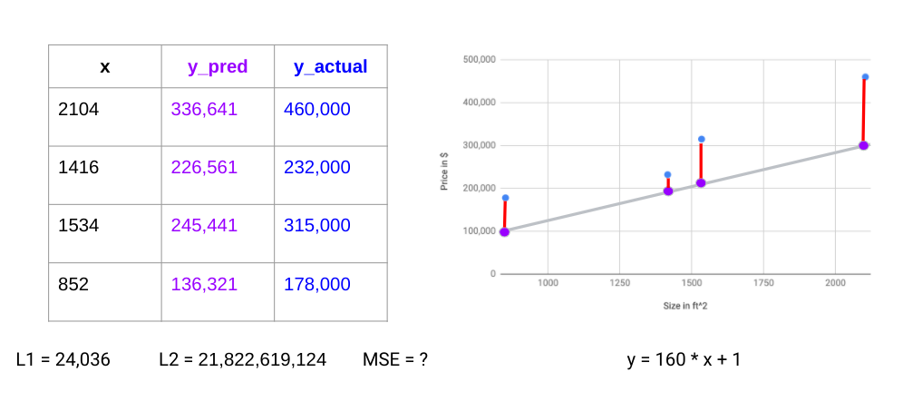
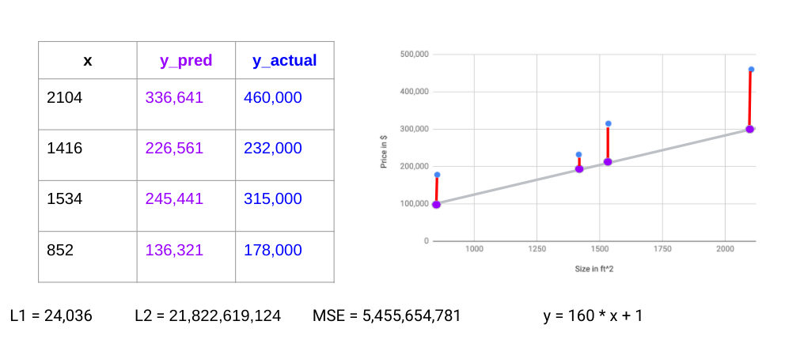
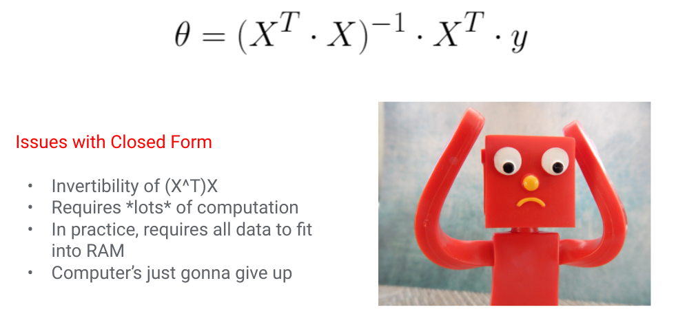

# Regression

---

<!--
Has anyone? seen a crime show or heard of an investigation where they used a footprint to determine a suspect’s height? It’s a tactic frequently mentioned in connection to forensics, but does it actually work? Let’s try it out!

*Use your shoe size and height as the suspect’s, and tell students to keep in mind that US men’s size equals US women’s size - 2.*

*Split the students into groups of ~6 each and give each group a sheet of graph paper.*

Plot each of your shoe sizes on the x-axis and heights on the y-axis. What do you think is the suspect's height based on their shoe size?

*Then have the groups share data, so each has a plot of the whole class’s information. 

Make another guess per group. Does anyone come close?

*They should theoretically have better guesses with more data, but shoe size might not actually be well correlated to height, so they might not.*

Image Details:
* [regression1.jpg](https://unsplash.com/photos/BqpdGGfezFw): Unsplash License
-->

---

# Mathematical Model

<!--
Linear regression has a simple goal: to find a straight line that best fits a set of data.

Image Details:
* [regression2.png](http://www.google.com): Copyright Google
-->

---

# Data Goes In, Prediction Comes Out

<!--
Recall that the equation for a line is y = m * x + b, where x is input features and y is output targets. If we were trying to predict energy level from coffee intake, amount of coffee would be the input, and energy level would be output.

Image Details:
* [regression3.png](http://www.google.com): Copyright Google
-->

---

# What is the Machine "Learning?"

<!--
Using the data, regression “learns” two values. The first is m, which you may have called “slope” and which we’ll refer to as a “weight / coefficient." This represents how much a change in the feature value (x) should affect our prediction (y). The second is b, which you may have called an “intercept” and which we’ll refer to as a “bias." This represents the prediction we would make if our input features are all zero.

Image Details:
* [regression4.png](http://www.google.com): Copyright Google
-->

---

# Multiple Features

<!--
Realistically, energy level might depend on several factors. Now, our model needs to learn three weights (one for each input feature) and one bias.

The concept of weights and bias is important to most machine learning models, even complex neural networks. The model uses data to learn how each input feature affects the output and how it learns a bias to linearly shift its predictions to fit the data. This is like shifting a y-intercept.

Image Details:
* [regression5.png](http://www.google.com): Copyright Google
-->

---

# Machine Learning Process

1. Infer/Predict/Forecast
1. Calculate Error/Loss/Cost
1. Train/Learn
1. Iterate/Repeat (until some stopping condition)

---

# Predict the Selling Price of a House

<!--
Image Details:
* [regression12.png](http://www.google.com): Copyright Google
-->

---

# Predict Price of a House Using the Machine Learning Process

<!--
Image Details:
* [regression13.png](http://www.google.com): Copyright Google
-->

---

# Predict Price of a House Using the Machine Learning Process

<!--
Image Details:
* [regression14.png](http://www.google.com): Copyright Google
-->

---

# Predict Price of a House Using the Machine Learning Process

<!--
Image Details:
* [regression15.png](http://www.google.com): Copyright Google
-->

---

# Predict Price of a House Using the Machine Learning Process

<!--
Image Details:
* [regression16.png](http://www.google.com): Copyright Google
-->

---

# Predict Price of a House Using the Machine Learning Process

<!--
Image Details:
* [regression17.png](http://www.google.com): Copyright Google
-->

---

# Predict Price of a House Using the Machine Learning Process

<!--
Image Details:
* [regression18.png](http://www.google.com): Copyright Google
-->

---

# Predict Price of a House Using the Machine Learning Process

<!--
Image Details:
* [regression19.png](http://www.google.com): Copyright Google
-->

---

# "Learned" Parameters

Wobble m and b around **iteratively** to **reduce loss**
  * Usually, loss means root mean squared error **(RMSE)**

<!--
Instead, machine learning must iteratively update its parameters to adjust for anything that is being “learned." In this case, that includes the weights and bias. It does this based on a loss function that measures how well the current parameters are performing. The model will attempt to incrementally change its weights and bias to decrease loss.
A common loss function for regression is the root mean squared error. We’ll discuss this and some other common loss functions in more detail later.

Image Details:
* [regression8.gif](http://www.google.com): Copyright Google
* [regression8b.png](http://www.google.com): Copyright Google
-->

---

# Error/Loss/Cost Functions

<!--
Image Details:
* [regression20.png](http://www.google.com): Copyright Google
-->

---

# Housing Example

<!--
Image Details:
* [regression21.png](http://www.google.com): Copyright Google
-->

---

# Housing Example

<!--
Image Details:
* [regression22.png](http://www.google.com): Copyright Google
-->

---

# Housing Example

<!--
Image Details:
* [regression23.png](http://www.google.com): Copyright Google
-->

---

# Housing Example

<!--
Image Details:
* [regression24.png](http://www.google.com): Copyright Google
-->

---

# Gradient Descent

* The computer’s job:
  * Start with an arbitrary guess of parameters.
  * Tweak it in whichever direction reduces loss more.
  * The less the loss is changing, the less the value should be tweaked.

* The human’s job:
  * Choose the **learning rate**, a constant value which scales how far we tweak the value on each learning step.

Learning rate is an example of a **hyperparameter**. Not a parameter in the the actual model, but a parameter in the algorithm that tweaks the model.

<!--
How does the model “iteratively” update its parameters? We can think of our goal as an optimization problem, where we’d like to optimize (minimize) a loss function. Machine learning models then use an “optimizer," an algorithm to perform that optimization.

The most common optimizer is gradient descent, where the model starts by picking random values for each parameter. It then changes each in the direction that reduces loss the most. On each iteration or “step," the model should get closer to the minimal loss until it “converges," or reaches a point where the loss isn’t changing much between steps. (Usually this is based on some threshold, like the loss function changing by less than 0.001 between steps.) Since this isn’t a closed-form solution, gradient descent isn’t guaranteed to converge to the absolute lowest loss possible. There are more sophisticated optimizers that can sometimes do better.

You can control gradient descent by choosing the learning rate, which determines how much you tweak each parameter on each step. We call this a hyperparameter: a value you can change to change model performance, but one that isn’t “learned” by the model.

Image Details:
* [regression9.gif](http://www.google.com): Copyright Google
-->

---

# Linear Algebra Notation for y=mx+b

<!--
Image Details:
* [regression25.png](http://www.google.com): Copyright Google
-->

---

# Linear Algebra Notation for y=mx+b

<!--
Image Details:
* [regression26.png](http://www.google.com): Copyright Google
-->

---

# Multiple Regression (i.e. Multiple Features)

<!--
Realistically, energy level might depend on several factors. Now, our model needs to learn three weights (one for each input feature) and one bias.

The concept of weight and bias is important to most machine learning models, even complex neural networks. The model uses data to learn how each input feature affects the output, and it learns a bias to linearly shift its predictions to fit the data. This is like shifting a y-intercept.

Image Details:
* [regression27.png](http://www.google.com): Copyright Google
-->

---

# Multiple Regression Notation

<!--
Image Details:
* [regression28.png](http://www.google.com): Copyright Google
-->

---

# Closed Form, Exact Solution

<!--
How does the model actually “learn” those values? Through linear algebra, we’ve actually found an exact equation. All you need to do is plug in your X and y values, and calculate to get your weight and bias values.

X is an m x n matrix. X^T*X is invertible if and only if m /leq n and rank(X) = m.

Image Details:
* [regression29.png](http://www.google.com): Copyright Google
-->

---

# Batched Data

Break data into smaller batches.
  * We’ll use a new batch on each learning step.
  * New hyperparameter batch size controls how much data is used for each learning step.

 

<!--
 Another important hyperparameter is batch size. While you could perform gradient descent based on your full dataset every step, it may require too much memory, and take longer to converge. To combat both, we split the data into smaller batches. On each step, we’ll use a new batch to update parameters. You can control how large these batches are.

Image Details:
* [regression10.png](http://www.google.com): Copyright Google
-->

---

# Hyperparameters We Care About

 

<!--
After setting up a model, you may find you need to perform “hyperparameter tuning” to achieve better results. Different problems work well with different combinations of hyperparameter values. You’ll often need to experiment or “tune” those combinations. Here are some rough guidelines for potential problems with learning rate and batch size that might suggest increasing or decreasing their values.

Image Details:
* [regression11.png](http://www.google.com): Copyright Google
-->

---
