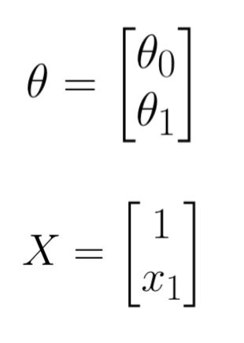

---

marp: true

---

# Regression

---

<!--
Has anyone seen a crime show or heard of an investigation where they used a footprint to determine a suspect’s height? It’s a tactic frequently mentioned in connection to forensics, but does it actually work? Let’s try it out!

@Exercise (15 minutes): {
Use your own shoe size and height as the suspect’s, and tell students to keep in mind that US men’s size equals US women’s size - 2. Don't tell them the suspect's height, but tell them the suspect's shoe size and tell them that their task will be to guess the suspect's height.

Split the students into groups of ~6 each and give each group a sheet of graph paper.

Ask the groups to plot each group member's shoe size on the x-axis and height on the y-axis. What do they think is the suspect's height based on the suspect's shoe size?

Then have the groups share data, so each has a plot of the whole class’s information.

Make another guess per group. Does anyone come close?

They should theoretically have better guesses with more data, but shoe size might not actually be well correlated to height, so they might not.
}

Image Details:
* [regression1.jpg](https://unsplash.com/photos/BqpdGGfezFw): Unsplash License
-->

---

# Mathematical Model

<!--
Linear regression has a simple goal: to find a straight line that best fits a set of data.

Image Details:
* [regression2.png](https://opensource.google/docs/copyright/): Copyright Google
-->

---

# Features Go In, Targets Come Out

<!--
Recall that the equation for a line is y = m * x + b, where x denotes our input variable and y is our output. In the case of machine learning, x is input features and y is target outputs. If we were trying to forecast energy level from coffee intake, amount of coffee would be the input, and energy level would be the output.

Image Details:
* [regression3.png](https://opensource.google/docs/copyright/): Copyright Google
-->

---

# What is the Machine "Learning?"

<!--
Using the data, simple linear regression “learns” two values. The first is m, which you may have called “slope” and which we’ll refer to as a “weight / coefficient." This represents how much a change in the feature value (x) should affect our prediction (y). In other words, a 1 unit increase in x yields an m unit change in y. The second is b, which you may have called an “intercept” and which we’ll refer to as a “bias." The bias represents the prediction we would make if our input features are all zero. For example, you may expect yourself to have low energy without any coffee, but probably not zero energy.

Image Details:
* [regression4.png](https://opensource.google/docs/copyright/): Copyright Google
-->

---

# Multiple Features

<!--
Realistically, energy level might depend on several factors (maybe coffee, time of day, and temperature). Now, our model needs to learn three weights (one for each input feature) and one bias.

The concept of weights and biases is important to most machine learning models, even complex neural networks. The model uses data to learn how each input feature affects the output and it learns a bias to linearly shift its predictions to fit the data. This is like shifting a y-intercept.

Image Details:
* [regression5.png](https://opensource.google/docs/copyright/): Copyright Google
-->

---

# Machine Learning Process

1. Infer/Predict/Forecast
1. Calculate Error/Loss/Cost
1. Train/Learn
1. Iterate/Repeat (until some stopping condition)

<!--
But how do we "learn" the weights and biases? Typically, in machine learning we use the following iterative process.

* Given an input value, we forecast (or guess) the potential target value.
* We calculate the error (or difference) between the actual target value and the target we guessed.
* We update the weights and biases to produce a guess that is closer to the actual target.
* We iterate. That is, we repeat these steps until some stopping condition. (The stopping condition could be a small enough error, or that the error is no longer changing between iterations.)
-->

---

# Predict the Selling Price of a House

<!--
Here are four data points. THe feature (x-value) is square footage of a house, and the target (y-value) is the price of the house.

Image Details:
* [regression12.png](https://opensource.google/docs/copyright/): Copyright Google
-->

---

# Predict the Price of a House Using the Machine Learning Process

<!--
Here is a different depiction of the same four data points. It is a simple scatter plot, where the x-axis is the size of a house (our feature), and on the y-axis we have the price of the house (our target).

Image Details:
* [regression13.png](https://opensource.google/docs/copyright/): Copyright Google
-->

---

# Predict the Price of a House Using the Machine Learning Process

<!--
To begin the iterative machine learning process, we make a guess at the weights and biases. In this case, we have one weight, m, and one bias, b. Glancing at the data (but not agonizing too hard), we guess that b = 160 and m = 1.

Image Details:
* [regression14.png](https://opensource.google/docs/copyright/): Copyright Google
-->

---

# Predict the Price of a House Using the Machine Learning Process

<!--
We now have an initial guess for our model's parameters, and we create the line y = mx + b.

Image Details:
* [regression15.png](https://opensource.google/docs/copyright/): Copyright Google
-->

---

# Predict the Price of a House Using the Machine Learning Process

<!--
We use the line to forecast predicted output values. For each point in our training data set (x_k,y_k), we calculate y_pred = m(x_k) + b.

Image Details:
* [regression16.png](https://opensource.google/docs/copyright/): Copyright Google
-->

---

# Predict the Price of a House Using the Machine Learning Process

<!--
Here we have the actual target outputs (blue) and the forecasted outputs that came from our model (purple). We've completed the infer/predict/forecast step.

Image Details:
* [regression17.png](https://opensource.google/docs/copyright/): Copyright Google
-->

---

# Predict the Price of a House Using the Machine Learning Process

<!--
Now we move onto step 2, which is to compute error/loss/cost. We calculate the error between the actual target values, and the forecasted values. The metric we use to calculate this error can be simple Euclidean distance, but there are other measures as well. We will talk about error/cost functions in a minute, but for now it's okay to think of the distance between the actual value and the forecasted value.

Image Details:
* [regression18.png](https://opensource.google/docs/copyright/): Copyright Google
-->

---

# Predict the Price of a House Using the Machine Learning Process

<!--
Finally, we update the weight and bias such that we reduce the error. Now we have a new m and b, and we start at step 1 using these new parameters.

Image Details:
* [regression19.png](https://opensource.google/docs/copyright/): Copyright Google
-->

---

# Error/Loss/Cost Functions

<!--
Now let's look at a few common loss/cost functions. Remember we use the functions to determine the error that results from a particular set of weights and biases. These are not the only loss functions, but they are very common.

L1 Loss is also known as least absolute deviations (LAD) or least absolute errors (LAE). L1 is resistant to outliers in the data (i.e. robust). If your data has outliers that can be ignored, then L1 is a good choice. If it is important to pay attention to any and all outliers, the method of least squares is a better choice.

L2 Loss is also called least squares (LS). Generally, L2 loss is preferred to L1, but when outliers are present in the data, then L2 may not perform well. The reason for this is because we are squaring the difference between the actual target and the predicted target. So if the error is large (in the case of an extreme outlier), then the error function will overcompensate.

Mean Squared Error (MSE) is the average of the squared differences between predicted targets and actual targets. Due to squaring, predictions which are far away from actual values are penalized heavily in comparison to less deviated predictions (similar to L2). MSE also has nice mathematical properties which make it easier to calculate gradients, which are used to update the model parameters (weights and biases).

Image Details:
* [regression20.png](https://opensource.google/docs/copyright/): Copyright Google
-->

---

# Housing Example

<!--
Let's practice calculating each of these loss functions for the data in the housing example, with the model y = 160x+1.

@Exercise (15 minutes): {
Have students work in small groups to calculate the loss functions based on the data in the table. It may be helpful to write the loss functions on the board at this point. Or flip back to the slide with the loss functions and allow students to write them down.
}

Image Details:
* [regression21.png](https://opensource.google/docs/copyright/): Copyright Google
-->

---

# Housing Example

<!--
*Invite answer from students for L1*

Image Details:
* [housingexample2.png](https://opensource.google/docs/copyright/): Copyright Google
-->

---

# Housing Example

<!--
*Invite answer from students for L2*

Image Details:
* [housingexample3.png](https://opensource.google/docs/copyright/): Copyright Google
-->

---

# Housing Example

<!--
*Invite answer from students for MSE*

Image Details:
* [housingexample4.png](https://opensource.google/docs/copyright/): Copyright Google
-->

---

# Computer vs. Human Jobs

* The computer’s job:
  * Start with an arbitrary guess of parameters.
  * Tweak these parameters to reduce loss.
  * The less the loss is changing, the less the value should be tweaked.

* The human’s job:
  * Choose the **learning rate**, a constant value which scales how far we tweak the value during each iteration. (Learning rate is a **hyperparameter** - not a parameter in the actual model.)

<!--
A hyperparameter is not a parameter in the model. In other words, it's not a weight or bias. It is a value that is chosen by the machine learning specialist that controls how the algorithm "learns" the model parameters. This is a subtle but important distinction.

-->

---

# Gradient Descent

<!--
How does the model “iteratively” update its parameters? We can think of our goal as an optimization problem, where we’d like to optimize (minimize) a loss function. Machine learning models then use an “optimizer," an algorithm to perform that optimization.

The most common optimizer is gradient descent, where the model starts by picking random values for each parameter. It then changes each in the direction that reduces loss the most. On each iteration or “step," the model should get closer to the minimal loss until it “converges," or reaches a point where the loss isn’t changing much between steps. (Usually this is based on some threshold, like the loss function changing by less than 0.001 between steps.) Since this isn’t a closed-form solution, gradient descent isn’t guaranteed to converge to the absolute lowest loss possible. There are more sophisticated optimizers that can sometimes do better.

You can control gradient descent by choosing the learning rate, which determines how much you tweak each parameter on each step. We call this a hyperparameter: a value you can change to change model performance, but one that isn’t “learned” by the model.

Image Details:
* [regression9.gif](https://opensource.google/docs/copyright/): Copyright Google
-->

---

# Linear Algebra Notation for y=mx+b

<!--
Here theta_0 is the bias and theta_1 is the weight (i.e. theta_0 = b and theta_1 = m).

Image Details:
* [regression25.png](https://opensource.google/docs/copyright/): Copyright Google
-->

---

# Linear Algebra Notation for y=mx+b

<!--
Using matrix/vector notation we can rewrite the equation of the line more compactly as theta^(transpose) X.

Image Details:
* [regression26.png](https://opensource.google/docs/copyright/): Copyright Google
-->

---

# Multiple Regression (i.e. Multiple Features)

<!--
This notational convenience can be extended to regression with multiple features. Recall our example from before where energy is a function of coffee, time of day, and temperature.

Image Details:
* [regression27.png](https://opensource.google/docs/copyright/): Copyright Google
-->

---

# Multiple Regression Notation

<!--
Again, we can use theta^(transpose) X to represent the regression equation.

Image Details:
* [regression28.png](https://opensource.google/docs/copyright/): Copyright Google
-->

---

# Closed Form, Exact Solution

## $\theta = (X^{T} \cdot X)^{-1} \cdot X^{T} \cdot y$

* Good for small datasets
* Finds optimal solution
* Can be computationally expensive
* Requires an invertable matrix

<!--

How does the model actually “learn” those values? Through linear algebra, there is an exact (closed form) solution. All you need to do is plug in your X and y values, and calculate to get your weight and bias values.

X is an m x n matrix. X^T*X is invertible if and only if m /leq n and rank(X) = m.

Image Details:
* [regression29.png](http://www.google.com): Copyright Google
-->

---

# Batched Data

Break data into smaller batches.
  * We’ll use a new batch on each learning step.
  * New hyperparameter **batch size** controls how much data is used for each learning step.

 

<!--
 Another important hyperparameter is batch size. While you could perform gradient descent based on your full dataset every step, it may require too much memory, and take longer to converge. To combat both, we split the data into smaller batches. On each step, we’ll use a new batch to update parameters. You can control how large these batches are.

Image Details:
* [regression10.png](https://opensource.google/docs/copyright/): Copyright Google
-->

---

# Hyperparameters We Care About

 

<!--
After setting up a model, you may find you need to perform “hyperparameter tuning” to achieve better results. Different problems work well with different combinations of hyperparameter values. You’ll often need to experiment or “tune” those combinations. Here are some rough guidelines for potential problems with learning rate and batch size that might suggest increasing or decreasing their values.

Image Details:
* [regression11.png](https://opensource.google/docs/copyright/): Copyright Google
-->

