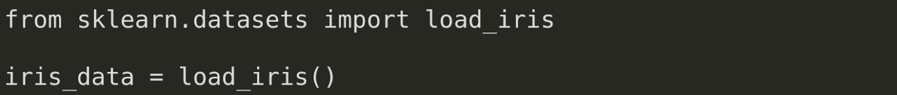
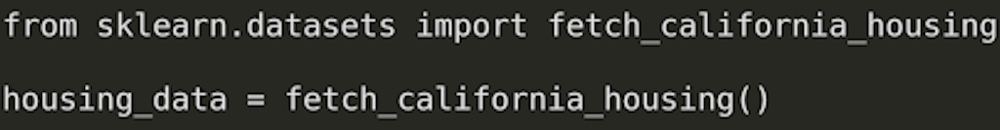
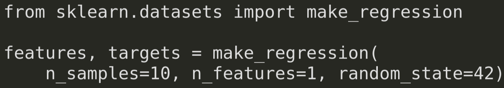
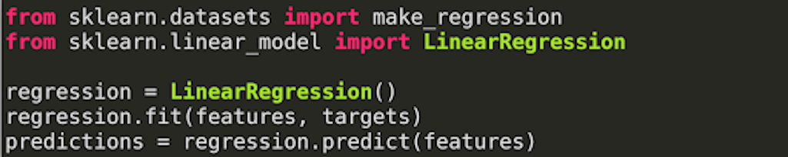
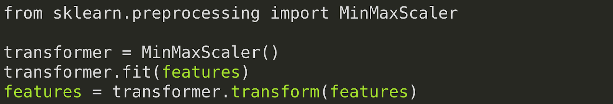
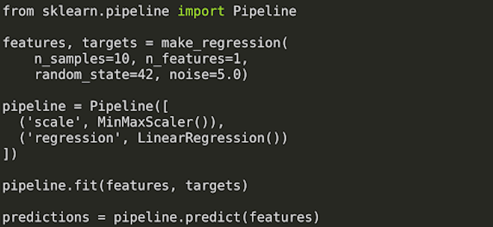
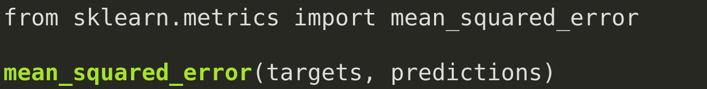

# Intro to scikit-learn

---

# [scikit-Learn](https://scikit-learn.org)

<!--
* scikit-learn.org is the primary website for the scikit-learn project. Here you will find information pertaining to scikit-learn, including instructions on installation, documentation, and even the project source code.
* Let's take a few moments to look around the project website.

@Exercise (10 minutes) {
Either navigate to scikit-learn.org on your own computer and present your computer screen to the students (recommended), or ask them to open their laptops to scikit-learn.org. Take the time to point out the following elements on the website:
  * The classification, regression, clustering, dimensionality reduction, model selection, and preprocessing sections on the main page. These represent core groupings of features provided by scikit-learn.
  * The top-page navigation with links on how to install the toolkit, documentation, and examples.
  * The banner on the upper right corner that says "Fork me on GitHub." This leads to the source code.
  * When you click the 'Documentation' drop-down in the upper navigation, it tells you the current stable version and has a link to 'All available versions.' Tell students to be sure to check the version of scikit-learn they're working with once they start the colab.
  * The 'Examples' linked in the top navigation are not just API usage examples; they also contain some interesting machine learning insights.
}
Image Details:
* [introtoscikit1.png](http://www.google.com): Copyright Google  
-->

---

# Datasets

<!--
Scikit-learn comes with support for acquiring and generating datasets. The library even comes packaged with some datasets that are commonly used for exploring new models.
Let's look at some of the ways you can acquire data with scikit-learn.
-->

---

# Loading

<!--
Scikit-learn has a few datasets that are installed alongside the library. To access these datasets, you can rely on load functions like the load_iris function shown in this example.

Image Details:
* [introtoscikit2.png](http://www.google.com): Copyright Google
-->

---

# Fetching

<!--
Some common datasets aren't installed alongside scikit-learn, but the library does know how to access them. For these datasets, we use 'fetch' functions, which pull the dataset down from the internet if necessary.

Image Details:
* [introtoscikit3.png](http://www.google.com): Copyright Google
-->

---

# Generating

<!--
Finally, sometimes it makes more sense to generate a dataset from scratch. For this, we can use one of the many generator functions provided by scikit-learn.

Image Details:
* [introtoscikit4.png](http://www.google.com): Copyright Google
-->

---

# Bunches

<!--
Bunch objects are scikit-learn objects that are often used to store datasets. If you find yourself using a load or fetch method, you'll likely encounter a bunch object.
The lab for this lesson provides more details on Bunch objects and explores the data stored within them. You'll encounter data that is composed of named features, as well as target values paired with sets of features.

For the most part, we will convert scikit-learn Bunch objects into Pandas DataFrame objects or TensorFlow dataset objects. The aforementioned objects are more easily integrated with the methods and frameworks we will cover in this course. 
-->

---

# Estimators

<!--
Most of the models in scikit-learn are considered estimators. An estimator is expected to implement two methods: fit and predict.
* Fit is used to train the model. At a minimum, it is passed the feature data used to train the model. In supervised models, it is also passed the target data.
* Predict is used to get predictions from the model. This method is passed features and returns target predictions.

Image Details:
* [introtoscikit5.png](http://www.google.com): Copyright Google
-->

---

# Transformers

<!--
In practice, it is rare that you will get perfectly clean data that is ready to feed into your model for training. Most of the time you will need to perform some type of cleaning on the data first.

Transformers implement fit and transform methods. The fit method calculates parameters necessary to perform the data transformation. Transform actually applies the transformation. There is a convenience fit_transform method that performs both fitting and transformation in one method call.

Image Details:
* [introtoscikit6.png](http://www.google.com): Copyright Google
-->

---

# Pipelines

<!--
It isn't a coincidence that transformers have fit and transform methods and that models have fit methods. The common interface across classes allows scikit-learn to create pipelines for data processing and model building.

A pipeline is simply a series of transformers, often with an estimator at the end.

Image Details:
* [introtoscikit7.png](http://www.google.com): Copyright Google
-->

---

# Metrics

<!--
Scikit-learn also comes with many functions for measuring model performance in the metrics package.

In this case, we are calculating the mean squared error. (In the Introduction to Regression lesson, you saw L1, L2, and MSE.)

Image Details:
* [introtoscikit8.png](http://www.google.com): Copyright Google
-->

---

# Your Turn

<!--
*It may be helpful to scroll through the lab associated with this unit and point out to the students the key ideas we covered here.*

-->
