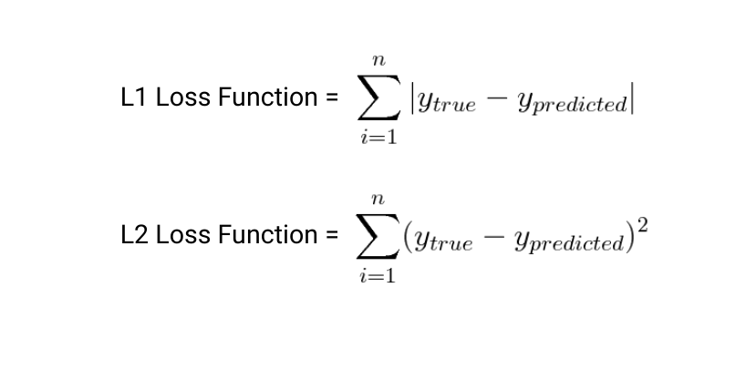
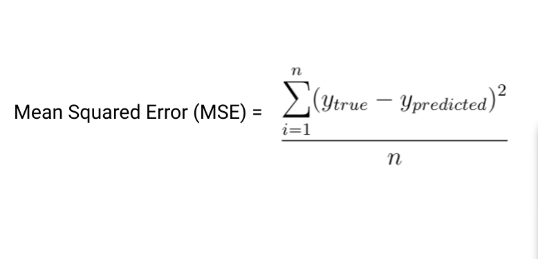
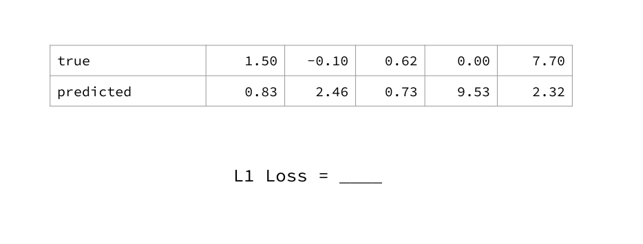
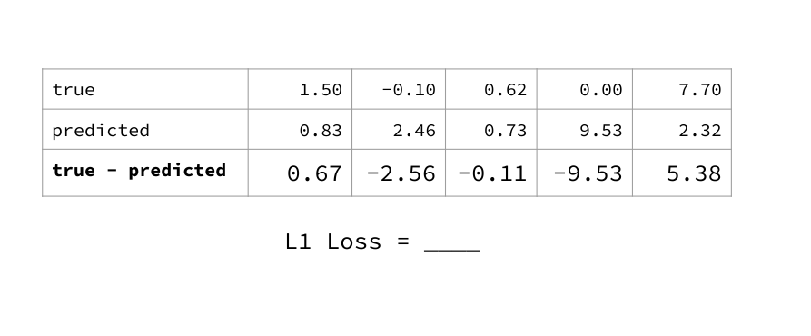
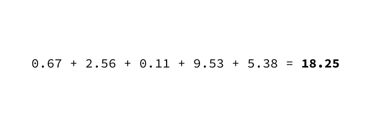
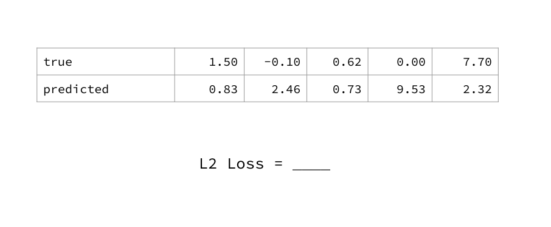
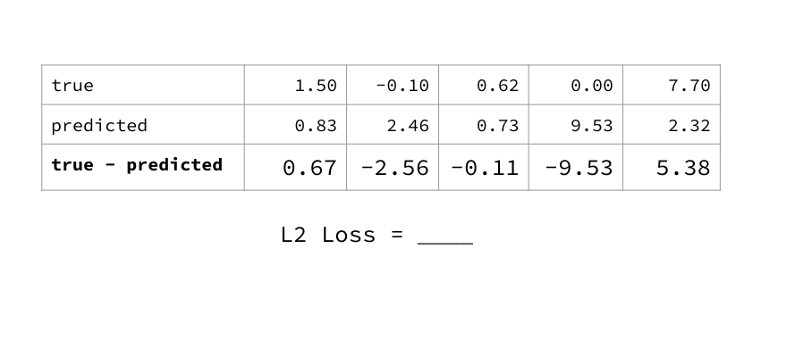
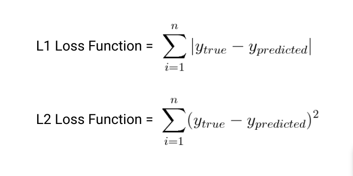
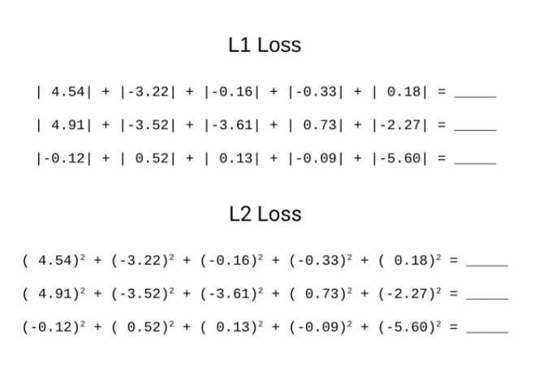
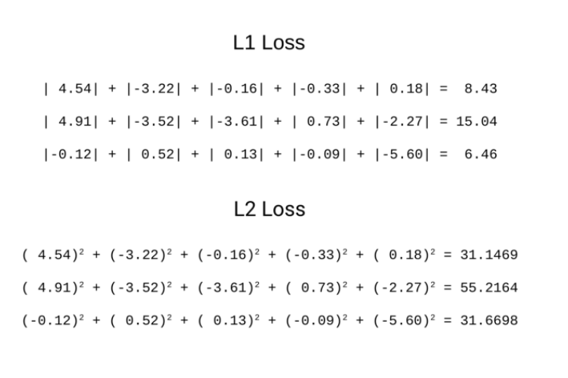

# Loss Functions

---

# L1 and L2 Formulas

<!--
Loss functions are essential to machine learning. At its core, machine learning “learns” by trying to optimize a loss function. A loss function is simply a way to evaluate how well your algorithm models your data. You can think of it as similar to a measure of error: higher loss means your model is performing worse, and lower loss is a sign of better performance.

Two of the most common loss functions for regression are called L1 and L2. L1 minimizes the sum of *absolute* differences between the true value and the predicted value of all samples, and L2 minimizes the sum of *squared* differences.
-->

---

# Averaging

<!--
It’s common to either take the sum or average over all data points to calculate overall loss. “Mean Squared Error” is another widely used loss function that is closely related to L2 loss, but instead of the sum of squared differences, it’s the *average* of squared differences.

You should choose a loss function based on your specific problem and dataset. L1 and L2 loss are used for regression problems. We’ll discuss loss functions used for other machine learning problems, such as classification, later.
-->

---

# L1 loss: example

<!--
Work through example of calculating L1 loss, starting from data values and predictions.
-->

---

L1 loss: example {.big}

<!--
The first step is to find the differences (y_true - y_predicted).
-->

---

L1 loss: example {.big}

<!--
Take the absolute value of each difference.
-->

---

L1 loss: example {.big}

<!--
Add all absolute value differences.
-->

---

# L2 loss: example

<!--
Work through same example with L2 loss.
-->

---

L2 loss: example {.big}

<!--
First step is again to find the differences (y_true - y_predicted).
-->

---

L2 loss: example {.big}

<!--
Now square each difference.
-->

---

L2 loss: example {.big}

<!--
Add the squared differences.
-->

---

# Your Turn

<!--
Students work on Loss worksheet (give around 5 min):
* 3 sets of true / predicted data points on page 1
* intermediate steps on page 2 (can choose to give or not give to students)
* solution on page 3
* previous worked through example on page 4 (can choose to give or not give as reference)
-->

---

# How did you do?

Compare answers with your neighbor.
Resolve any discrepancies.

<!--
End by asking what’s the difference between L1 and L2 as summary measures? Why might you want to use one over the other?

Answer: L2 is more sensitive to outliers in the data set, because squaring the difference makes the difference more extreme.
-->

---

# Solution

---

# Solution

