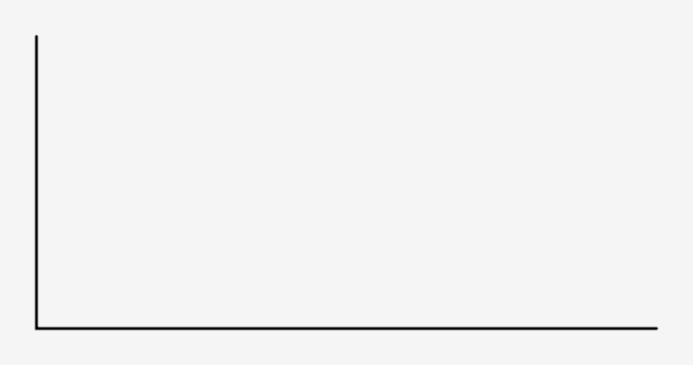
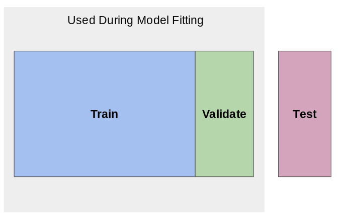
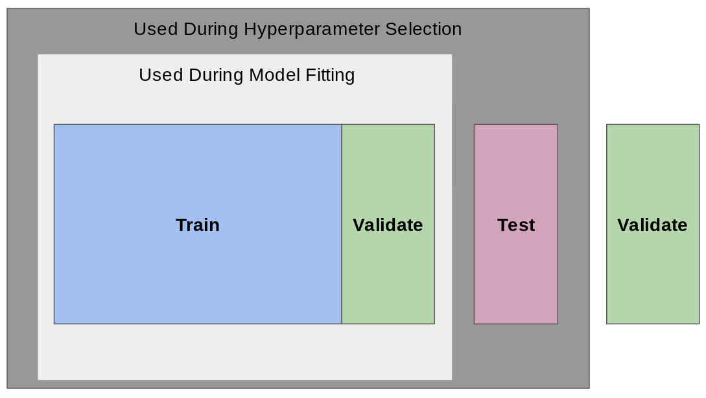

---
false
marp: true

---

<style>
img[alt~="center"] {
  display: block;
  margin: 0 auto;
}
</style>

# Linear Regression with scikit-learn

<!--
We have learned about linear regression and we have learned about scikit-learn. In this unit, we are going to perform a linear regression using the scikit-learn toolkit.
-->

---

# Linear Regression



<!--
Remember that linear regression involves fitting a straight line to a dataset. Most of the time, the line doesn't fit perfectly for all data points. You can see in this illustration the blue data points, the regression line, and then the red lines between the data points and the regression line. The red lines indicate the "error." There are many ways to measure this error that we'll talk about in detail in a future unit.

Image Details:
* [linearregressionwithscikit1.gif](http://www.google.com): Copyright Google
-->

---

# scikit-learn: Using Linear Algebra

```python
from sklearn.linear_model import LinearRegression

lin_reg = LinearRegression()
lin_reg.fit(X, y)
lin_reg.coef_, lin_reg.intercept_
```
Note: this is not a learning algorithm.

<!--
To perform linear regression in scikit-learn without learning, we use the `LinearRegression` class from the `linear_model` package. As you can see in this example, performing the regression is as simple as instantiating the class and then calling the `fit()` method. The model then calculates the coefficient and intercept for the linear equation.
-->

---

# Optimizers

1. (Batch) Gradient Descent
1. Stochastic Gradient Descent
1. Mini-Batch Gradient Descent

<!--
Recall that our overall goal is to learn parameters that minimize a particular cost/loss function. There are many ways to perform this optimization, but gradient descent is a very popular choice. At a high-level, we use the gradient (i.e. the derivative/slope) of the cost function to determine the direction to adjust the parameters. In other words, if we want to get to hte bottom of the hill, we walk in the direct of the steepest downward slope. 

In regular gradient descent the entire dataset is used to calculate the gradient during each iteration of training. This is sometimes called batch gradient descent, where the "batch" refers to the whole dataset. Note that if you have a particularly large dataset, this will result in A LOT of calculations, and it will quickly become an issue computationally. 

To speed up computation, we often use stochastic gradient descent or mini-batch gradient descent. The word "stochastic" means randomly determined. In stochastic gradient descent (SGD) we randomly choose one data point form our training set to compute the gradient at each iteration (i.e. we use a batch-size of 1). Unlike typical gradient descent (which always changes the parameters in the direction of the steepest slope), the path taken by stochastic gradient descent to reach the minimum is often a little noisy. Due to the noise, SGD may take more iterations to converge, but each iteration is so much faster computationally that completing additional iterations is still a significant computational improvement over typical gradient descent. In the walking down a hill analogy, it can be helpful to think of an inebriated person walking/falling down a hill (stochastic gradient descent) versus a careful mathematician who calculates the best direction before taking each step. Ultimately, both people will arrive at the bottom of the hill. For our purposes, we only care that we find parameters that minimize the cost function (i.e. live at the bottom of the hill), and we'd prefer to get there as quickly as possible. 

Mini-batch gradient descent is a middle ground between batch gradient descent and stochastic gradient descent. In mini-batch gradient descent, a fixed number of training samples (greater than 1, but less than the entire dataset) is used to compute the gradient during each iteration. 

Let's look at how to call SGD in scikit-learn. 

-->

---

# scikit-learn: Stochastic Gradient Descent

```python
from sklearn.linear_model import SGDRegressor

sgd_reg = SGDRegressor()
sgd_reg.fit(X, y)
sgd_reg.coef_, sgd_reg.intercept_
```

<!--

Using the stochastic gradient descent looks strikingly similar to using `LinearRegression`. This is no accident. scikit-learn's API is very consistent.

In this example, we load the data into memory, perform SGD, and then print out the coefficient and intercept.

Note that this might not be the optimal coefficient and intercept, just the best one that the SGD algorithm found after running through its epochs.
-->

---

# scikit-learn: SGD Hyperparameters

```python
from sklearn.linear_model import SGDRegressor

sgd_reg = SGDRegressor(
    max_iter=100000,
    n_iter_no_change=10,
    tol=1e-4,
    learning_rate='adaptive',
)
sgd_reg.fit(X, y)
sgd_reg.coef_, sgd_reg.intercept_
```

<!--
There aren't really any hyperparameters to tune for `LinearRegression`. There are some settings that you can change based on your data, such as whether the intercept should be calculated or whether the data is already centered, but there is very little to explore.

`SGDRegressor`, however, has many hyperparameters that can be tuned. You can see some of those hyperparameters in use here.

The first hyperparameter that we have changed is the `max_iter`. This changes the maximum number of times that the data will be passed to the model for training. Sometimes you can improve model performance by just training more.

The second parameter, `n_iter_no_change`, manages "early stopping" for the model. This setting controls the number of times the data will be passed to the model for training, not see a meaningful change in loss, and keep going. We have said that if you don't see a meaningful change in 10 epochs, stop. Increasing this number can potentially help your model get out of a plateau of loss that is just a local minimum.

The `tol` setting defines the meaningful change in loss.

And finally the `learning_rate` affects the change in learning rate over time. At each epoch the algorithm adjusts weights in a way that's proportional to the learning rate and measures the loss. This rate can be constant throughout the training, but can also change over time. There are schools of thought that favor making the learning rate smaller as training continues to allow the optimizer to make finer adjustments as it nears an optimal solution.

There are many more hyperparameters that can be found in the SGDRegressor documentation.
-->

---

# scikit-learn: SGD `partial_fit`

```python
from sklearn.linear_model import SGDRegressor

sgd_reg = SGDRegressor()
sgd_reg.partial_fit(X_1, y_1)
sgd_reg.partial_fit(X_2, y_2)
...
sgd_reg.partial_fit(X_n, y_n)
sgd_reg.coef_, sgd_reg.intercept_
```

<!--
Another capability of the `SGDRegressor` is the ability to partially train the model. This can be useful if your data doesn't fit into memory. You can continually call `partial_fit` with subsets of the full dataset.
-->

---

# Loss

## Mean Squared Error

## $MSE = \frac{1}{n} \sum_{n=1}^{n}(y_{i} - \hat{y_{i}})^{2}$

<!--
We'll got into loss and different ways to measure it in later units. For this unit we'll calculate loss using the mean squared error. The mean squared error is the measure of the values that our model predicts vs. what the values actually are. The differences are calculated, squared to get rid of negatives, and summed so that the average squared error can be found.
-->

---

# Train/Validate, Test



<!--
This lab will also be the first time that we'll need to split our data for model training. 

When we train a model, we could use all of the data that we have. However, when we do that we risk overfitting the model to our data, and we lose the ability to test our model on "new" data that it hasn't seen. The model might become really good at making predictions that look like the data that it has already seen, but really bad at generalizing.

For this reason we typically hold out some of the data and don't use it to train the model at all. We keep this "test set" of data and use it only to evaluate the model after training has completed. We pass the trained models the features in the test set, get the predictions from the model, and then calculate the difference between the predictions and the actual values.

How much data do we hold out for testing? There is no exact answer, but it is common to see 10%, 20%, and even 25% of the data held out for testing.

When you do this hold out of data, it is important that you get a good random sample of the data. You might need to shuffle the data to get this sample.

Contrary to a purely random sample, you might also want to ensure some pattern in the data is represented in your test set. Say you have a dataset about dogs and there are 10 different breeds in the dataset that each make up 10% of the dataset. You might think that the ratio of breeds represented in the test set should match that of the overall dataset. This is called stratification of the test set.

Okay, so we all understand the test set, but what is the validation set?

The validation set is used during training to let the optimizer evaluate the model. The loss calculated with the validation set directly affects decisions the model makes.

Some models, like `LinearRegression` don't have a validation set since they aren't built using an optimizer. Others, like `SGDRegressor`, do utilize a validation set. The `validation_fraction` parameter can be adjusted to tell the model how much of the data to use for validation.

Image Details:
* [train_validate_test.png](http://www.google.com): Copyright Google
-->

---

# Train/Validate, Test, Validate



<!--
The holdout data story gets more complicated when hyperparameter tuning is involved. When you tune hyperparameters you'll still have the same training and validating data available during model fitting. Then you'll use your test data to see how well the model generalizes. However, if you then change hyperparameters and test again you risk over-tuning hyperparameters to the test data set!

In order to prevent this, many data scientists also keep another holdout dataset called the validation dataset. This dataset is used for one final check after you have selected hyperparameters.

There is an unfortunate naming collision with the validation data that the model holds out while optimizing. Luckily you don't really ever interact directly with the validation data that the model uses while training. The most you might do is set the percentage of data to hold out. The final validation set is fully your responsibility though.
-->

---

# Your Turn

<!--
Let's now build a few different linear regression models using scikit-learn!
-->