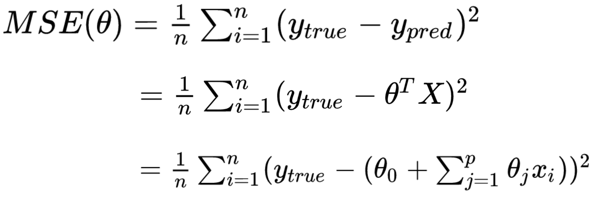
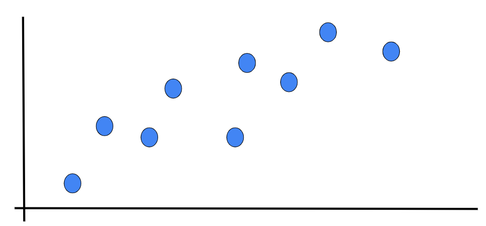

# Polynomial Regression & Overfitting

---

# What Are We Doing Here?

1.  Remind ourselves of **Linear Regression**
1.  **Polynomial Regression**: What is it and how is it different?
1.  Caution! **Dangers** of polynomial regression!
1.  Regression vs. **Interpolation** (connect the dots!)

---

<!--
We have seen linear regression and have implemented it using multiple toolkits. We found the line of best fit using optimizers such as gradient descent. Though linear regression can be a powerful predictive tool, it isn't appropriate for all types of regression problems.

Image Details:
* [polynomialregression1.gif](http://www.google.com): Copyright Google
-->

---

<!--
Take a look at this dataset for a few seconds. See if you can find a good spot to place a line.

Image Details:
* [polynomialregression2.png](http://www.google.com): Copyright Google
-->

---

<!--
This is the line that the closed form of linear regression would create. It doesn't look like a very good fit does it? The r-squared score for this line is actually 0.228.

Image Details:
* [polynomialregression3.png](http://www.google.com): Copyright Google
-->

---

<!--
We can see that if we introduce a polynomial line (in this case a 2nd degree polynomial), we get a much better looking fit. The r-squared score is now 0.790.

Image Details:
* [polynomialregression4.png](http://www.google.com): Copyright Google
-->

---

<!--
Here are a few examples of polynomial equations. The topmost is the linear equation that we are used to. The next is commonly called a quadratic equation. The third is a cubic equation. The number of factors you can add to the equation is theoretically unbounded, though you'll pay a computational expense for very large equations and also introduce the risk of overfitting (which we'll talk about soon).

Image Details:
* [polynomialregression5.png](http://www.google.com): Copyright Google
-->

---

<!--
Turn to a partner next to you and discuss the above two questions.

Image Details:
* [polynomialregression5.png](http://www.google.com): Copyright Google
-->

---

<!--
This dataset was actually randomly generated based on a polynomial equation with some random noise. You can see the line drawn in green on the chart. Our predicted line in red isn't perfect by any means. You can see a much sharper slope at both ends, but it is still better than a straight-line fit.

Image Details:
* [polynomialregression7.png](http://www.google.com): Copyright Google
-->

---

<!--
Turn to a partner next to you and discuss the above two questions.

We will now discuss using different order polynomials for regression. In particular, we will explore potential dangers of using higher order polynomial fits.

Image Details:
* [polynomialregression8.png](http://www.google.com): Copyright Google
-->

---

<!--
What could possibly go wrong if we use a polynomial to fit the following data? Brainstorm some ideas.

Image Details:
* [polynomialregression9.png](http://www.google.com): Copyright Google
-->

---

<!--
*Pretend to throw one more data point about in (B) in a region where the curve does not pass through, to show one point could throw off entire fit.*

Image Details:
* [polynomialregression10.png](http://www.google.com): Copyright Google
-->

---

# Overfitting

---

<!--
Let's think of overfitting by looking into clothing. Here, we have a person wearing a reasonably well-fitting suit.

Source: photo by NordWood Themes on Unsplash

Image Details:
* [polynomialregression11.jpg](https://unsplash.com/photos/q8U1YgBaRQk): Unsplash License
-->

---

<!--
Clothing can be a little more form-fitting, which reduces the number of people that it will fit. This is overfitting. You can think of it like a custom-tailored suit that you could never lend to someone else.

Source: photo by Hugo L. Casanova on Unsplash

Image Details:
* [polynomialregression12.jpg](https://unsplash.com/photos/GDre1q4wEJk): Unsplash License
-->

---

<!--
There is the other extreme, where you make clothing so loose that just about anyone could wear it. This would be underfitting.

Image Details:
* [polynomialregression13.jpg](https://unsplash.com/photos/Z1X6cXjn7GQ): Unsplash License
-->

---

<!--
Most of the time, you probably just want a simple, midsized, unisex t-shirt of a given style.

Image Details:
* [polynomialregression14.jpg](https://unsplash.com/photos/WWesmHEgXDs): Unsplash License
-->

---

<!--
So how does this apply to real data? Here is an illustration of overfitting a regression model. You can see how the regression line perfectly fits the data points on the graph, but it can't necessarily predict well for future x-values.

https://en.wikipedia.org/wiki/Overfitting

Image Details:
* [polynomialregression15.png](http://www.google.com): Copyright Google
-->

---

How Do You Avoid This? {.big}

<!--
Given the problem of a polynomial fitting data too closely, how would you avoid overfitting?
*Give students some time to throw out some ideas.*
-->

---

Avoiding Overfitting {.big}

* Simpler polynomial
* More training data
* Dropping out some training data
* Overfitting penalties (Regularization)

<!--
Here are some of the most common ways to avoid overfitting.

Using a polynomial function with fewer degrees is one way. If your model is introducing enough curvature to cross most training data points, then use fewer degrees in your polynomial.

Another tactic is to use more data to train your model. As your dataset grows in size, it will likely also grow in diversity and create a model that is less overfit.

If you can't collect more data to train your model, it might be possible to drop some data out of the training set to reduce the ability for your model to overfit.

And finally, there are strategies for adding penalties to the model to make even a high-degree polynomial less likely to overfit. Some common strategies are called LASSO, Ridge, and ElasticNet. We'll look at each of these more closely, and you'll experiment with them in your lab exercise.
-->

---

# Regularization

<!--
Regularization is a method of "shrinking" the coefficients in the learned equation. There are two distinct types we will look at: Lasso and Ridge.

https://medium.com/@yongddeng/regression-analysis-lasso-ridge-and-elastic-net-9e65dc61d6d3
-->

---

# Loss

<!--
What does it mean to shrink coefficients? It effectively means to increase the value of the loss function as the coefficients are calculated.

As a reminder, this is the equation of a common loss function, the residual sum of squares.

In this equation:

n = number of rows in the training data
p = coefficients in the equation
yi = target value
β0 = intercept
βi = bias at each coefficient of the polynomial equation
xi = feature value at the given factor of the polynomial equation

https://en.wikipedia.org/wiki/Residual_sum_of_squares

$$RSS(\beta) = \displaystyle\sum_{i=1}^{n} \left( y_i -\beta_0 - \displaystyle\sum_{j=1}^p \beta_j x_{i}^j \right)^2$$

Image Details:
* [polynomialregression16.png](http://www.google.com): Copyright Google
-->

---

# Lasso (L1)

<!--
Lasso is L1 regression. This means that it uses the absolute value of the coefficients and appends them to the output of the loss function.

LASSO is an acronym for "Least Absolute Shrinkage and Selection Operator".

Due to the L1 normalization, some of the coefficients are more likely set equal to zero, depending on the regularization parameter λ, which is chosen/tuned by the cross-validation.

https://en.wikipedia.org/wiki/Lasso_(statistics)

$$RSS(\beta) + \lambda \displaystyle \sum_{j=1}^p \left| \beta_j \right|$$

Image Details:
* [polynomialregression17.png](http://www.google.com): Copyright Google
-->

---

# Ridge (L2)

<!--
Ridge regularization looks similar to LASSO, but instead of appending the sum of absolute values of coefficients to the loss function, it appends the sum of squares of coefficients.

Ridge regression seeks the value of λ that minimizes the penalized or regularized RSS. As the L2 norm is differentiable, problems using the method can be solved by gradient descent.

https://en.wikipedia.org/wiki/Tikhonov_regularization

$$RSS(\beta) + \lambda \displaystyle \sum_{j=1}^p \beta_j^2$$

Image Details:
* [polynomialregression18.png](http://www.google.com): Copyright Google
-->

---

# ElasticNet (L1 + L2)

<!--
ElasticNet is the combination of L1 and L2 regularization applied to the loss function.

https://en.wikipedia.org/wiki/Elastic_net_regularization
-->

---

# Which regularization is best?

<!--
It depends.

- L1 regularization can drive coefficients to zero, and tends to produce a sparse model.
- L2 regularization is less likely to drive coefficients to zero, and tends to produce a more dense model.
- ElasticNet, as a compromise, works well in many situations.

It is probably worth experimenting with each method to see which works best for your particular model.
-->

---

Is there a way we can find a polynomial to go through the data perfectly? {.big}

---

Is there a way we can find a polynomial to go through the data perfectly? {.big}
**If so, should we do it?** {big}

---

What type of function would you use to fit the following data? {.big}

<!--
Image Details:
* [polynomialregression19.png](http://www.google.com): Copyright Google
-->

---

What type of function would you use to fit the following data? {.big}

<!--
Image Details:
* [polynomialregression20.png](http://www.google.com): Copyright Google
-->

---

What type of function would you use to fit the following data? {.big}

<!--
Image Details:
* [polynomialregression21.png](http://www.google.com): Copyright Google
-->

---

What type of function would you use to fit the following data? {.big}

<!--
Image Details:
* [polynomialregression22.png](http://www.google.com): Copyright Google
-->

---

What type of function would you use to fit the following data? {.big}

<!--
Image Details:
* [polynomialregression23.png](http://www.google.com): Copyright Google
-->

---

What type of function would you use to fit the following data? {.big}

<!--
Image Details:
* [polynomialregression24.png](http://www.google.com): Copyright Google
-->

---

Why might this be a bad idea? {.big}

<!--
Image Details:
* [polynomialregression25.png](http://www.google.com): Copyright Google
-->

---

Polynomial Interpolation != Polynomial Regression {.big}

<!--
- A linear regression may make more sense; throw in another data point, and polynomial regression results may drastically change!
- High order polynomials may be too “curvy”.
- Polynomial interpolations generally go crazy outside the region where the data was interpolated (connected)

Image Details:
* [polynomialregression26.png](http://www.google.com): Copyright Google
-->

---

Polynomial interpolations misbehave outside the data range {.big}

<!--
Image Details:
* [polynomialregression27.png](http://www.google.com): Copyright Google
-->

---

# Your Turn
