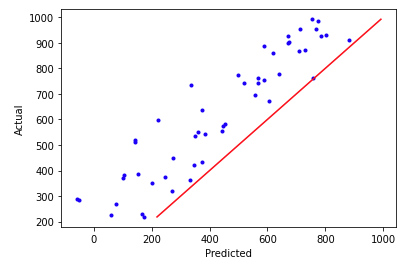

---
false
marp: true

---

# Regression Quality

<!--
So far in this course, we have spent some time building and testing regression models. But how can we measure how good these models are? In this unit we will examine a few of the ways we can measure and graph the results of a regression model in order to better understand the quality of the model.
-->

---

# Coefficient of Determination

> $$ SS_{res} = \sum_{i}(y_i - \hat{y_i})^2 $$
> $$ \bar{y} = \frac{1}{n}\sum_{i=1}^{n}y_{i} $$
> $$ SS_{tot} = \sum_{i}(y_{i}-\bar{y})^2 $$
> $$ R^{2} = 1 - \frac{SS_{res}}{SS_{tot}} $$
<!--

The coefficient of determination, denoted $R^2$, is one of the most important metrics in regression. It tells us how much of the data is "explained" by the model.

Before we can define the metric itself, we need to define a few other key terms.

A residual is the difference between the target value $y_i$ and the predicted value $\hat{y_i}$. The residual sum of squares is the summation of the square of every residual in the prediction set.

The total sum of squares is the sum of the squared differences between each value $y_i$ and their mean.

Given the total sum of squares and the residual sum of squares, we can calculate the coefficient of determination $R^2$.

The $R^2$ score measures how well the actual variance from $x$-values to $y$-values is represented in the variance between the $x$-values and the predicted $\hat{y}$-values.

Typically, this score ranges from 0 to 1, where 0 is bad and 1 is a perfect mapping. However, the score can also be negative. Can you guess why?

If a line drawn horizontally through the data points performs better than your regression, then the $R^2$ score would be negative. If you see this, try again. Your model really isn't working.

For values in the range 0-1, interpreting the $R^2$ is more subjective. The closer to 0, the worse your model is at fitting the data. And generally, the closer to 1, the better. But you also don't want to overfit. This is where testing, observation, and experience come into play.
-->

---

# Mean Squared Error (MSE)

> $$ MSE = \frac{1}{n} \sum_{n=1}^{n}(y_{i} - \hat{y_{i}})^{2} $$

<!--
The mean squared error is the measure of the values that our model predicts vs. what the values actually are. The differences are calculated, squared to get rid of negatives, and summed so that the average squared error can be found.

What is a good MSE value?

The answer really depends how perfect you want your model to be. The values of MSE are a little difficult to interpret, though. Since they are the square of the error, the units don't match the units of the target in our model. This is fine for machines training the model, but it's nearly impossible to reason about afterward.

There is a solution, though.
-->

---

# Root Mean Squared Error (RMSE)

> $$ RMSE = \sqrt{\frac{1}{n} \sum_{n=1}^{n}(y_{i} - \hat{y_{i}})^{2}} $$

<!--
The root mean squared error is simply the square root of the mean squared error. It adjusts the units of the error back to the units of the target, which makes model quality much easier to reason about.

For instance, if you have a model that predicted housing prices, and it had an RMSE of 10,000, would that model be good or bad? Since houses cost in the hundreds of thousands -- if not millions -- of dollars, an error of $10,000 doesn't seem too bad.

What about a model that predicted average global temperatures in Celsius that had an RMSE of 8? Although 8 is much smaller than 10,000, an 8 degrees Celsius change is a big deal in terms of average temperatures. Thus, 8 is probably not an acceptable RMSE for this model.
-->

---

# Mean Absolute  Error (MAE)

> $$ MAE = \frac{1}{n} \sum_{n=1}^{n}(|y_{i} - \hat{y_{i}}|) $$

<!--
Mean absolute error is calculated similarly to mean squared error. Instead of using squaring to remove negative values, the absolute value of the difference in actual and predicted values is taken.

A benefit of MAE is that the units remain the same as that of the target.

The primary difference in MAE and MSE is that MSE squares the error, which gives larger differences in value and much higher error scores. This gives extra penalty to really bad predictions.
-->

---

# Predicted vs. Actual Plots

<!--
There are numerous ways to visualize regression predictions, but one of the most basic is the "predicted vs. actual" plot.

In this case the data points scatter pretty evenly around the prediction-to-actual line (i.e., the line y=x, where the actual and predication are equal).

So what does a bad plot look like?

Image Details:
* [predicted_vs_actual.png](http://www.google.com): Copyright Google
-->

---

# Predicted vs. Actual Plots

<!--
Now we have a situation where there is an obvious bias. All predictions are higher than the actual values, so the model needs to be adjusted to make smaller predictions.

Image Details:
* [predicted_vs_actual.png](http://www.google.com): Copyright Google
-->

---

# Residual Plots

<!--
Another helpful visualization tool is to plot the regression residuals. As a reminder, residuals are the difference between the actual values and the predicted values.

We plot residuals on the y-axis against the predicted values on the x-axis and draw a horizontal line through  y=0.

Image Details:
* [residual.png](http://www.google.com): Copyright Google
-->

---

# Residual Plots

<!--
Cases where our predictions were too low are above the line. Cases where our predictions were too high are below the line.

In the "predicted vs. actual" section above, we plotted a case where there was a large positive bias in our predictions. Plotting the same biased data on a residual plot shows all of the residuals below the zero line.

Image Details:
* [residual_bias.png](http://www.google.com): Copyright Google
-->

---

# Your Turn

<!--
Let's now move on to the lab portion of the unit. In this lab you'll create and interpret various measures and interpretations of regression model quality.
-->
