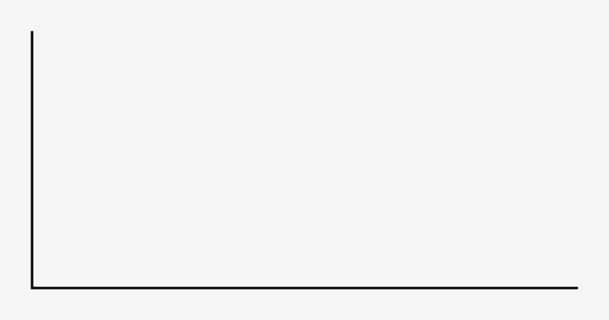
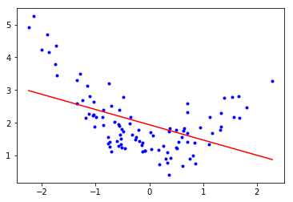

---

marp: true

---

# Polynomial Regression & Overfitting

---

# Outline

1.  Recall **Linear Regression**
1.  **Polynomial Regression**: What is it and how is it different (or not so different)?
1.  Caution! **Dangers** of polynomial regression!

---

<!--
We have seen linear regression and have implemented it using scikit-learn. We found the line of best fit using optimizers such as gradient descent. Though linear regression can be a powerful predictive tool, it isn't appropriate for all types of regression problems.

Image Details:
* [polynomialregression1.gif](https://opensource.google/docs/copyright/): Copyright Google
-->

---

<!--
Take a look at this dataset for a few seconds. See if you can find a good spot to place a line.

Image Details:
* [polynomialregression2.png](https://opensource.google/docs/copyright/): Copyright Google
-->

---

<!--
This is the line that the closed form of linear regression would create. It doesn't look like a very good fit, does it? The R-squared score for this line is actually 0.228.

Image Details:
* [polynomialregression3.png](https://opensource.google/docs/copyright/): Copyright Google
-->

---

<!--
We can see that if we introduce a polynomial line (in this case, a 2nd degree polynomial), we get a much better looking fit. The R-squared score is now 0.790.

Image Details:
* [polynomialregression4.png](https://opensource.google/docs/copyright/): Copyright Google
-->

---

<!--
Here are a few examples of polynomial equations. The topmost is the linear equation we are used to. The next is commonly called a quadratic equation. The third is a cubic equation. The number of factors you can add to the equation is theoretically unbounded, though you'll pay a computational expense for polynomials of higher degree and also increase the risk of overfitting. We'll get to that soon.

Image Details:
* [polynomialregression5.png](https://opensource.google/docs/copyright/): Copyright Google
-->

---

<!--
@Exercise (3 minutes) {
Ask students to turn to a partner next to them and discuss the two questions on the slide.
}

Image Details:
* [polynomialregression5.png](https://opensource.google/docs/copyright/): Copyright Google
-->

---

<!--
This dataset was actually randomly generated based on a polynomial equation with some random noise. You can see the original polynomial line drawn in green on the chart. Our predicted line in red isn't perfect by any means. You can see a much sharper slope at both ends, but it is still better than a straight-line fit.

Image Details:
* [polynomialregression7.png](https://opensource.google/docs/copyright/): Copyright Google
-->

---

<!--
If we understand the process behind polynomial regression, we can see that it is not so different from linear regression. Ultimately, in order to reduce error in our model, we are still attempting to find the most accurate weights and biases we can find.

Image Details:
* [polynomialregression8.png](https://opensource.google/docs/copyright/): Copyright Google
-->

---

# Polynomial Regression = Linear Regression

Turn the original polynomial regression probem into a polynomial regression problem with multiple features

<!--
To find the weights and biases for a polynomial regression model, we recast the problem as a multivariate linear regression problem. Then we are able to use all the machinery we've already developed to "learn" the parameters.

Image Details:
* [polynomialregression19.png](https://opensource.google/docs/copyright/): Copyright Google
-->

---

# Overfitting

<!--
We will now explore the potential dangers of using higher-order polynomial fits.
-->

---

<!--
What could possibly go wrong if we use a polynomial model to fit the following data? Brainstorm some ideas.

Image Details:
* [polynomialregression9.png](http://www.google.com): Copyright Google
-->

---

<!--
*Pretend to throw one more data point into (B) in a region where the curve does not pass through (perhaps above the second valley).*

It is clear that (B) is not able to generalize to new data points.

Image Details:
* [polynomialregression10.png](http://www.google.com): Copyright Google
-->

---

<!--
Let's think of overfitting by looking into clothing. Here, we have a person wearing a reasonably well-fitting shirt.

Image Details:
* [polynomialregression11.jpg](https://unsplash.com/photos/q8U1YgBaRQk): Unsplash License
-->

---

<!--
Clothing can be a little more form-fitting, which reduces the number of people that it will fit. This is overfitting. You can think of it like a custom-tailored suit of armor that you could never lend to someone else.

Image Details:
* [polynomialregression12.jpg](https://unsplash.com/photos/GDre1q4wEJk): Unsplash License
-->

---

<!--
There is the other extreme, where you make clothing so loose that just about anyone could wear it. This would be underfitting.

Image Details:
* [polynomialregression13.jpg](https://unsplash.com/photos/Z1X6cXjn7GQ): Unsplash License
-->

---

<!--
Most of the time, you probably just want a simple, midsized, unisex t-shirt of a given style.

Image Details:
* [polynomialregression14.jpg](https://unsplash.com/photos/WWesmHEgXDs): Unsplash License
-->

---

<!--
So how does this apply to real data? Here is an illustration of overfitting a regression model. You can see how the regression line perfectly fits the data points on the graph, but it can't necessarily predict well for future x-values.

https://en.wikipedia.org/wiki/Overfitting

Image Details:
* [polynomialregression15.png](http://www.google.com): Copyright Google
-->

---

# How Do We Avoid This?

<!--
Given the problem of a polynomial fitting data too closely, how would you avoid overfitting?

*Give students some time to throw out some ideas.*
-->

---

# Avoiding Overfitting

* Simpler polynomial
* More training data
* Dropping out some training data
* Overfitting penalties (Regularization)

<!--
Here are some of the most common ways to avoid overfitting.

Using a polynomial function with fewer degrees is one way. If your model is introducing enough curvature to cross most training data points, then use fewer degrees in your polynomial.

Another tactic is to use more data to train your model. As your dataset grows in size, it will likely also grow in diversity and create a model that is less overfitted.

If you can't collect more data to train your model, it might be possible to drop some data out of the training set to reduce the ability for your model to overfit.

And finally, there are strategies for adding penalties to the model to make even a high-degree polynomial less likely to overfit. Some common strategies are called Lasso, Ridge, and ElasticNet. We'll look at each of these more closely, and you'll experiment with them in your lab exercise.
-->

---

# Regularization

<!--
Regularization is a method of "shrinking" the coefficients in the learned equation. There are many types of regularizers, but we will look at the most common ones here. They are Lasso, Ridge, and ElasticNet.

https://medium.com/@yongddeng/regression-analysis-lasso-ridge-and-elastic-net-9e65dc61d6d3
-->

---

# Recall: Mean Squared Error

<!--
As a reminder, this is the equation of a common loss function, the mean squared error.

In this equation we have the following:

Line 1: (y_true - y_pred) is the error between the true target and the predicted target from the model.

Line 2: Recall that y_pred came from a linear regression equation, which can be written in matrix notation. Theta is a vector consisting of the bias term and the weights, and X is our features.

Line 3: Completing the matrix multiplication and writing the multivariate regression formula using the notation:
  * n = number of rows in the training data
  * p = coefficients in the equation (also number of features)
  * y_true = true target value
  * theta_0 = intercept
  * theta_j = coefficients of the polynomial equation
  * x_i = feature values

Image Details:
* [polynomialregression20.png](http://www.google.com): Copyright Google
-->

---

# Lasso (L1)

<!--
What does it mean to shrink coefficients? It effectively means to increase the value of the loss function as the coefficients are calculated.

Lasso is L1 regression. This means that it uses the absolute value of the coefficients and appends them to the output of the loss function. We can see that by adding the absolute value of theta_j (a positive number), the cost function is always slightly larger than the regular MSE loss function. This is going to force the model to make the thetas slightly smaller.

Smaller coefficients make the model "more linear." For example, imagine we have y = theta_0 + theta_1(x) + theta_2(x^2) + theta_3(x^3), where theta_2 and theta_3 are very very small (almost 0). Then the function is almost linear. So smaller coefficients effectively control the model to scale back curvature and reduce overfitting.

LASSO is an acronym for "Least Absolute Shrinkage and Selection Operator."

Due to the L1 regularization, some of the coefficients may actually equal zero. How many coefficients go to zero depends on the regularization parameter λ, which is chosen/tuned by cross-validation. Because of the fact that some coefficients may go to zero, L1 regularization can be used for dimensionality reduction. That is, we can identify which features are most important for predicting our target and remove the features whose coefficient goes to zero.

Image Details:
* [polynomialregression17.png](http://www.google.com): Copyright Google
-->

---

# Ridge (L2)

<!--
Ridge regularization looks similar to LASSO, but instead of appending the sum of absolute values of coefficients to the loss function, it appends the sum of squares of coefficients.

Ridge regularization seeks the value of λ that minimizes the penalized or regularized RSS (residual sum of squares). As the L2 norm is differentiable, problems using the method can be solved by gradient descent.

Image Details:
* [polynomialregression18.png](http://www.google.com): Copyright Google
-->

---

# ElasticNet (L1 + L2)

<!--
ElasticNet is the combination of L1 and L2 regularization applied to the loss function.

https://en.wikipedia.org/wiki/Elastic_net_regularization
-->

---

# Which Regularization Is Best?

<!--
It depends.

- L1 regularization can drive coefficients to zero, and it tends to produce a sparse model (and result in feature selection).
- L2 regularization is less likely to drive coefficients to zero, and it tends to produce a more dense model.
- ElasticNet, as a compromise, works well in many situations.

It is probably worth experimenting with each method to see which works best for your particular model.
-->

---

# Your Turn
