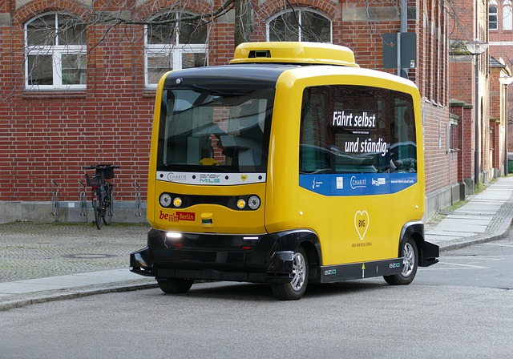
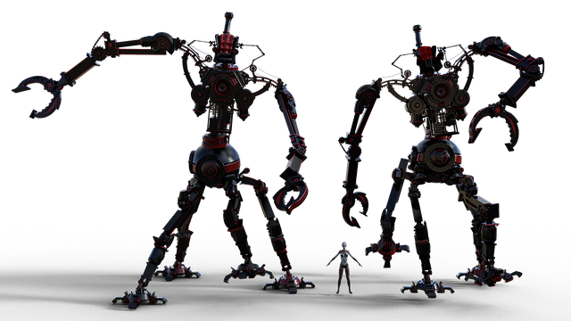
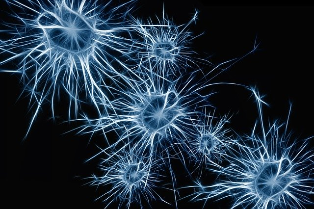
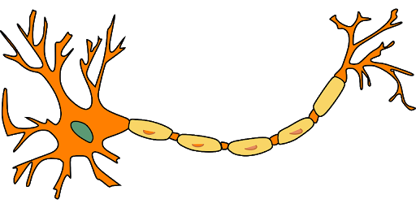
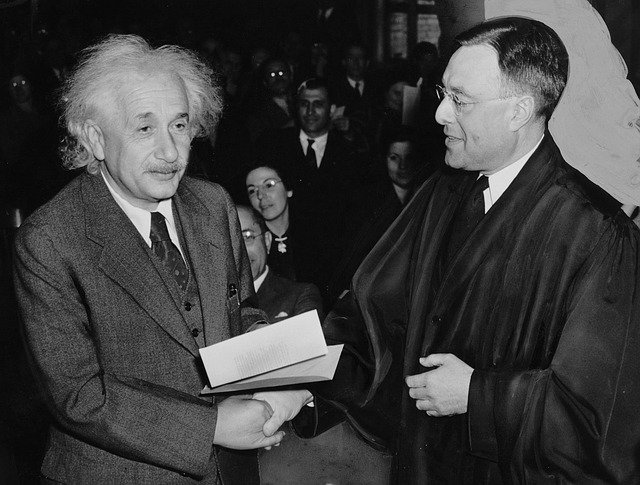
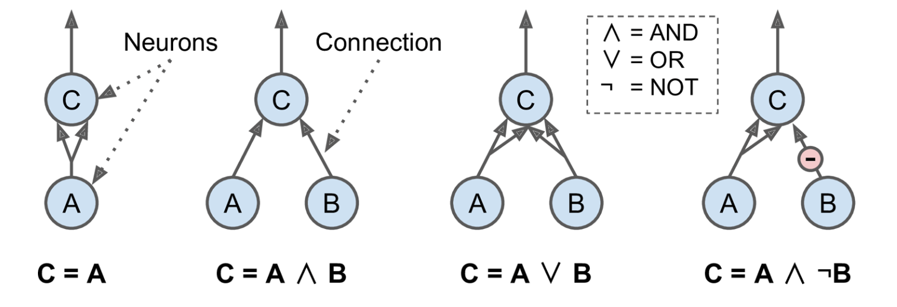
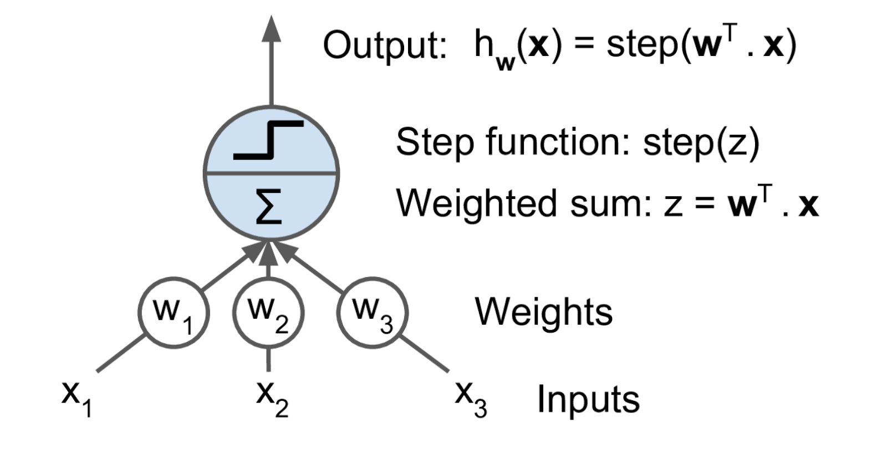
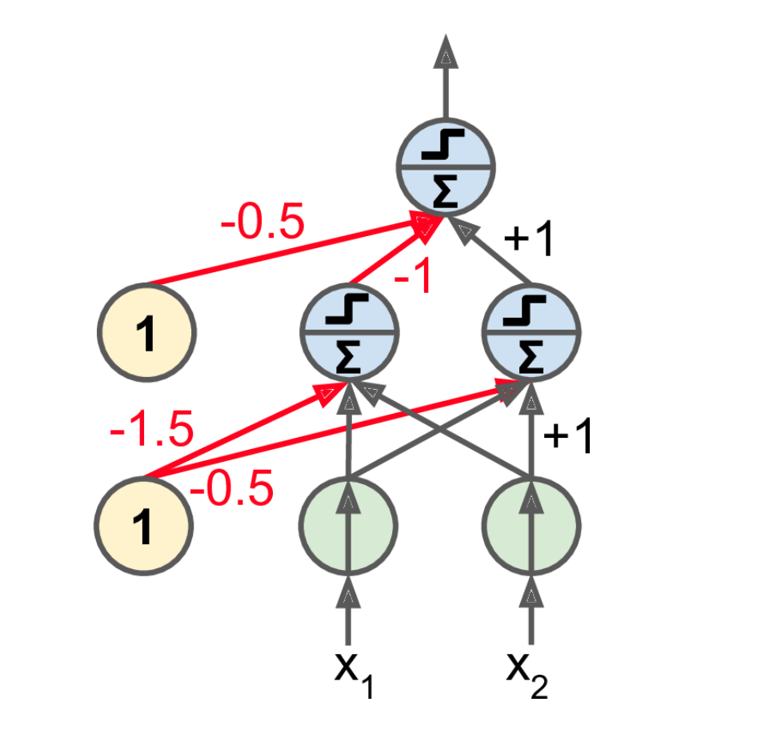
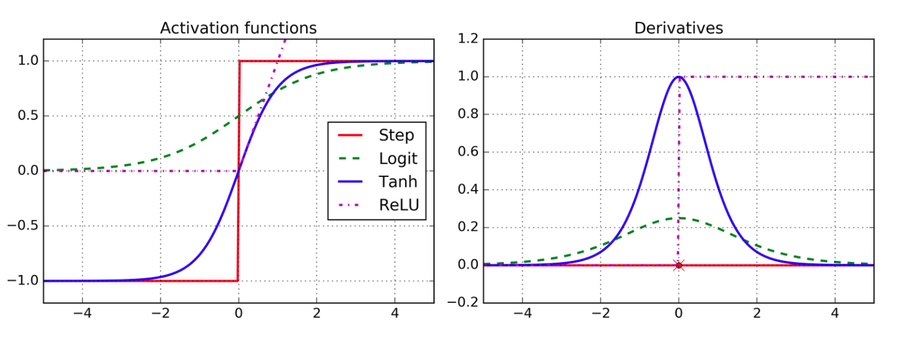
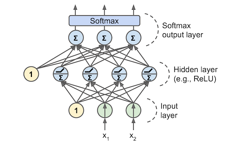

# Neural Networks
## *Deep learning inspired by nature*

<!--
So far we have used classic machine learning models. These models are powerful and have proven useful for a wide range of applications.

It is likely that you have heard about neural networks and deep learning. These concepts are in vogue right now. Depending on your perspective, deep learning and neural networks are either going to be a giant leap forward for humanity, are going to destory us all, or are over-hyped tools with limited application.

There is likely a litte truth to each of these opinions.
-->

---

# Neural Networks: Good?

<!--
Deep learning is a giant leap forward for humanity. We can now program machines to excel at tasks that we once thought only humans could master. Computers can drive cars, interpret medical imaging, create art, and play complex games at a human-expert level or better.

Image Details:
* [car.jpg](https://pixabay.com/photos/vehicle-autonomous-4759347/): Pixabay License
-->

---

# Neural Networks: Bad?

<!--
There is also the fear that deep learning will have huge negative impacts on society. The images of a terminator are likely overblown, but there is real concern that advanced deep learning algorithms will have negative effects on some people.

Distruptive technologies like self-driving cars will displace millions of workers.

Societal bias (concious or not) can become encoded in deep learning algorithms, multiplying and normalizing the negative effects that have existed for decades. 

Great care must be taken when using deep learning to remove bias and to understand the implcations of mass application of the algorithms.

Image Details:
* [terminator.jpg](https://pixabay.com/illustrations/bot-cyborg-robot-helper-arm-chair-4875211/: Pixabay License
-->

---

# Neural Networks: Hype?

<!--
And finally, there are those that think that deep learning and neural networks are just hype. For every person that thinks a technological reveloution is around the corner, there is another pointing out how specialized and controlled the environment has to be for machine learning algorithms to perform well.

Deep learning doesn't progress at an even pace. We are currently in a deep learning boom, but this has happened before. There have been two "AI Winters" where researchers thought that we were on the cusp of a reveloution only to have research in neural networks go dormant for a while.

We'd like to think that this time might be different. Computation is finally fast enough and has enought scale that algorithms designed decades ago can finally be impelmented and trained in an effective manner.

Only time will tell if deep learning can live up to expectations. What we can do now is learn about it, be thoughful about how we train and use it, and continue to innovate cautiously.

Image Details:
* [hype.jpg](https://unsplash.com/photos/NrtC3y108Ys): Unsplash License
-->

---

# Neural Networks: Inspired by Nature

<!--
We've talked about what people think neural networks can and cannot do, but we really haven't talked about what neural networks are. And why are they even called neural networks?

Nature can be a source of inspiration. Birds inspired man to fly. The burdock plant was the inspiration for velcro. Even in the computer science realm we hear references to trees, forests, and other things that occur in nature.

Image Details:
* [nature.png](https://pixabay.com/photos/burdock-thistle-prickly-stick-barb-745306/): Pixabay License
* [nature.png](https://pixabay.com/photos/nike-baby-shoes-shoe-baby-velcro-1201595/): Pixabay License
* [nature.png](https://pixabay.com/photos/bird-seagull-flying-wings-gull-3158784/): Pixabay License
* [nature.png](https://pixabay.com/photos/plane-aircraft-take-off-sky-50893/): Pixabay License
-->

---

# Neural Networks: Inspired by Nature

<!--
Similar to the examples in the last slide, neural networks are inspired by nature. The brain contains a massive network of neurons that send electrical signals that activate other neurons. Through this network we are able to think.

Neural networks were inspired by the brain, hence the name.

Image Details
* [neurons.jpg](https://pixabay.com/illustrations/neurons-brain-cells-brain-structure-1773922/)
-->

---

# Neural Networks: Inspired by Nature

<!--
This is the building block of the brain: a neuron.

A neuron is just a cell with a nucleus and cell body like any other cell. One of the distinguishing features of the neuron is the 'axon', which is the long tail of the neuron. The tip of the axon has synaptic terminals that attach to other neuron bodies. A neuron body receives signals from the synapse of neurons before it. When those signals reach a critical point within a fixed period of time, the receiving neuron fires, sending a signal to later neurons.

Image Details:
* [neuron.png](https://pixabay.com/vectors/neuron-nerve-cell-axon-dendrite-296581/): Pixabay License
-->

---

# Neural Networks: Inspired by Nature

<!--
This builds a web of neurons called a "neural network"

This simplification of the brain signaling pathway lead to research into "artificial neural networks" with different types of neurons.

Beyond this network effect, the concept of neural networks tends to break away from biology. Similarly, birds inspired flight, but modern airplanes don't flap their wings.

We find inspiration in nature. We don't have to copy it.

Image Details
* [neurons.jpg](https://pixabay.com/illustrations/neurons-brain-cells-brain-structure-1773922/)
-->

---

# Neural Networks: Cutting Edge

<!--
When did neural networks originate? The 1940s.

1940s! I thought neural networks were cutting edge?

Many of the fundamental algorithms that we use today are rooted in thought experiments from the 1940s, but it has been a long journey from then until where we are today.

Computing power and data storage that we have today is nearly unimaginable compared to what was available, even in the recent past. Also, many of the early ideas were foundational, but have been improved upon over time.

The idea of deep learning is not new. There were even a few "AI winters" over the last 80 years that stalled development and research in deep learning. It feels like we might finally be at a point where the theoretical ideas of the past can be fulfilled with the technologies of today.

Image Details:
* [einstein.png](https://pixabay.com/photos/albert-einstein-scientists-physicist-62931/)
-->

---

# Artificial Neural Networks (ANN)

<!--
Today we will talk about artificial neural networks. These are computational networks inspired by biological systems.

ANN is a big umbrella. There are "feed-forward" networks. There is a concept of "backpropagation". And there are specific types of networks such as convolutional neural networks (CNN) and recurrent neural networks (RNN) that we will look at in more detail.
-->
---

# Neurons

<!--
Let's first take a look at a naive neuron. This type of neuron receives signals and makes a decision. There are pass-through/identity neurons, "And" neurons. "Or" neurons. And "Not" neurons.

These neurons are the building blocks from the 40s. They can build a computational system of signals that can be used to make decisions.

Image Details:
* [neurnet06.png](http://www.oreilly.com): Unliscensed
-->

---

# Perceptrons

<!--
The simple on/off model can be effective, but in practice there is a better type of neuron for many applications: the perceptron

The perceptron (circa 1957) is a different type of neuron layer. It is composed of TLUs. Each TLU is a neuron which inputs weighted values and has a step function that only fires if the weights are over some threshold.

These are built on TLUs (Threshold Logic Units).

Image Details:
* [neurnet07.png](http://www.oreilly.com): Unliscensed
-->

---

# Perceptrons

<!--
This perceptron has two inputs (plus a bias) and three TLUs.

The perceptron is trained by reinforcing connections that fire together and produce a correct output.

Image Details:
* [neurnet08.png](http://www.oreilly.com): Unliscensed
-->

---

# Multilayer Perceptron

<!--
Multilayer perceptron. This is used to get more advanced calculations, such as XOR, but also obfuscates the decision making rationale of the algorithm. 

Image Details:
* [neurnet09.png](http://www.oreilly.com): Unliscensed
-->

---

# Backpropogation

<!--
Let’s make this even shorter: for each training instance the backpropagation algorithm first makes a prediction (forward pass), measures the error, then goes through each layer in reverse to measure the error contribution from each connection (reverse pass), and finally slightly tweaks the connection weights to reduce the error (Gradient Descent step).
-->

---

# Activation Functions

<!--
The choice of activation function is important. RELU makes differentiation difficult, but actually works in practice. The other functions are also very useful.

Image Details:
* [neurnet10.png](http://www.oreilly.com): Unliscensed
-->

---

# Activation Functions: Softmax

<!--
Softmax is often used at the end of a neural network in classification functions. It can pick the most probable output neuron.

Image Details:
* [neurnet11.png](http://www.oreilly.com): Unliscensed
-->