<style>
img[alt~="center"] {
  display: block;
  margin: 0 auto;
}
</style>

# Neural Networks

<!--
So far we have used classic machine learning models. These models are powerful and have proven useful for a wide range of applications.

It is likely that you have heard about neural networks and deep learning. These concepts are in vogue right now. Depending on your perspective, deep learning and neural networks are either going to be a giant leap forward for humanity, are going to destory us all, or are over-hyped tools with limited application.

There is likely a litte truth to each of these opinions.
-->

---

# Neural Networks: Good?


<!--
Deep learning is a giant leap forward for humanity. We can now program machines to excel at tasks that we once thought only humans could master. Computers can drive cars, interpret medical imaging, create art, and play complex games at a human-expert level or better.

Image Details:
* [car.jpg](https://pixabay.com/photos/vehicle-autonomous-4759347/): Pixabay License
-->

---

# Neural Networks: Bad?


<!--
There is also the fear that deep learning will have huge negative impacts on society. The images of a terminator are likely overblown, but there is real concern that advanced deep learning algorithms will have negative effects on some people.

Distruptive technologies like self-driving cars will displace millions of workers.

Societal bias (concious or not) can become encoded in deep learning algorithms, multiplying and normalizing the negative effects that have existed for decades. 

Great care must be taken when using deep learning to remove bias and to understand the implcations of mass application of the algorithms.

Image Details:
* [terminator.jpg](https://pixabay.com/illustrations/bot-cyborg-robot-helper-arm-chair-4875211/: Pixabay License
-->

---

# Neural Networks: Hype?


<!--
And finally, there are those that think that deep learning and neural networks are just hype. For every person that thinks a technological reveloution is around the corner, there is another pointing out how specialized and controlled the environment has to be for machine learning algorithms to perform well.

Deep learning doesn't progress at an even pace. We are currently in a deep learning boom, but this has happened before. There have been two "AI Winters" where researchers thought that we were on the cusp of a reveloution only to have research in neural networks go dormant for a while.

We'd like to think that this time might be different. Computation is finally fast enough and has enought scale that algorithms designed decades ago can finally be impelmented and trained in an effective manner.

Only time will tell if deep learning can live up to expectations. What we can do now is learn about it, be thoughful about how we train and use it, and continue to innovate cautiously.

Image Details:
* [hype.jpg](https://unsplash.com/photos/NrtC3y108Ys): Unsplash License
-->

---

# History & Motivation

<!--
Let's first look at some history and motivation for neural networks. 
-->

---

# Neural Networks: Inspired by Nature


<!--
We've talked about what people think neural networks can and cannot do, but we really haven't talked about what neural networks are. And why are they even called neural networks?

Nature can be a source of inspiration. Birds inspired man to fly. The burdock plant was the inspiration for velcro. Even in the computer science realm we hear references to trees, forests, and other things that occur in nature.

Image Details:
* [nature.png](https://pixabay.com/photos/burdock-thistle-prickly-stick-barb-745306/): Pixabay License
* [nature.png](https://pixabay.com/photos/nike-baby-shoes-shoe-baby-velcro-1201595/): Pixabay License
* [nature.png](https://pixabay.com/photos/bird-seagull-flying-wings-gull-3158784/): Pixabay License
* [nature.png](https://pixabay.com/photos/plane-aircraft-take-off-sky-50893/): Pixabay License
-->

---

# Neural Networks: Inspired by Nature


<!--
Similar to the examples in the last slide, neural networks are inspired by nature. The brain contains a massive network of neurons that send electrical signals that activate other neurons. Through this network we are able to think.

This is the building block of the brain: a neuron.

A neuron is just a cell with a nucleus and cell body like any other cell. One of the distinguishing features of the neuron is the 'axon', which is the long tail of the neuron. The tip of the axon has synaptic terminals that attach to other neuron bodies. A neuron body receives signals from the synapse of neurons before it. When those signals reach a critical point within a fixed period of time, the receiving neuron fires, sending a signal to later neurons.

Neural networks were inspired by neurons and connections between neurons in the brain, hence the name. 

Image Details:
* [neuron.png](https://pixabay.com/vectors/neuron-nerve-cell-axon-dendrite-296581/): Pixabay License
-->

---

# Neural Networks: Inspired by Nature


<!--
This builds a web of neurons called a "neural network"

This simplification of the brain signaling pathway lead to research into "artificial neural networks" with different types of neurons.

Beyond this network effect, the concept of neural networks tends to break away from biology. Similarly, birds inspired flight, but modern airplanes don't flap their wings.

We find inspiration in nature. We don't have to copy it.

Image Details
* [neurons.jpg](https://pixabay.com/illustrations/neurons-brain-cells-brain-structure-1773922/)
-->

---

# Neural Networks: Cutting Edge


<!--
When did neural networks originate? The 1940s.

1940s! I thought neural networks were cutting edge?

Many of the fundamental algorithms that we use today are rooted in thought experiments from the 1940s, but it has been a long journey from then until where we are today.

Computing power and data storage that we have today is nearly unimaginable compared to what was available, even in the recent past. Also, many of the early ideas were foundational, but have been improved upon over time.

The idea of deep learning is not new. There were even a few "AI winters" over the last 80 years that stalled development and research in deep learning. It feels like we might finally be at a point where the theoretical ideas of the past can be fulfilled with the technologies of today.

Image Details:
* [einstein.png](https://pixabay.com/photos/albert-einstein-scientists-physicist-62931/)
-->

---

# Artificial Neural Networks (ANN)

<!--
Today we will talk about artificial neural networks. These are computational networks inspired by biological systems.

ANN is a big umbrella. There are "feed-forward" networks. There is a concept of "backpropagation." And there are specific types of networks such as convolutional neural networks (CNN) and recurrent neural networks (RNN) that we will look at in more detail in future units.
-->

---

# Artificial Neural Networks (ANN)

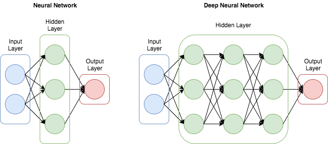

<!--
These are the typical diagrams you see to depict an artifical neural network. On the left, we have our "input layer." This is where we feed our feature data into the model. In these two diagrams, there are two features (depicted by the two blue dots on the far left of the schematic).

The feature information then flows into "hidden layers." In these hidden layers matheamtical operations are performed to extract patterns from the feature data. We'll talk more about this math on future slides. 

Finally, the transformed feature data flows to the output layer, which returns our predicted target values. 

The main idea is that if neurons in one layer "fire," then using the connections to the next layer, we can determine which neurons in the next layer will fire. For now, it is useful to think of a neuron firing as a 1 and not firing as a 0. It is true that more sophisticated neural networks take into account the intensity of a "fire" (i.e. fired at 50% vs fired at 100%), but for the sake of discussion let's stick with the 1 or 0 model. 

Image Details:
* [ann.png](http://www.google.com): Unlicensed

-->

---

# Perceptron

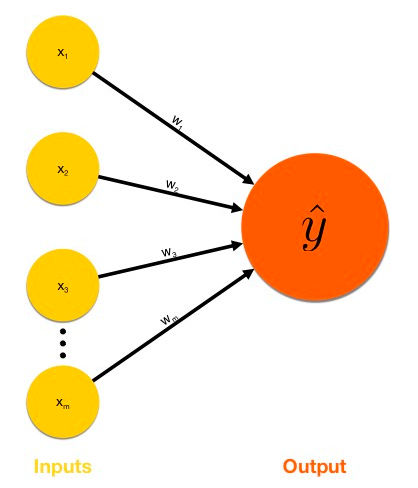

<!--
1958 - Frank Rosenblatt - An American psychologist attempted to build a machine called a perceptron. 

We can think of the perceptron as the building block of neural networks. The perceptron has no hidden layers. We feed our features into the left side, do computation, and receive a predicted target. 

This looks strikingly similar to the models we've been builing in this course. And that's no accident! We can think of a linear regression model as a perceptron. 

But what are those mystery computations that take place on the black lines? There are weights, w_{1}, ..., w_{m}, that are used in these computations. How does that work? Let's look closer at what's happening behind the scenes along those black lines. 

Image Details:
* [perceptron.png](https://towardsdatascience.com/introducing-deep-learning-and-neural-networks-deep-learning-for-rookies-1-bd68f9cf5883): Unlicensed
-->

---

# Perceptron

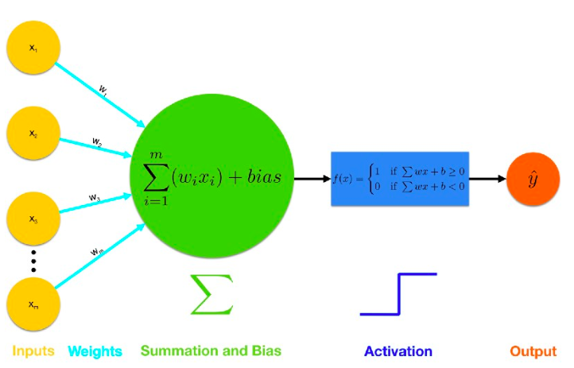

<!--
The green and blue compartments show the computations taking place in the connections bewteen the input layer and output layer of a perceptron. 

This looks strikingly similar to the models we've been builing in this course. And that's no accident! We can think of a linear regression model as a perceptron. 

The features are denoted by x_{i}. The weights w_{i} are playing the same role as the weights in our linear regression model. If we build a vectors W = [w_{1}, w_{2}, ..., w_{m}] and X = [x_{1}, x_{2}, ..., x_{m}], then the green computation is simply  W^{T}X + b  (which is exactly the same as a regression model target = bias + w_{1}x_{1} + w_{2}x_{2} + w_{m}x_{m}).

This information is then sent to an "activation function," which uses the information from the green computation to determine whether or not the next neuron should fire. In a linear regression example, the activation function might be f(x) = x (in other words, the activation function plays no role). But let's look at a slightly more interesting example and walk through these details in a little more depth. 

Image Details:
* [perceptron2.png](https://towardsdatascience.com/introducing-deep-learning-and-neural-networks-deep-learning-for-rookies-1-bd68f9cf5883): Unlicensed
-->

---

# Perceptron Example

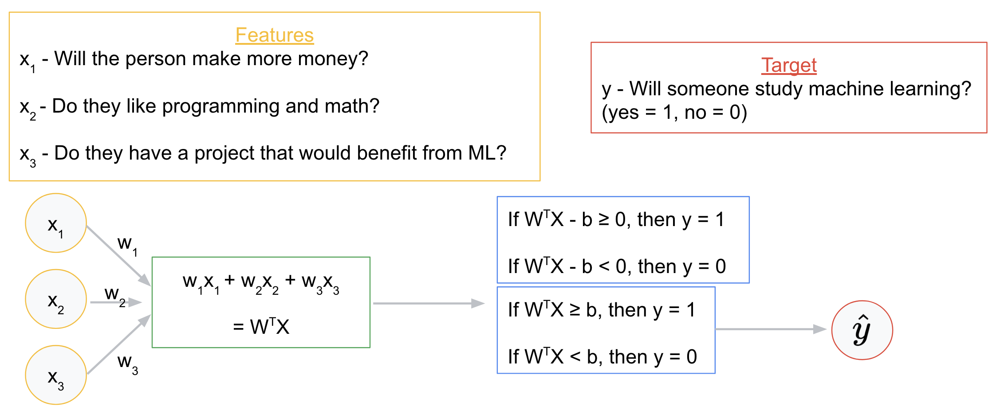

<!--
Suppose we want to 

Image Details:
* [perceptron_example.png](http://www.google.com): Copyright Google
-->

---

# Machine Learning Process

1. Infer/Predict/Forecast
1. Calculate Error/Loss/Cost
1. Train/Learn
1. Iterate (until some stopping condition)

<!--

-->

---

# Perceptron Example

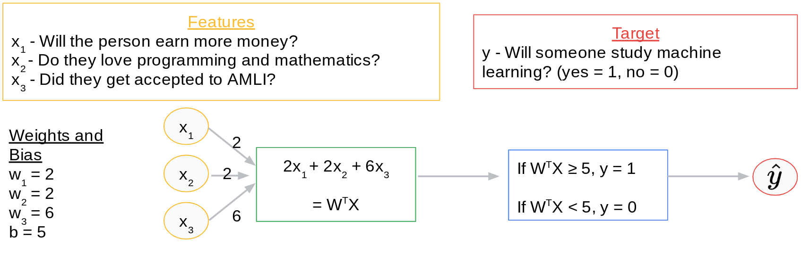

<!--
Image Details:
* [perceptron_example_01.png](http://www.google.com): Copyright Google
-->

---

# Perceptron Example


<!--
Image Details:
* [perceptron_example_02.png](http://www.google.com): Copyright Google
-->

---

# Perceptron Example

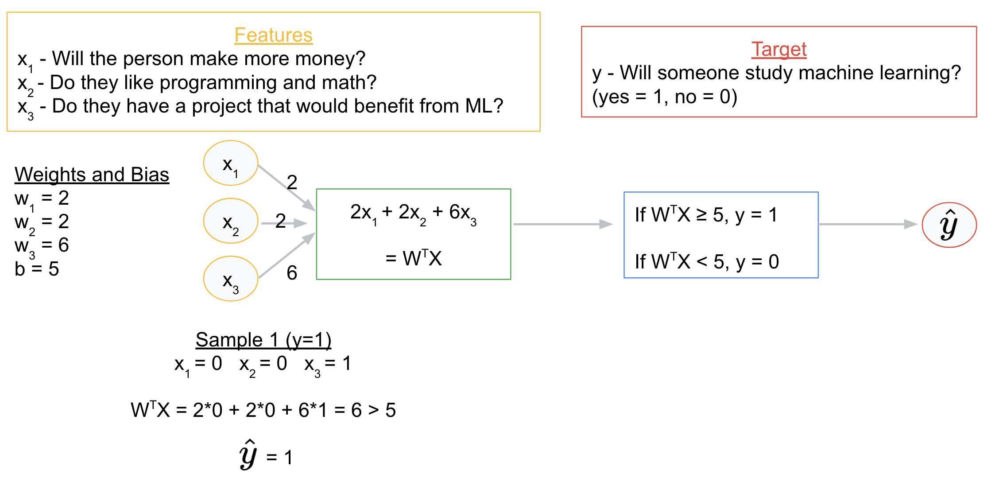

<!--
Image Details:
* [perceptron_example_03.png](http://www.google.com): Copyright Google
-->

---

# Perceptron Example

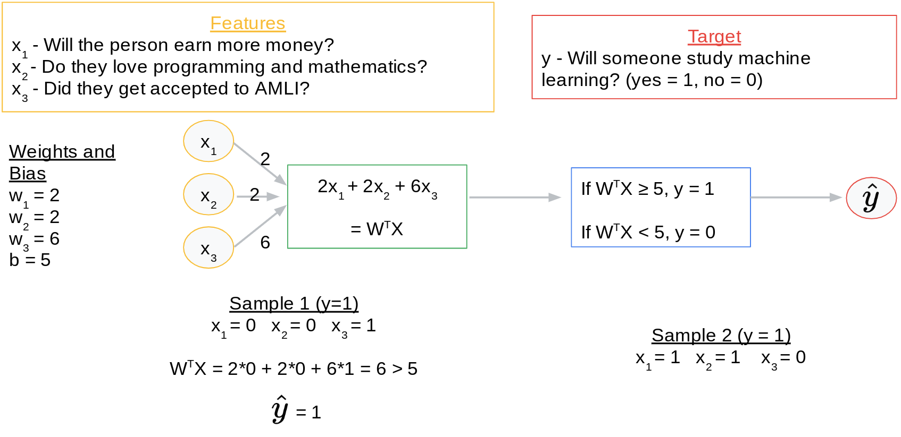

<!--
Image Details:
* [perceptron_example_04.png](http://www.google.com): Copyright Google
-->

---

# Perceptron Example

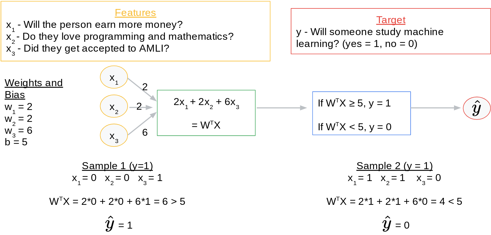

<!--
Image Details:
* [perceptron_example_05.png](http://www.google.com): Copyright Google
-->

---

# Perceptron Example

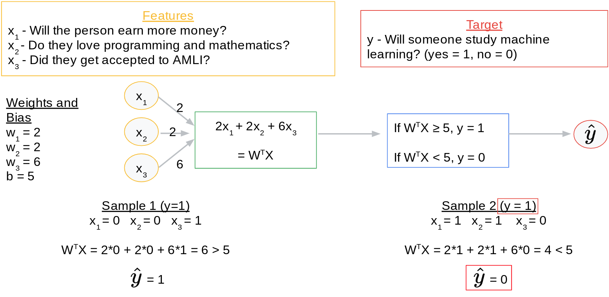

<!--
Image Details:
* [perceptron_example_06.png](http://www.google.com): Copyright Google
-->

---

# Perceptron Example

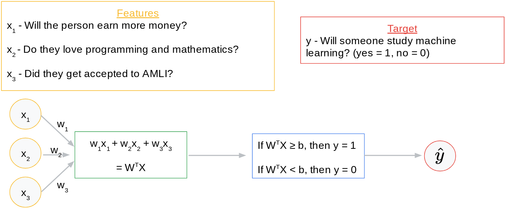

<!--
Image Details:
* [perceptron_example_07.png](http://www.google.com): Copyright Google
-->

---

# Perceptron Example

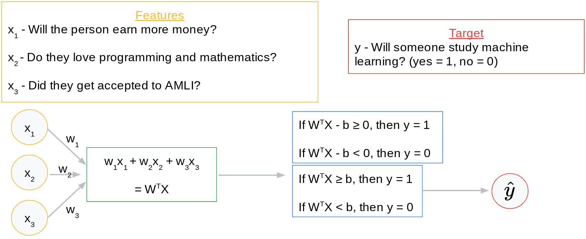

<!--
Image Details:
* [perceptron_example_08.png](http://www.google.com): Copyright Google
-->

---

# Perceptron Example

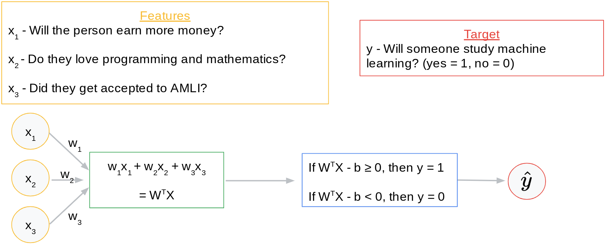

<!--
Image Details:
* [perceptron_example_09.png](http://www.google.com): Copyright Google
-->

---

# Perceptron Example

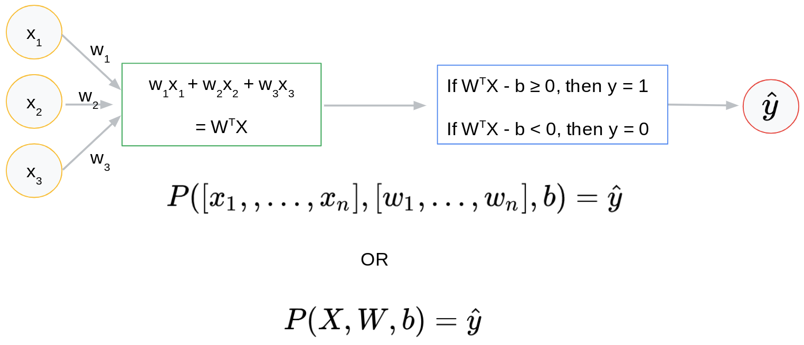

<!--
Image Details:
* [perceptron_example_10.png](http://www.google.com): Copyright Google
-->

---

# Perceptrons


<!--
1958 - Frank Rosenblatt - An American psychologist attempted to build a machine called a perceptron. 

Image Details:
* [perceptrons.png](https://towardsdatascience.com/introducing-deep-learning-and-neural-networks-deep-learning-for-rookies-1-bd68f9cf5883): Unlicensed

-->

---

# Networks With Hidden Layers

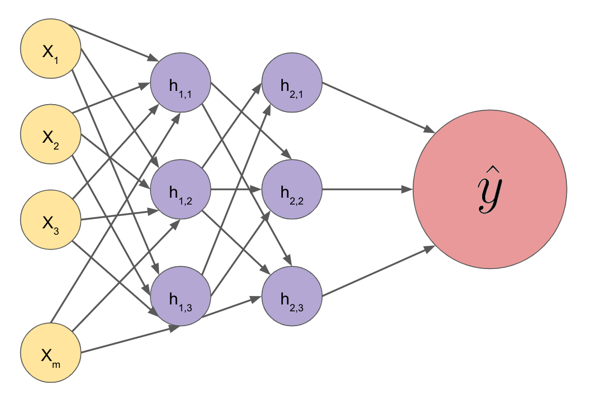

<!--
Image Details:
* [hidden_layers.png](http://www.google.com): Unlicensed
-->

---

# Networks With Hidden Layers

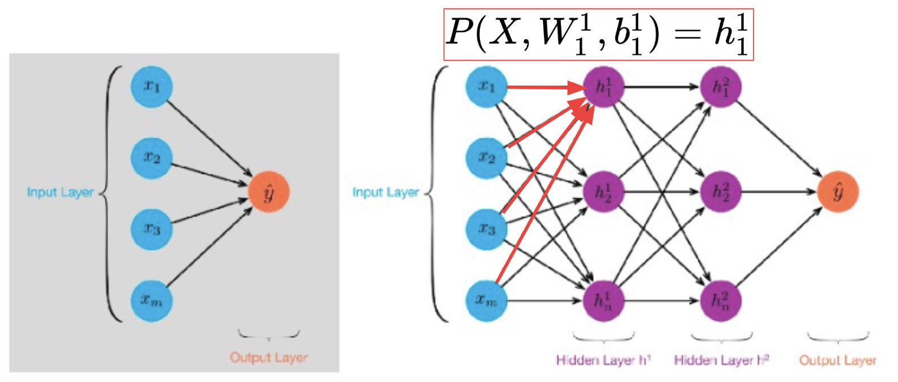

<!--
Image Details:
* [hidden_layers.png](http://www.google.com): Unlicensed
-->

---

# Networks With Hidden Layers

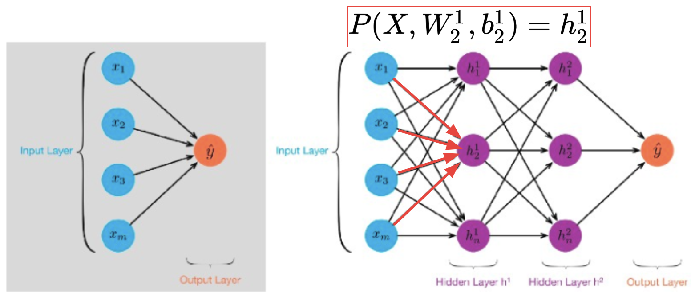

<!--
Image Details:
* [hidden_layers.png](http://www.google.com): Unlicensed
-->

---

# Let’s go through some of this on the board...

<!--

-->

---

# Summary

1. Infer/Predict/Forecast
    * Compute f(X, W, B) - compositions of f and lots of matrix mult
1. Calculate Error/Loss/Cost
    * MSE, MAE, etc.
1. Train/Learn
    * Change W and B in direction to minimize cost
    * Gradient descent -> derivative -> chain rule -> backpropagation
1. Iterate (until some stopping condidtion)

<!--

-->

---

# Issues with this plan? 

```
f(x) =  1 if x ≥ 0
        0 if x < 0
````

The step function, f, is not the greatest activation function.
* `f` is not differentiable at 0
* `f’(x) = 0` for all x other than 0
* `f` only returns 0 or 1 (as opposed to a confidence) 

<!--

-->

---

# Sigmoid

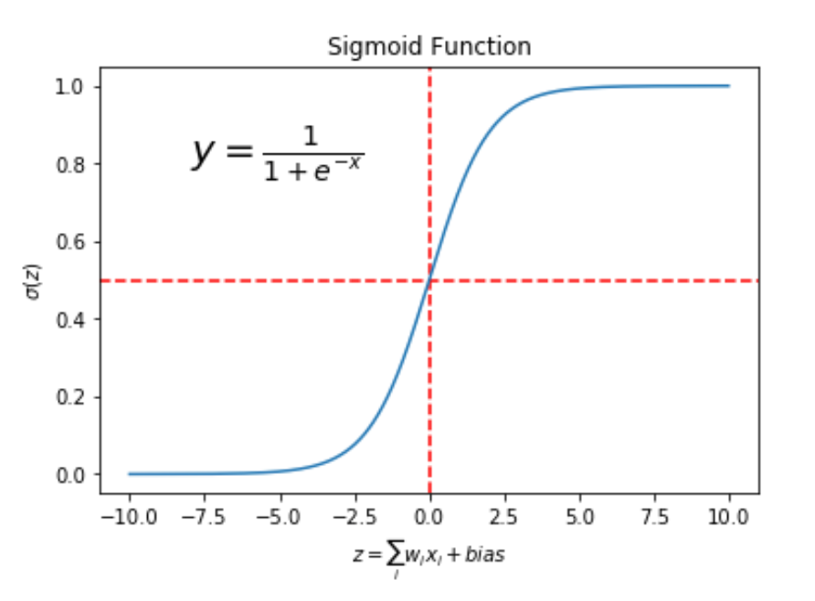

<!--
Image Details:
* [sigmoid.png](http://www.gogole.com): Unlicensed
-->

---

# Backpropogation

<!--
Let’s make this even shorter: for each training instance the backpropagation algorithm first makes a prediction (forward pass), measures the error, then goes through each layer in reverse to measure the error contribution from each connection (reverse pass), and finally slightly tweaks the connection weights to reduce the error (Gradient Descent step).
-->

---

# Activation Functions


<!--
The choice of activation function is important. RELU makes differentiation difficult, but actually works in practice. The other functions are also very useful.

Image Details:
* [neurnet10.png](http://www.oreilly.com): Unliscensed
-->

---

# Activation Functions: Softmax


<!--
Softmax is often used at the end of a neural network in classification functions. It can pick the most probable output neuron.

Image Details:
* [neurnet11.png](http://www.oreilly.com): Unliscensed
-->